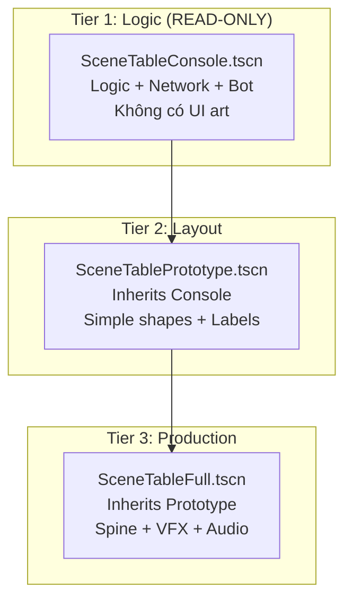
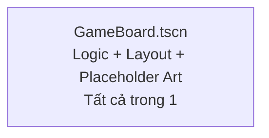
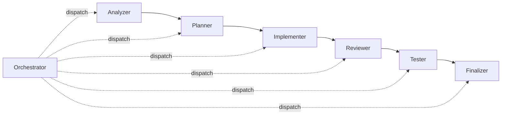
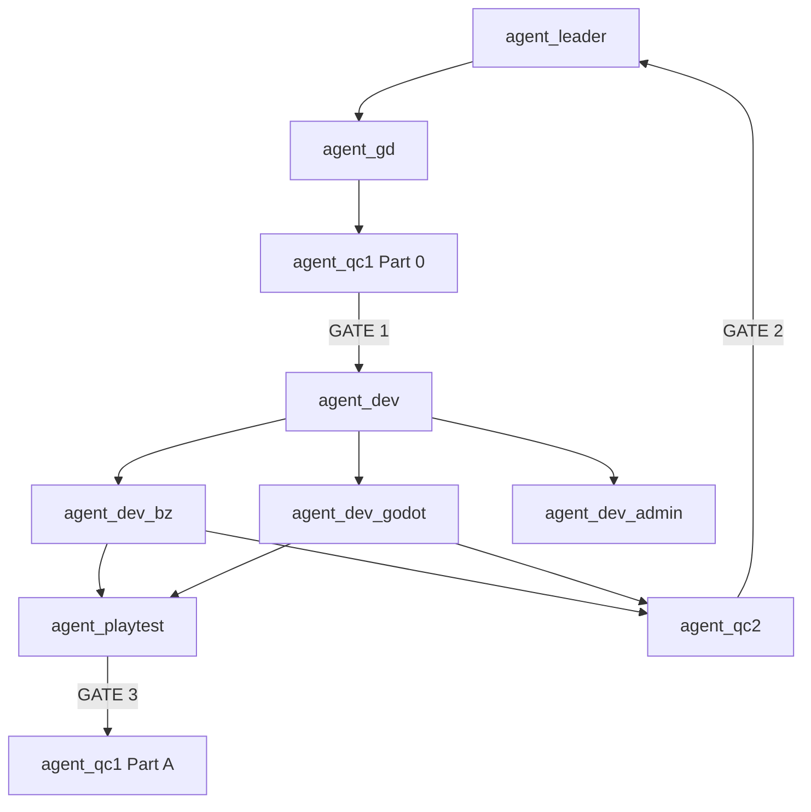
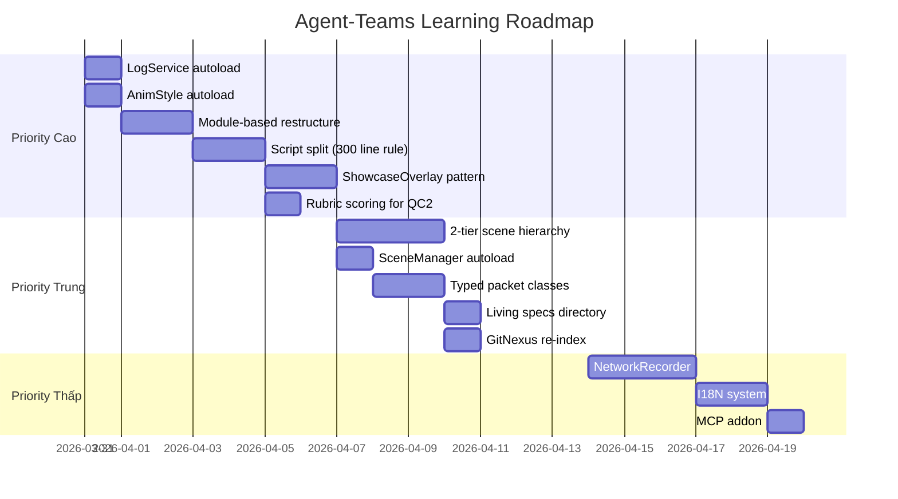

# Godot-Client vs Playtest — Báo Cáo So Sánh & Khuyến Nghị

> **Phiên bản**: 1.0 | **Ngày**: 2026-03-30 | **Phương pháp**: Doc Wave Analysis (3 parallel agents)

---

## Tóm Tắt Điều Hành

Hai dự án Godot trong hệ sinh thái CCN2 đại diện cho **hai thế hệ phát triển game** khác nhau:

- **godot-client** (Meo No — Card Game): Godot 4.6, kiến trúc module hoàn chỉnh, 7-agent AI pipeline, 13,561 GitNexus symbols. Đây là dự án **trưởng thành hơn** với nhiều pattern đã được kiểm chứng.
- **playtest** (Elemental Hunter — Board Game): Godot 4.2, 56 GDScript files (~4,200 dòng), 862 GitNexus symbols. Dự án thuộc hệ thống **agent-teams 9-agent pipeline**, phát triển nhanh nhưng có technical debt.

Báo cáo này phân tích **15 khía cạnh** mà playtest/agent-teams có thể học hỏi từ godot-client, kèm **recommendation** cụ thể cho từng mục.

---

## Mục Lục

1. [Kiến Trúc Tổng Thể](#1-kiến-trúc-tổng-thể)
2. [Scene Hierarchy & Inheritance](#2-scene-hierarchy--inheritance)
3. [Autoload / Singleton Architecture](#3-autoload--singleton-architecture)
4. [Network Layer](#4-network-layer)
5. [Animation & Visual System](#5-animation--visual-system)
6. [Testing Framework](#6-testing-framework)
7. [Debug & Development Tools](#7-debug--development-tools)
8. [Code Quality & Conventions](#8-code-quality--conventions)
9. [Documentation Architecture](#9-documentation-architecture)
10. [AI Agent Pipeline](#10-ai-agent-pipeline)
11. [GitNexus Integration](#11-gitnexus-integration)
12. [Scene Management](#12-scene-management)
13. [I18N / Localization](#13-i18n--localization)
14. [Inter-Agent Data Exchange](#14-inter-agent-data-exchange)
15. [Tổng Hợp Khuyến Nghị](#15-tổng-hợp-khuyến-nghị)

---

## 1. Kiến Trúc Tổng Thể

### Godot-Client (Meo No)

```
client/
├── autoloads/          # 13 singletons, phân nhóm: core/, network/, lobby/, table/, cheat/
├── modules/            # Feature-based: loading/, login/, lobby/, table/
│   └── table/
│       ├── scenes/     # 3-tier: Console → Prototype → Full
│       └── scripts/    # Tách script theo tier: console/, proto/, full/
├── assets/             # Phân nhóm theo module: core/, loading/, login/, lobby/, table/
├── tests/              # GUT framework
└── addons/             # godot-mcp, gut
```

**Đặc điểm nổi bật**:
- **Module-based organization**: Mỗi feature là một thư mục tự chứa (scenes + scripts + assets)
- **3-tier scene hierarchy**: Console (logic) → Prototype (layout) → Full (art) — cho phép validate từng layer độc lập
- **Script tách theo tier**: `scripts/console/`, `scripts/proto/`, `scripts/full/` — tránh file phình to

### Playtest (Elemental Hunter)

```
godot/
├── src/                # Flat structure — 56 files, tất cả trong src/
│   ├── base/network/   # Network classes
│   ├── loading/        # Login/loading
│   ├── scenes/         # .tscn files (8 scenes)
│   └── (flat files)    # EHGameController, BoardManager, TokenNode, TileNode, etc.
├── tests/              # GdUnit4 framework
│   ├── unit/           # 14 test files
│   ├── integration/    # 1 test
│   └── rule6/          # Visual verification harness
└── addons/             # gdUnit4, tcp_client, udp_client, sound_manager, etc.
```

**Đặc điểm**:
- **Flat structure**: Core game files nằm trực tiếp trong `src/` (không nhóm theo feature)
- **Autoloads phân tán**: 8 autoloads nhưng không có thư mục riêng, khai báo tập trung trong `project.godot`
- **Không có tier separation**: Một scene = một level duy nhất (không Console → Proto → Full)

### So Sánh & Đánh Giá

| Tiêu chí | godot-client | playtest | Đánh giá |
|----------|-------------|----------|----------|
| Tổ chức thư mục | Module-based, nhóm theo feature | Flat, nhóm theo kỹ thuật | godot-client ⭐⭐⭐⭐⭐ |
| Scene hierarchy | 3-tier inheritance | Single-tier | godot-client ⭐⭐⭐⭐⭐ |
| Script separation | Tách theo tier + helper files | Monolithic (EHGameController 849 dòng) | godot-client ⭐⭐⭐⭐ |
| Scalability | Cao — thêm module mới không ảnh hưởng module cũ | Trung bình — file mới thêm vào flat list | godot-client ⭐⭐⭐⭐ |

### 🎯 Recommendation cho Agent-Teams

> **PRIORITY CAO**: Chuyển playtest sang **module-based structure**:
> ```
> godot/src/
> ├── autoloads/          # Tách riêng từ project.godot
> │   ├── core/           # GlobalVar, SignalHub, KeyStorage
> │   └── network/        # GameNetwork, CityData
> ├── modules/
> │   ├── loading/        # SceneLoading + SceneLogin
> │   ├── board/          # BoardManager, TileNode, TokenNode, eh_game_board
> │   └── game/           # EHGameController, EHToken, EHNetworkHandler
> ├── ui/                 # eh_player_hud, eh_dice_btn, eh_artifact_btn
> └── shared/             # eh_tile_types, utils/
> ```

---

## 2. Scene Hierarchy & Inheritance

### Godot-Client: Mô Hình 3-Tier



**Lợi ích**:
1. **Validate logic** mà không cần art (Console → bot auto-play, packet logging)
2. **Validate layout** với shapes trước khi đưa art vào (Prototype)
3. **Art thay đổi không break logic** (Full chỉ override visual)
4. **Agent QC** có thể kiểm tra từng tier riêng biệt

### Playtest: Single-Tier



**Hạn chế**:
- Khi art thay đổi → phải test lại logic
- Khi logic thay đổi → phải verify lại layout
- Bot testing phải load toàn bộ scene graph
- Rule 6 visual verification phải chạy full scene

### 🎯 Recommendation

> **PRIORITY CAO**: Áp dụng **2-tier minimum** cho playtest:
> - **Tier 1 (Logic)**: `EHBoardConsole.tscn` — chỉ chứa EHGameController + EHNetworkHandler + mock board state. Dùng cho bot test + packet validation.
> - **Tier 2 (Full)**: `GameBoard.tscn` (hiện tại) — inherit logic, thêm visual.
>
> **Lý do**: agent_playtest đang phải load full scene chỉ để smoke test logic → tách tier sẽ giảm 50%+ thời gian test + giảm false positives từ art issues.

---

## 3. Autoload / Singleton Architecture

### Godot-Client: 13 Autoloads, Phân Nhóm Rõ Ràng

```
autoloads/
├── core/       # AppConfig, Log, SceneManager, PopupService, ToastService, AnimStyle, LocaleService, DebugInspector
├── network/    # NetworkService, ReconnectService
├── lobby/      # LobbyService
├── table/      # GameService, GameLog
└── cheat/      # ThumbCheat
```

**Đặc điểm**:
- Mỗi autoload có **Single Responsibility** rõ ràng
- `NetworkService` → transport duy nhất, các service khác `subscribe()` qua nó
- `SceneManager` → **duy nhất** nơi gọi `change_scene_to_file()` — tránh scene jump hỗn loạn
- `AnimStyle` → **centralized animation constants** — không ai hardcode duration/easing
- `Log` → structured logging với levels, colors, packet tracing

### Playtest: 8 Autoloads, Không Có Thư Mục Riêng

```
# project.godot khai báo:
g_tcp_client, g_udp_client, SceneTransition, KeyStorage,
UserProfiles, GlobalVar, SoundManager, CityData
```

**Hạn chế**:
- `GlobalVar` (290 dòng) — **God object**: chứa server configs, build mode, resolution, timeouts, max constants
- Không có centralized `Log` service → logging ad-hoc qua `print()`
- Không có `SceneManager` → scene navigation phân tán
- Không có `AnimStyle` → animation values hardcode trong từng file

### 🎯 Recommendation

> **PRIORITY CAO — 3 autoloads cần thêm ngay**:
>
> 1. **LogService** — Structured logging (levels, colors, packet trace). Hiện playtest dùng `print()` rời rạc → khó debug, không filter được.
>
> 2. **SceneManager** — Centralize scene navigation. Hiện có `SceneTransition` (fade only) nhưng không quản lý history hay enforce single entry point.
>
> 3. **AnimStyle** — Constants cho animation durations/easing. Hiện `MOVE_DURATION = 0.25s` hardcode trong TokenNode, `0.35s` trong EHToken → inconsistent.
>
> **PRIORITY TRUNG**: Tách `GlobalVar` thành `AppConfig` (build/server) + `GameConstants` (gameplay).

---

## 4. Network Layer

### Godot-Client: Typed Packet Subscription

```gdscript
# Đăng ký 1 lần — auto-parse to typed packet class
NetworkService.subscribe(CmdDefine.BOARD_DRAW_CARD, DrawCardRecv, _on_draw)

# Handler nhận typed packet — type-safe
func _on_draw(pkt: DrawCardRecv) -> void:
    if not pkt.is_ok(): return
    var card_id: int = pkt.card_id  # Direct property access
```

**Ưu điểm**:
- **Type-safe**: Handler nhận packet class cụ thể, IDE autocomplete
- **One-line subscribe**: 1 dòng code = register + parse + dispatch
- **Auto-cleanup**: `unsubscribe_all(self)` trong `_exit_tree()`
- **Replay/Record**: `NetworkReplayer` + `NetworkRecorder` cho offline testing

### Playtest: Signal-Based Handler Registry

```gdscript
# Đăng ký qua hàm r_sig trong constructor
func _init() -> void:
    super._init(2000, "EHNetworkHandler")
    r_sig(2100, null, "evt_game_state_sync")
    r_sig(2101, null, "evt_dice_result")
    # ... 9 signals

# Handler phải parse binary manually
func _on_evt_game_state_sync(pkt: InPacket) -> void:
    var hp: int = pkt.read_int()      # Manual binary read
    var round_num: int = pkt.read_int()
```

**Hạn chế**:
- **Untyped**: Handler nhận `InPacket` (raw binary) → phải manual parse
- **No replay**: Không có packet recording/replay
- **Coupling**: `EHNetworkHandler` vừa define signals vừa parse → không tách được

### 🎯 Recommendation

> **PRIORITY TRUNG**: Thêm **typed packet classes** cho playtest:
> ```gdscript
> # Thay vì parse manual:
> class GameStateSyncPacket extends RecvPacket:
>     var hp: int
>     var round_num: int
>     var tokens: Array[Dictionary]
>     func _parse(pkt: InPacket) -> void:
>         hp = pkt.read_int()
>         round_num = pkt.read_int()
> ```
>
> **PRIORITY THẤP**: Thêm `NetworkRecorder` cho offline replay — rất hữu ích cho agent_playtest smoke test mà không cần server live.

---

## 5. Animation & Visual System

### Godot-Client: AnimStyle Constants + Spine Integration

```gdscript
# AnimStyle autoload — Single Source of Truth
class AnimStyle:
    const DEAL_FLY_DURATION := 0.22
    const DEAL_STAGGER := 0.08
    const DRAW_FLY_DURATION := 0.4
    const FLY_EASE := Tween.EASE_OUT
    const FLY_TRANS := Tween.TRANS_CUBIC
    const FONT_XS := 20
    const FONT_SPLASH := 48
```

**Ưu điểm**:
- **Zero hardcoded values**: Mọi agent/developer dùng chung constants
- **Tunable**: Thay 1 chỗ → toàn bộ game update
- **Grouped**: card/, player/, ui/, fx/ track prefixes trong AnimationPlayer

### Playtest: Hardcoded Values

```gdscript
# TokenNode.gd — hardcode
const MOVE_DURATION = 0.25

# EHToken.gd — hardcode KHÁC
const MOVE_DURATION = 0.35

# BoardManager — hardcode offset
const MULTI_TOKEN_OFFSET_X = 15
```

**Vấn đề**: 2 token classes dùng 2 duration khác nhau (0.25 vs 0.35) → visual inconsistency.

### 🎯 Recommendation

> **PRIORITY CAO**: Tạo `BoardAnimStyle.gd` autoload:
> ```gdscript
> # autoloads/core/board_anim_style.gd
> extends Node
>
> # Token movement
> const TOKEN_MOVE_DURATION := 0.3
> const TOKEN_MOVE_EASE := Tween.EASE_IN_OUT
> const TOKEN_MOVE_TRANS := Tween.TRANS_QUAD
>
> # Board layout
> const MULTI_TOKEN_OFFSET_X := 15.0
> const TILE_Z_BASE := 0
> const TOKEN_Z_OFFSET := 1000
>
> # Visual feedback
> const FLASH_DURATION := 0.15
> const FLASH_COLOR_ATTACK := Color(1, 0.3, 0.3)
> const FLASH_COLOR_DEFEND := Color(1, 1, 1)
> ```

---

## 6. Testing Framework

### Godot-Client: GUT + ShowcaseOverlay

| Công cụ | Mục đích | Đặc điểm |
|---------|---------|----------|
| **GUT** | Unit testing | Addon, chạy trong editor hoặc CLI |
| **ShowcaseOverlay** | Visual testing | Auto-attach khi standalone, `_test_*()` methods tạo test buttons |
| **ConsoleBot** | Network testing | Auto-play, step-by-step, packet logging |
| **SceneTableConsole** | Logic validation | Separated tier — test logic mà không cần art |

**ShowcaseOverlay pattern** (rất sáng tạo):
```gdscript
# production_scene.gd — KHÔNG có test code
func _ready() -> void:
    ShowcaseOverlay.attach_if_standalone(self)

# production_scene.showcase.gd — CHỈ test code, auto-excluded from build
class_name ProductionSceneShowcase extends ProductionScene
func _test_default() -> void: pass
func _test_selected() -> void: pass
```

### Playtest: GdUnit4 + Rule 6 Visual Harness

| Công cụ | Mục đích | Đặc điểm |
|---------|---------|----------|
| **GdUnit4** | Unit + integration | CLI headless, 14 test files |
| **Rule 6 harness** | Visual verification | `capture_board.gd` — 9 checks, screenshots |
| **test_board_layout.gd** | Layout validation | 13 test cases (41 tiles, types, positions, z-index) |

**Ưu điểm playtest**: Rule 6 visual harness là unique — godot-client chưa có tương đương.

### 🎯 Recommendation

> **PRIORITY CAO — Học từ godot-client**:
> 1. **ShowcaseOverlay pattern**: Cho phép mỗi UI component (EHPlayerHUD, EHDiceBtn) tự test standalone mà không cần load full GameBoard. Rất phù hợp cho agent_playtest — test từng component thay vì toàn bộ.
>
> **GIỮ NGUYÊN từ playtest**:
> 1. **Rule 6 visual harness** — Đây là strength của agent-teams, godot-client NÊN học ngược lại.
> 2. **GdUnit4** — Tốt hơn GUT cho CLI headless testing (agent-friendly).
>
> **KẾT HỢP TỐT NHẤT**: GdUnit4 (unit) + ShowcaseOverlay (component visual) + Rule 6 harness (full-scene visual).

---

## 7. Debug & Development Tools

### Godot-Client

| Tool | Mô tả |
|------|--------|
| **Log service** | Structured logging, levels, BBCode colors, elapsed time tracking |
| **ShowcaseOverlay** | Standalone component testing với UI buttons |
| **ConsoleBot** | Auto-play, step mode, packet tracing |
| **DebugInspector** | Runtime inspection |
| **NetworkRecorder/Replayer** | Offline packet replay |
| **ThumbCheat** | Quick cheat commands |
| **Godot MCP** | Claude ↔ Godot editor bridge |

### Playtest

| Tool | Mô tả |
|------|--------|
| **Rule 6 harness** | Automated screenshot verification |
| **GdUnit4 CLI** | Headless test execution |
| **print() logging** | Ad-hoc, no structure |

### 🎯 Recommendation

> **PRIORITY CAO**: Thêm **Log autoload** — single investment, long-term payoff cho toàn bộ debug workflow.
>
> **PRIORITY TRUNG**: Thêm **MCP addon** (godot-mcp) — cho phép agent_dev_godot và agent_playtest tương tác trực tiếp với Godot editor.
>
> **PRIORITY THẤP**: Thêm `NetworkRecorder` — agent_playtest có thể replay packets offline.

---

## 8. Code Quality & Conventions

### Godot-Client: 3 Rule Files + Agent Enforcement

```
.claude/rules/
├── NAMING_CONVENTION.md    # PascalCase scenes, snake_case scripts, prefix by domain
├── CODE_STRUCTURE.md       # Max 300 lines/script, tách helpers, tách scenes >50 nodes
└── CODE_QUALITY.md         # Single responsibility, no magic numbers, signal-first
```

**Enforced by**: 7-agent pipeline (analyzer → reviewer → tester) với rubrics scoring ≥9/10.

**Key rules**:
- Max **300 dòng/script** → tách helper files
- **Explicit types bắt buộc**: `var x: int = 0`
- **@onready bắt buộc**: Không `get_node()` trong `_ready()`
- **Signal-first**: Children emit signals, never call parent methods

### Playtest: CONVENTIONS.md + BEST_PRACTICES.md

```
godot/
├── CONVENTIONS.md      # Naming, type safety, script structure
└── BEST_PRACTICES.md   # Scene org, communication, init order
```

**Enforced by**: agent_qc2 (whitebox code review) — nhưng không có rubric scoring system.

**Vấn đề hiện tại**:
- `EHGameController.gd` = **849 dòng** (vi phạm max 300 rule nếu áp dụng)
- `BoardManager.gd` = **507 dòng** (cũng quá lớn)
- `GlobalVar.gd` = **290 dòng** (god object)
- `GameLoading.gd` = **776 dòng** (mixed concerns)

### 🎯 Recommendation

> **PRIORITY CAO**: Áp dụng **max 300 dòng/script rule** cho playtest:
> - `EHGameController.gd` (849) → tách: `eh_game_controller.gd` (state + signals) + `eh_game_network_bridge.gd` (packet handling) + `eh_game_ui_bridge.gd` (UI wiring)
> - `BoardManager.gd` (507) → tách: `board_manager.gd` (state + API) + `board_renderer.gd` (tile/token creation) + `board_z_sorter.gd` (painter's algorithm)
>
> **PRIORITY TRUNG**: Thêm **rubric-based scoring** cho agent_qc2 code review (tham khảo `.claude/rubrics/code-quality` từ godot-client).

---

## 9. Documentation Architecture

### Godot-Client: Layered Docs

```
docs/
├── design/
│   ├── architecture-client-godot.md    # Module pattern, scene flow, autoloads
│   ├── architecture-server.md          # Server architecture
│   ├── base-framework.md              # BitZero framework
│   ├── game-rules.md                  # Game mechanics
│   ├── glossary.md                    # Terms
│   ├── ui-layout-art.md              # UI reference
│   ├── features/                      # Per-feature specs
│   └── events/                        # Event-specific rules
├── todo/
│   └── table-flow-*.md               # Implementation guides
└── specs/                             # Living specs (inter-agent)
```

### Playtest: MCP Query Docs

```
docs/godot/
├── OVERVIEW.md            # Scene graph, signal flow, file map
├── NETWORK_HANDLER.md     # Commands, events, element ordinal
├── BOARD_SYSTEM.md        # Tiles, coordinates, APIs
├── UI_COMPONENTS.md       # 8 scenes + signals
├── TESTING.md             # GdUnit4 quickref
└── MCP_INTEGRATION.md     # godot-mcp setup

docs/server/
├── OVERVIEW.md
├── BITZERO_PROTOCOL.md
├── STATE_MANAGEMENT.md
└── MODULE_PATTERN.md
```

### 🎯 Recommendation

> **GIỮ NGUYÊN từ playtest**: MCP Query Docs format rất tốt — mỗi doc là 1 topic, dễ query. godot-client nên học pattern này.
>
> **HỌC TỪ godot-client**:
> 1. **Living specs** (`specs/` directory) — inter-agent data exchange documents có timestamp, auto-updated. Playtest chưa có → agents phải đọc toàn bộ code thay vì đọc spec.
> 2. **Feature specs** (`design/features/`) — mỗi feature có spec riêng. Playtest có `shared/design/` nhưng ở agent-teams level, không ở Godot project level.

---

## 10. AI Agent Pipeline

### Godot-Client: 7-Agent Linear Pipeline



**Đặc điểm**:
- **In-project agents** (`.claude/agents/`) — agents sống TRONG project, hiểu project context
- **6 phases** với skills cụ thể cho từng phase
- **Isolated reviewer**: Fresh subagent, chỉ nhận artifacts + rubric
- **Threshold**: ≥9/10 cho reviews, max 3 retries
- **Context split**: >20k tokens → sub-contexts
- **40+ skills** (.claude/skills/) — mỗi task có skill riêng

### Agent-Teams: 9-Agent Event-Driven Pipeline



**Đặc điểm**:
- **Cross-project agents** — agents sống NGOÀI project, quản lý nhiều dự án
- **Event-driven** với CLI dispatch (`openclaw agent --agent <id>`)
- **4 human gates** — cần approval tại mỗi milestone
- **Specialized roles**: GD (design), Dev (tech lead), QC1 (blackbox), QC2 (whitebox), Playtest
- **REFERENCE.md** — human-editable runtime hướng dẫn cho agents

### So Sánh Chi Tiết

| Tiêu chí | godot-client (7-agent) | agent-teams (9-agent) | Winner |
|----------|----------------------|---------------------|--------|
| Scope | Single project | Multi-project (server + client) | agent-teams |
| Agent specialization | Phase-based (analyze→finalize) | Role-based (GD, Dev, QC, Playtest) | agent-teams |
| Human oversight | 0 gates (auto, escalate on 3 fails) | 4 gates (explicit approval) | Depends on risk tolerance |
| Review quality | Rubric scoring ≥9/10 | Score + checklist nhưng no rubric system | godot-client |
| Visual verification | ShowcaseOverlay (component) | Rule 6 harness (full scene) | Complementary |
| Retry mechanism | Max 3 retries → escalate | Hotfix rounds (R1→R5 observed) | godot-client (cleaner) |
| Knowledge base | GitNexus 13,561 symbols | GitNexus 862 symbols + lessons.md | godot-client (scale) |
| Living specs | ✅ specs/ directory | ❌ Chưa có | godot-client |
| Lessons learned | lesson-extract skill | godot-lessons.md + playtest-lessons.md | agent-teams (manual but rich) |

### 🎯 Recommendation

> **PRIORITY CAO — Agent-teams nên học**:
> 1. **Rubric scoring system**: Tạo rubrics cho agent_qc2 tương tự `.claude/rubrics/code-quality` — hiện agent_qc2 review bằng "judgment call", thiếu standardized scoring.
> 2. **Living specs**: Thêm `shared/playtest/specs/` directory — mỗi ticket tạo spec, agents đọc spec thay vì scan toàn bộ code.
> 3. **Context split rule**: >20k tokens → split sub-contexts. Hiện agent-teams agents có thể nhận context quá lớn.
>
> **GIỮ NGUYÊN — Godot-client nên học**:
> 1. **4 human gates** — phù hợp với high-stakes game development
> 2. **REFERENCE.md pattern** — human có thể inject hướng dẫn runtime
> 3. **Specialized roles** (GD ≠ Dev ≠ QC) — phân chia chuyên môn rõ hơn phase-based

---

## 11. GitNexus Integration

### Godot-Client: Deep Integration (13,561 symbols)

```gdscript
# CLAUDE.md bắt buộc:
# ALWAYS: Call gitnexus_context(symbol) BEFORE modifying functions with callers
# ALWAYS: Call gitnexus_impact(target) BEFORE modifying classes or signals
# NEVER: Read files directly — use gitnexus_query
```

- **13,561 symbols**, 21,219 relationships, 300 execution flows
- Agents PHẢI dùng GitNexus trước khi edit bất kỳ symbol nào
- `gitnexus_detect_changes()` bắt buộc trước commit

### Playtest: Basic Integration (862 symbols)

- **862 symbols**, 886 relationships, 4 execution flows
- Có knowledge packs trong `shared/knowledge/gitnexus/`
- agent_dev_godot được yêu cầu dùng impact analysis

### 🎯 Recommendation

> **PRIORITY TRUNG**: Tăng GitNexus coverage cho playtest:
> - Re-index sau mỗi major ticket (hiện 862 symbols khá ít cho 56 files)
> - Enforce `gitnexus_impact()` check trong agent_qc2 checklist
> - Thêm execution flows (hiện chỉ 4 — godot-client có 300)

---

## 12. Scene Management

### Godot-Client: Centralized SceneManager

```gdscript
# SceneManager — ONLY place calling change_scene_to_file()
class ScenePaths:
    const LOGIN = "res://modules/login/scene_login.tscn"
    const LOBBY = "res://modules/lobby/SceneLobby.tscn"
    const TABLE_CONSOLE = "res://modules/table/scenes/SceneTableConsole.tscn"

SceneManager.go_to(SceneManager.ScenePaths.LOBBY)
SceneManager.go_back()
SceneManager.replace(SceneManager.ScenePaths.TABLE_FULL)
```

**Ưu điểm**: History stack, centralized paths, test hook (`navigate_fn: Callable`).

### Playtest: Decentralized Scene Navigation

```gdscript
# SceneTransition autoload — chỉ fade animation
# Scene navigation gọi trực tiếp:
get_tree().change_scene_to_file("res://src/scenes/GameBoard.tscn")
```

### 🎯 Recommendation

> **PRIORITY TRUNG**: Thêm `SceneManager` wrapper cho playtest — centralize scene paths + navigation logic. Đặc biệt quan trọng khi thêm scenes mới (settings, shop, etc.).

---

## 13. I18N / Localization

### Godot-Client: Full I18N System

```gdscript
# Rule: ALWAYS use tr("KEY").format({"param": value})
# NEVER: % operator with tr(), inline BBCode in CSV
# LocaleService autoload manages language switching
```

- CSV translation files trong `assets/core/locale/`
- Strict rules cho parameterized strings

### Playtest: Không Có I18N

- Tất cả text hardcoded bằng tiếng Anh trong code
- Không có translation system

### 🎯 Recommendation

> **PRIORITY THẤP** (chưa cần ngay): Khi playtest chuẩn bị production release, thêm I18N. Hiện tại focus vào gameplay logic.

---

## 14. Inter-Agent Data Exchange

### Godot-Client: Living Specs System

```
specs/
├── _index.md                           # Overview (all agents update)
├── PROTOTYPE_LAYOUT_SPEC.md            # Owner: layout-design skill
├── ANIMATION_LIST.md                   # Owner: animation-design skill
├── SHARED_ANIMATION_STYLE.md           # Owner: anim-style-manage skill
├── NODE_UI_LIST.md                     # Owner: node-list-generate skill
├── features/{date}_{name}/plan.md      # Owner: feature-plan skill
├── lessons/{date}.md                   # Owner: lesson-extract skill
└── todo_review/active.md              # Owner: finalizer
```

**Rule**: Mỗi spec có **owner** (skill), **timestamp**, agents phải check drift.

### Agent-Teams: Ticket-Based Exchange

```
shared/
├── design/         # GDD outputs (agent_gd)
├── analysis/       # REQ, DESIGN, TECH_DESIGN_SPEC (agent_dev)
├── tickets/        # Per-ticket design + reports
└── knowledge/      # Lessons, retrospectives
```

**Difference**: Agent-teams dùng **ticket-centric** model (mỗi ticket = workflow), godot-client dùng **spec-centric** model (mỗi spec = shared state).

### 🎯 Recommendation

> **PRIORITY TRUNG**: Thêm **persistent specs** bên cạnh ticket workflow:
> ```
> shared/playtest/specs/
> ├── BOARD_LAYOUT_SPEC.md      # Owned by agent_dev_godot — tile positions, coordinate system
> ├── NETWORK_PROTOCOL_SPEC.md  # Owned by agent_dev_bz — command IDs, packet format
> └── VISUAL_CHECKLIST_SPEC.md  # Owned by agent_playtest — Rule 6 checks
> ```
> **Lý do**: Hiện agent_dev_godot phải đọc toàn bộ code để hiểu board layout. Có spec → đọc 1 file.

---

## 15. Tổng Hợp Khuyến Nghị

### PRIORITY CAO (nên làm ngay — tác động lớn, effort vừa phải)

| # | Khuyến nghị | Nguồn học | Tác động | Effort |
|---|-------------|-----------|---------|--------|
| 1 | **Module-based folder structure** cho playtest | godot-client `modules/` pattern | Scalability, navigation | 2-3 giờ refactor |
| 2 | **LogService autoload** | godot-client `log_service.gd` | Debug efficiency +80% | 1-2 giờ |
| 3 | **AnimStyle autoload** — centralize animation constants | godot-client `anim_style.gd` | Consistency, tuning | 1 giờ |
| 4 | **Max 300 dòng/script rule** — tách EHGameController + BoardManager | godot-client CODE_STRUCTURE rule | Maintainability | 3-4 giờ |
| 5 | **ShowcaseOverlay pattern** — component standalone testing | godot-client debug system | Test isolation, agent efficiency | 2-3 giờ |
| 6 | **Rubric scoring** cho agent_qc2 | godot-client `.claude/rubrics/` | Review consistency | 2 giờ |

### PRIORITY TRUNG (nên làm trong sprint tiếp — tác động tốt)

| # | Khuyến nghị | Nguồn học | Tác động | Effort |
|---|-------------|-----------|---------|--------|
| 7 | **2-tier scene hierarchy** (Console + Full) | godot-client 3-tier pattern | Test separation | 4-5 giờ |
| 8 | **SceneManager autoload** | godot-client `scene_manager.gd` | Navigation centralization | 2 giờ |
| 9 | **Typed packet classes** | godot-client subscribe system | Type safety, IDE support | 3-4 giờ |
| 10 | **Living specs directory** | godot-client `specs/` | Inter-agent efficiency | 2 giờ |
| 11 | **GitNexus re-index** + enforce impact checks | godot-client CLAUDE.md rules | Safer refactoring | 1 giờ |
| 12 | **Tách GlobalVar** thành AppConfig + GameConstants | godot-client pattern | Single responsibility | 1-2 giờ |

### PRIORITY THẤP (backlog — nice to have)

| # | Khuyến nghị | Nguồn học | Tác động | Effort |
|---|-------------|-----------|---------|--------|
| 13 | **NetworkRecorder/Replayer** | godot-client network system | Offline testing | 4-5 giờ |
| 14 | **I18N system** | godot-client locale_service | Localization ready | 3-4 giờ |
| 15 | **MCP addon** (godot-mcp) | godot-client addon | Agent ↔ Editor bridge | 2 giờ |

### Ngược Lại: Godot-Client Nên Học Từ Agent-Teams

| # | Pattern | Nguồn | Giá trị |
|---|---------|-------|--------|
| A | **Rule 6 Visual Verification** — mandatory runtime screenshots | agent_playtest | Catch UI bugs mà code review miss |
| B | **4 Human Gates** — approval checkpoints | agent_leader pipeline | Reduce risk cho high-stakes changes |
| C | **REFERENCE.md** — human-editable runtime guidance | agent_dev_godot | Flexible agent steering |
| D | **Lessons.md** — structured post-mortem knowledge | shared/knowledge/lessons/ | Organizational learning |
| E | **Specialized agent roles** (GD ≠ Dev ≠ QC) | 9-agent model | Better domain expertise |

---

## Phụ Lục A: Bảng So Sánh Toàn Diện

| Dimension | godot-client (Meo No) | playtest (Elemental Hunter) |
|-----------|----------------------|---------------------------|
| **Engine** | Godot 4.6 | Godot 4.2 |
| **Genre** | Card game (multiplayer) | Board game (2-player) |
| **Codebase size** | ~60+ GDScript files | 56 GDScript files (~4,200 lines) |
| **GitNexus symbols** | 13,561 | 862 |
| **Execution flows** | 300 | 4 |
| **Autoloads** | 13 (grouped in 5 domains) | 8 (flat, no grouping) |
| **Scene hierarchy** | 3-tier (Console → Proto → Full) | 1-tier (single scene per feature) |
| **Network** | Typed subscribe + replay | Signal-based + manual parse |
| **Animation** | AnimStyle constants + Spine | Hardcoded tween values |
| **Testing** | GUT + ShowcaseOverlay + ConsoleBot | GdUnit4 + Rule 6 harness |
| **Debug tools** | Log, Inspector, Recorder, MCP | print(), Rule 6 screenshots |
| **Agent pipeline** | 7-agent linear (in-project) | 9-agent event-driven (cross-project) |
| **Review system** | Rubric scoring ≥9/10 | Judgment-based + checklist |
| **Human gates** | 0 (auto, escalate on fail) | 4 (explicit approval) |
| **I18N** | Full (CSV + LocaleService) | None |
| **Living specs** | Yes (specs/ directory) | No (ticket-based only) |
| **Max lines/script** | 300 (enforced) | No limit (849 max observed) |
| **Documentation** | Architecture + feature specs + table flow | MCP query docs + conventions |
| **Server** | Go/Fiber WebSocket + Docker | Kotlin/BitZero TCP |

---

## Phụ Lục B: Implementation Roadmap



---

> **Kết luận**: Godot-client (Meo No) là dự án **trưởng thành hơn** với nhiều engineering practices đã qua kiểm chứng. Agent-teams/playtest có thể áp dụng **6 improvements priority cao** trong 1-2 tuần để nâng chất lượng code và hiệu quả agent pipeline đáng kể. Ngược lại, godot-client nên học **5 patterns** từ agent-teams (đặc biệt Rule 6 visual verification và human gates) để tăng production safety.

---

*Báo cáo tạo bởi Doc Wave Analysis skill — 2026-03-30*
*3 parallel exploration agents | ~264k tokens total | 100% Tiếng Việt*
