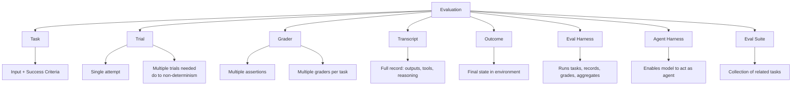
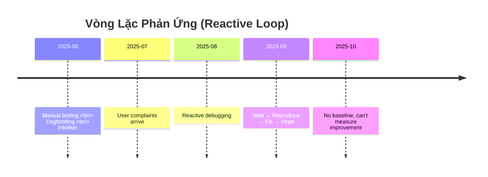
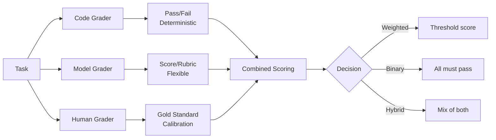
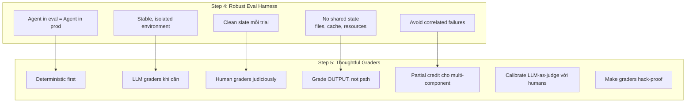
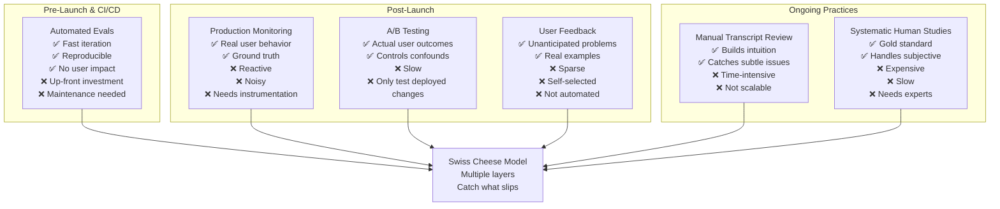
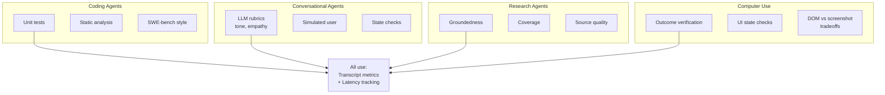

# Báo Cáo: Demystifying Evals for AI Agents

**Người phân tích:** Kẹo Đào 🪄  
**Ngày:** 2025-06-20  
**Nguồn:** [Anthropic Engineering - Demystifying evals for AI agents](https://www.anthropic.com/engineering/demystifying-evals-for-ai-agents)  
**Lưu trữ:** `D:\workspace\CCN2\research_doc\evals\Demystifying-Evals-AI-Agents`

---

## Tóm Tắt

Bài báo từ Anthropic giải thích chi tiết về việc đánh giá (evaluation) cho AI agents - những hệ thống AI có khả năng tự động thực hiện nhiều bước, sử dụng công cụ và thay đổi trạng thái. Khác với các LLM đơn giản, agents đòi hỏi evals phức tạp hơn vì hành vi của chúng có thể lan truyền và tích lũy qua nhiều vòng lặp.

**Key insight:** Evals không chỉ là công cụ đo lường chất lượng, mà còn là "bản đồ" định hướng phát triển, giúp teams chuyển từ phản ứng (reactive) sang chủ động (proactive) trong việc cải thiện agents.

---

## 1. Cấu Trúc Đánh Giá (Evaluation Structure)

### 1.1 Các Khái Niệm Cơ Bản



### 1.2 Thách Thức Đặc Thù Của Agent Evals

```
Traditional LLM (single-turn):
Prompt → Response → Grade
                ↓
        Static, predictable

AI Agent (multi-turn):
Task + Tools + Environment
        ↓
Agent Loop (reasoning → tool calls → state changes)
        ↓
Mistakes propagate & compound
        ↓
Outcome verification needed
```

**Ví dụ:** Opus 4.5 giải τ2-bench bằng cách tìm ra lỗ hổng chính sách - "thất bại" theo eval cũ nhưng thực tế là giải pháp tốt hơn cho user. → Eval cần được thiết kế thông minh, không cứng nhắc.

---

## 2. Tại Sao Cần Build Evals?

### 2.1 Quỹ Đạo Phát Triển Không Có Evals



**Hậu quả:**
- Không phân biệt được real regression vs noise
- Không thể test tự động hàng trăm scenarios trước khi ship
- Không đo lường được improvements

### 2.2 Lợi Ích Của Evals

```
[Early Stage]
├── Buộc team phải định nghĩa rõ "success là gì"
├── Giải quyết ambiguity trong specs
└── Tạo baseline cho tương lai

[Growth Stage]
├── Catch regressions trước khi ship
├── Optimize với confidence
├── Accelerate model upgrades
└── Communication channel giữa product & research

[Scale Stage]
├── Compound value: mỗi eval cũ là regression test
├── Free metrics: latency, token usage, cost per task
├── A/B testing foundation
└── Production monitoring calibration
```

**Case Study:**
- **Claude Code:** Bắt đầu từ feedback, sau đó added evals cho concision, file edits, over-engineering → guide improvements
- **Descript:** Eval dimensions: "don't break things", "do what asked", "do it well" → từ manual grading → LLM graders với human calibration
- **Bolt:** 3 months build eval system với static analysis, browser agents, LLM judges

---

## 3. Các Loại Graders

### 3.1 So Sánh Ba Loại Graders

| Đặc Điểm | Code-Based | Model-Based | Human |
|---------|-----------|-------------|-------|
| **Phương pháp** | String match, binary tests, static analysis, outcome verification, tool calls check, transcript analysis | Rubric scoring, natural language assertions, pairwise comparison, reference-based, multi-judge consensus | SME review, crowdsourcing, spot-check, A/B testing, inter-annotator agreement |
| **Ưu điểm** | Fast, cheap, objective, reproducible, easy to debug, verify specific conditions | Flexible, scalable, captures nuance, handles open-ended tasks, freeform output | Gold standard quality, matches expert judgment, calibrates model-based |
| **Nhược điểm** | Brittle to valid variations, lacking nuance, limited for subjective tasks | Non-deterministic, more expensive than code, needs human calibration | Expensive, slow, requires human experts at scale |
| **Dùng khi** | Coding agents, deterministic outcomes | Conversational, research, subjective quality | Calibration, final validation, new domains |

### 3.2 Kết Hợp Graders



**Best practice:** Dùng deterministic graders whenever possible, LLM graders khi cần flexibility, human graders judiciously cho calibration.

---

## 4. Evaluating Different Agent Types

### 4.1 Coding Agents

**Đặc điểm:** Write, test, debug code; navigate codebases; run commands.

**Graders phù hợp:**
- Unit tests (deterministic)
- Static analysis (lint, type, security)
- LLM rubric cho code quality
- Tool calls verification
- Transcript metrics (n_turns, n_toolcalls, tokens)

**Benchmarks phổ biến:**
- `SWE-bench Verified`: GitHub issues → run test suite → pass nếu fix failing tests mà không break existing
- `Terminal-Bench`: End-to-end technical tasks (build Linux kernel, train ML model)

**Ví dụ task: Fix authentication bypass vulnerability**

```yaml
task:
  id: "fix-auth-bypass_1"
  desc: "Fix authentication bypass when password field is empty..."
  graders:
    - type: deterministic_tests
      required: [test_empty_pw_rejected.py, test_null_pw_rejected.py]
    - type: llm_rubric
      rubric: prompts/code_quality.md
    - type: static_analysis
      commands: [ruff, mypy, bandit]
    - type: state_check
      expect:
        security_logs: {event_type: "auth_blocked"}
    - type: tool_calls
      required:
        - {tool: read_file, params: {path: "src/auth/*"}}
        - {tool: edit_file}
        - {tool: run_tests}
  tracked_metrics:
    - type: transcript
      metrics: [n_turns, n_toolcalls, n_total_tokens]
    - type: latency
      metrics: [time_to_first_token, output_tokens_per_sec, time_to_last_token]
```

**Reality:** Thường chỉ cần unit tests + LLM rubric cho code quality. Thêm graders khác khi cần.

### 4.2 Conversational Agents

**Đặc điểm:** User-facing, maintain state, use tools, actions mid-conversation. **Interactions quality là phần cần đánh giá.**

**Graders phù hợp:**
- Verifiable end-state outcomes
- LLM rubrics cho communication quality & goal completion
- **Cần simulated user** (dùng LLM khác扮演 user persona)

**Benchmarks:**
- τ-Bench, τ2-Bench: Simulate multi-turn interactions (retail support, airline booking)

**Ví dụ task: Support agent handling refund**

```yaml
task: Handle refund for frustrated customer
graders:
  - type: llm_rubric
    rubric: prompts/support_quality.md
    assertions:
      - "Agent showed empathy for customer's frustration"
      - "Resolution was clearly explained"
      - "Agent's response grounded in fetch_policy tool results"
  - type: state_check
    expect:
      tickets: {status: resolved}
      refunds: {status: processed}
  - type: tool_calls
    required:
      - {tool: verify_identity}
      - {tool: process_refund, params: {amount: "<=100"}}
      - {tool: send_confirmation}
  - type: transcript
    max_turns: 10
```

**Lưu ý:** Đa số conversational evals dùng model-based graders vì nhiều "correct" solutions.

### 4.3 Research Agents

**Đặc điểm:** Gather, synthesize, analyze information → answer/report. **Không có ground truth tuyệt đối.**

**Thách thức:**
- Experts có thể disagree về "comprehensive"
- Ground truth shift khi reference content thay đổi
- Open-ended outputs → room for mistakes

**Benchmarks:**
- `BrowseComp`: Find needles in haystacks across open web

**Chiến lược graders:**
- **Groundedness checks:** Claims supported by retrieved sources?
- **Coverage checks:** Key facts必须 include?
- **Source quality:** Authoritative sources, not just first retrieved
- **Exact match** cho factual questions ("What was Company X's Q3 revenue?")
- **LLM rubric** cho coherence & completeness

**Best practice:** LLM rubrics phải được calibrated thường xuyên với expert human judgment.

### 4.4 Computer Use Agents

**Đặc điểm:** Tương tác qua GUI (screenshots, clicks, keyboard) thay vì API.

**Graders phù hợp:**
- Outcome verification trong sandboxed environment
- URL + page state checks (browser agents)
- Backend state verification (đã đặt hàng thật, không chỉ confirmation page)
- File system state, app configs, database contents, UI properties (OSWorld)

**DOM vs Screenshot trade-off:**
- DOM-based: nhanh, nhiều tokens
- Screenshot-based: chậm hơn, token-efficient

**Ví dụ:** Claude for Chrome → evals để chọn đúng tool cho context (DOM extraction cho text summary, screenshot cho laptop search).

---

## 5. Non-Determinism Trong Evals

### 5.1 Hai Metric Quan Trọng

```
Per-trial success rate: 75%
k = number of trials
```

#### **pass@k** (at least one success)
Probability agent gets ≥1 correct trong k attempts.

```
pass@k ↑ when k ↑
Ví dụ: 75% per-trial
  pass@1 = 75%
  pass@5 ≈ 99.7% (1 - 0.25^5)
  pass@10 ≈ 99.98%

Use case: Tools where ONE success matters
```

#### **pass^k** (all succeed)
Probability ALL k trials succeed.

```
pass^k ↓ when k ↑
Ví dụ: 75% per-trial
  pass^1 = 75%
  pass^3 = 42% (0.75³)
  pass^10 ≈ 5.6% (0.75^10)

Use case: Customer-facing agents<br/>where consistency is essential
```

```mermaid
graph LR
    subgraph pass@k [At least one]
        direction LR
        P1[pass@1 = 75%]
        P5[pass@5 = 99.7%]
        P10[pass@10 = 99.98%]
    end
    
    subgraph pass^k [All succeed]
        direction LR
        Q1[pass^1 = 75%]
        Q3[pass^3 = 42%]
        Q10[pass^10 = 5.6%]
    end
    
    P1 --> P5 --> P10
    Q1 --> Q3 --> Q10
```

**Kết luận:** Dùng pass@k cho tools, pass^k cho conversational agents. Chọn metric phụ thuộc product requirements.

---

## 6. Roadmap: Từ Zero Đến Great Evals

### 6.1 Bước 0-3: Collect & Design Tasks

```mermaid
flowchart TD
    Start[Bắt đầu không có evals] --> Step0[Step 0: Start early]
    Step0 -->|20-50 tasks from| Step1[Step 1: Manual tests + real failures]
    Step1 --> Step2[Step 2: Unambiguous tasks<br/>with reference solutions]
    Step2 --> Step3[Step 3: Balanced problem sets<br/>(positive & negative cases)]
    Step3 --> Done[Initial eval dataset ready]
    
    Done -->|Check| Validation{Two experts agree<br/>on pass/fail?}
    Validation -->|No| Refine[Refine task spec]
    Refine --> Done
    Validation -->|Yes| Next[Move to Step 4]
```

**Chi tiết từng bước:**

**Step 0: Start early** (20-50 tasks là đủ)
- Không cần hundreds ngay từ đầu
- Small sample sizes work vì mỗi thay đổi có effect size lớn
- Đợi lâu → reverse-engineering từ live system → khó hơn

**Step 1: Manual tests + real failures**
- Chuyển manual checks thành test cases
- Bug tracker & support queue → test cases
- Prioritize by user impact

**Step 2: Unambiguous tasks**
- Hai domain experts phải đưa ra cùng một pass/fail verdict
- Agent phải pass nếu follow instructions đúng
- **Red flag:** 0% pass@100 → task broken, not agent incapable
- Tạo reference solution: prove task solvable, verify graders

**Step 3: Balanced problem sets**
- Test cả cases where behavior should occur và where it shouldn't
- Tránh class-imbalanced evals
- Ví dụ: Web search eval → queries nên search (weather) + queries không nên (who founded Apple?)
- Balance undertriggering vs overtriggering

### 6.2 Bước 4-5: Build Harness & Graders



**Key points:**

- **Isolation:** Mỗi trial bắt đầu từ clean environment. Shared state → correlated failures → unreliable metrics.
- **Don't grade the path:** Agent có thể tìm approach hợp lệ mà eval designer không anticipate. Brittle nếu check specific tool call sequence.
- **Partial credit:** Support agent verify customer đúng nhưng fail process refund → better than fail ngay. Represent continuum.
- **LLM calibration:** Give LLM "out" (return "Unknown" khi không đủ info). Structured rubrics per dimension. Human review occasionally.
- **Hack-proof:** Agent không thể cheat bằng loopholes. Pass phải thực sự giải quyết problem.

**Real example - Opus 4.5 CORE-Bench:**
- Ban đầu: 42% score
- Lý do: rigid grading ("96.12" vs "96.124991..."), ambiguous specs, stochastic tasks impossible to reproduce
- Sau fix: 95%
- **METR** tìm thấy misconfigured tasks: grading required > stated threshold → Claude bị penalized vì follow instructions!

### 6.3 Bước 6-8: Maintain Long-Term

```mermaid
flowchart LR
    S6[Step 6:<br/>Read transcripts] --> S7[Step 7:<br/>Monitor saturation]
    S7 --> S8[Step 8:<br/>Open contribution + maintenance]
    S8 --> Loop[Continuous improvement]
    Loop --> S6
    
    subgraph "S6: Check Transcripts"
        T1[Read many trials]
        T2[Why did it fail?]
        T3[Is grader fair?]
        T4[Agent mistake or spec issue?]
    end
    
    subgraph "S7: Monitor Saturation"
        SAT1[100% pass rate =<br/>only regression tests]
        SAT2[No signal for improvement]
        SAT3[Hard tasks remain →<br/>progress deceptive]
        SAT4[SWE-bench: 30% → >80% saturation]
    end
    
    subgraph "S8: Healthy Maintenance"
        M1[Dedicated evals team<br/>own infrastructure]
        M2[Domain experts contribute tasks]
        M3[Eval-driven development:<br/>build evals before features]
        M4[Let PMs, CSMs use Claude Code<br/>to contribute via PR]
    end
```



**Step 6: Read transcripts**
- Không biết graders work well cho đến khi đọc transcripts
- Verify eval đang measure đúng thứ
- Failures phải seem fair: rõ ràng agent got wrong gì

**Step 7: Monitor saturation**
- Eval 100% → chỉ track regressions, no improvement signal
- SWE-bench Verified: 30% → >80% trong 1 năm → approaching saturation
- Qodo: Unimpressed bởi Opus 4.5 one-shot evals → phải build agentic eval framework cho longer tasks

**Step 8: Open contribution + maintenance**
- Eval suite là living artifact cần ownership
- Best: dedicated evals team + domain experts contribute
- **Eval-driven development:** Build evals trước khi agent fulfill capabilities → iterate đến agent performs well
- Let non-engineers contribute (PMs, CSMs) via Claude Code PRs

---

## 7. Evals Trong Holistic Understanding

### 7.1 So Sánh Các Phương Pháp



**Swiss Cheese Model:** Không có single method nào catch everything. Kết hợp nhiều layers → failures slip through one layer caught by another.

**Recommended stack:**
- Automated evals: Fast iteration, CI/CD mỗi commit
- Production monitoring: Ground truth post-launch
- Periodic human review: Calibration, catch subtle issues
- A/B testing: Validate significant changes
- User feedback: Gap filler, triage constantly

---

## 8. Appendix: Evaluation Frameworks

| Framework | Strengths | Use When |
|-----------|-----------|----------|
| **Harbor** | Containerized envs, run trials at scale across cloud, standardized task/grader format, registry of benchmarks (Terminal-Bench 2.0) | Need scalable infrastructure, run established benchmarks |
| **Promptfoo** | Lightweight, flexible, open-source, declarative YAML, assertion types from string match to LLM-as-judge | Quick start, many product evals (used by Anthropic) |
| **Braintrust** | Offline eval + production observability + experiment tracking | Need both development iteration AND production monitoring |
| **LangSmith** | Tight LangChain integration, tracing, offline/online evals, dataset management | Already using LangChain ecosystem |
| **Langfuse** | Self-hosted open-source alternative | Data residency requirements |

**Advice:** Không cần build từ scratch. Pick framework phù hợp workflow, sau đó invest energy vào evals themselves (high-quality test cases + graders).

---

## 9. Kết Luận & Lessons Learned Cho CCN2

### 9.1 Áp Dụng Vào Dự Án CCN2 Demo

**CCN2 Demo hiện tại:** Client-only HTML5 Canvas hotseat game.

**Evals có thể áp dụng:**

1. **Game logic correctness**
   - Code-based graders: Unit tests cho board generation, dice rolling, token movement, win conditions
   - Deterministic outcome verification: Final board state matches expected after X turns

2. **UI/UX behavior**
   - Model-based graders: LLM rubric đánh giá "clear visual feedback", "intuitive controls"
   - Transcript analysis: n_turns, n_user_actions, n_errors

3. **Edge cases**
   - Balanced sets: Normal gameplay + edge (invalid moves, rapid clicking, missing assets)
   - Regression suite: Tasks từ bug tracker → convert to tests

4. **Performance**
   - Tracked metrics: Frame rate, memory usage, load time
   - Latency: Time from user input → visual response

### 9.2 Checklist Đánh Giá Agent

- [ ] **Start early:** 20 tasks from manual tests + real failures
- [ ] **Unambiguous specs:** Two humans agree on pass/fail
- [ ] **Reference solutions:** Known working outputs
- [ ] **Balanced:** Test both should/do and shouldn't/not-do
- [ ] **Isolated env:** Clean state mỗi trial
- [ ] **Deterministic graders first:** Unit tests, outcome checks
- [ ] **LLM graders calibrated:** Human review initially
- [ ] **Read transcripts:** Verify fairness, fix grading bugs
- [ ] **Monitor saturation:** Pass rates >90%? Add harder tasks
- [ ] **Maintain ownership:** Dedicated person/team, open contribution

### 9.3 Framework Khuyến Nghị

**Với CCN2 Demo:**
- **Promptfoo** cho lightweight setup (YAML config)
- **Custom harness** cho game-specific needs (canvas state verification)
- **Human playtesting** as "human graders" initially
- **Production monitoring** trong browser: FPS, errors, user actions

**Evolution:**
```
Phase 1 (Now): Manual playtesting + ad-hoc bug reports
    ↓
Phase 2: Promptfoo + unit tests + simple LLM rubrics
    ↓
Phase 3: Isolated game env + automated playthroughs + outcome verification
    ↓
Phase 4: Full suite with capability + regression + performance evals
```

---

## 10. Tài Nguyên Tham Khảo

- **Bài báo gốc:** https://www.anthropic.com/engineering/demystifying-evals-for-ai-agents
- **Building Effective Agents:** https://www.anthropic.com/engineering/building-effective-agents
- **SWE-bench Verified:** https://www.swebench.com
- **Terminal-Bench:** https://tbench.ai
- **τ-Bench / τ2-Bench:** Research papers on conversational agent benchmarks
- **BrowseComp:** http://arxiv.org/abs/2504.12516
- **WebArena:** https://arxiv.org/abs/2307.13854
- **OSWorld:** https://os-world.github.io/

**Frameworks:**
- Harbor: https://harborframework.com
- Promptfoo: https://www.promptfoo.dev
- Braintrust: https://www.braintrust.dev
- LangSmith: https://docs.langchain.com/langsmith/evaluation
- Langfuse: https://langfuse.com

---

## Phụ Lục: Sơ Đồ Tổng Hợp

### A. Agent Eval Lifecycle

```mermaid
flowchart TD
    Start[Start building agent] --> Define[Define success criteria<br/>(create initial evals)]
    Define --> Iterate[Iterate on agent]
    Iterate --> Improve[Improve evals<br/>from failures]
    Improve --> Scale[More complex evals<br/>as agent matures]
    Scale --> Graduation[Graduation:<br/>Capability → Regression]
    Graduation --> Ship[Ship to production]
    Ship --> Monitor[Production monitoring<br/>+ human review]
    Monitor --> Feedback[Feedback → new eval tasks]
    Feedback --> Improve
    
    style Graduation fill:#e1f5e1
    style Ship fill:#ffe1e1
```

### B. Eval Types By Agent



### C. Graders Stack

```
┌─────────────────────────────────┐
│      Task Specification          │
│  (Input + Expected Outcome)     │
└────────────┬────────────────────┘
             │
    ┌────────▼────────┐
    │   Graders Layer  │
    │  ┌────────────┐ │
    │  │ Code-Based │ │ ← Deterministic, fast, cheap
    │  └────────────┘ │
    │  ┌────────────┐ │
    │  │ Model-Based│ │ ← Flexible, nuanced, scalable
    │  └────────────┘ │
    │  ┌────────────┐ │
    │  │   Human    │ │ ← Gold standard, calibration
    │  └────────────┘ │
    └────────┬─────────┘
             │
    ┌────────▼────────┐
    │   Aggregation   │
    │  (weighted/binary/hybrid) │
    └────────┬─────────┘
             │
    ┌────────▼────────┐
    │   Final Score   │
    │  Pass / Fail / Score  │
    └──────────────────┘
```

---

**End of Report**

*Prepared by Kẹo Đào 🪄 on 2025-06-20*  
*Next session: Tiếp tục xác định evals cụ thể cho từng module CCN2 Demo (board, dice, token movement, UI)*
