# GitNexus — Báo Cáo Phân Tích Toàn Diện

**Repository Path**: `D:\PROJECT\CCN2\GitNexus`
**Ngày phân tích**: 2026-03-26
**Phiên bản**: `gitnexus` v1.4.8
**License**: PolyForm Noncommercial 1.0.0
**Tác giả**: Abhigyan Patwari
**Mục đích báo cáo**: Chuẩn bị plan tạo skill `git-nexus-deep-understanding` và `using-git-nexus` cho agent teams

---

## Mục Lục

1. [Tổng Quan & Vấn Đề Giải Quyết](#1-tổng-quan--vấn-đề-giải-quyết)
2. [Kiến Trúc Monorepo](#2-kiến-trúc-monorepo)
3. [Indexing Pipeline — Luồng Xử Lý Chính](#3-indexing-pipeline--luồng-xử-lý-chính)
4. [Knowledge Graph Schema](#4-knowledge-graph-schema)
5. [MCP Server & 7 Tools](#5-mcp-server--7-tools)
6. [Claude Code Hooks](#6-claude-code-hooks)
7. [Multi-Repo Architecture](#7-multi-repo-architecture)
8. [Web UI Architecture](#8-web-ui-architecture)
9. [Skills System](#9-skills-system)
10. [Tech Stack Chi Tiết](#10-tech-stack-chi-tiết)
11. [CLI Commands Reference](#11-cli-commands-reference)
12. [Guardrails & Operational Signs](#12-guardrails--operational-signs)
13. [Eval System](#13-eval-system)
14. [So Sánh: Traditional Graph RAG vs GitNexus](#14-so-sánh-traditional-graph-rag-vs-gitnexus)
15. [Tích Hợp Với CCN2 Agent Teams](#15-tích-hợp-với-ccn2-agent-teams)
16. [Roadmap & Limitations](#16-roadmap--limitations)
17. [Gợi Ý Plan Skill](#17-gợi-ý-plan-skill)

---

## 1. Tổng Quan & Vấn Đề Giải Quyết

### Tagline

> *"Building nervous system for agent context."*
> *"Like DeepWiki, but deeper."*

**GitNexus** là một công cụ **code intelligence** dùng knowledge graph để giúp AI agents (Claude Code, Cursor, Codex, Windsurf) hiểu sâu codebase — không chỉ tìm kiếm text mà còn trả lời được: *"Cái gì sẽ hỏng nếu tôi thay đổi function này?"*

### Vấn Đề Cốt Lõi

Khi AI agent edit `UserService.validate()` mà không biết có 47 functions phụ thuộc vào return type của nó → **breaking changes ship silently**.

### Hai Cách Sử Dụng

| Mode | Mô tả | Lưu trữ |
|------|--------|----------|
| **CLI + MCP** | Index local, AI agent kết nối qua MCP | LadybugDB native, local |
| **Web UI** | Browser-based graph explorer + AI chat | LadybugDB WASM, in-browser |
| **Bridge Mode** | `gitnexus serve` + Web UI = cả hai | HTTP bridge |

---

## 2. Kiến Trúc Monorepo

### Layout Tổng Thể

```
GitNexus/
├── gitnexus/               # NPM package chính (CLI + MCP + Core)
│   ├── src/
│   │   ├── cli/            # Entry points: index.ts, analyze.ts, mcp.ts, serve.ts...
│   │   ├── core/
│   │   │   ├── ingestion/  # Pipeline: parsing, imports, calls, communities, processes
│   │   │   ├── embeddings/ # HuggingFace transformers.js
│   │   │   ├── graph/      # In-memory knowledge graph
│   │   │   ├── lbug/       # LadybugDB adapter (graph persistence)
│   │   │   ├── search/     # BM25 + hybrid fusion
│   │   │   └── wiki/       # Wiki generator
│   │   ├── mcp/            # MCP server: tools.ts, resources.ts, local-backend.ts
│   │   ├── storage/        # repo-manager.ts, git.ts
│   │   └── config/         # supported-languages.ts, ignore-service.ts
│   ├── hooks/
│   │   └── claude/
│   │       └── gitnexus-hook.cjs  # PreToolUse + PostToolUse hooks
│   └── skills/             # 7 skill files (.md)
├── gitnexus-web/           # React/Vite browser app
│   ├── src/
│   │   ├── components/     # UI components
│   │   ├── core/           # Shared ingestion (WASM version)
│   │   └── services/       # Backend bridge, LLM service
│   └── public/wasm/        # Tree-sitter WASM binaries (11 languages)
├── eval/                   # Python evaluation harness (SWE-bench)
├── .claude/skills/         # Skills installed to Claude Code
│   └── gitnexus/           # 7 SKILL.md files
├── .github/workflows/      # CI: quality, tests, e2e, publish
└── ARCHITECTURE.md
    AGENTS.md
    CLAUDE.md
    GUARDRAILS.md
    RUNBOOK.md
    TESTING.md
```

### Dependency Map Giữa Các Packages

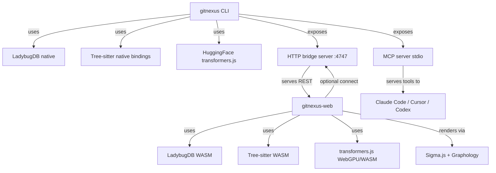

---

## 3. Indexing Pipeline — Luồng Xử Lý Chính

### Overview Flow

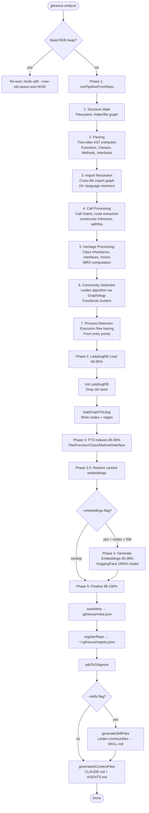

### Sub-pipeline: Import Resolution Per Language

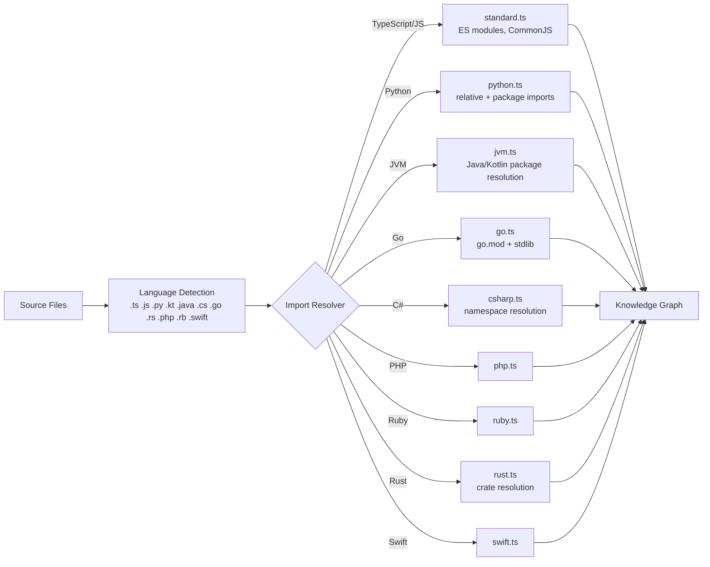

### Topological Sort (Pipeline Optimization)

Pipeline dùng **Kahn's algorithm** để group files theo topological levels — files trong cùng level không phụ thuộc nhau → **xử lý song song** qua Worker Pool.

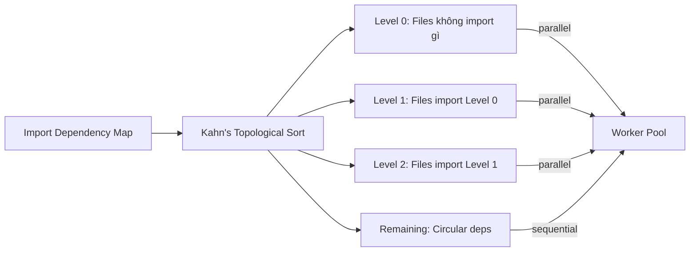

---

## 4. Knowledge Graph Schema

### Node Types

| Node Type | Mô tả | Key Properties |
|-----------|--------|----------------|
| `File` | Source file | `filePath`, `name`, `content` |
| `Function` | Standalone function | `name`, `filePath`, `startLine`, `content` |
| `Class` | Class definition | `name`, `filePath`, `content` |
| `Method` | Class method | `name`, `filePath`, `startLine` |
| `Interface` | Interface/Type | `name`, `filePath` |
| `Community` | Functional cluster | `heuristicLabel`, `cohesionScore` |
| `Process` | Execution flow | `name`, `type`, `stepCount` |
| `CodeEmbedding` | Vector embedding | `nodeId`, `embedding[]` |

### Edge Types (via `CodeRelation.type`)

| Edge Type | Mô tả | Confidence |
|-----------|--------|------------|
| `CALLS` | A calls B | 0.0–1.0 |
| `IMPORTS` | A imports B | high |
| `EXTENDS` | A extends B (inheritance) | high |
| `IMPLEMENTS` | A implements interface B | high |
| `DEFINES` | File defines symbol | high |
| `MEMBER_OF` | Symbol thuộc Community | — |
| `STEP_IN_PROCESS` | Symbol là 1 step trong Process | step_index |

### Graph Diagram

```mermaid
erDiagram
    File ||--o{ Function : "DEFINES"
    File ||--o{ Class : "DEFINES"
    File ||--o{ Interface : "DEFINES"
    Class ||--o{ Method : "DEFINES"
    Function }o--o{ Function : "CALLS (confidence)"
    Method }o--o{ Function : "CALLS (confidence)"
    Class }o--o{ Class : "EXTENDS"
    Class }o--o{ Interface : "IMPLEMENTS"
    File }o--o{ File : "IMPORTS"
    Function }o--|{ Community : "MEMBER_OF"
    Method }o--|{ Community : "MEMBER_OF"
    Class }o--|{ Community : "MEMBER_OF"
    Function }o--o{ Process : "STEP_IN_PROCESS (step_index)"
    Method }o--o{ Process : "STEP_IN_PROCESS (step_index)"
    Function ||--o| CodeEmbedding : "embedding"
    Class ||--o| CodeEmbedding : "embedding"
```

### Cypher Query Examples

```cypher
-- Tìm callers của 1 function
MATCH (caller)-[r:CodeRelation {type: 'CALLS'}]->(f:Function {name: "myFunc"})
RETURN caller.name, caller.filePath, r.confidence

-- Tìm tất cả symbols trong 1 community
MATCH (c:Community {heuristicLabel: 'Authentication'})<-[:CodeRelation {type: 'MEMBER_OF'}]-(s)
RETURN s.name, s.filePath

-- Tìm execution processes qua nhiều hops
MATCH path = (a)-[:CodeRelation {type: 'CALLS'}*1..3]->(b:Function {name: "validateUser"})
RETURN [n IN nodes(path) | n.name] AS chain

-- High-confidence call relationships
MATCH (c)-[r:CodeRelation {type: 'CALLS'}]->(fn)
WHERE r.confidence > 0.8
RETURN c.name, fn.name, r.confidence ORDER BY r.confidence DESC
```

---

## 5. MCP Server & 7 Tools

### Architecture MCP

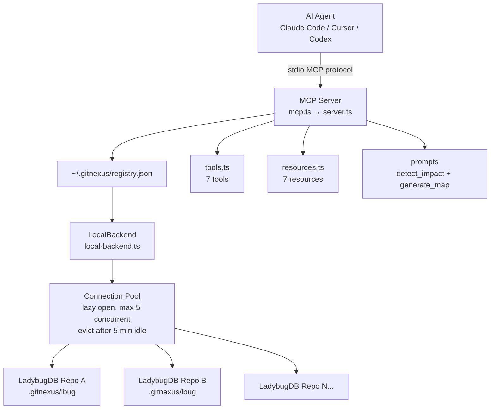

### 7 MCP Tools — Chi Tiết

#### Tool 1: `query` — Process-Grouped Hybrid Search

```
Input: { query: string, repo?: string, context?: string, goal?: string, limit?: number }
Search: BM25 + semantic (nếu có embeddings) + RRF fusion
Output: processes[] + process_symbols[] + definitions[]
```

**Output structure:**
```
processes:
  - summary: "LoginFlow"
    priority: 0.042
    symbol_count: 4
    process_type: cross_community  # hoặc intra_community
    step_count: 7

process_symbols:
  - name: validateUser
    type: Function
    filePath: src/auth/validate.ts
    process_id: proc_login
    step_index: 2

definitions:
  - name: AuthConfig
    type: Interface
    filePath: src/types/auth.ts
```

#### Tool 2: `context` — 360-Degree Symbol View

```
Input: { name: string, repo?: string, uid?: string, file?: string }
Output: symbol info + incoming refs (calls, imports) + outgoing refs + processes
```

**Output structure:**
```
symbol:
  uid: "Function:validateUser"
  kind: Function
  filePath: src/auth/validate.ts
  startLine: 15

incoming:
  calls: [handleLogin, handleRegister, UserController]
  imports: [authRouter]

outgoing:
  calls: [checkPassword, createSession]

processes:
  - name: LoginFlow (step 2/7)
  - name: RegistrationFlow (step 3/5)
```

#### Tool 3: `impact` — Blast Radius Analysis

```
Input: { target: string, direction: "upstream"|"downstream", repo?: string,
         maxDepth?: number, minConfidence?: number, includeTests?: boolean }
Output: depth-grouped dependents with confidence + affected processes + risk_level
```

**Risk levels:**
| Depth | Label | Ý nghĩa |
|-------|-------|---------|
| d=1 | **WILL BREAK** | Direct callers/importers |
| d=2 | LIKELY AFFECTED | Indirect dependencies |
| d=3 | MAY NEED TESTING | Transitive effects |

**Risk assessment:**
| Affected | Risk |
|----------|------|
| <5 symbols, ít processes | LOW |
| 5-15 symbols, 2-5 processes | MEDIUM |
| >15 symbols, nhiều processes | HIGH |
| Critical path (auth, payments) | CRITICAL |

#### Tool 4: `detect_changes` — Git-Diff Impact

```
Input: { scope: "staged"|"all"|"compare", repo?: string, base_ref?: string }
Output: changed_symbols[], affected_processes[], risk_level, summary stats
```

#### Tool 5: `rename` — Multi-File Coordinated Rename

```
Input: { symbol_name: string, new_name: string, dry_run: boolean, repo?: string }
Output: files_affected, total_edits, graph_edits (high confidence),
        text_search_edits (manual review needed), changes[]
```

**QUAN TRỌNG**: `graph_edits` = tìm qua call graph (an toàn). `text_search_edits` = text search fallback (cần review thủ công).

#### Tool 6: `cypher` — Raw Cypher Queries

```
Input: { query: string, repo?: string }
Output: raw Cypher results from LadybugDB
```

Phải đọc `gitnexus://repo/{name}/schema` trước khi dùng.

#### Tool 7: `list_repos` — Discover Indexed Repos

```
Input: {}
Output: list of indexed repositories from ~/.gitnexus/registry.json
```

### 7 MCP Resources

```mermaid
graph LR
    REPOS[gitnexus://repos\nAll indexed repos]
    CTX[gitnexus://repo/{name}/context\nStats + staleness check\n~150 tokens]
    CLUSTERS[gitnexus://repo/{name}/clusters\nAll functional areas + scores\n~300 tokens]
    CLUSTER[gitnexus://repo/{name}/cluster/{name}\nArea members\n~500 tokens]
    PROCESSES[gitnexus://repo/{name}/processes\nAll execution flows]
    PROCESS[gitnexus://repo/{name}/process/{name}\nFull step-by-step trace\n~200 tokens]
    SCHEMA[gitnexus://repo/{name}/schema\nGraph schema for Cypher]
```

### 2 MCP Prompts

| Prompt | Mô tả |
|--------|--------|
| `detect_impact` | Pre-commit change analysis — scope, processes, risk level |
| `generate_map` | Architecture documentation với Mermaid diagrams |

---

## 6. Claude Code Hooks

GitNexus tích hợp sâu với Claude Code qua **PreToolUse** và **PostToolUse** hooks:

### Hook Architecture

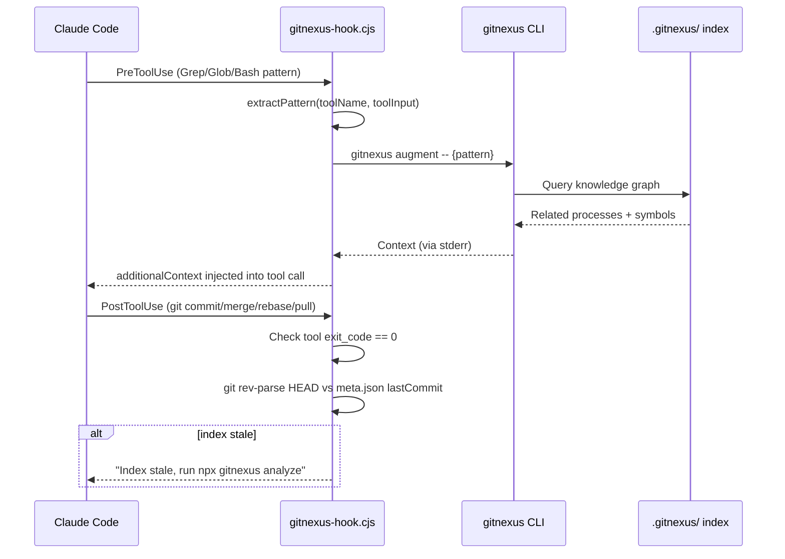

### PreToolUse — Search Augmentation

**Trigger**: Agent gọi `Grep`, `Glob`, hoặc `Bash` (với `rg`/`grep`)
**Action**: Extract search pattern → query graph → inject related execution flows as context
**Timeout**: 7000ms (graceful failure nếu timeout)

**Pattern extraction logic:**
- `Grep`: lấy `pattern` trực tiếp
- `Glob`: extract từ `**/symbolName` pattern
- `Bash`: parse `rg`/`grep` command, lấy search term sau flags

### PostToolUse — Index Staleness Detection

**Trigger**: `git commit`, `git merge`, `git rebase`, `git cherry-pick`, `git pull` (exit_code = 0)
**Action**: So sánh `HEAD` với `meta.json.lastCommit` → nếu khác, notify agent
**Note**: Trên Windows, SessionStart hooks bị broken (Claude Code bug) → context inject qua CLAUDE.md/skills thay thế.

---

## 7. Multi-Repo Architecture

### Global Registry Flow

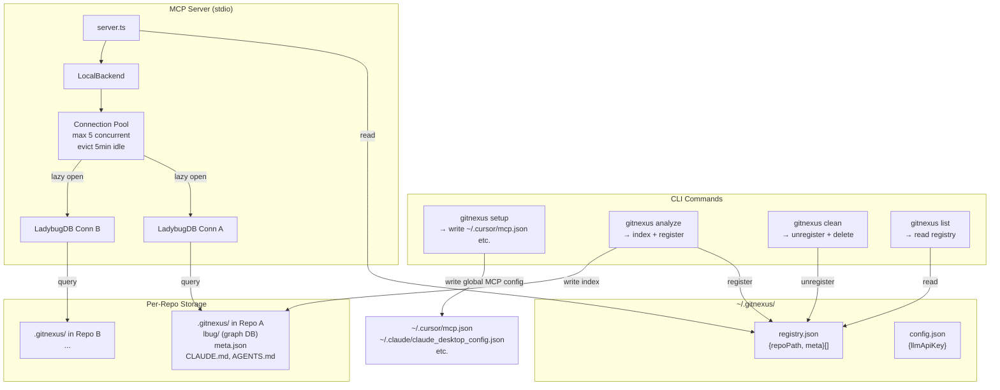

### Multi-Repo Tool Usage

Khi chỉ có 1 repo indexed: `repo` parameter là optional.

Khi có nhiều repos:
```
list_repos()  →  chọn repo name
query({query: "auth", repo: "my-app"})
context({name: "UserService", repo: "my-app"})
impact({target: "UserService", repo: "my-app"})
```

---

## 8. Web UI Architecture

### Web UI Stack

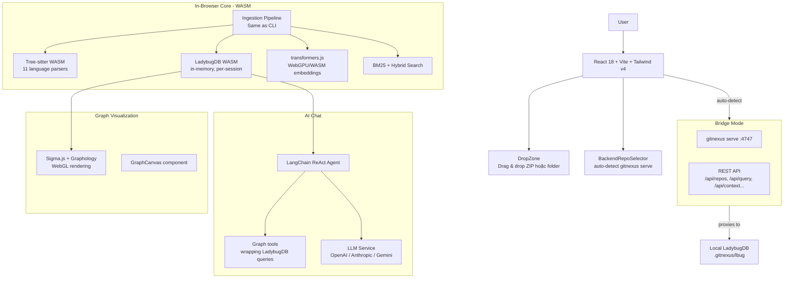

### Limitation Web UI

- In-browser: limited bởi browser memory (~5k files)
- Bridge mode: unlimited (kết nối CLI backend)
- Privacy: code không bao giờ leave browser (WASM mode)

---

## 9. Skills System

### Skills Hierarchy

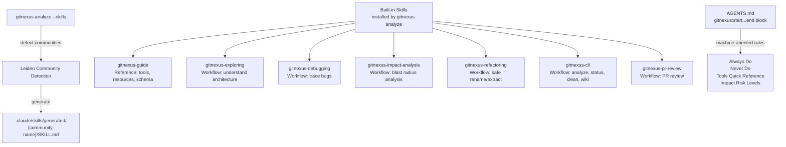

### Skill Selection Logic (theo AGENTS.md)

| Task | Skill |
|------|-------|
| "How does X work?" | `gitnexus-exploring` |
| "What breaks if I change X?" | `gitnexus-impact-analysis` |
| "Why is X failing?" | `gitnexus-debugging` |
| "Rename/Extract/Split code" | `gitnexus-refactoring` |
| "Index/Status/Clean/Wiki" | `gitnexus-cli` |
| "Tools/Resources/Schema?" | `gitnexus-guide` |
| "Review PR" | `gitnexus-pr-review` |

### Skill Workflow: Exploring (Ví dụ điển hình)

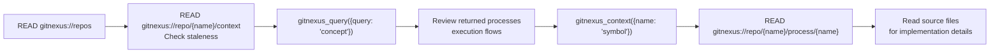

---

## 10. Tech Stack Chi Tiết

### CLI Package (`gitnexus/`)

| Layer | Technology | Version | Mục đích |
|-------|-----------|---------|---------|
| **Runtime** | Node.js | ≥ 20 | JavaScript runtime |
| **Language** | TypeScript | ^5.4.5 | Source language |
| **CLI Framework** | commander | ^12.0.0 | Command parsing |
| **Parsing** | tree-sitter | ^0.25.0 | AST parsing (native) |
| **Parsing (per lang)** | tree-sitter-* | varies | 11 language grammars |
| **Graph DB** | @ladybugdb/core | ^0.15.2 | Embedded graph + vector DB |
| **In-memory Graph** | graphology | ^0.25.4 | Graph algorithms |
| **Community Detection** | graphology-indices | ^0.17.0 | Leiden algorithm |
| **Embeddings** | @huggingface/transformers | ^3.0.0 | ONNX-based embeddings |
| **Embeddings Runtime** | onnxruntime-node | ^1.24.0 | ONNX inference |
| **MCP Protocol** | @modelcontextprotocol/sdk | ^1.0.0 | MCP server |
| **HTTP Server** | express | ^4.19.2 | Bridge mode |
| **LRU Cache** | lru-cache | ^11.0.0 | AST + query caching |
| **Progress** | cli-progress | ^3.12.0 | CLI progress bar |
| **Testing** | vitest | ^4.0.18 | ~2000 unit + ~1850 integration tests |
| **Build** | tsc | TypeScript compiler | |
| **Dev Watch** | tsx | ^4.0.0 | TypeScript hot-reload |

### Web Package (`gitnexus-web/`)

| Layer | Technology | Mục đích |
|-------|-----------|---------|
| **Framework** | React 18 + Vite | Frontend |
| **Styling** | Tailwind v4 | CSS |
| **Graph Viz** | Sigma.js + Graphology | WebGL graph rendering |
| **Parsing** | Tree-sitter WASM | In-browser AST |
| **Graph DB** | LadybugDB WASM | In-browser graph |
| **Embeddings** | transformers.js + WebGPU | In-browser ML |
| **AI Agent** | LangChain ReAct | Chat agent |
| **Concurrency** | Web Workers + Comlink | Background processing |
| **Testing** | Vitest + Playwright | ~200 unit + 5 E2E |

### Supported Languages (gitnexus/src/core/ingestion/languages/)

| Language | File | Imports | Named Bindings | Exports | Heritage | Constructor Inference |
|----------|------|---------|----------------|---------|----------|----------------------|
| TypeScript | `typescript.ts` | ✓ | ✓ | ✓ | ✓ | ✓ |
| JavaScript | `typescript.ts` | ✓ | ✓ | ✓ | ✓ | ✓ |
| Python | `python.ts` | ✓ | ✓ | ✓ | ✓ | ✓ |
| Java | `java.ts` | ✓ | ✓ | ✓ | ✓ | ✓ |
| Kotlin | `kotlin.ts` | ✓ | ✓ | ✓ | ✓ | ✓ |
| C# | `csharp.ts` | ✓ | ✓ | ✓ | ✓ | ✓ |
| Go | `go.ts` | ✓ | — | ✓ | ✓ | ✓ |
| Rust | `rust.ts` | ✓ | ✓ | ✓ | ✓ | ✓ |
| PHP | `php.ts` | ✓ | ✓ | ✓ | — | ✓ |
| Ruby | `ruby.ts` | ✓ | — | ✓ | ✓ | ✓ |
| Swift | `swift.ts` | — | — | ✓ | ✓ | ✓ |
| C | `c-cpp.ts` | — | — | ✓ | — | ✓ |
| C++ | `c-cpp.ts` | — | — | ✓ | ✓ | ✓ |

---

## 11. CLI Commands Reference

### Full Command Map

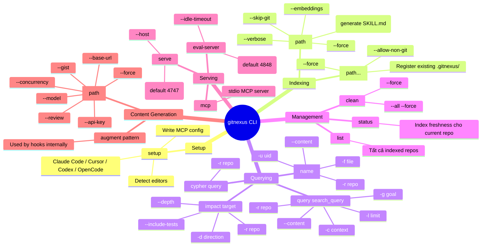

### Storage Paths

| Path | Nội dung |
|------|---------|
| `.gitnexus/` | Per-repo index directory (gitignored tự động) |
| `.gitnexus/lbug` | LadybugDB graph store |
| `.gitnexus/meta.json` | Index metadata: lastCommit, stats |
| `~/.gitnexus/registry.json` | Global repo registry |
| `~/.gitnexus/config.json` | Global config (LLM API key) |

---

## 12. Guardrails & Operational Signs

### Non-Negotiables (từ GUARDRAILS.md)

1. **NEVER commit secrets** — dùng `.env.example` với placeholders
2. **NEVER rename với blind find-and-replace** → dùng `rename` MCP tool với `dry_run: true` trước
3. **Run impact analysis trước khi edit shared symbols** → đừng ignore HIGH/CRITICAL risk
4. **Run `detect_changes` trước khi commit**
5. **Preserve embeddings** — nếu meta.json có embeddings, luôn dùng `--embeddings` khi re-analyze

### Operational Signs (Recurring Failures)

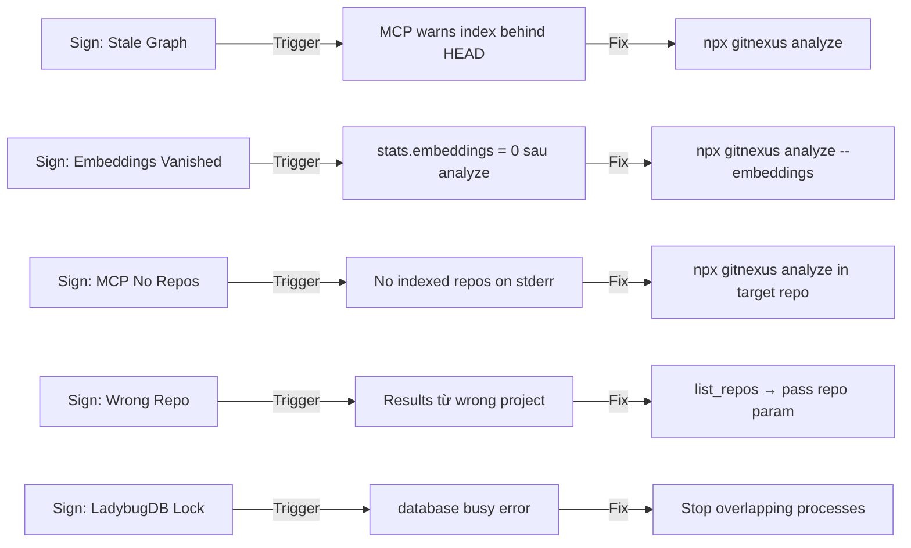

### Scope Boundaries (AGENTS.md)

| | Được phép |
|--|-----------|
| **Reads** | Repository tree, `.gitnexus/`, docs |
| **Writes** | Only files required for the task; update lockfiles when deps change |
| **Executes** | `npm`, `npx`, `node`, `uv run` (eval), shell utils |
| **Off-limits** | Secrets, production creds, unrelated repos, destructive git without confirmation |

---

## 13. Eval System

### SWE-bench Evaluation Framework

```
eval/
├── agents/
│   └── gitnexus_agent.py     # Python agent using gitnexus tools
├── bridge/
│   ├── gitnexus_tools.sh     # Shell bridge
│   └── mcp_bridge.py         # MCP bridge cho Python
├── configs/
│   ├── models/               # yaml configs: claude-haiku/sonnet/opus, deepseek, glm, minimax
│   └── modes/                # baseline.yaml, etc.
└── analysis/
    └── analyze_results.py    # Result analysis
```

**Supported models cho eval:**
- Claude Haiku / Sonnet / Opus (Anthropic)
- DeepSeek Chat / v3
- GLM-4.7 / GLM-5
- MiniMax-2.5 / m2.1

**Eval server** (`gitnexus eval-server`): Lightweight HTTP daemon cho fast tool calls trong SWE-bench evaluation, tránh MCP overhead.

---

## 14. So Sánh: Traditional Graph RAG vs GitNexus

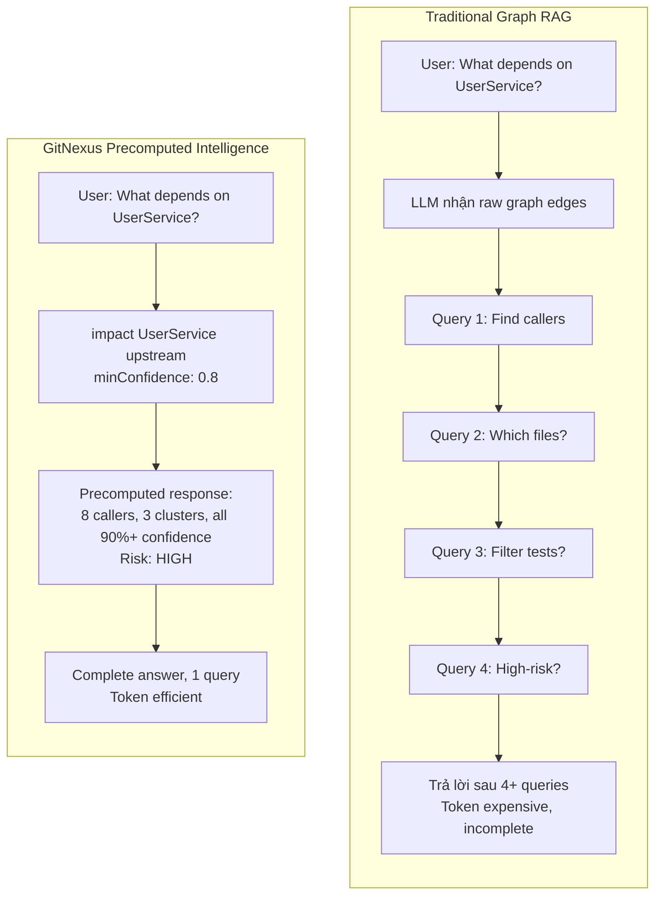

### Core Innovation: Precomputed Relational Intelligence

**Thay vì để LLM tự explore graph**, GitNexus precompute:
- **Communities** (Leiden algorithm at index time) → AI biết code được group như thế nào
- **Processes** (entry-point tracing at index time) → AI biết execution flows
- **Confidence scores** (at index time) → AI biết độ chắc chắn của mỗi relationship

**Kết quả:**
- **Reliability**: LLM không thể miss context vì context đã được precompute
- **Token efficiency**: Không cần 10-query chains để hiểu 1 function
- **Model democratization**: Smaller LLMs work vì tools làm heavy lifting

---

## 15. Tích Hợp Với CCN2 Agent Teams

### Mapping Agents → GitNexus Tools

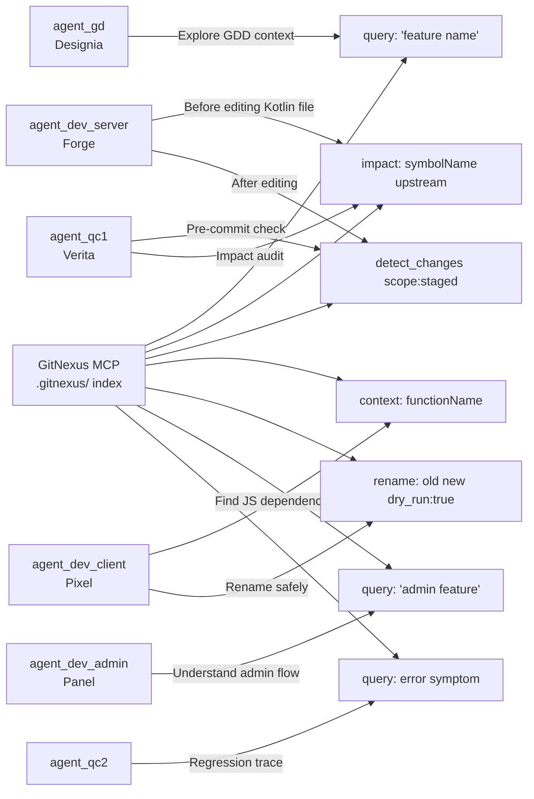

### Setup cho CCN2

CCN2 có cả Kotlin server (`serverccn2/`) và TypeScript/JS client (`clientccn2/`). GitNexus hỗ trợ tốt cả hai.

**Bước setup:**
```bash
# Index server
cd D:\PROJECT\CCN2\serverccn2
npx gitnexus analyze

# Index client
cd D:\PROJECT\CCN2\clientccn2
npx gitnexus analyze

# Multi-repo: agent dùng repo param
query({query: "room logic", repo: "serverccn2"})
impact({target: "GameRoom", repo: "serverccn2"})
```

### Use Cases Cụ Thể Cho CCN2

| Agent Task | GitNexus Command |
|-----------|-----------------|
| Forge thay đổi `GameRoom.kt` | `impact({target: "GameRoom", direction: "upstream"})` |
| Pixel rename JS function | `rename({symbol_name: "old", new_name: "new", dry_run: true})` |
| Verita pre-commit | `detect_changes({scope: "staged"})` |
| Debug server crash | `query({query: "error symptom"})` → `context({name: "suspect"})` |
| Hiểu Combat system | `query({query: "combat engine"})` |
| Tìm execution flows | `READ gitnexus://repo/serverccn2/processes` |

### Agent Teams Integration Pattern

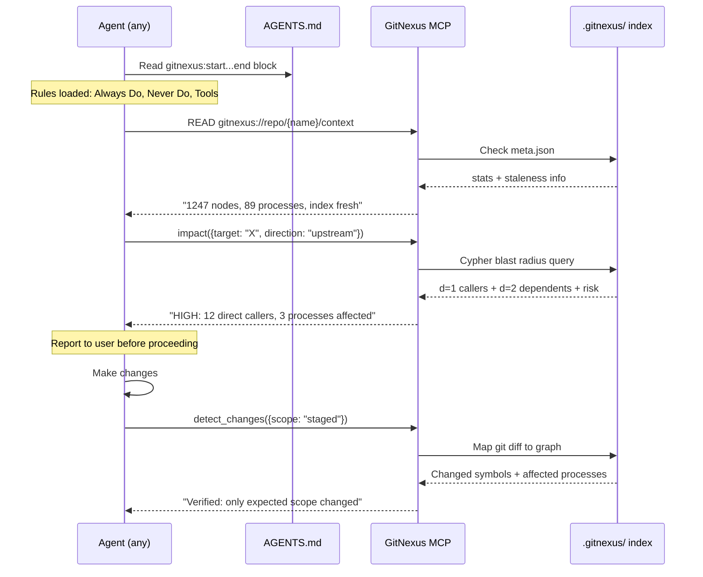

---

## 16. Roadmap & Limitations

### Actively Building (từ README)

- **LLM Cluster Enrichment** — Semantic cluster names via LLM API (hiện dùng heuristic labels)
- **AST Decorator Detection** — Parse `@Controller`, `@Get`, etc. cho JVM frameworks
- **Incremental Indexing** — Chỉ re-index changed files (hiện rebuild toàn bộ)

### Recently Completed

- Constructor-Inferred Type Resolution, `self`/`this` Receiver Mapping
- Wiki Generation, Multi-File Rename, Git-Diff Impact Analysis
- Process-Grouped Search, 360-Degree Context, Claude Code Hooks
- Multi-Repo MCP, Zero-Config Setup, 13 Language Support
- Community Detection, Process Detection, Confidence Scoring
- Hybrid Search, Vector Index

### Known Limitations

| Limitation | Chi tiết |
|-----------|---------|
| **Full reindex** | Mỗi `analyze` rebuild toàn bộ graph (incremental đang build) |
| **Memory** | Cần 8GB heap cho large repos |
| **LadybugDB single-writer** | Không chạy `analyze` song song với MCP |
| **Windows hooks bug** | SessionStart hooks broken (Claude Code bug) |
| **Embedding opt-in** | `--embeddings` phải pass mỗi lần analyze hoặc bị drop |
| **Node count limit** | Embeddings tự skip nếu >50,000 nodes |
| **Web UI** | ~5k files limit trong browser (WASM mode) |
| **tree-sitter-kotlin/swift** | Optional deps, build cần python3/make/g++ |

---

## 17. Gợi Ý Plan Skill

### Skill 1: `git-nexus-deep-understanding`

**Mục đích**: Phân tích codebase đang được index bởi GitNexus — hiểu architecture, execution flows, clusters.

**Triggers**: "Giải thích codebase X", "Architecture của Y là gì?", "How does Z work?", "Phân tích hệ thống"

**Workflow gợi ý**:
```
1. READ gitnexus://repos → xác định repo name
2. READ gitnexus://repo/{name}/context → stats + check staleness
3. READ gitnexus://repo/{name}/clusters → functional areas
4. READ gitnexus://repo/{name}/processes → execution flows
5. gitnexus_query({query: "concept"}) → find related flows
6. gitnexus_context({name: "key symbol"}) → deep dive
7. Generate Mermaid diagram từ kết quả
```

**Output**: Mermaid architecture diagram + description của từng cluster + main execution flows

### Skill 2: `using-git-nexus`

**Mục đích**: Workflow cho agent teams khi làm việc trong project đã được index. Protocol: trước khi edit, sau khi edit.

**Triggers**: Bất kỳ agent nào đang làm task trong CCN2 codebase đã index

**Core Protocol**:
```
TRƯỚC KHI EDIT:
1. READ gitnexus://repo/{name}/context → check staleness
2. gitnexus_impact({target: symbolToEdit, direction: "upstream"})
3. If risk == HIGH/CRITICAL → report to user, wait confirmation

SAU KHI EDIT:
4. gitnexus_detect_changes({scope: "staged"})
5. Verify only expected scope changed

RENAME:
6. gitnexus_rename({dry_run: true}) → review edits
7. gitnexus_rename({dry_run: false}) → apply
8. gitnexus_detect_changes() → verify

DEBUG:
9. gitnexus_query({query: "error symptom"})
10. gitnexus_context({name: "suspect"})
11. READ gitnexus://repo/{name}/process/{processName}
```

**Key Rules** (từ AGENTS.md gitnexus:start block):
- MUST run impact trước mọi edit
- MUST run detect_changes trước commit
- NEVER rename với find-and-replace
- NEVER ignore HIGH/CRITICAL risk warnings

---

## Tổng Kết

GitNexus là một **code intelligence layer** mạnh mẽ cho AI agents. Điểm mạnh cốt lõi:

1. **Precomputed graph** — không phải raw data, mà là structured intelligence
2. **7 MCP tools** phủ toàn bộ use cases: search, context, impact, detect changes, rename, cypher
3. **Claude Code integration sâu** — PreToolUse (augment search) + PostToolUse (staleness notify)
4. **Multi-repo** — 1 MCP server phục vụ tất cả repos
5. **13 languages** với semantic understanding (imports, calls, heritage, constructors)
6. **Privacy-first** — tất cả local, không có network calls

Với CCN2 agent teams (Kotlin server + JS client), GitNexus có thể:
- Ngăn breaking changes khi agents edit shared symbols
- Tăng tốc debug bằng call chain tracing
- Cho phép safe refactoring với multi-file rename
- Cung cấp architectural overview instant cho mọi agent
