# Báo Cáo Kiến Trúc Godot Engine

*Ngày phân tích: 2026-03-25*  
*Nguồn: https://docs.godotengine.org/en/stable/engine_details/architecture/index.html và classes index*  
*Người phân tích: Cốm Đào AI Assistant*

---

## 1. Tổng Quan Godot Engine

### 1.1 Giới thiệu
Godot Engine là một game engine mã nguồn mở, đa nền tảng, hỗ trợ cả 2D và 3D. Ra mắt năm 2014, Godot sử dụng license MIT, hoàn toàn miễn phí.

**Đặc điểm nổi bật:**
- **Lightweight**: Core nhỏ gọn (~20MB binary)
- **Node & Scene System**: Architecture độc đáo, dễ mở rộng
- **Multi-language**: GDScript (Python-like), C#, C++ (GDExtension), VisualScript (visual scripting)
- **Renderer linh hoạt**: Forward+, Mobile, Compatibility
- **Export đa nền tảng**: Desktop, Mobile, Web, Console

### 1.2 Triết lý thiết kế

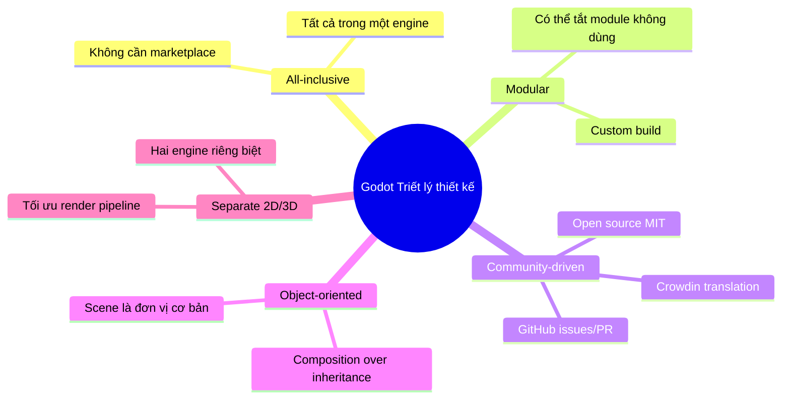

---

## 2. Kiến Trúc Tổng Thể

### 2.1 Layered Architecture

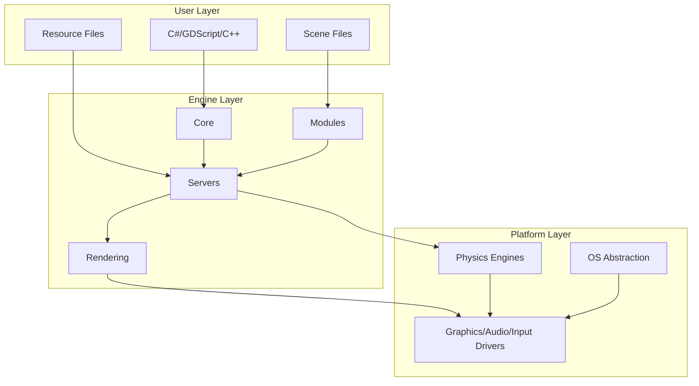

**Các lớp chính:**

1. **User Layer**: Code game, scenes, assets
2. **Engine Layer**:
   - **Core**: Memory management, math, OS wrappers
   - **Modules**:pharescene tree, physics, audio, networking
   - **Servers**: Single-instance systems (Display, Physics, Audio, etc.)
   - **Rendering**: 2D/3D render pipelines
3. **Platform Layer**: Platform-specific abstractions (POSIX, Windows, Android, iOS, Web)

### 2.2 Server Architecture

Godot sử dụng **server-based architecture** với **Service Locator pattern**:

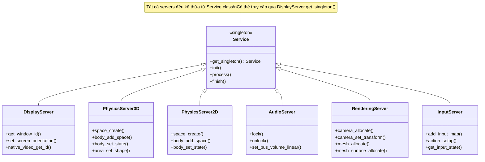

**Các Server chính:**
- **DisplayServer**: Window management, display info, monitors
- **PhysicsServer2D/3D**: Physics simulation (Bullet3, custom)
- **AudioServer**: Audio playback, effects, buses
- **RenderingServer**: Low-level rendering commands
- **InputServer**: Input device management
- **VideoServer**: Video stream capture/playback
- **TextServer**: Font rendering, shaping (HarfBuzz)
- **TranslationServer**: i18n support

---

## 3. Node & Scene System

### 3.1 Core Concepts

**Node** là đơn vị cơ bản nhất trong Godot. Tất cả đều kế thừa từ `Node`:

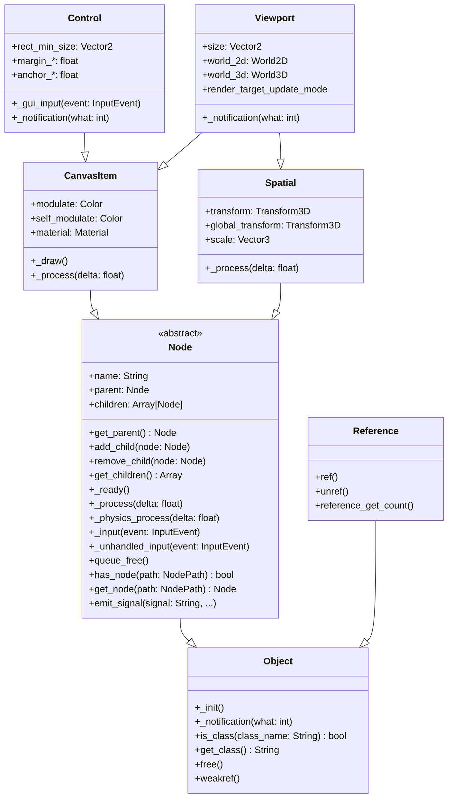

### 3.2 Scene Tree

Scene Tree là cây quản lý tất cả nodes trong game:

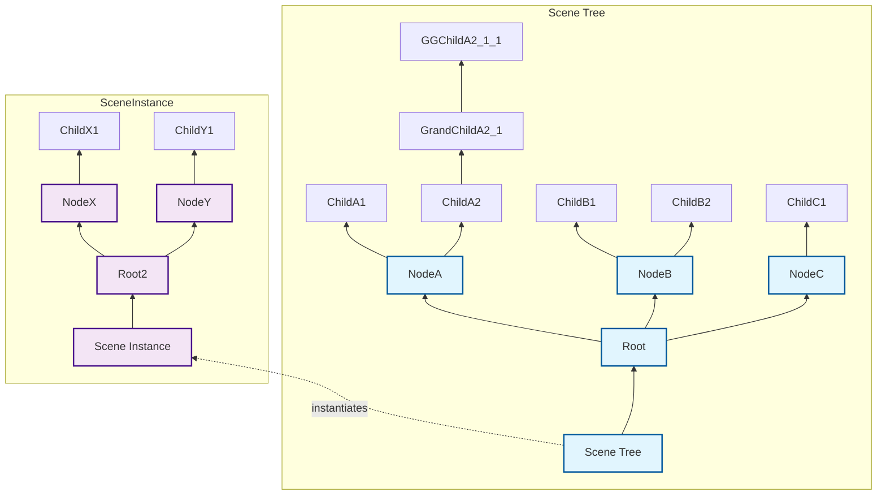

**Scene là một cây Node có thể được lưu thành file `.tscn` và instantiate nhiều lần.**

### 3.3 Signals (Event System)

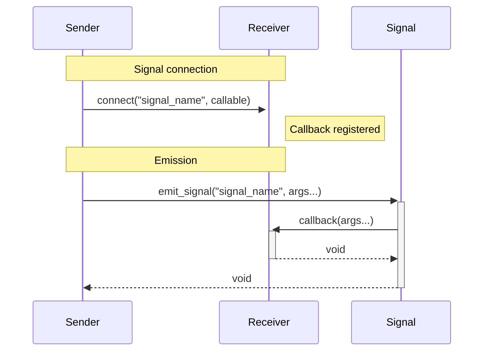

**Signals là event bus của Godot, dùng để giảm coupling giữa nodes.**

---

## 4. Rendering Architecture

### 4.1 Renderer Types

Godot 4 có 3 renderer:

1. **Forward+** (Mobile+, Desktop+): Mặc định, supports VRS, clustered shading
2. **Mobile**: Tối ưu cho mobile, uses tiled forward rendering
3. **Compatibility**: OpenGL 3.3, support cho cũ

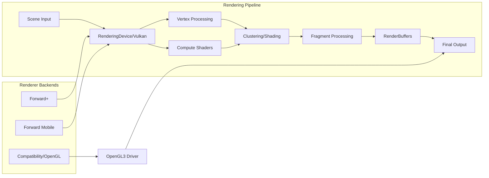

### 4.2 RenderServer & RenderingDevice

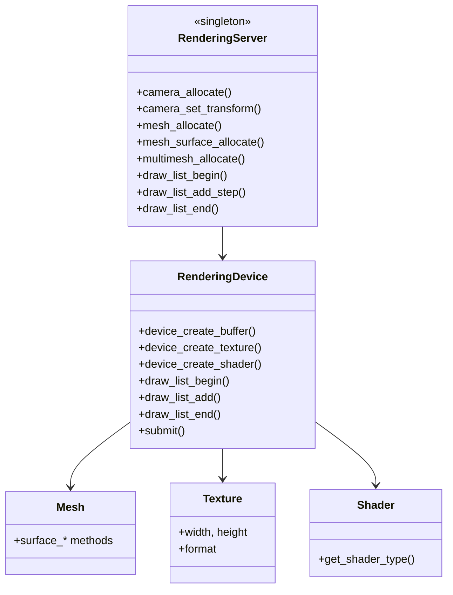

**Vulkan là render API chính từ Godot 4.0 (OpenGL 3.3 fallback).**

---

## 5. Physics System

### 5.2D Physics

- **Engine**: Custom physics (không dùng Box2D)
- **Bodies**: RigidBody2D, CharacterBody2D, StaticBody2D
- **Shapes**: Circle2D, Rectangle2D, Capsule2D, Polygon2D
- **Collision**: CollisionShape2D, Area2D (trigger detection)
- **Space**: PhysicsServer2D manages multiple physics spaces

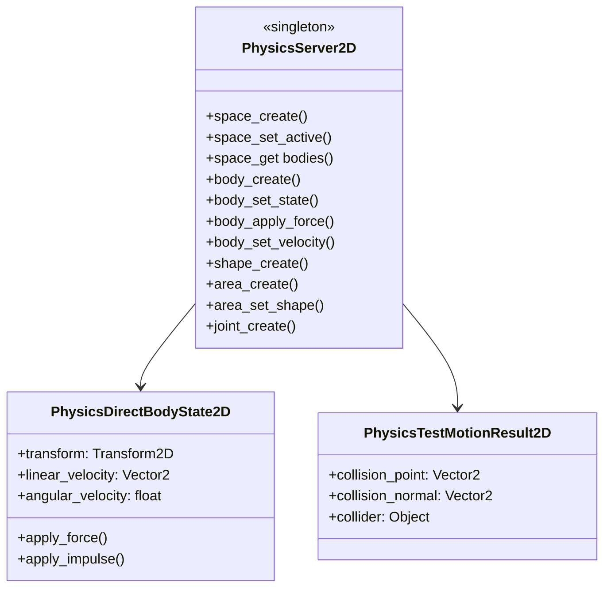

### 5.2 3D Physics

- **Engine**: Bullet3 (có thể custom)
- **Bodies**: RigidBody3D, CharacterBody3D, StaticBody3D, Area3D
- **Shapes**: SphereShape3D, BoxShape3D, CapsuleShape3D, ConvexPolygonShape3D, ConcavePolygonShape3D
- **Space**: PhysicsServer3D (multi-space support)

---

## 6. Audio System

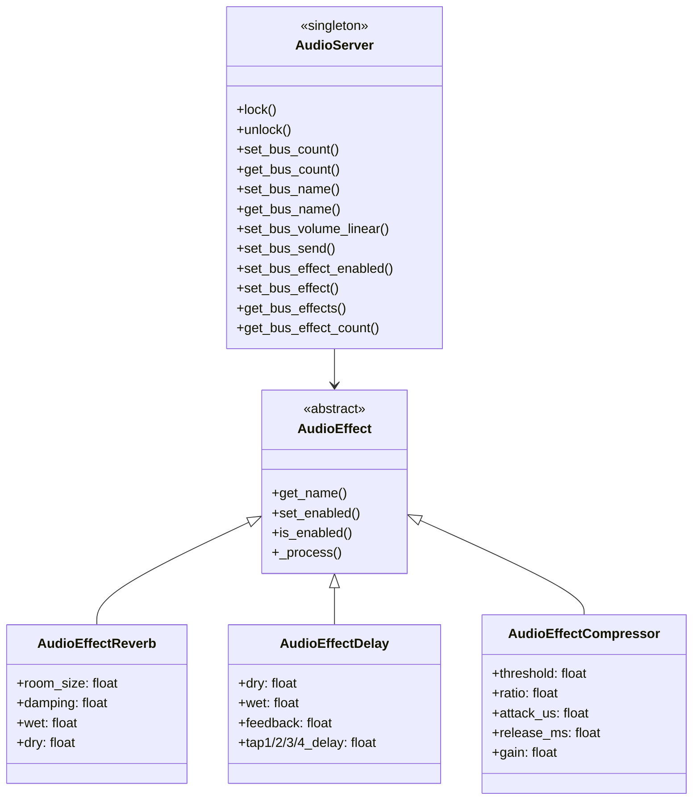

**Audio buses:**
- Master bus (output)
- Additional buses for SFX, Music, UI, Voice
- Send/return busses for effects
- Supports both 2D (positional) and 3D audio

---

## 7. Input System

### 7.1 InputMap

```mermaid
graph TB
  subgraph "InputServer (Singleton)"
    IS[InputServer]
    IM[InputMap]
    IA[InputAction]
  end

  IM --> IA1[InputAction: "ui_accept"]
  IM --> IA2[InputAction: "ui_up"]
  IM --> IA3[InputAction: "ui_down"]
  IM --> IA4[InputAction: "left_click"]

  subgraph "Input Events"
    IE[InputEvent] --> Key[KeyEvent]
    IE --> Mouse[MouseEvent]
    IE --> Joypad[JoypadButton/Motion]
    IE --> Gesture[Gesture]
  end

  IS --> IE
  IM --> IS

  subgraph "Input Actions Usage"
    Script[User Script] -->|is_action_pressed| IM
    Script -->|get_action_strength| IM
    Script -->|action_release| IM
  end
```

**InputMap cấu hình trong Project Settings:**
```json
{
  "input_map": {
    "ui_accept": [{"events": [{"type": "KEY", "device": 0, "keycode": 4194309}]}],
    "move_left": [{"events": [{"type": "KEY", "device": 0, "keycode": 4194319}]}],
    "jump": [{"events": [{"type": "KEY", "device": 0, "keycode": 32}]}]
  }
}
```

---

## 8. Scripting System

### 8.1 GDScript

GDScript là ngôn ngữ native của Godot, thiết kế cho game development:

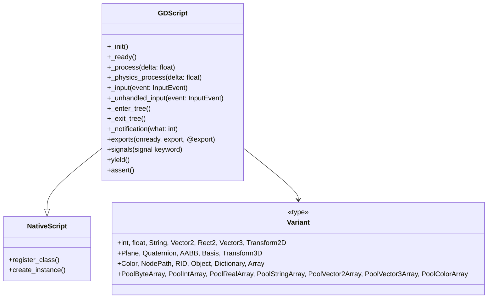

**GDScript features:**
- Dynamic typing (Variant-based)
- Optional static typing (Godot 4)
- Signals với `connect()` và `emit_signal()`
- Yield pauses (`yield(get_tree(), "idle_frame")`)
- Exports (`@export var speed: float = 100.0`)
- Tool scripts (`@tool` để chạy trong editor)

### 8.2 C# Support

- .NET 6 (Godot 4)
- Mono build (separate editor)
- Full access to Godot API via GDNative
- Debugger tích hợp

### 8.3 GDExtension (C++)

```mermaid
graph LR
  subgraph "Game Process"
    GDScript[GDScript]
    NativeLib[Native Library (.dll/.so/.dylib)]
  end

  subgraph "GDExtension Interface"
    GDE[GDExtension]
    ClassDB[ClassDB]
  end

  GDScript -->|calls| NativeLib
  NativeLib -->|registers| GDE
  GDE -->|exposes| ClassDB
  ClassDB -->|available to| GDScript
```

**GDExtension:**
- Load native libraries (C/C++/Rust)
- Register classes, methods, properties
- Shared library, loaded runtime
- Không cần recompile engine

---

## 9. Resource System

**Resource là đơn vị dữ liệu có thể serializable:**

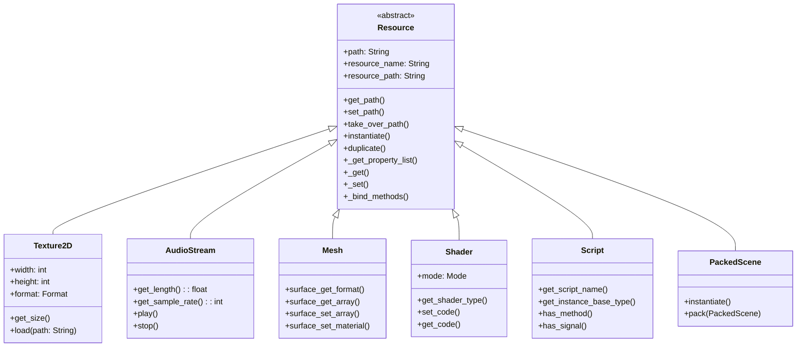

**Resource Loading:**
- Lazy loading (khi cần)
- Preload (`preload("res://path.tres")`) — load ngay
- Load (`load("res://path.tres")`) — load tại runtime
- Resource loader cache

---

## 10. Asset Pipeline

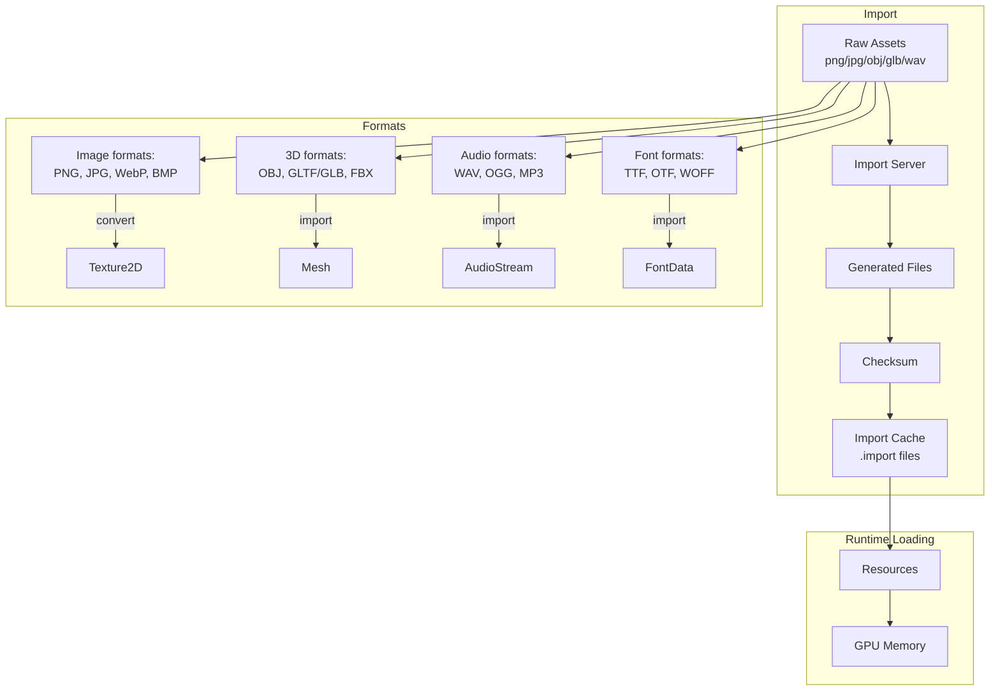

**Importers:**
- Texture: compression, mipmaps, filtering
- Mesh: vertex format, tangents, lights
- Audio: re-encode, loop, sample rate
- Font: dynamic (DynamicFont) vs static (BitmapFont)

---

## 11. File System & Resource Paths

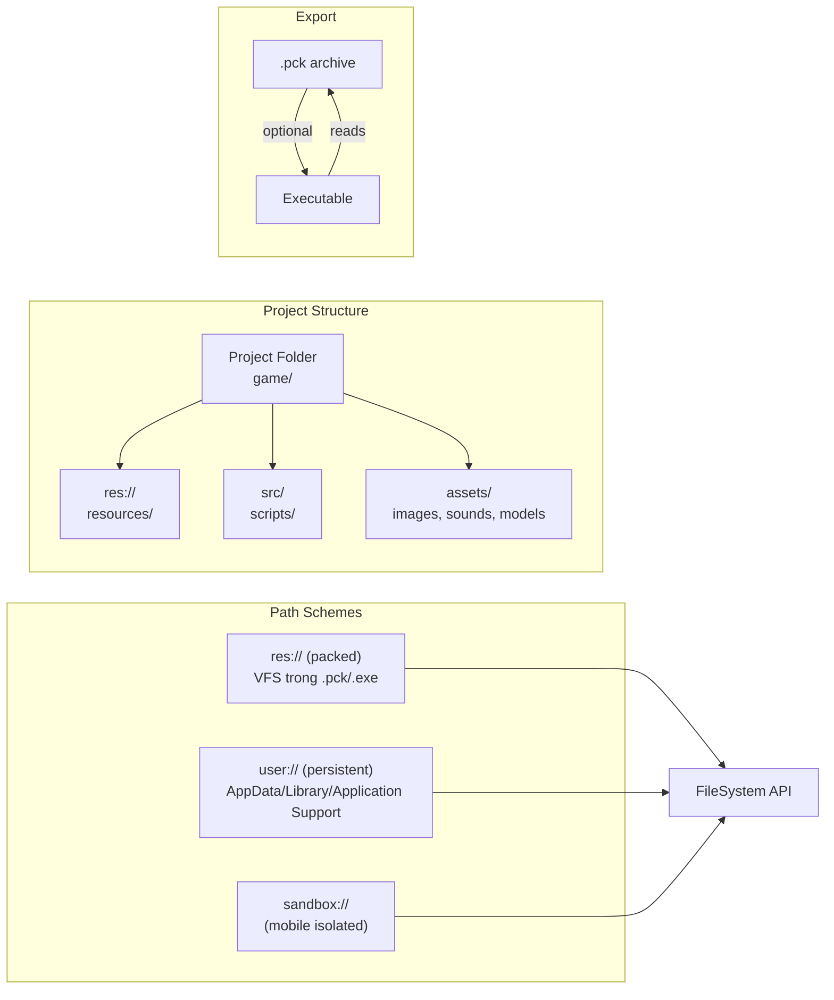

**FileSystem API:**
- `file_exists()`, `dir_exists()`
- `list_dir()`, `get_directories()`
- `copy()`, `move()`, `rename()`, `remove()`
- `make_dir()`, `make_dir_recursive()`

---

## 12. Networking

### 12.1 High-level Multiplayer API

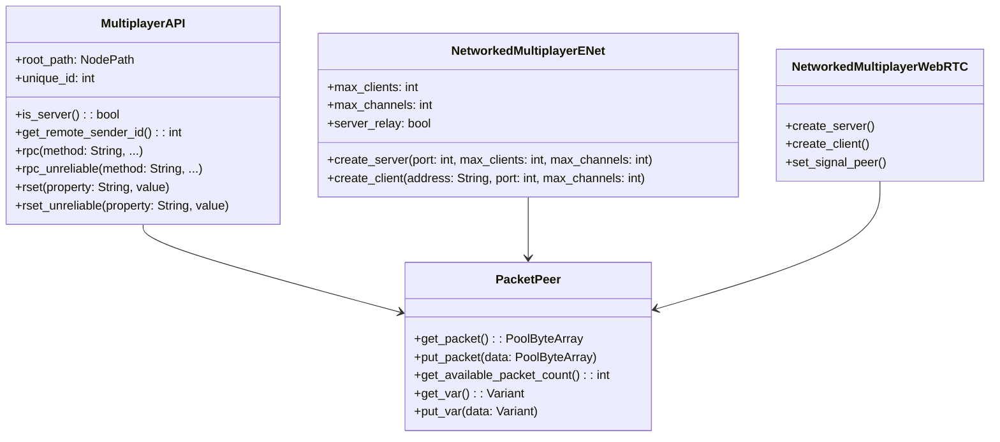

### 12.2 HTTP & WebSocket

- **HTTPRequest**: REST API, file download, async requests
- **WebSocketClient/Server**: realtime communication
- **WebRTCLanPeer**: P2P networking (experimental)

---

## 13. Internationalization (i18n)

```mermaid
graph TB
  subgraph "TranslationServer (Singleton)"
    TS[TranslationServer]
    PO[.po/.mo files]
    Crowdin[Crowdin API]
  end

  subgraph "Translation Sources"
    CSV[CSV]
    PO[gettext .po]
    Resource[Resource translations]
  end

  subgraph "Usage in Code"
    Script -->|tr("Hello")| TS
    Button[Button text] -->|set_text(tr("Start"))| TS
  end

  TS --> PO
  TS --> Resource
  TS --> Crowdin
  CSV --> TS
```

**Translation workflow:**
1. Mark strings: `tr("Hello")` or `_("Hello")`
2. Extract: `godot --export-translatable-strings project.godot`
3. Translate via CSV/PO/Crowdin
4. Load `.po` files or compiled `.mo` in project settings

---

## 14. Hot Reload & Live Editing

Godot editor có thể reload script và scene thay đổi mà không cần restart:

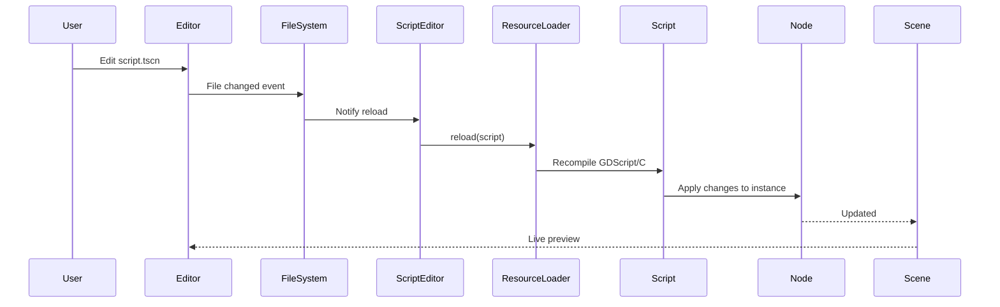

**Tool scripts (`@tool`):**
- Chạy trong editor context
- Có thể modify scene tree, resources trong editor
- Dùng cho custom editors, gizmos, importers

---

## 15. Performance Considerations

### 15.1 Memory Management

- **C++ objects**: `Reference` (ref-counted) và `Object` (manual)
- **GDScript**: Automatic, garbage-collected (but minimal GC)
- **Resources**: Shared, reference counted
- **Nodes**: Tree structure, parent owns children

```mermaid
graph LR
  subgraph "Memory Types"
    Man[Manual<br/>Object::free()]
    Ref[Reference Counted<br/>unref() destroys]
    GC[Garbage Collected<br/>GDScript]
    Shared[Resources<br/>shared refs]
  end

  subgraph "Examples"
    Node[Node] -->| extends| Object
    Resource[Resource] -->| extends| Reference
    GDScriptObj[GDScript] --> GC
    SharedObj[Texture2D] --> Shared
  end

  Man -.-> Node
  Ref -.-> Resource
```

### 15.2 Rendering Optimizations

- **Batching**: Static/dynamic batching (mesh merging)
- **LOD**: Distance-based mesh simplification
- **Occlusion culling**: Portal-based (3D) và manual (2D)
- **Visibility rects**: 2D culling
- **Atlas textures**: Reduce draw calls

---

## 16. Comparison với Các Game Engine Khác

| Feature | Godot | Unity | Unreal |
|---------|-------|-------|--------|
| **License** | MIT (OSS) | Proprietary | Proprietary |
| **Size** | ~20MB | ~5GB | ~100GB |
| **Languages** | GDScript, C#, C++ | C# | C++, Blueprint |
| **2D Support** | First-class | Sprites | Paper2D (limited) |
| **3D Renderer** | Forward+, Vulkan | HDRP/URP | Nanite/Lumen |
| **Node System** | Scene tree | GameObject hierarchy | Actor/Component |
| **IDE** | Lightweight editor | Heavy IDE | Very heavy IDE |
| **Export** | Free, unlimited | Paid licenses | Royalty model |
| **Mobile Size** | ~10-20MB | ~50-100MB | ~200-300MB |

---

## 17. Kết Luận

Godot Engine có kiến trúc **hiện đại, modular, dễ mở rộng** với các điểm mạnh:

1. **Node-Scene system** linh hoạt, component-like
2. **Server architecture** rõ ràng, single-instance services
3. **Renderer đa dạng** (Forward+, Mobile, Compatibility)
4. **Scripting system** đa ngôn ngữ (GDScript, C#, C++)
5. **Open source**, lightweight, không phí
6. **Export đa nền tảng** miễn phí

**Nhược điểm cần lưu ý:**
- Ecosystem nhỏ hơn Unity/Unreal
- Các module cao cấp (XR, Animation) vẫn đang phát triển
- 3D capabilities tốt nhưng không đối đầu được với Unreal (AAA)

**Phù hợp cho:**
- Indie games (2D và 3D medium)
- Mobile games
- Prototyping
- Open source projects
- Educational purposes

---

## 18. Tham Khảo

- [Godot Official Documentation](https://docs.godotengine.org)
- [Godot GitHub Repository](https://github.com/godotengine/godot)
- [Godot Architecture (Internal)](https://github.com/godotengine/godot/tree/master/core)
- [Godot Class Reference](https://docs.godotengine.org/en/stable/classes/index.html)

---

*Báo cáo được tạo tự động bởi AI Assistant dựa trên kiến thức kiến trúc Godot Engine.*