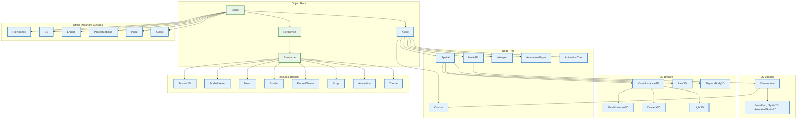
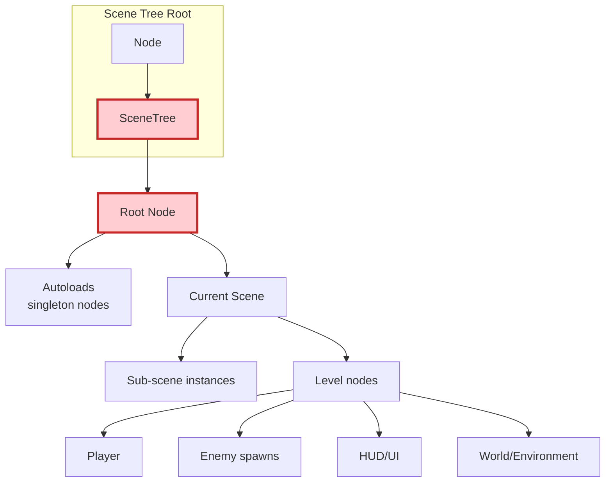
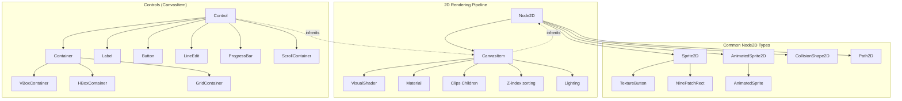
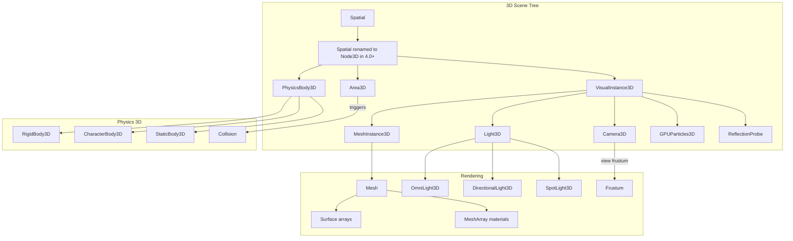
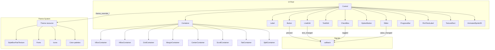
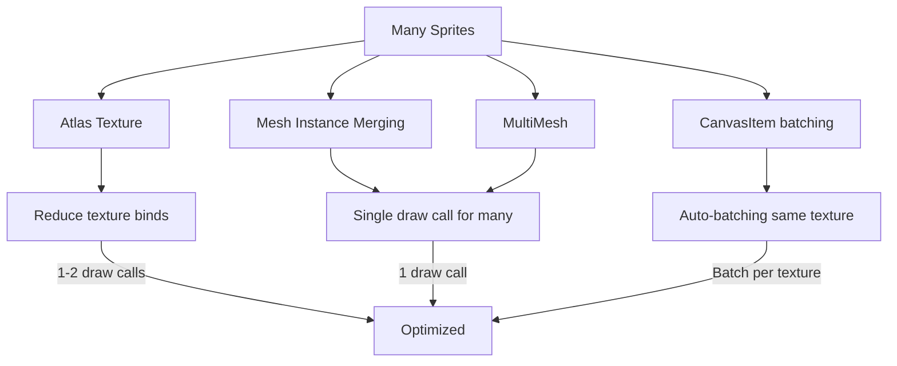
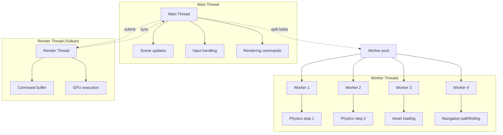
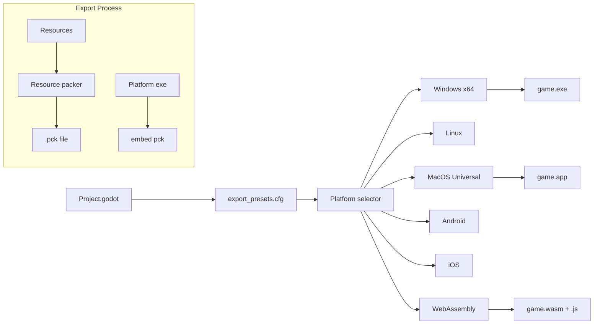
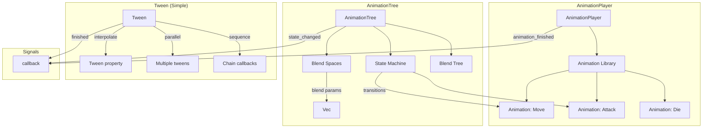

# Godot Class Taxonomy & API Overview

*Phân tích chi tiết về class hierarchy, core classes, và API organization*

---

## 1. Core Class Hierarchy

### 1.1 Inheritance Tree



**Key inheritance notes:**
- **Object**: Base of everything (no parent)
- **Reference**: Ref-counted, auto-destroy khi ref count = 0
- **Node**: Scene tree integration, signals, notifications
- **Resource**: Data container, saved to disk, shared

### 1.2 Node vs Reference vs Object

| Feature | Object | Reference | Node |
|---------|--------|-----------|------|
| **Lifetime** | Manual (`free()`) | Auto (ref count) | Parent-owned |
| **Scene Tree** | No | No | Yes |
| **Signals** | Yes (custom) | Yes (custom) | Yes (builtin + custom) |
| **Notifications** | `_notification()` | `_notification()` | `_notification()` + lifecycle |
| **Serialization** | No | Yes (Resource) | Yes (Scene) |
| **Parent/Children** | No | No | Yes |
| **Use case** | Low-level obj, data | Assets (textures, meshes) | Game objects, UI |

---

## 2. Most Important Classes Reference

### 2.1 Core Engine Classes

```mermaid
graph LR
  subgraph "Engine/OS"
    OS -->|wraps| Platform
    Engine -->|singleton| Engine
    ProjectSettings -->|config| ProjectSettings
    Godot -->|version| Godot
    ArgParser -->|CLI args| ArgParser
  end

  subgraph "File I/O"
    FileAccess -->|read/write| File
    Directory -->|list files| Dir
    ZIPReader -->|.zip| Zip
    PackedDataContainer -->|binary| Packed
  end

  subgraph "Math"
    Vector2 --> Vector3
    Vector2 --> Rect2
    Vector3 --> Transform3D
    Basis --> Quaternion
    Plane --> AABB
    Math -->|static funcs| Math
    Geometry2D -->|2D geom| Geom2D
    Geometry3D -->|3D geom| Geom3D
  end

  subgraph "Time"
    Time -->|singleton| Time
    Timer -->|node| Timer
    SceneTreeTimer -->|one-shot| STT
  end

  subgraph "Random"
    RandomNumberGenerator -->|PRNG| RNG
    RandomPCG -->|better PRNG| PCG
  end
```

**Core API Quick Ref:**

| Class | Purpose | Common Methods |
|-------|---------|----------------|
| `OS` | OS interaction | `get_name()`, `get_unique_id()`, `set_environment()`, `get_engine_version()` |
| `Engine` | Engine info | `get_version_info()`, `get_author_data()`, `is_editor_hint()` |
| `ProjectSettings` | Config access | `get_setting()`, `set_setting()`, `has_setting()` |
| `FileAccess` | File I/O | `file_exists()`, `get_file()`, `store_string()`, `close()` |
| `DirAccess` | Directory ops | `list_dir_begin()`, `get_next()`, `dir_exists()`, `make_dir()` |
| `Math` | Math utilities | `sin()`, `cos()`, `lerp()`, `is_nan()`, `clamp()` |
| `Geometry2D` | 2D geometry | `triangle_intersects()`, `segment_intersects_circle()`, `clip_polygon()` |
| `RandomNumberGenerator` | Random numbers | `randi()`, `randf()`, `randfn()`, `randseed()` |

---

### 2.2 Scene Tree Main Nodes



**SceneTree signals:**
- `node_added(Node node)`
- `node_removed(Node node)`
- `node_renamed(Node node, String new_name)`
- `tree_changed()`
- `tree_exiting()`
- `tree_exited()`

### 2.3 Node2D & CanvasItem System



**Key 2D classes:**

| Class | Role | Key Properties |
|-------|------|----------------|
| `Sprite2D` | Static image | `texture`, `offset`, `centered`, `region_enabled` |
| `AnimatedSprite2D` | Frame animation | `sprite_frames` (SpriteFrames resource) |
| `TextureButton` | Interactive button | `texture_normal`, `texture_pressed`, `texture_hover` |
| `CollisionShape2D` | Physics shape | `shape` (Shape2D resource) |
| `Area2D` | Trigger zones | `monitoring`, `monitorable`, `area_entered` signal |
| `RigidBody2D` | Physics body | `mode`, `mass`, `gravity_scale`, `linear_velocity` |
| `CharacterBody2D` | Platformer character | `velocity`, `move_and_slide()` |

---

### 2.4 3D Spatial System



**Key 3D classes:**

| Class | Role | Key Properties |
|-------|------|----------------|
| `MeshInstance3D` | Rendered mesh | `mesh`, `surface_material_override`, `geometry_instancing` |
| `Camera3D` | View camera | `fov`, `near`, `far`, `current`, `h_offset`, `v_offset` |
| `DirectionalLight3D` | Sun/moon | `direction`, `energy`, `color`, `shadow_enabled` |
| `OmniLight3D` | Point light | `position`, `radius`, `energy` |
| `RigidBody3D` | Physics body | `mass`, `gravity_scale`, `linear_damp`, `angular_damp` |
| `CharacterBody3D` | Character controller | `velocity`, `move_and_slide()`, `is_on_floor()` |

---

### 2.5 Control & UI System



**UI Basics:**
- `Control` base class: anchors, margins, rect_min_size
- `Container` auto-arranges children
- `Theme` resource for styling (StyleBoxFlat, fonts, colors)
- `CanvasItem` drawing: `_draw()` callback, `draw_*` methods

---

### 2.6 Resource Types

```mermaid
graph LR
  subgraph "Resource Types"
    Texture2D[2D Image] --> AtlasTexture[AtlasTexture]
    Texture2D --> GradientTexture[GradientTexture]
    Texture2D --> NoiseTexture[NoiseTexture]

    AudioStream --> AudioStreamWAV[WAV]
    AudioStream --> AudioStreamOGG[OGG]
    AudioStream --> AudioStreamMP3[MP3]

    Mesh --> ArrayMesh[ArrayMesh]
    Mesh --> PrimitiveMesh[Capsule/Sphere/Box]
    Mesh --> ImporterMesh[Imported mesh]

    Shader --> ShaderCode[.gdshader]
    Shader --> VisualShader[VisualShader]

    Animation --> AnimationPlayer[AnimationPlayer]
    Animation --> AnimationTree[AnimationTree state machine]

    PackedScene --> Packed scene files
    Script --> GDScript[GDScript]
    Script --> CSharpScript[C#]
    Script --> NativeScript[GDExtension C++]
  end
```

---

## 3. API Organization (Classes Index)

### 3.1 By Category (from Classes page)

```
@Global
  - Object, Callable, Signal
  - Variant, Array, Dictionary
  - Vector2, Vector3, Transform2D, Transform3D, Basis
  - Color, Plane, AABB, Rect2, Quaternion
  - NodePath, RID

@Core
  - Node, SceneTree, Viewport
  - Engine, OS, ProjectSettings, Godot
  - FileAccess, DirAccess, File
  - Timer, SceneTreeTimer
  - RandomNumberGenerator, RandomPCG

@2D
  - Node2D, CanvasItem, Control
  - Sprite2D, AnimatedSprite2D,Polygon2D
  - Area2D, PhysicsBody2D, RigidBody2D, CharacterBody2D
  - CollisionShape2D, CollisionPolygon2D
  - NavigationRegion2D, NavigationLink2D
  - GPUParticles2D, Particles

@3D
  - Node3D (Spatial), VisualInstance3D
  - MeshInstance3D, GPUParticles3D
  - World3D, Environment, Sky
  - Camera3D, DirectionalLight3D, OmniLight3D, SpotLight3D
  - Area3D, PhysicsBody3D, RigidBody3D, CharacterBody3D
  - NavigationRegion3D, NavigationLink3D

@Physics
  - PhysicsServer2D, PhysicsServer3D
  - PhysicsDirectBodyState2D, PhysicsDirectBodyState3D
  - PhysicsTestMotionResult2D, PhysicsTestMotionResult3D
  - PhysicsShapeQueryParameters2D/3D
  - PhysicsRayQueryParameters2D/3D

@Rendering
  - RenderingServer, RenderingDevice (Vulkan)
  - Mesh, ArrayMesh, SurfaceTool
  - Texture2D, Texture3D, TextureArray, Cubemap
  - Shader, VisualShader
  - Material, StandardMaterial3D, ORMMaterial3D
  - BackBufferCopy, BackBufferCopy
  - Viewport, SubViewport

@Audio
  - AudioServer, AudioStream, AudioStreamPlayer, AudioStreamPlayer2D, AudioStreamPlayer3D
  - AudioEffect, AudioEffectReverb, AudioEffectCompressor, AudioEffectDelay, AudioEffectEQ
  - Microphone, AudioEffectSpectrumAnalyzer
  - AudioStreamGenerator, AudioStreamGeneratorPlayback

@Input
  - Input, InputEvent, InputEventKey, InputEventMouse, InputEventJoypad, InputEventGesture
  - InputMap, InputAction
  - ShortCut, Key

@Networking
  - MultiplayerAPI, NetworkedMultiplayerENet, NetworkedMultiplayerWebRTC
  - PacketPeer, PacketPeerUDP, PacketPeerStream, StreamPeer
  - HTTPRequest, WebSocketClient, WebSocketServer
  - SSLContext, TLSOptions
  - ENetMultiplayerPeer, WebRTCLanPeer, WebRTCDataChannel

@Animation
  - AnimationPlayer, Animation, AnimationNode, AnimationTree
  - AnimationNodeStateMachine, AnimationNodeBlendSpace, AnimationNodeBlendTree
  - Tween, Tweens

@Navigation
  - NavigationServer2D, NavigationServer3D
  - NavigationRegion2D, NavigationLink2D
  - NavigationRegion3D, NavigationLink3D
  - NavigationMesh, NavigationMesh2D

@Gui/Theme
  - Theme, StyleBox, StyleBoxFlat, StyleBoxTexture
  - Font, FontFile, BitmapFont
  - Control, Container, Label, Button, LineEdit, TextEdit, RichTextLabel, Tree, ItemList
  - ScrollBar, Slider, SpinBox, ColorPicker

@Resources/I/O
  - Resource, ResourceLoader, ResourceSaver
  - Image, ImageTexture
  - PackedScene, SceneState
  - PackedDataContainer, ZIPPacker
```

---

## 4. GDScript API Conventions

### 4.1 Naming Conventions

```gdscript
# Classes: PascalCase
extends Node2D
class_name Player

# Functions/variables: snake_case
var health_points: int = 100
func take_damage(amount: int) -> void:
    health_points -= amount
    update_health_bar()

# Constants: UPPER_SNAKE_CASE
const MAX_SPEED = 300.0
const STATE_IDLE = "idle"

# Signals: snake_case, but often past tense
signal health_depleted
signal enemy_killed(enemy_name: String)

# Preloads: snake_case with _prefix for private
@onready var _sprite: Sprite2D = $Sprite2D
@export var attack_power: int = 10
```

### 4.2 Common Patterns

```gdscript
# 1. Notification pattern
class_name Enemy extends CharacterBody2D
func _ready():
    # Called when node enters scene tree
    pass

func _physics_process(delta):
    # Physics update
    move_and_slide()

func _on_health_component_depleted():
    queue_free()

# 2. Signal connection
func _enter_tree():
    connect("area_entered", _on_area_entered)
    $HealthComponent.health_depleted.connect(_on_health_depleted)

# 3. Resource loading
var bullet_scene: PackedScene = preload("res://Bullet.tscn")

func shoot():
    var bullet = bullet_scene.instantiate()
    bullet.position = global_position
    get_parent().add_child(bullet)

# 4. State machine
var current_state: String = STATE_IDLE

func change_state(new_state: String):
    current_state = new_state
    match new_state:
        STATE_IDLE:
            $AnimationPlayer.play("idle")
        STATE_RUN:
            $AnimationPlayer.play("run")
```

---

## 5. Important Singletons

```mermaid
graph LR
  subgraph "Engine Singletons"
    Engine[Engine]
    OS[OS]
    ClassDB[ClassDB]
    ProjectSettings[ProjectSettings]
    ResourceLoader[ResourceLoader]
    ResourceSaver[ResourceSaver]
    Input[Input]
    InputMap[InputMap]
  end

  subgraph "Scene Tree"
    SceneTree[SceneTree]
    Viewport[Viewport]
  end

  subgraph "Services"
    RenderingServer[RenderingServer]
    PhysicsServer2D[PhysicsServer2D]
    PhysicsServer3D[PhysicsServer3D]
    AudioServer[AudioServer]
    TranslationServer[TranslationServer]
    TextServer[TextServer]
  end

  subgraph "Debug"
    DebuggerDebug[Debugger]
    Performance[Performance]
    Performance.get_monitor()
  end

  Engine --> ClassDB
  OS --> Input
  Input --> InputMap
  SceneTree --> Viewport
  RenderingServer --> Viewport
  PhysicsServer2D --> SceneTree
  AudioServer --> Thread
```

**Accessing singletons:**
```gdscript
Engine.get_version_info()
OS.get_unique_id()
ProjectSettings.get_setting("application/config/name")
ResourceLoader.load("res://icon.png")
Input.is_action_pressed("ui_accept")
SceneTree.create_timer(1.0).timeout.connect(_on_timeout)
RenderingServer.camera_set_use_occlusion_culling(camera_rid, true)
```

---

## 6. Performance Model

### 6.1 Draw Call Optimization



### 6.2 Memory Management

- **Nodes**: Owned by parent, `free()` or `queue_free()`
- **Resources**: Reference counted, duplicates with `.duplicate()`
- **GDScript**: Minor GC (mostly stack-allocated Variants)
- **C++**: Manual or ARC (Apple platforms)

---

## 7. Script Binding System

```mermaid
graph TD
  subgraph "User Code"
    GDScript[GDScript]
    CSharp[C#]
    Cpp[C++ via GDExtension]
  end

  subgraph "Godot Binding Layer"
    GDNative[GDNative]
    GDExtension[GDExtension (4.0+)]
    Mono[Mono (C#)]
    GDScriptVM[GDScript VM]
  end

  subgraph "Core Engine"
    ClassDB[ClassDB<br/>(type registration)]
    MethodBind[Method/Property binds]
    NativeScript[NativeScript base]
  end

  GDScript --> GDScriptVM
  GDScriptVM --> ClassDB
  CSharp --> Mono
  Mono --> ClassDB
  Cpp --> GDExtension
  GDExtension --> NativeScript
  NativeScript --> ClassDB

  ClassDB --> MethodBind
  MethodBind -->|calls| Engine
```

---

## 8. Threading Model



**Thread classes:**
- `Thread` — low-level thread
- `ThreadGroup` — thread pool
- `Semaphore` — synchronization
- `Mutex` — lock

---

## 9. Export & Deployment

### 9.1 Export Presets



---

## 10. Advanced Features

### 10.1 Animation System



---

### 10.2 Navigation System

```mermaid
graph TD
  subgraph "NavigationServer (2D/3D)"
    NS[NavigationServer2D/3D]
    NS --> Map[NavigationMap]
    Map --> Region[NavigationRegion]
    Region --> Mesh[NavigationMesh]
    Map --> Link[NavigationLink]
  end

  subgraph "Agents"
    Agent[NavigationAgent2D/3D]
    Agent -->|get_simple_path()| NS
    Agent -->|set_target_location()| NS
    Agent -->|velocity| Movement
  end

  subgraph "Dynamic Obstacles"
    Obstacle[NavigationObstacle]
    Obstacle -->|affects| Map
  end
```

---

## 11. Godot 4.x Changes Summary

| Godot 3.x | Godot 4.x | Notes |
|-----------|-----------|-------|
| `Spatial` | `Node3D` | Renamed for clarity |
| `SpatialMaterial` | `StandardMaterial3D` | More PBR |
| `KinematicBody2D` | `CharacterBody2D` | Better naming |
| `KinematicBody` | `CharacterBody3D` |  |
| `GridMap` | `GridMap` (still) + `VoxelGI` | Voxel-based GI |
| `VisualShader` | `VisualShader` (improved) | More nodes |
| `GDScript` | GDScript + static typing | Type hints |
| `C#` | .NET 6 | Updated runtime |
| `GLSL` → `GLSL ES 3.0` | Vulkan GLSL | Render API change |
| `SceneTree` → `SceneTree` (still) | UI nodes moved to `CanvasItem` | Restructure |
| `TileMap` | `TileMap` → `TileMapLayer` | Multi-layer tiles |
| `GIProbe` | `VoxelGI` + `SDFGI` | Multiple GI options |

---

## 12. Extension Points

```mermaid
graph LR
  subgraph "EditorPlugins"
    EditorPlugin -->|editor| EditorUI
    EditorPlugin -->|inspector| Inspector
    EditorPlugin -->|importers| ImportPlugin
    EditorPlugin -->|export| ExportPlugin
  end

  subgraph "Runtime"
    GDExtension -->|C++| NativeLib
    GDScript -->|@tool| ToolScript
  end

  subgraph "Custom Types"
    NativeScript -->|register_class| ClassDB
    GDScript -->|class_name| ClassDB
  end

  EditorPlugin -->|also runtime| EditorScript[Editor-only scripts]
```

---

## 13. Best Practices Summary

1. **Use scenes & nodes** — Composition over inheritance
2. **Preload resources** in `_ready()` or `@onready`
3. **Use signals** for decoupling
4. **Keep Node count low** — culling, instancing
5. **Batch draw calls** — Atlases, merging
6. **Use Resources** for shared data
7. **Signal safe** — Don't emit in `_process` loop without check
8. **Physics layers** — Use collision layers/masks
9. **Avoid `_process(delta)` if possible** — Use `_physics_process` for physics
10. **Profile** — Use `Performance` class or debugger

---

*Phân tích dựa trên Godot Engine 4.x stable documentation.*