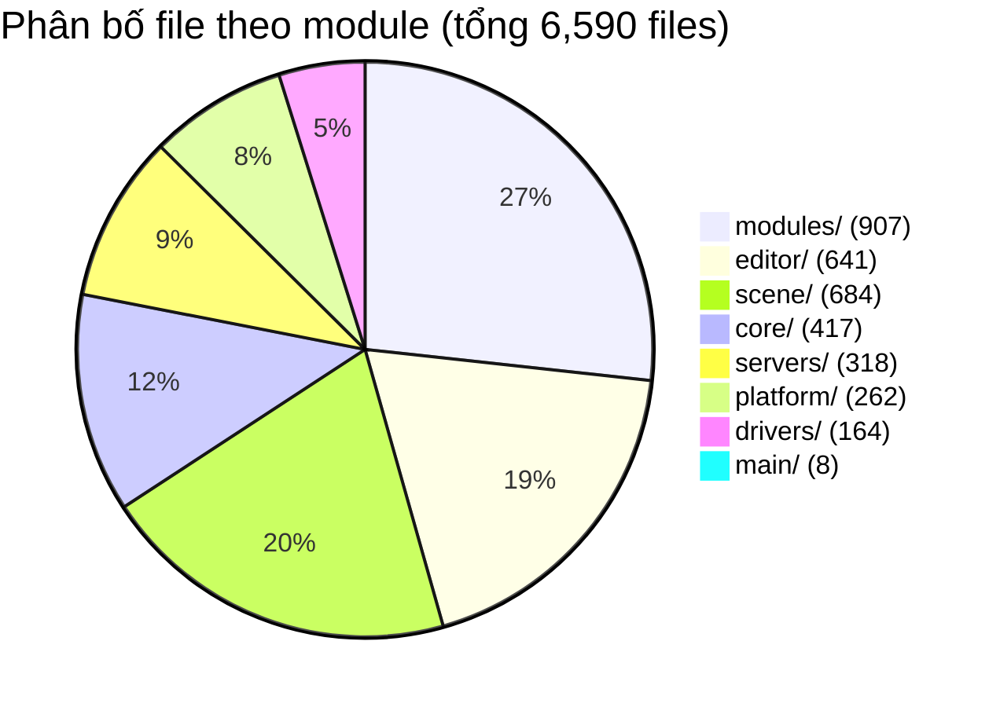
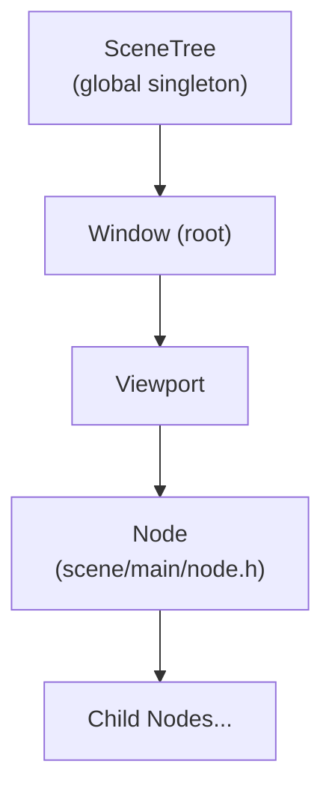
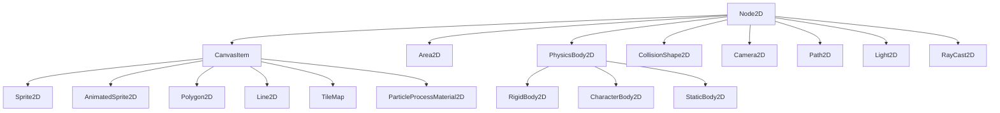
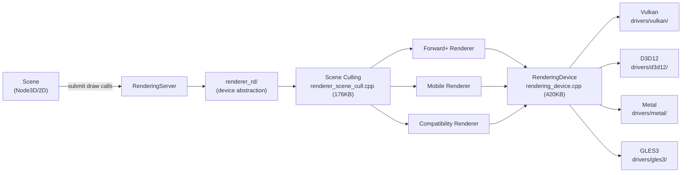

# Phân Tích Source Code Godot Engine 4.7-dev

*Ngày phân tích: 2026-03-30*
*Nguồn: `D:\PROJECT\CCN2\godot-master\` (branch main, version 4.7-dev)*
*Người phân tích: Claude Code AI Assistant*

---

## 1. Tổng Quan Source Code

### 1.1 Metadata

| Thông tin | Giá trị |
|-----------|---------|
| **Version** | 4.7-dev (development branch) |
| **Language** | C++ (C++17 standard) |
| **License** | MIT |
| **Build System** | SCons 4.0+ (Python 3.9+) |
| **Tổng file .cpp** | 2,389 files |
| **Tổng file .h** | 4,201 files |
| **Tổng C++ files** | 6,590 files |

### 1.2 Cấu trúc thư mục gốc

```
godot-master/
├── core/          417 files  — Core types, memory, I/O, math
├── scene/         684 files  — Scene tree, nodes, GUI, animation
├── servers/       318 files  — Backend services (rendering, physics, audio)
├── drivers/       164 files  — Platform drivers (Vulkan, GL, audio)
├── platform/      262 files  — OS abstractions (Windows, Linux, macOS, iOS, Android, Web, VisionOS)
├── modules/       907 files  — Pluggable features (56 modules)
├── editor/        641 files  — Editor UI + tools
├── main/            8 files  — Entry point + initialization
├── thirdparty/     ---       — External dependencies (Bullet, HarfBuzz, etc.)
├── doc/            ---       — Documentation source
├── tests/          ---       — Test suite
├── SConstruct     52KB       — Build config (Python)
└── version.py      ---       — Version 4.7
```

### 1.3 File count theo module



---

## 2. Kiến Trúc Layered (Source-Level)

```mermaid
graph TB
    subgraph "User / Script Layer"
        GDScript["GDScript (.gd)"]
        CSharp["C# (.cs)"]
        GDExt["GDExtension (C/C++ plugins)"]
    end

    subgraph "Engine Core (core/ — 417 files)"
        Object["Object system\nobject.h / object.cpp"]
        Variant["Variant type union\nvariant.h"]
        Math["Math types\nVector2/3/4, Transform"]
        IO["I/O & Serialization\nFileAccess, ResourceLoader"]
        Templates["Containers\nHashMap, List, Array"]
        StringSys["String system\nStringName, String"]
    end

    subgraph "Scene Layer (scene/ — 684 files)"
        Node["Node base class\nscene/main/node.h"]
        Node2D["2D Nodes (100 files)\nSprite2D, Body2D..."]
        Node3D["3D Nodes (172 files)\nMeshInstance3D, Body3D..."]
        GUI["GUI Controls (118 files)\nButton, Label, Container..."]
        Anim["Animation (21 files)\nAnimationPlayer, Tween"]
        Resources["Resources (214 files)\nTexture, Mesh, Shader..."]
    end

    subgraph "Servers (servers/ — 318 files)"
        RenderSrv["RenderingServer\nrendering_server.h"]
        PhysSrv["PhysicsServer 2D/3D\nphysics_server_2d/3d.h"]
        AudioSrv["AudioServer\naudio_server.h"]
        Display["DisplayServer\ndisplay_server.h"]
        NavSrv["NavigationServer 2D/3D"]
        TextSrv["TextServer (HarfBuzz)"]
    end

    subgraph "Drivers (drivers/ — 164 files)"
        Vulkan["Vulkan\ndrivers/vulkan/"]
        GLES3["OpenGL ES 3\ndrivers/gles3/"]
        D3D12["DirectX 12\ndrivers/d3d12/"]
        Metal["Metal (Apple)\ndrivers/metal/"]
        AudioDrv["Audio: ALSA/WASAPI/CoreAudio/XAudio2"]
    end

    subgraph "Platform (platform/ — 262 files)"
        Windows["Windows\nplatform/windows/"]
        Linux["Linux/BSD\nplatform/linuxbsd/"]
        macOS["macOS\nplatform/macos/"]
        iOS["iOS\nplatform/ios/"]
        Android["Android\nplatform/android/"]
        Web["WebAssembly\nplatform/web/"]
        VisionOS["VisionOS\nplatform/visionos/"]
    end

    GDScript --> Object
    CSharp --> Object
    GDExt --> Object
    Object --> Variant
    Node --> Object
    Node2D --> Node
    Node3D --> Node
    GUI --> Node
    Resources --> Object
    Node --> RenderSrv
    Node --> PhysSrv
    Node --> AudioSrv
    RenderSrv --> Vulkan
    RenderSrv --> GLES3
    RenderSrv --> D3D12
    PhysSrv --> Platform
    AudioSrv --> AudioDrv
    Display --> Windows
    Display --> Linux
```



---

## 3. Core Module Chi Tiết (core/ — 417 files)

### 3.1 Object System — Nền Tảng Của Mọi Thứ

**File chính**: `core/object/object.h` (47KB), `core/object/object.cpp`

```cpp
// Pattern cơ bản của mọi Godot class
class Node : public Object {
    GDCLASS(Node, Object);  // Macro đăng ký class

protected:
    static void _bind_methods();  // Đăng ký methods với reflection system

public:
    // Methods được bind vào ClassDB → accessible từ GDScript/C#/editor
};
```

**Các class quan trọng trong core/object/**:

| Class | File | Mục đích |
|-------|------|---------|
| `Object` | `object.h` | Base của tất cả Godot objects |
| `RefCounted` | `ref_counted.h` | Auto memory (smart pointer Ref<T>) |
| `ClassDB` | `class_db.h` | Runtime class registry + reflection |
| `ObjectDB` | `object_db.h` | Global instance tracking |
| `Callable` | `callable.h` | Function pointer + method binding |
| `Signal` | `signal.h` | Signal/slot event system |

### 3.2 Variant — Dynamic Type System

**File**: `core/variant/variant.h`

Variant là union chứa tất cả Godot types:
- `null`, `bool`, `int`, `float`, `String`
- `Vector2`, `Vector3`, `Color`, `Rect2`, `Transform2D`, `Transform3D`
- `Array`, `Dictionary`, `PackedByteArray`, ...
- `Object*`, `Callable`, `Signal`, `NodePath`, `StringName`

Cho phép GDScript typeless, serialization, editor inspection.

### 3.3 Math Types (core/math/ — 75 files)

| Type | File |
|------|------|
| `Vector2`, `Vector2i` | `vector2.h` |
| `Vector3`, `Vector3i` | `vector3.h` |
| `Vector4` | `vector4.h` |
| `Quaternion` | `quaternion.h` |
| `Transform2D` | `transform_2d.h` |
| `Transform3D` | `transform_3d.h` |
| `Basis` | `basis.h` |
| `Plane` | `plane.h` |
| `AABB` | `aabb.h` |
| `Color` | `color.h` |
| `Geometry2D/3D` | `geometry_2d/3d.h` |

### 3.4 Container Templates (core/templates/ — 37 files)

```cpp
HashMap<K, V>    // Hash map O(1) average
HashSet<T>       // Hash set
List<T>          // Doubly-linked list
RBMap<K, V>      // Red-black tree map
RBSet<T>         // Red-black tree set
LocalVector<T>   // Optimized vector (stack-first)
Deque<T>         // Double-ended queue
```

### 3.5 I/O System (core/io/ — 103 files)

| Class | Mục đích |
|-------|---------|
| `FileAccess` | File read/write (res://, user://, abs) |
| `DirAccess` | Directory operations |
| `ResourceLoader` | Load .tscn, .tres, .png, .ogg... |
| `ResourceSaver` | Save resources to disk |
| `Image` | Image manipulation + format conversion |
| `JSON` | JSON parsing/serialization |
| `PackedData` | PCK archive (packed game resources) |
| `Marshalls` | Binary serialization |
| `StreamPeer` | Binary data streams |

---

## 4. Scene Module Chi Tiết (scene/ — 684 files)

### 4.1 Scene Tree Core (scene/main/ — 34 files)



**Node lifecycle** (từ `node.h`):
```
_enter_tree()      ← khi node vào scene tree
_ready()           ← sau khi tất cả children sẵn sàng
_process(delta)    ← mỗi frame
_physics_process() ← fixed timestep (60Hz)
_input(event)      ← input events
_exit_tree()       ← khi node rời scene tree
```

### 4.2 Resource System (scene/resources/ — 214 files)

**Resource** = data container, ref-counted, serializable:

| Resource | File | Mục đích |
|----------|------|---------|
| `Texture2D` | `texture.h` | 2D image textures |
| `Texture3D` | `texture_3d.h` | 3D/cube textures |
| `Mesh` | `mesh.h` | 3D geometry |
| `ArrayMesh` | `array_mesh.h` | Dynamic mesh |
| `Animation` | `animation.h` | Keyframe animation data |
| `AnimationLibrary` | `animation_library.h` | Animation set |
| `Material` | `material.h` | Base material |
| `StandardMaterial3D` | `standard_material_3d.h` | PBR material |
| `ShaderMaterial` | `shader_material.h` | Custom shader |
| `Shader` | `shader.h` | GLSL/HLSL shader code |
| `Font` | `font.h` | TrueType/bitmap font |
| `Theme` | `theme.h` | UI theming |
| `PackedScene` | `packed_scene.h` | Serialized scene |
| `AudioStream` | `audio_stream.h` | Audio data |
| `Curve` | `curve.h` | Mathematical curves |

### 4.3 2D Nodes (scene/2d/ — 100 files)



### 4.4 GUI System (scene/gui/ — 118 files)

```mermaid
graph TD
    Control --> BaseButton
    BaseButton --> Button
    BaseButton --> CheckBox
    BaseButton --> CheckButton
    BaseButton --> LinkButton
    BaseButton --> TextureButton

    Control --> Label
    Control --> LineEdit
    Control --> TextEdit
    Control --> RichTextLabel

    Control --> Container
    Container --> VBoxContainer
    Container --> HBoxContainer
    Container --> GridContainer
    Container --> MarginContainer
    Container --> ScrollContainer
    Container --> TabContainer
    Container --> PanelContainer

    Control --> Range
    Range --> Slider
    Range --> ProgressBar
    Range --> SpinBox
    Range --> ScrollBar

    Control --> Popup
    Popup --> PopupMenu
    Popup --> PopupPanel

    Control --> ItemList
    Control --> Tree
    Control --> ColorPicker
```



---

## 5. Servers Module Chi Tiết (servers/ — 318 files)

### 5.1 Rendering Architecture

**Rendering pipeline** từ `servers/rendering/`:



**File quan trọng nhất**:
- `rendering_device.cpp` — **420KB** — GPU abstraction API, command recording
- `rendering_device_graph.cpp` — **158KB** — Render graph (frame dependency tracking)
- `renderer_scene_cull.cpp` — **176KB** — Scene culling, LOD, visibility
- `renderer_viewport.cpp` — **68KB** — Viewport composition

### 5.2 Physics Architecture

**2 Physics systems** (plug-in architecture):

| System | Module | Mục đích |
|--------|--------|---------|
| Godot Physics 2D | `modules/godot_physics_2d/` | Built-in 2D (32 files) |
| Godot Physics 3D | `modules/godot_physics_3d/` | Built-in 3D (46 files) |
| Jolt Physics | `modules/jolt_physics/` | Advanced 3D physics (90 files) |

**Interface**: `servers/physics_server_2d.h`, `servers/physics_server_3d.h`

### 5.3 Audio Architecture

```
AudioServer (audio_server.h)
├── AudioBus (mixing/effects)
│   ├── AudioEffectReverb
│   ├── AudioEffectDelay
│   ├── AudioEffectChorus
│   └── AudioEffectEQ
├── AudioDriver (platform-specific)
│   ├── drivers/alsa/        — Linux
│   ├── drivers/pulseaudio/  — Linux (PulseAudio)
│   ├── drivers/coreaudio/   — macOS/iOS
│   ├── drivers/wasapi/      — Windows
│   └── drivers/xaudio2/     — Windows (XAudio2)
└── AudioStream implementations
    ├── AudioStreamMP3
    ├── AudioStreamOGGVorbis
    └── AudioStreamWAV
```

---

## 6. Modules System (modules/ — 907 files, 56 modules)

Modules là **pluggable features** — có thể enable/disable trong build:

### 6.1 Modules lớn nhất

| Module | Files | Mục đích |
|--------|-------|---------|
| `openxr/` | 147 | OpenXR/VR framework |
| `jolt_physics/` | 90 | Alternative 3D physics engine |
| `gltf/` | 64 | glTF 2.0 3D import |
| `gdscript/` | 62 | GDScript language runtime |
| `mono/` | 47 | C# scripting (Mono/dotnet) |
| `godot_physics_3d/` | 46 | Built-in 3D physics |
| `navigation_3d/` | 40 | 3D pathfinding |
| `navigation_2d/` | 36 | 2D pathfinding |
| `godot_physics_2d/` | 32 | Built-in 2D physics |

### 6.2 File Format Modules

| Module | Format |
|--------|--------|
| `bmp/`, `hdr/`, `tga/`, `webp/` | Image formats |
| `dds/`, `tinyexr/` | Advanced image |
| `svg/` | Vector graphics |
| `basis_universal/`, `astcenc/` | Texture compression |
| `fbx/`, `gltf/` | 3D model import |
| `ogg/`, `vorbis/`, `theora/` | Audio/video codecs |

### 6.3 Networking Modules

| Module | Protocol |
|--------|---------|
| `websocket/` | WebSocket |
| `webrtc/` | WebRTC (P2P) |
| `enet/` | ENet (UDP-based) |
| `upnp/` | UPnP port forwarding |

### 6.4 Module Structure Pattern

Mỗi module có:
```
modules/{name}/
├── register_types.h/.cpp   ← Đăng ký với ClassDB
├── SCsub                   ← Build config
├── config.py               ← Module enable/disable config
└── *.h / *.cpp             ← Implementation
```

---

## 7. Drivers & Platform (drivers/ + platform/)

### 7.1 Graphics Drivers (drivers/ — 22 subdirs)

| Driver | Folder | Platform |
|--------|--------|---------|
| Vulkan | `drivers/vulkan/` | All |
| OpenGL ES 3 | `drivers/gles3/` | Mobile/Web/Legacy |
| DirectX 12 | `drivers/d3d12/` | Windows |
| Metal | `drivers/metal/` | macOS/iOS |
| EGL | `drivers/egl/` | Mobile/Web |

### 7.2 Platform Implementations (platform/ — 7 platforms)

| Platform | Files | Key Components |
|----------|-------|---------------|
| `windows/` | 42 | Window creation, file dialogs, registry |
| `linuxbsd/` | 45 | X11, Wayland support |
| `macos/` | 35 | Metal, Cocoa integration |
| `ios/` | 28 | UIKit, AppKit |
| `android/` | 22 | JNI integration, sensors |
| `web/` | 28 | WebAssembly (Emscripten) |
| `visionos/` | 8 | Apple Vision OS (new 4.7!) |

---

## 8. Build System (SCons)

**File**: `SConstruct` (52KB Python script)

### 8.1 Cách build

```bash
# Build editor (default)
scons

# Build với profile cụ thể
scons platform=windows target=editor

# Build export template (game distribution)
scons platform=linux target=template_release

# Build server (headless)
scons platform=linuxbsd target=template_release arch=x86_64

# Tắt module
scons module_mono_enabled=no
```

### 8.2 Build artifacts (Generators)

SCons tự generate code trước khi compile:
- `make_virtuals.py` → Virtual function binding code
- `gles3_builders.py` → GLSL shader code (compile thành C++ arrays)
- `glsl_builders.py` → Vulkan GLSL shaders

### 8.3 Module SCsub pattern

```python
# modules/gdscript/SCsub
Import('env')
Import('env_modules')

env_gdscript = env_modules.Clone()
env_gdscript.add_source_files(env.modules_sources, "*.cpp")
```

---

## 9. GDExtension System

**Folder**: `core/extension/`

GDExtension = C-compatible plugin API — cho phép develop compiled extensions mà không cần link vào engine:

```c
// GDExtension pattern
GDExtensionClassCreationInfo info = {};
info.create_instance_func = &MyClass::create;
info.class_userdata = ...;
gdextension_interface_classdb_register_extension_class(
    p_library, "MyClass", "RefCounted", &info
);
```

**Ưu điểm**: Deploy compiled .dll/.so, không cần recompile engine.

---

## 10. Entry Point & Initialization Order

**File**: `main/main.cpp` (1800+ lines)

```
1. Core types registration (Object, Variant, Math)
2. Drivers initialization (Vulkan/GLES3/...)
3. Platform setup (OS, Input, Display)
4. Servers registration (Rendering, Physics, Audio)
5. Scene/Node types registration
6. Module registration (all 56 modules)
7. Editor initialization (if running editor)
8. Project load
9. Main loop (scene tree processing)
```

---

## 11. Key Design Patterns (Source-Level)

### 11.1 Class Registration Pattern
```cpp
class MyNode : public Node {
    GDCLASS(MyNode, Node);

protected:
    static void _bind_methods() {
        ClassDB::bind_method(D_METHOD("my_method"), &MyNode::my_method);
        ADD_PROPERTY(PropertyInfo(Variant::INT, "value"), "set_value", "get_value");
        ADD_SIGNAL(MethodInfo("value_changed", PropertyInfo(Variant::INT, "new_value")));
    }
};

// In register_types.cpp
GDREGISTER_CLASS(MyNode);
```

### 11.2 Server Singleton Pattern
```cpp
// Access (anywhere in engine)
RenderingServer *rs = RenderingServer::get_singleton();
PhysicsServer3D *ps = PhysicsServer3D::get_singleton();
AudioServer *as = AudioServer::get_singleton();
DisplayServer *ds = DisplayServer::get_singleton();
```

### 11.3 Resource Ref-Counting
```cpp
// Automatic memory management
Ref<Texture2D> texture = ResourceLoader::load("res://icon.png");
// Ref<T> acts as shared_ptr — auto-freed when last ref dies
```

### 11.4 Notification System
```cpp
void Node::_notification(int p_what) {
    switch (p_what) {
        case NOTIFICATION_READY:    // _ready()
        case NOTIFICATION_PROCESS:  // _process()
        case NOTIFICATION_ENTER_TREE:
        case NOTIFICATION_EXIT_TREE:
    }
}
```

---

## 12. Regex Patterns cho Skill Parsing

Các pattern có thể dùng để parse Godot C++ source:

```javascript
// Class detection (với inheritance)
/class\s+(\w+)\s*(?::\s*(?:public|protected|private)\s+(\w+))?/

// GDCLASS macro (Godot-specific)
/GDCLASS\s*\(\s*(\w+)\s*,\s*(\w+)\s*\)/

// Struct/enum
/(?:struct|enum\s+class)\s+(\w+)/

// Method binding
/ClassDB::bind_method\s*\(\s*D_METHOD\s*\(\s*"([^"]+)"/

// Signal definition
/ADD_SIGNAL\s*\(\s*MethodInfo\s*\(\s*"([^"]+)"/

// Property binding
/ADD_PROPERTY\s*\(.*?"([^"]+)"/

// Server singleton
/(\w+Server)\s*::\s*get_singleton\s*\(\s*\)/

// Include (local only)
/#include\s+"([^"]+\.h)"/
```

---

## 13. Limitations & Gotchas

1. **Macro-heavy**: `GDCLASS`, `GDVIRTUAL_*`, `GDREGISTER_*` — regex không parse được đầy đủ
2. **Template classes**: `Ref<T>`, `LocalVector<T>` — cần context để hiểu
3. **Conditional compilation**: `#ifdef VULKAN_ENABLED` — một file có thể enable/disable
4. **`servers/rendering/rendering_device.cpp` (420KB)** — file lớn nhất, nên skip trong overview/module depth
5. **`scene/main/node.h`** — rất complex với nhiều macros, parse heuristic sẽ không accurate
6. **VisionOS**: Platform mới trong 4.7, chỉ có 8 files — edge case cho module detection

---

## 14. Cấu Trúc Output Skill Nên Generate

Khi phân tích ở `module` depth, skill nên output theo template này:

```markdown
## Module: core/object/

**Mục đích**: Object system — base class, reflection, memory management
**Files**: 32 (.h: 20, .cpp: 12)
**Key classes**: Object, RefCounted, ClassDB, ObjectDB, Callable, Signal
**Patterns**: GDCLASS macro, _bind_methods, ClassDB registry
**Depends on**: core/templates, core/string, core/variant
**Used by**: scene/, servers/, modules/

| Class | File | Chức năng |
|-------|------|----------|
| `Object` | object.h | Base của tất cả Godot objects |
| `RefCounted` | ref_counted.h | Smart pointer auto-memory |
| `ClassDB` | class_db.h | Runtime reflection + method registry |
```

---

*Phân tích dựa trên scan trực tiếp `D:\PROJECT\CCN2\godot-master\` (2026-03-30)*
*Version 4.7-dev — development branch*
