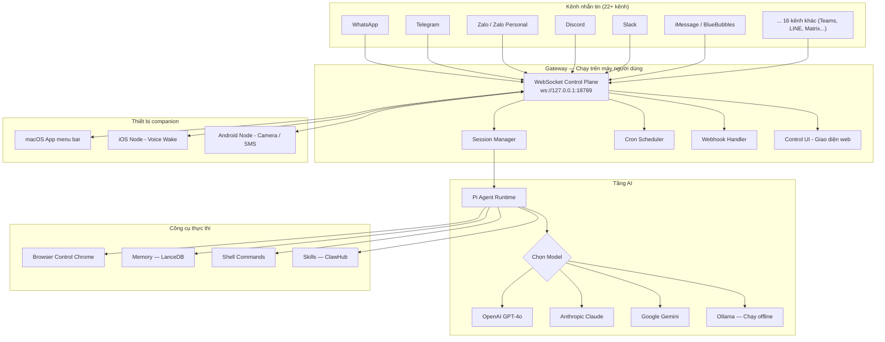
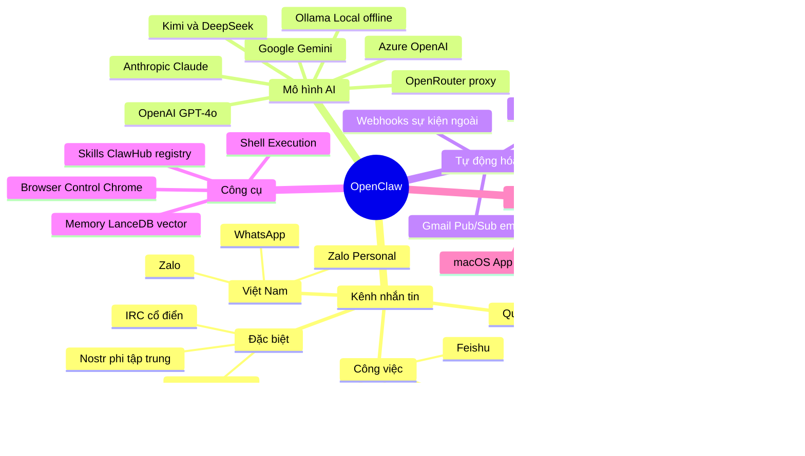

# OpenClaw — Tổng Quan Dự Án

> **Phiên bản tài liệu**: 1.0 | **Cập nhật**: 2026-03-12
> **Nguồn**: Phân tích trực tiếp từ source code tại `D:\PROJECT\CCN2\openclaw\`
> **Đối tượng đọc**: Người chưa quen AI và kỹ thuật phần mềm

---

## 1. OpenClaw là gì?

**OpenClaw** là một trợ lý AI cá nhân mà bạn tự chạy trên máy của mình — không phụ thuộc vào server của bên thứ ba, không bị ràng buộc bởi một ứng dụng chat duy nhất.

### Giải thích đơn giản bằng ví dụ đời thường

Hãy tưởng tượng bạn có một **trợ lý riêng** rất thông minh. Thay vì phải gọi cho trợ lý đó qua một đường dây điện thoại cố định (giống như phải mở app ChatGPT mỗi lần muốn hỏi), bạn có thể nhắn tin cho trợ lý này qua **bất kỳ kênh liên lạc nào bạn đang dùng**:

- Nhắn tin qua **Zalo** → trợ lý trả lời ngay trên Zalo
- Gửi tin qua **Telegram** → trả lời trên Telegram
- Nhắn trên **Slack** trong giờ làm việc → trả lời ngay trên Slack
- Thậm chí ra lệnh bằng **giọng nói** (tiếng nói kích hoạt tự động)

Hơn nữa, trợ lý này không chỉ **nói chuyện** mà còn **làm việc thực sự** — mở trình duyệt, tìm kiếm web, chạy lệnh trên máy tính, quản lý lịch nhắc nhở tự động.

Đây chính là OpenClaw: **một AI thực sự làm việc, chạy trên thiết bị của bạn, tiếp cận qua kênh bạn đang dùng.**

### Thông tin kỹ thuật cơ bản

| Thuộc tính | Giá trị |
|---|---|
| Tên chính thức | OpenClaw — Personal AI Assistant |
| Phiên bản hiện tại | `2026.3.11` |
| License | MIT (miễn phí, mã nguồn mở) |
| Tác giả ban đầu | Peter Steinberger |
| Ngôn ngữ lập trình | TypeScript (Node.js) |
| Yêu cầu runtime | Node.js phiên bản 22 trở lên |
| Cài đặt | `npm install -g openclaw@latest` |

---

## 2. Tại sao OpenClaw được tạo ra?

### Vấn đề gốc rễ

Các trợ lý AI phổ biến hiện nay (ChatGPT, Claude, Gemini) đều có **một hạn chế lớn**: bạn phải vào đúng ứng dụng/website của họ để dùng. Đời thường của bạn diễn ra trên Zalo, Telegram, Slack — nhưng AI lại sống trong một tab trình duyệt riêng biệt.

Ngoài ra, những AI đó:
- **Không có bộ nhớ dài hạn** (mỗi cuộc trò chuyện mới là bắt đầu lại từ đầu)
- **Không chạy được lệnh thực tế** trên máy tính của bạn
- **Phụ thuộc hoàn toàn vào server của nhà cung cấp** (nếu họ đổi giá, bạn phải theo)
- **Không tích hợp được** vào quy trình làm việc tự động (không có cron job, webhook...)

### Vision của dự án (trích từ `VISION.md`)

OpenClaw được xây dựng với tầm nhìn rõ ràng:

> "OpenClaw is the AI that actually does things. It runs on your devices, in your channels, with your rules."
> *(OpenClaw là AI thực sự làm việc. Chạy trên thiết bị của bạn, trong các kênh của bạn, theo quy tắc của bạn.)*

Ba trụ cột chính:
1. **Tự chủ** — Chạy trên máy bạn, dùng model AI của bạn chọn (OpenAI, Anthropic, Gemini, Ollama local...)
2. **Đa kênh** — Tiếp cận qua bất kỳ ứng dụng nhắn tin nào bạn đang dùng
3. **Bảo mật và quyền riêng tư** — Dữ liệu không rời máy bạn nếu không cần thiết

### Lịch sử phát triển

Dự án đã qua nhiều tên gọi trước khi trở thành OpenClaw:

```
Warelay → Clawdbot → Moltbot → OpenClaw
```

Bắt đầu như một "sân chơi cá nhân" để học AI và xây dựng thứ gì đó thực sự hữu ích, dự án dần trưởng thành thành một nền tảng mã nguồn mở có cộng đồng đóng góp rộng lớn, được tài trợ bởi OpenAI và Vercel.

---

## 3. Tính năng chính

### 3.1 Gateway — Trung tâm điều phối

**Gateway** là trái tim của OpenClaw. Hãy nghĩ nó như một **tổng đài điện thoại thông minh**: nhận tất cả tin nhắn từ mọi kênh, xử lý, rồi phân phối câu trả lời về đúng kênh nguồn.

- Chạy trên máy tính của bạn tại địa chỉ `ws://127.0.0.1:18789`
- Quản lý kết nối đến tất cả các kênh nhắn tin cùng lúc
- Có giao diện web (Control UI) để theo dõi và quản lý

**Ví dụ thực tế**: Bạn nhắn tin hỏi trên Telegram lúc 8h sáng, nhắn trên Zalo lúc 2h chiều, nói chuyện qua voice trên điện thoại iOS lúc 6h tối — tất cả đều được Gateway xử lý đồng bộ trong một hệ thống duy nhất.

### 3.2 Đa kênh nhắn tin

Hỗ trợ **22+ kênh nhắn tin** (xem bảng chi tiết ở Mục 4). Điều đặc biệt là bạn không phải cài thêm app, chỉ cần kết nối tài khoản hiện có của mình với OpenClaw.

### 3.3 Hỗ trợ nhiều mô hình AI (Multi-model)

OpenClaw không bị khóa vào một nhà cung cấp AI. Bạn có thể chọn:
- **OpenAI** (GPT-4, GPT-4o, Codex)
- **Anthropic** (Claude)
- **Google Gemini**
- **Ollama** (chạy AI hoàn toàn offline trên máy tính của bạn — không tốn phí, không cần mạng)
- **OpenRouter** (proxy đến nhiều model khác)
- **Azure OpenAI**, **Kimi**, **DeepSeek**, **Alibaba ModelStudio**, và nhiều hơn nữa

**Tính năng failover**: Nếu model chính bị lỗi hoặc hết credit, hệ thống tự động chuyển sang model dự phòng.

### 3.4 Tự động hóa (Automation)

- **Cron jobs** — Đặt lịch chạy tác vụ tự động (ví dụ: mỗi sáng 7h gửi tóm tắt tin tức)
- **Webhooks** — Nhận sự kiện từ bên ngoài và xử lý (ví dụ: khi có email mới thì AI tóm tắt)
- **Gmail Pub/Sub** — Tích hợp xử lý email tự động

### 3.5 Kiểm soát trình duyệt (Browser Control)

OpenClaw có thể điều khiển Chrome/Chromium để:
- Tự động điền form
- Chụp ảnh màn hình trang web
- Thực hiện thao tác trên web thay bạn

**Ví dụ**: "Mở website booking vé máy bay và tìm chuyến bay rẻ nhất từ Hà Nội đi Sài Gòn ngày mai"

### 3.6 Voice Wake + Talk Mode (Giọng nói)

- **Voice Wake** (macOS/iOS): Nói từ khóa kích hoạt, AI lắng nghe mà không cần bấm nút
- **Talk Mode** (Android): Chế độ giọng nói liên tục
- Hỗ trợ **ElevenLabs** cho giọng nói tự nhiên, có fallback về TTS hệ thống

### 3.7 Plugin và Skills

- **Plugin API mở rộng**: Lập trình viên có thể viết plugin riêng
- **ClawHub** (`clawhub.ai`): Kho skill cộng đồng — giống App Store cho OpenClaw
- **Skills**: Bộ kỹ năng được định nghĩa sẵn giúp AI làm những việc chuyên biệt
- **MCP Support**: Tích hợp với hệ sinh thái Model Context Protocol qua `mcporter`

> **MCP là gì?** MCP (Model Context Protocol) là một chuẩn mở cho phép các AI tool chia sẻ context và dữ liệu với nhau. Hãy nghĩ nó như "cổng USB" giúp AI kết nối với các công cụ bên ngoài.

### 3.8 Bộ nhớ (Memory)

AI có thể ghi nhớ thông tin qua nhiều phiên làm việc:
- Hỗ trợ tìm kiếm ngữ nghĩa (semantic search) trên lịch sử trò chuyện
- Tích hợp **Gemini Embedding** cho indexing đa phương tiện (ảnh + audio)
- Chỉ một memory plugin được kích hoạt tại một thời điểm để tránh xung đột

---

## 4. Các kênh nhắn tin được hỗ trợ

| # | Tên kênh | Loại | Thư viện sử dụng | Ghi chú |
|---|---|---|---|---|
| 1 | **WhatsApp** | Tin nhắn cá nhân/nhóm | Baileys | Rất phổ biến tại VN |
| 2 | **Zalo** | Tin nhắn doanh nghiệp | — | Dành cho tài khoản doanh nghiệp |
| 3 | **Zalo Personal** | Tin nhắn cá nhân | — | Tài khoản cá nhân |
| 4 | **Telegram** | Tin nhắn cá nhân/nhóm/kênh | grammY | Phổ biến, nhiều tính năng |
| 5 | **Discord** | Tin nhắn/server community | discord.js | Phổ biến cho cộng đồng kỹ thuật |
| 6 | **Slack** | Tin nhắn công việc | Bolt | Workspace doanh nghiệp |
| 7 | **Google Chat** | Tin nhắn công việc Google | Chat API | Tích hợp Google Workspace |
| 8 | **Signal** | Tin nhắn bảo mật cao | signal-cli | Mã hóa đầu cuối |
| 9 | **BlueBubbles** | iMessage (Apple, khuyến nghị) | BlueBubbles | Cần thiết bị Apple |
| 10 | **iMessage** | iMessage (Apple, legacy) | imsg | Cần macOS |
| 11 | **Microsoft Teams** | Tin nhắn công việc | — | Môi trường doanh nghiệp Microsoft |
| 12 | **Matrix** | Tin nhắn phi tập trung | — | Giao thức mã nguồn mở |
| 13 | **Feishu** | Tin nhắn công việc | — | Phổ biến tại Trung Quốc |
| 14 | **LINE** | Tin nhắn | — | Phổ biến tại Nhật, Thái, Đài Loan |
| 15 | **Mattermost** | Tin nhắn tự host | — | Slack open-source alternative |
| 16 | **Nextcloud Talk** | Hội nghị/chat | — | Nền tảng self-hosted |
| 17 | **Nostr** | Mạng xã hội phi tập trung | — | Dựa trên cryptographic key |
| 18 | **Synology Chat** | Chat nội bộ | — | Dành cho người dùng NAS Synology |
| 19 | **Tlon** | Mạng xã hội phi tập trung | — | Nền tảng Urbit |
| 20 | **Twitch** | Livestream chat | — | Tương tác với khán giả stream |
| 21 | **IRC** | Chat cổ điển | — | Internet Relay Chat, dành cho dev |
| 22 | **WebChat** | Chat web tích hợp | — | Nhúng trực tiếp vào website |
| 23 | **macOS / iOS / Android** | Ứng dụng native | Swift/Kotlin | App companion + voice |

> **Lưu ý bảo mật**: Với các kênh như Telegram/WhatsApp/Signal, mặc định OpenClaw yêu cầu **ghép đôi (pairing)** với người dùng mới. Người lạ nhắn tin lần đầu sẽ nhận mã xác nhận — chủ sở hữu phải approve thủ công để tránh spam và tấn công injection.

---

## 5. Tech Stack

| Công nghệ | Mục đích | Ghi chú |
|---|---|---|
| **TypeScript** | Ngôn ngữ lập trình chính | Dễ đọc, dễ mở rộng, cộng đồng rộng |
| **Node.js >= 22** | Runtime nền tảng | Chạy JavaScript phía server |
| **pnpm** | Quản lý package (khuyến nghị) | Nhanh hơn npm, chia sẻ dependency thông minh |
| **tsx** | Chạy TypeScript trực tiếp | Không cần compile khi dev |
| **tsdown** | Bundler (build production) | Đóng gói code thành file dist |
| **oxlint** | Linting (kiểm tra code style) | Nhanh hơn ESLint nhiều lần |
| **oxfmt** | Formatting (định dạng code) | Thay thế Prettier |
| **vitest** | Testing framework | Unit/integration tests |
| **Swift** | macOS + iOS companion apps | Native Apple platform |
| **Kotlin/Gradle** | Android companion app | Native Android |
| **grammY** | Telegram bot library | Framework TypeScript cho Telegram |
| **discord.js** | Discord bot library | Library chính thức Discord |
| **Bolt** | Slack bot framework | Framework chính thức Slack |
| **Baileys** | WhatsApp integration | Reverse-engineered protocol |
| **signal-cli** | Signal integration | CLI wrapper cho Signal |
| **LanceDB** | Vector DB cho Memory | Semantic search, lưu trên local |
| **Tailscale** | Remote access an toàn | VPN đơn giản, thay thế ngầm phức tạp |
| **Docker** | Containerization | Cài đặt thay thế (không cần Node trực tiếp) |

### Tại sao chọn TypeScript?

Từ `VISION.md`, tác giả giải thích rõ:

> OpenClaw chủ yếu là hệ thống điều phối (orchestration): prompts, tools, protocols, và integrations. TypeScript được chọn để giữ OpenClaw có thể hack được (hackable) theo mặc định. Ngôn ngữ này được biết đến rộng rãi, nhanh để lặp lại, dễ đọc, sửa đổi và mở rộng.

### Kiến trúc tổng quan (sơ đồ văn bản)

```
┌─────────────────────────────────────────┐
│           Messaging Channels             │
│  WhatsApp / Telegram / Zalo / Discord   │
│  Slack / Signal / iMessage / Teams...   │
└──────────────┬──────────────────────────┘
               │ inbound messages
               ▼
┌──────────────────────────────┐
│           GATEWAY             │
│  (chạy trên máy người dùng)  │
│   ws://127.0.0.1:18789       │
│                               │
│  Sessions | Config | Cron    │
│  Webhooks | Control UI       │
└──────────────┬───────────────┘
               │
               ├─── Pi Agent (AI Runtime)
               │      └─── Model: OpenAI / Claude / Gemini / Ollama...
               ├─── CLI (openclaw ...)
               ├─── WebChat UI (giao diện web)
               ├─── macOS app
               └─── iOS / Android nodes
```

---

## 6. Lịch sử phiên bản

### Milestone quan trọng

| Phiên bản | Thời gian | Sự kiện chính |
|---|---|---|
| **Warelay / Clawdbot** | Giai đoạn đầu | Dự án cá nhân của Peter Steinberger để học AI |
| **Moltbot** | Giai đoạn giữa | Mở rộng kênh, cải thiện stability |
| **OpenClaw** (public) | 2025 | Mã nguồn mở MIT, cộng đồng đóng góp, được tài trợ bởi OpenAI và Vercel |
| **2026.3.11** | 11/03/2026 | Phiên bản ổn định mới nhất — bảo mật + UX iOS + Ollama wizard |

### Nổi bật phiên bản `2026.3.11` (hiện tại)

Phiên bản này tập trung vào **bảo mật** và **trải nghiệm người dùng mới**:

- Vá 7 lỗ hổng bảo mật (CVE) liên quan đến WebSocket origin validation, session hijacking, browser proxy
- Thêm **Ollama setup wizard** — cài đặt AI chạy offline hoàn toàn trên máy tính
- Hỗ trợ **iOS Home Canvas** mới với giao diện cải tiến, toolbar dock
- Tích hợp **Gemini multimodal embedding** cho memory (search ảnh + audio)
- Thêm OpenCode Go provider cho lập trình viên
- Nhiều fix bug cho Telegram, Feishu, Discord, ACP protocol

### Phiên bản `Unreleased` (đang phát triển)

Đang chuẩn bị vá thêm 7 lỗ hổng bảo mật mới được phát hiện bởi security researchers (tất cả có GHSA advisory). Các lỗ hổng liên quan đến:
- Invisible Unicode trong approval prompts (bypass lệnh nguy hiểm)
- Device token scope tràn quyền
- Git exec path injection
- Session tree visibility trong sandbox

---

## 7. So sánh nhanh với các AI Assistant khác

| Tiêu chí | **OpenClaw** | **ChatGPT App** | **Claude (Anthropic)** | **Siri / Google Assistant** |
|---|---|---|---|---|
| **Chạy trên máy bạn** | Có (self-hosted) | Không (cloud) | Không (cloud) | Một phần (device) |
| **Hỗ trợ đa kênh** | 22+ kênh | Chỉ app riêng | Chỉ app riêng | Hệ điều hành tích hợp |
| **Chọn model AI** | Tự do (OpenAI, Claude, Gemini, Ollama...) | Chỉ GPT | Chỉ Claude | Cố định |
| **Chạy AI offline** | Có (qua Ollama) | Không | Không | Một phần |
| **Tự động hóa (Cron)** | Có | Không | Không | Giới hạn |
| **Kiểm soát trình duyệt** | Có (Chrome CDP) | Không | Không | Không |
| **Voice Wake** | Có (macOS/iOS/Android) | Giới hạn | Không | Có |
| **Bộ nhớ dài hạn** | Có (LanceDB local) | Plus plan | Có | Có |
| **Plugin/Extensions** | Có (ClawHub) | Có (GPT Store) | Không | Không |
| **Chi phí** | Miễn phí (tự trả API riêng) | Free + Pro $20/tháng | Free + Pro $20/tháng | Miễn phí |
| **Mã nguồn mở** | Có (MIT) | Không | Không | Không |
| **Bảo mật dữ liệu** | Cao (local-first) | Trung bình | Trung bình | Thấp-trung bình |
| **Độ phức tạp cài đặt** | Cao (cần terminal) | Rất thấp | Rất thấp | Không cần cài |
| **Hỗ trợ Zalo** | Có | Không | Không | Không |

**Kết luận nhanh**: OpenClaw là lựa chọn mạnh nhất cho **lập trình viên và power users** muốn có trợ lý AI tự chủ, tích hợp sâu vào quy trình làm việc thực tế. ChatGPT/Claude phù hợp hơn cho **người dùng phổ thông** muốn dùng ngay không cần cài đặt.

---

## 8. Ai nên dùng OpenClaw?

### Phù hợp nhất

**Lập trình viên và kỹ sư phần mềm**
- Muốn có AI trực tiếp trong terminal, IDE, hoặc kênh chat nhóm (Slack/Discord)
- Cần chạy script và command tự động có sự hỗ trợ của AI
- Ví dụ usecase: "Chạy test suite, nếu có lỗi, phân tích và đề xuất fix"

**Người làm việc tự động hóa (Automation enthusiast)**
- Muốn thiết lập cron job AI: mỗi sáng tóm tắt email, báo cáo task hôm nay
- Webhook xử lý sự kiện: khi có PR mới thì AI review tự động
- Ví dụ usecase: Thiết lập AI đọc email mỗi sáng và gửi tóm tắt lên Telegram

**Người dùng đa nền tảng**
- Dùng nhiều kênh nhắn tin khác nhau trong ngày
- Muốn chat với AI trực tiếp trên kênh đang dùng (Zalo, LINE, WhatsApp...)
- Ví dụ usecase: Nhắn tin hỏi AI qua Zalo trong khi đang làm việc

**Người quan tâm bảo mật và quyền riêng tư**
- Không muốn dữ liệu lưu trên server nước ngoài
- Muốn dùng model chạy local (Ollama) hoàn toàn offline
- Ví dụ usecase: Phân tích tài liệu nội bộ mà không lo rò rỉ thông tin

### Không phù hợp

- Người mới hoàn toàn với terminal/command line (cài đặt phức tạp)
- Người chỉ cần chat đơn giản, không cần tích hợp hay tự động hóa
- Người muốn dùng ngay không cần cấu hình gì thêm

---

## 9. Sơ đồ tổng quan (Mermaid)

### 9.1 Kiến trúc luồng dữ liệu



### 9.2 Mindmap tính năng



---

## Phụ lục: Cách cài đặt nhanh

```bash
# Bước 1: Cài đặt OpenClaw (yêu cầu Node.js 22+)
npm install -g openclaw@latest

# Bước 2: Chạy wizard hướng dẫn cài đặt từng bước
openclaw onboard --install-daemon

# Bước 3: Kiểm tra tình trạng hệ thống
openclaw doctor

# Bước 4: Bắt đầu nhắn tin với AI
openclaw agent --message "Xin chào! Hôm nay tôi cần làm gì?"
```

Hướng dẫn đầy đủ: https://docs.openclaw.ai/start/getting-started

---

*Tài liệu này được tạo từ phân tích source code thực tế tại `D:\PROJECT\CCN2\openclaw\` (README.md, VISION.md, CHANGELOG.md, package.json, LICENSE). Để biết thêm chi tiết kỹ thuật, xem các báo cáo tiếp theo trong series.*
