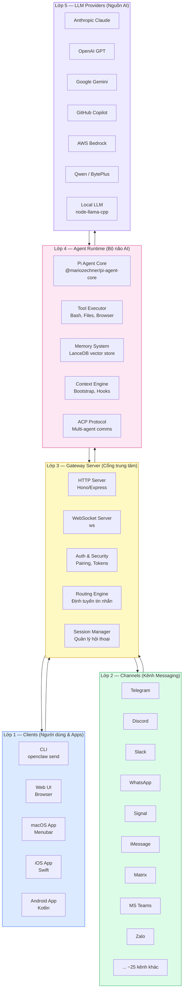
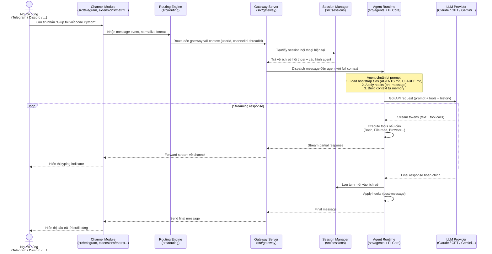
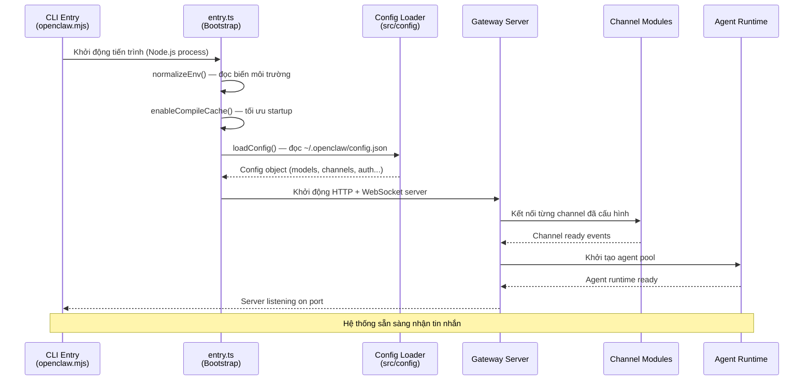

# OpenClaw — Kiến Trúc Tổng Thể

> **Phiên bản**: 2026.3.11 | **Ngôn ngữ chính**: TypeScript | **Node.js**: >= 22.12.0

---

## 1. Monorepo là gì? (Giải thích đơn giản)

### Khái niệm cơ bản

Hãy tưởng tượng bạn có một công ty lớn với nhiều phòng ban: phòng kỹ thuật, phòng marketing, phòng hỗ trợ... Bình thường, mỗi phòng có một văn phòng riêng ở các địa điểm khác nhau — đó là cách tổ chức "multi-repo" (nhiều kho mã nguồn riêng lẻ).

**Monorepo** (mono = một, repo = kho mã nguồn) giống như đặt tất cả phòng ban vào **một tòa nhà chung**. Mọi người cùng làm việc trong một nơi, chia sẻ hạ tầng (thang máy, căng tin, máy photocopy), nhưng mỗi phòng vẫn có không gian riêng và trách nhiệm riêng.

### Ưu điểm của Monorepo trong OpenClaw

| Lợi ích | Ý nghĩa thực tế |
|---------|-----------------|
| **Chia sẻ code dễ dàng** | Package `openclaw` (core) được dùng bởi tất cả extensions mà không cần publish lên npm riêng |
| **Đồng bộ version** | Một lệnh `pnpm install` cài tất cả dependencies của toàn bộ dự án |
| **Refactor an toàn** | Thay đổi API lõi và xem ngay tất cả nơi bị ảnh hưởng trong cùng một codebase |
| **CI/CD thống nhất** | Một pipeline kiểm tra toàn bộ dự án cùng lúc |

### Công cụ quản lý: pnpm Workspaces

**pnpm** (viết tắt của "performant npm") là trình quản lý package — giống như npm nhưng nhanh hơn và tiết kiệm ổ đĩa hơn. **Workspaces** là tính năng cho phép pnpm quản lý nhiều package con trong một monorepo.

File `pnpm-workspace.yaml` khai báo cấu trúc:

```yaml
packages:
  - .            # package gốc (openclaw core)
  - ui           # giao diện web
  - packages/*   # clawdbot, moltbot (compatibility shims)
  - extensions/* # ~40 channel extensions (Telegram, Discord, WhatsApp...)
```

---

## 2. Cấu trúc thư mục

```
openclaw/                          ← Thư mục gốc (root package)
│
├── src/                           ← Mã nguồn TypeScript chính
│   ├── cli/                       ← Giao diện dòng lệnh (CLI wiring)
│   ├── commands/                  ← Các lệnh CLI (send, config, channels...)
│   ├── gateway/                   ← Gateway server (WebSocket + HTTP)
│   ├── agents/                    ← AI Agent runtime (LLM orchestration)
│   ├── channels/                  ← Logic routing chung cho tất cả channels
│   ├── providers/                 ← Adapters kết nối với các LLM providers
│   ├── telegram/                  ← Tích hợp Telegram (built-in)
│   ├── discord/                   ← Tích hợp Discord (built-in)
│   ├── slack/                     ← Tích hợp Slack (built-in)
│   ├── signal/                    ← Tích hợp Signal (built-in)
│   ├── imessage/                  ← Tích hợp iMessage (built-in, macOS only)
│   ├── whatsapp/                  ← Tích hợp WhatsApp Web (built-in)
│   ├── web/                       ← Tích hợp WebChat (built-in)
│   ├── line/                      ← Tích hợp LINE (built-in)
│   ├── acp/                       ← Agent Communication Protocol
│   ├── config/                    ← Cấu hình ứng dụng (config loader)
│   ├── infra/                     ← Hạ tầng (env, ports, updates, errors)
│   ├── media/                     ← Xử lý media (ảnh, audio, video)
│   ├── media-understanding/       ← AI phân tích nội dung media
│   ├── memory/                    ← Hệ thống bộ nhớ agent (LanceDB)
│   ├── hooks/                     ← Lifecycle hooks (pre/post message)
│   ├── plugins/                   ← Plugin loader và registry
│   ├── plugin-sdk/                ← SDK cho plugin developers
│   ├── security/                  ← Bảo mật (auth, pairing, credentials)
│   ├── sessions/                  ← Quản lý session hội thoại
│   ├── routing/                   ← Định tuyến tin nhắn đến đúng agent
│   ├── tui/                       ← Terminal UI (giao diện terminal)
│   ├── wizard/                    ← Onboarding wizard
│   ├── daemon/                    ← Background daemon (launchd, systemd)
│   ├── process/                   ← Process management (exec, PTY)
│   ├── canvas-host/               ← Canvas rendering (a2ui bundle)
│   ├── node-host/                 ← Node execution host
│   ├── cron/                      ← Scheduled tasks
│   ├── tts/                       ← Text-to-Speech
│   ├── terminal/                  ← Terminal utilities (colors, tables)
│   ├── utils/                     ← Shared utilities
│   ├── index.ts                   ← Entry point chính (public API)
│   └── entry.ts                   ← Bootstrap entry (CLI launcher)
│
├── extensions/                    ← Extension packages (~40 packages)
│   ├── matrix/                    ← Matrix protocol
│   ├── msteams/                   ← Microsoft Teams
│   ├── zalo/                      ← Zalo (Việt Nam)
│   ├── zalouser/                  ← Zalo User mode
│   ├── voice-call/                ← Voice call support
│   ├── bluebubbles/               ← BlueBubbles (iMessage proxy)
│   ├── mattermost/                ← Mattermost
│   ├── googlechat/                ← Google Chat
│   ├── irc/                       ← IRC protocol
│   ├── nostr/                     ← Nostr decentralized protocol
│   ├── tlon/                      ← Tlon/Urbit
│   ├── twitch/                    ← Twitch chat
│   ├── feishu/                    ← Feishu/Lark (ByteDance)
│   ├── memory-core/               ← Memory core extension
│   ├── memory-lancedb/            ← LanceDB vector memory
│   ├── llm-task/                  ← LLM task management
│   ├── copilot-proxy/             ← GitHub Copilot proxy
│   ├── acpx/                      ← ACP extension
│   ├── diagnostics-otel/          ← OpenTelemetry diagnostics
│   └── ...                        ← Và nhiều extension khác
│
├── packages/                      ← Compatibility packages
│   ├── clawdbot/                  ← Shim backward-compat cho "clawdbot" CLI
│   └── moltbot/                   ← Shim backward-compat cho "moltbot" CLI
│
├── ui/                            ← Web UI (Lit + TypeScript)
│   └── src/                       ← Components, controllers, views
│
├── apps/                          ← Native apps
│   ├── android/                   ← Android app (Kotlin/Gradle)
│   ├── ios/                       ← iOS app (Swift/Xcode)
│   └── macos/                     ← macOS menubar app (Swift/SwiftUI)
│
├── docs/                          ← Tài liệu (Mintlify)
├── scripts/                       ← Build/deploy/maintenance scripts
├── test/                          ← Shared test helpers
├── dist/                          ← Output sau khi build (tự động generate)
├── package.json                   ← Root package configuration
├── pnpm-workspace.yaml            ← Workspace config
├── tsconfig.json                  ← TypeScript configuration
├── tsdown.config.ts               ← Build configuration
├── vitest.config.ts               ← Test configuration
└── AGENTS.md                      ← Development guidelines
```

---

## 3. Sơ đồ kiến trúc lớp

**Giải thích ngắn**: OpenClaw hoạt động theo kiến trúc "lớp" (layered architecture) — mỗi lớp có một trách nhiệm cụ thể. Tin nhắn từ người dùng đi từ trên xuống qua các lớp, được xử lý, rồi phản hồi đi ngược lên.



---

## 4. Workspace packages

### 4.1. Root package (Core)

| Thuộc tính | Giá trị |
|-----------|---------|
| **Tên** | `openclaw` |
| **Phiên bản** | `2026.3.11` |
| **Mô tả** | Multi-channel AI gateway with extensible messaging integrations |
| **Binary** | `openclaw` (CLI command) |
| **Entry điểm** | `dist/index.js` |
| **Plugin SDK** | `openclaw/plugin-sdk` (40+ sub-paths) |

### 4.2. Compatibility packages (packages/)

| Package | Mô tả | Phụ thuộc |
|---------|-------|-----------|
| `clawdbot` | Shim chuyển tiếp CLI `clawdbot` → `openclaw` | `openclaw: workspace:*` |
| `moltbot` | Shim chuyển tiếp CLI `moltbot` → `openclaw` | `openclaw: workspace:*` |

> **Giải thích**: "Compatibility shim" là một lớp tương thích ngược. Ứng dụng trước đây có tên là `clawdbot` và `moltbot`, khi đổi tên thành `openclaw`, hai package này được giữ lại để người dùng cũ vẫn dùng được lệnh `clawdbot` mà không cần đổi workflow.

### 4.3. Built-in channel extensions (src/)

| Module | Kênh | Ghi chú |
|--------|------|---------|
| `src/telegram` | Telegram | Dùng thư viện Grammy |
| `src/discord` | Discord | Dùng Discord.js + Carbon |
| `src/slack` | Slack | Dùng @slack/bolt |
| `src/signal` | Signal | Tích hợp native |
| `src/imessage` | iMessage | Chỉ macOS |
| `src/whatsapp` | WhatsApp Web | Dùng Baileys |
| `src/web` | WebChat | HTTP/WebSocket |
| `src/line` | LINE | Dùng @line/bot-sdk |

### 4.4. Extension packages (extensions/)

| Extension | Kênh/Tính năng | Ghi chú đặc biệt |
|-----------|----------------|------------------|
| `extensions/matrix` | Matrix Protocol | Dùng matrix-sdk-crypto-nodejs |
| `extensions/msteams` | Microsoft Teams | Microsoft Graph API |
| `extensions/zalo` | Zalo | Mạng xã hội Việt Nam |
| `extensions/zalouser` | Zalo User | Mode user (không phải OA) |
| `extensions/voice-call` | Voice Call | Tích hợp cuộc gọi thoại |
| `extensions/bluebubbles` | BlueBubbles | iMessage proxy cho non-macOS |
| `extensions/googlechat` | Google Chat | Google Workspace |
| `extensions/mattermost` | Mattermost | Self-hosted Slack alternative |
| `extensions/irc` | IRC | Internet Relay Chat (cổ điển) |
| `extensions/nostr` | Nostr | Mạng xã hội phi tập trung |
| `extensions/twitch` | Twitch | Livestream chat |
| `extensions/feishu` | Feishu/Lark | Ứng dụng của ByteDance |
| `extensions/memory-lancedb` | Memory | Vector database cho AI memory |
| `extensions/llm-task` | LLM Tasks | Quản lý tác vụ AI |
| `extensions/copilot-proxy` | Copilot Proxy | Proxy GitHub Copilot |
| `extensions/diagnostics-otel` | Observability | OpenTelemetry tracing |
| `extensions/voice-call` | Voice | WebRTC voice calls |
| `extensions/acpx` | ACP Extension | Agent protocol extension |
| `extensions/diffs` | Diffs | Code diff utilities |

---

## 5. Tech stack chi tiết

### 5.1. Ngôn ngữ và Runtime

**TypeScript** là ngôn ngữ lập trình — hãy hiểu đây là JavaScript nhưng có thêm "kiểu dữ liệu" (type system). Giống như khi bạn làm việc, nếu ai đó nói "đưa tôi file Excel" thì rõ ràng hơn là chỉ nói "đưa tôi file". TypeScript giúp code rõ ràng hơn và bắt lỗi sớm hơn trước khi chạy.

| Thành phần | Công nghệ | Mục đích |
|-----------|-----------|----------|
| **Ngôn ngữ** | TypeScript 5.9 (strict mode) | Type safety, developer experience |
| **Runtime** | Node.js >= 22.12.0 | Chạy JavaScript phía server |
| **Module system** | ESM (ES Modules) | Import/export hiện đại |
| **TypeScript checker** | tsgo (native TS compiler) | Kiểm tra type nhanh hơn |

### 5.2. Build System

**tsdown** là công cụ biên dịch TypeScript → JavaScript. Giống như máy dịch thuật: bạn viết TypeScript (ngôn ngữ con người thân thiện), tsdown dịch ra JavaScript (ngôn ngữ máy hiểu).

| Công cụ | Version | Mục đích |
|---------|---------|----------|
| **tsdown** | 0.21.2 | Bundle TypeScript → JavaScript (dựa trên Rolldown/Rust) |
| **tsx** | 4.21.x | Chạy TypeScript trực tiếp không cần build (dùng cho scripts) |

### 5.3. Linting và Formatting

**Linting** = kiểm tra code tự động như "người soát lỗi". **Formatting** = tự động sắp xếp code cho đẹp và nhất quán.

| Công cụ | Version | Mục đích |
|---------|---------|----------|
| **Oxlint** | 1.53.x | Linter siêu nhanh (Rust-based), thay thế ESLint |
| **Oxfmt** | 0.38.0 | Formatter tự động (tương tự Prettier) |

### 5.4. Testing Framework

| Công cụ | Version | Mục đích |
|---------|---------|----------|
| **Vitest** | 4.0.18 | Test framework (tương tự Jest nhưng nhanh hơn) |
| **@vitest/coverage-v8** | 4.0.18 | Đo độ bao phủ test (coverage) |

### 5.5. Package Manager

| Công cụ | Version | Ghi chú |
|---------|---------|---------|
| **pnpm** | 10.23.0 | Package manager (nhanh hơn npm, tiết kiệm disk space) |

> **Giải thích pnpm vs npm**: npm cài đặt mỗi package nhiều lần (mỗi project một bản). pnpm dùng "hard links" — chỉ cài một lần, dùng chung cho nhiều project. Tiết kiệm đến 60-70% dung lượng ổ đĩa.

### 5.6. Web Framework (Gateway)

| Thư viện | Version | Mục đích |
|----------|---------|----------|
| **Hono** | 4.12.7 | HTTP framework siêu nhẹ cho gateway server |
| **Express** | 5.2.x | HTTP framework cho web provider |
| **ws** | 8.19.x | WebSocket server/client |

### 5.7. AI / LLM Dependencies

| Thư viện | Mục đích |
|----------|----------|
| `@mariozechner/pi-agent-core` | Core agent runtime (Pi framework) |
| `@mariozechner/pi-ai` | AI provider adapters (Pi framework) |
| `@mariozechner/pi-coding-agent` | Coding agent specialization |
| `@mariozechner/pi-tui` | Terminal UI cho agent |
| `@agentclientprotocol/sdk` | Agent Communication Protocol SDK |
| `node-llama-cpp` | Chạy LLM local (GGUF models, llama.cpp) |
| `@aws-sdk/client-bedrock` | AWS Bedrock (Claude, Titan...) |

---

## 6. Build System

### 6.1. Quy trình build chính

```
Source (TypeScript)     →     Build Script     →     Output (JavaScript)
src/**/*.ts                  tsdown              dist/index.js
extensions/**/*.ts           + copy scripts      dist/plugin-sdk/*.js
                             + write metadata    dist/entry.js
                                                 dist/daemon-cli.js
```

### 6.2. Build entrypoints (tsdown.config.ts)

| Entry File | Output | Mục đích |
|-----------|--------|----------|
| `src/index.ts` | `dist/index.js` | Public API chính |
| `src/entry.ts` | `dist/entry.js` | CLI bootstrap / launcher |
| `src/cli/daemon-cli.ts` | `dist/daemon-cli.js` | Background daemon |
| `src/infra/warning-filter.ts` | `dist/warning-filter.js` | Filter Node.js warnings |
| `src/plugin-sdk/*.ts` | `dist/plugin-sdk/*.js` | Plugin SDK (40+ subpaths) |
| `src/extensionAPI.ts` | `dist/extensionAPI.js` | Extension API |
| `src/hooks/bundled/*/handler.ts` | `dist/hooks/...` | Bundled hooks |

### 6.3. Các lệnh build quan trọng

```bash
pnpm build              # Full build (bao gồm UI, metadata, plugin-sdk DTS)
pnpm build:docker       # Build cho Docker (không có canvas bundle)
pnpm dev                # Chạy development mode
pnpm gateway:dev        # Chỉ chạy gateway (không có channels, để test nhanh)
pnpm tsgo               # Kiểm tra TypeScript types (không build)
```

### 6.4. Quy trình build đầy đủ

```
1. pnpm canvas:a2ui:bundle    → Bundle UI canvas (React-based a2ui)
2. node scripts/tsdown-build  → Compile TypeScript → JavaScript
3. copy-plugin-sdk-root-alias → Copy alias files
4. build:plugin-sdk:dts       → Generate TypeScript declarations (.d.ts)
5. write-plugin-sdk-entry-dts → Viết entry DTS files
6. canvas-a2ui-copy           → Copy canvas assets
7. copy-hook-metadata         → Copy hook metadata
8. copy-export-html-templates → Copy HTML templates
9. write-build-info           → Ghi thông tin build (version, git hash)
10. write-cli-startup-metadata → Ghi metadata CLI startup
11. write-cli-compat          → Ghi compatibility shims
```

---

## 7. Testing Strategy (Chiến lược kiểm thử)

**Testing** = kiểm tra tự động xem code có hoạt động đúng không. Giống như "QA tự động" — thay vì nhân viên test bằng tay, máy tính tự kiểm tra.

### 7.1. Các loại test

| Loại test | File pattern | Config | Mục đích |
|-----------|-------------|--------|----------|
| **Unit tests** | `*.test.ts` | `vitest.unit.config.ts` | Test từng hàm riêng lẻ |
| **Gateway tests** | `src/gateway/*.test.ts` | `vitest.gateway.config.ts` | Test gateway server |
| **Channel tests** | `extensions/**/*.test.ts` | `vitest.channels.config.ts` | Test channel integrations |
| **Extension tests** | `extensions/**/*.test.ts` | `vitest.extensions.config.ts` | Test extension packages |
| **E2E tests** | `*.e2e.test.ts` | `vitest.e2e.config.ts` | End-to-end flows |
| **Live tests** | `*.live.test.ts` | `vitest.live.config.ts` | Test với API keys thật |

### 7.2. Coverage thresholds (ngưỡng bao phủ test)

| Metric | Ngưỡng tối thiểu | Ý nghĩa |
|--------|-----------------|---------|
| Lines | 70% | 70% dòng code được test qua |
| Functions | 70% | 70% hàm được gọi trong test |
| Branches | 55% | 55% nhánh if/else được test |
| Statements | 70% | 70% câu lệnh được thực thi |

### 7.3. Test execution

```bash
pnpm test                  # Chạy tất cả test (parallel)
pnpm test:fast             # Chỉ unit tests (nhanh nhất)
pnpm test:gateway          # Test gateway (cần pool=forks)
pnpm test:coverage         # Test + đo coverage
pnpm test:live             # Test live (cần API keys thật)
pnpm test:docker:all       # Toàn bộ Docker integration tests
```

### 7.4. Test isolation

Vitest được cấu hình với `pool: "forks"` — mỗi test file chạy trong một process Node.js riêng biệt để tránh "ô nhiễm" giữa các test (`unstubEnvs: true`, `unstubGlobals: true`).

---

## 8. Luồng dữ liệu chính

### 8.1. Luồng tin nhắn từ người dùng đến AI và nhận phản hồi



### 8.2. Luồng khởi động (Startup Flow)



### 8.3. Ví dụ usecase thực tế

**Tình huống**: Người dùng gửi tin nhắn trên Telegram: "Hãy đọc file README.md và tóm tắt"

1. **Telegram channel** (`src/telegram`) nhận webhook từ Telegram Bot API
2. **Routing engine** (`src/routing`) xác định đây là message cho AI (không phải native command)
3. **Gateway** tạo session mới (hoặc dùng session cũ của cuộc trò chuyện)
4. **Agent runtime** load context: AGENTS.md của project, lịch sử hội thoại, memory
5. **Agent** gọi LLM với tool `read_file("README.md")`
6. **LLM** (Claude) trả về tool call → agent thực thi, đọc file thật
7. **Agent** gửi nội dung file + prompt "tóm tắt" lên LLM lần 2
8. **LLM** trả về văn bản tóm tắt
9. **Gateway** stream phản hồi về Telegram
10. **Người dùng** nhận được tóm tắt trong Telegram chat

---

## 9. Development Guidelines (từ AGENTS.md)

### 9.1. Quy tắc code (Coding Rules)

| Quy tắc | Chi tiết |
|---------|---------|
| **TypeScript strict** | Không dùng `any`, không dùng `@ts-nocheck` |
| **File size** | Giữ file < ~700 dòng; tách ra nếu quá dài |
| **Comments** | Thêm comment ngắn gọn cho logic phức tạp |
| **Dynamic imports** | Không mix `await import("x")` + `import from "x"` cho cùng module |
| **Prototype mutation** | Cấm dùng `applyPrototypeMixins`, dùng `extends` thay thế |
| **Naming** | Dùng `OpenClaw` cho headings; `openclaw` cho CLI/paths/keys |
| **Colors** | Dùng `src/terminal/palette.ts` — không hardcode màu ANSI |
| **Progress** | Dùng `src/cli/progress.ts` — không tự viết spinner |

### 9.2. Quy tắc PR (Pull Request Rules)

| Quy tắc | Ý nghĩa |
|---------|---------|
| **Bug fix validation** | Phải có: 1) Repro evidence, 2) Root cause in code, 3) Fix đúng chỗ, 4) Regression test |
| **Commit scope** | Dùng `scripts/committer` — không `git add -A` bừa bãi |
| **Commit format** | Ngắn gọn, action-oriented: `CLI: add verbose flag to send` |
| **Auto-close labels** | `r:skill`, `r:support`, `r:no-ci-pr`, `r:spam`, `invalid`... |
| **PR template** | Dùng `.github/pull_request_template.md` |

### 9.3. Testing Rules

| Quy tắc | Ý nghĩa |
|---------|---------|
| **Framework** | Vitest với V8 coverage |
| **Naming** | `*.test.ts` cho unit; `*.e2e.test.ts` cho E2E |
| **Run before push** | `pnpm test` bắt buộc khi chạm vào logic |
| **Max workers** | Không vượt quá 16 workers |
| **Memory pressure** | Dùng `OPENCLAW_TEST_PROFILE=low` trên máy yếu |

### 9.4. Security Rules

| Quy tắc | Ý nghĩa |
|---------|---------|
| **Credentials** | Không commit phone numbers, API keys, config values thật |
| **Credentials location** | Lưu ở `~/.openclaw/credentials/` |
| **Security advisories** | Đọc `SECURITY.md` trước khi triage |
| **Never stream to messaging** | Không gửi partial/streaming reply lên WhatsApp, Telegram |
| **Auth pairing** | Credentials phải scoped đúng account — không dùng store group |

### 9.5. Multi-agent Safety Rules

OpenClaw hỗ trợ nhiều AI agent chạy song song. Để tránh xung đột:

| Quy tắc | Ý nghĩa |
|---------|---------|
| **No git stash** | Không tự động tạo/apply/drop git stash |
| **No branch switch** | Không tự switch branch |
| **No worktree modify** | Không tạo/xóa worktrees trừ khi được yêu cầu |
| **Scope commits** | Chỉ commit changes của mình, không commit của agent khác |
| **"commit all"** | Chỉ commit tất cả khi user nói rõ "commit all" |

### 9.6. Release Channels

| Channel | Tag format | npm dist-tag | Ghi chú |
|---------|-----------|-------------|---------|
| **stable** | `vYYYY.M.D` | `latest` | Chỉ tagged releases |
| **beta** | `vYYYY.M.D-beta.N` | `beta` | Pre-release |
| **dev** | (không tag) | — | Chạy từ `main` branch |

---

## 10. Tóm tắt nhanh (Quick Reference)

### Các lệnh quan trọng nhất

```bash
# Phát triển
pnpm install          # Cài dependencies (lần đầu hoặc sau khi pull)
pnpm dev              # Chạy development server
pnpm gateway:dev      # Chạy chỉ gateway (không channels) để debug

# Build
pnpm build            # Full production build
pnpm tsgo             # Kiểm tra TypeScript (không build)

# Test
pnpm test             # Chạy tất cả tests
pnpm test:fast        # Chỉ unit tests
pnpm test:coverage    # Test + coverage report

# Code quality
pnpm check            # Chạy toàn bộ checks (format, lint, types)
pnpm format:fix       # Auto-fix formatting
pnpm lint:fix         # Auto-fix lint issues
```

### Giải thích các thuật ngữ kỹ thuật

| Thuật ngữ | Giải thích đơn giản |
|-----------|---------------------|
| **Monorepo** | Một kho chứa nhiều project con — như tòa nhà chung cho nhiều phòng ban |
| **TypeScript** | JavaScript có thêm type checking — giúp bắt lỗi sớm hơn |
| **pnpm** | Package manager nhanh và tiết kiệm disk hơn npm |
| **ESM** | Hệ thống import/export hiện đại của JavaScript |
| **Bundle** | Gộp nhiều file TypeScript thành ít file JavaScript để deploy |
| **Gateway** | Cổng trung tâm điều phối — nhận tin nhắn từ mọi kênh, giao cho AI |
| **Channel** | Kênh giao tiếp (Telegram, Discord, WhatsApp...) |
| **Extension** | Plugin mở rộng thêm channel mới hoặc tính năng mới |
| **Plugin SDK** | Bộ công cụ cho developer viết plugin cho OpenClaw |
| **LLM** | Large Language Model — mô hình AI ngôn ngữ lớn (Claude, GPT...) |
| **Agent** | AI có khả năng thực hiện actions (đọc file, chạy code...) |
| **ACP** | Agent Communication Protocol — giao thức để agents nói chuyện với nhau |
| **Vector DB** | Cơ sở dữ liệu lưu trữ "ký ức" AI theo dạng toán học (embedding) |
| **E2E test** | End-to-end test — test toàn bộ luồng từ đầu đến cuối |
| **Coverage** | Tỉ lệ % code được kiểm tra bởi test |
| **Streaming** | Phản hồi AI hiển thị dần từng chữ (không chờ hết mới hiện) |
```
