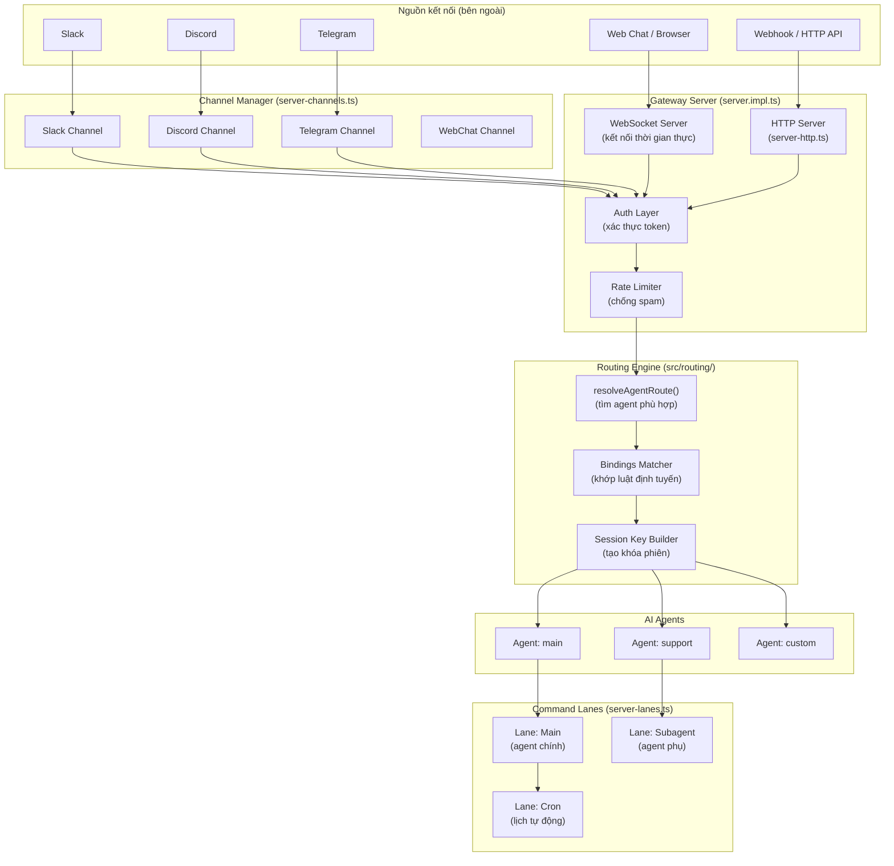
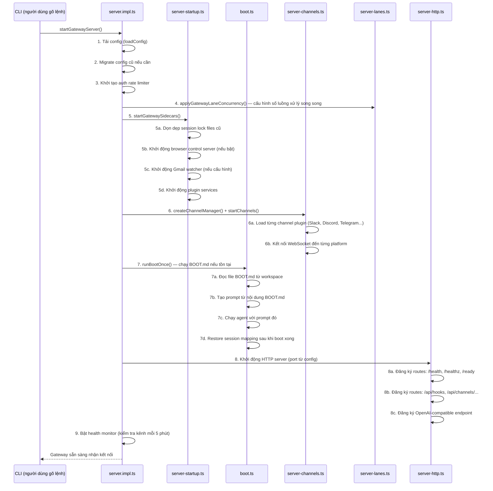
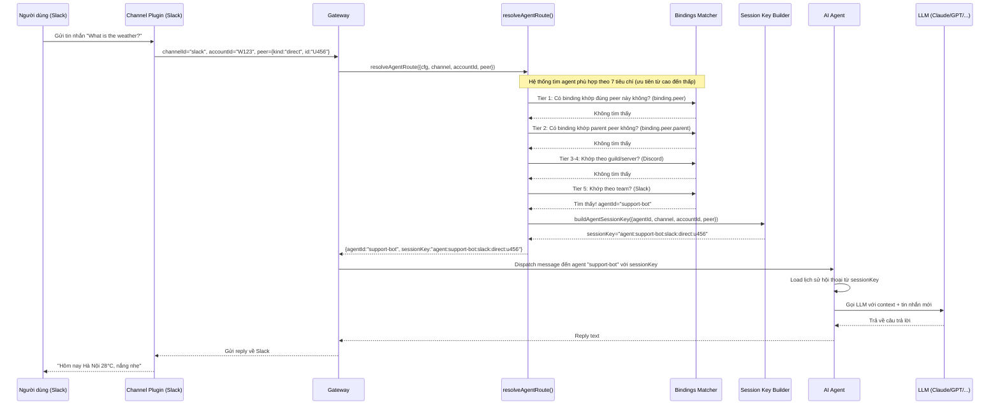

# Gateway & Routing — Tim Đập Của OpenClaw

---

## 1. Gateway là gì?

Hãy tưởng tượng bạn đang gọi đến một **tổng đài điện thoại lớn**. Tổng đài đó không tự giải quyết mọi việc — nó chỉ nhận cuộc gọi vào, xác định bạn muốn gặp ai, rồi chuyển tiếp đến đúng người. Đó chính xác là vai trò của **Gateway** trong OpenClaw.

OpenClaw là một nền tảng AI agent — một "trợ lý AI thông minh" có thể nhận tin nhắn từ nhiều nguồn khác nhau (Slack, Discord, Telegram, web chat...) và trả lời thông minh. Gateway là lớp trung gian đứng ở giữa:

```
Người dùng gửi tin → Gateway nhận → Xác định agent nào xử lý → Agent gọi LLM → Trả lời
```

**Ba nhiệm vụ chính của Gateway:**
1. **Lắng nghe** — mở cổng kết nối WebSocket (thời gian thực) và HTTP (yêu cầu đơn lẻ)
2. **Xác thực** — kiểm tra xem người dùng có quyền truy cập không
3. **Định tuyến (routing)** — quyết định agent AI nào sẽ xử lý tin nhắn

---

## 2. Sơ đồ kiến trúc Gateway



---

## 3. Boot Sequence — Khởi động như thế nào

Khi bạn chạy lệnh `openclaw serve`, hệ thống khởi động theo một trình tự rất cụ thể. Mỗi bước phải thành công thì bước tiếp theo mới chạy.

### Trình tự khởi động (từ `server.impl.ts` + `server-startup.ts` + `boot.ts`)



**Điểm đáng chú ý về `boot.ts`:** File `BOOT.md` trong thư mục workspace là một file đặc biệt. Nếu tồn tại, OpenClaw sẽ đọc nó và chạy agent với nội dung đó như một "nhiệm vụ khởi động". Ví dụ: bạn có thể viết `BOOT.md` để agent tự động gửi thông báo "Bot đã online" vào Slack mỗi khi server restart.

---

## 4. Message Routing — Tin nhắn đi đâu?

Khi bạn gửi một tin nhắn, ví dụ `/help` vào Slack, hệ thống phải quyết định **agent nào** sẽ trả lời. Đây là cơ chế routing.

### Luồng xử lý tin nhắn (từ `resolve-route.ts`)



### 7 tiêu chí định tuyến (theo thứ tự ưu tiên giảm dần)

Hệ thống thử từng tiêu chí một, từ cụ thể nhất đến chung nhất:

| Ưu tiên | Tiêu chí | Ví dụ |
|---------|----------|-------|
| 1 | `binding.peer` | Kênh Slack `#vip-support` → agent "vip-handler" |
| 2 | `binding.peer.parent` | Thread trong `#vip-support` kế thừa từ parent |
| 3 | `binding.guild+roles` | Discord server X + role "admin" → agent "admin-bot" |
| 4 | `binding.guild` | Discord server X (bất kỳ role) → agent "server-bot" |
| 5 | `binding.team` | Slack workspace Y → agent "workspace-bot" |
| 6 | `binding.account` | Account ID cụ thể → agent "account-bot" |
| 7 | `default` | Không khớp gì → agent mặc định "main" |

---

## 5. WebSocket vs HTTP — Hai loại kết nối

OpenClaw sử dụng hai giao thức kết nối cho hai mục đích khác nhau.

### WebSocket — Kết nối "đường dây nóng"

**WebSocket** giống như một cuộc gọi điện thoại đang mở: một khi kết nối được thiết lập, cả hai bên (server và client) có thể gửi dữ liệu cho nhau **bất cứ lúc nào** mà không cần "gọi lại từ đầu".

```
Client ──────────────────────────── Server
        ←→ kết nối hai chiều liên tục ←→
        "Tin nhắn mới!"
                        "Đang xử lý..."
                        "Đây là câu trả lời của tôi"
        "Cảm ơn!"
```

**Dùng khi nào:**
- Web chat interface (browser kết nối với OpenClaw)
- Nhận phản hồi streaming (từng chữ hiện dần ra màn hình)
- Control UI (giao diện điều khiển realtime)
- Canvas host (giao diện kéo thả realtime)

**Trong code:** `server.impl.ts` và `server-ws-runtime.ts` xử lý WebSocket. Các path WebSocket bao gồm `/ws` (main), `/canvas-ws` (canvas host).

### HTTP — Kết nối "gửi thư"

**HTTP** giống như gửi thư: bạn gửi một yêu cầu, chờ phản hồi, rồi kết nối đóng lại. Mỗi yêu cầu hoàn toàn độc lập.

**Dùng khi nào:**
- Webhooks từ Slack/Discord/Telegram (platform gửi HTTP POST khi có tin nhắn)
- Health check endpoints (`/health`, `/healthz`, `/ready`, `/readyz`)
- OpenAI-compatible API (các tool gọi OpenClaw như gọi ChatGPT)
- Hooks từ external services (Gmail, IFTTT, Zapier...)
- Admin API calls

**Các HTTP endpoints quan trọng (từ `server-http.ts`):**

| Endpoint | Mục đích |
|----------|----------|
| `GET /health` hoặc `/healthz` | Kiểm tra server có đang sống không (liveness probe) |
| `GET /ready` hoặc `/readyz` | Kiểm tra server đã sẵn sàng nhận traffic chưa (readiness probe) |
| `POST /api/hooks/*` | Nhận webhooks từ external services |
| `POST /api/channels/mattermost/command` | Nhận slash commands từ Mattermost |
| `/openai/*` | OpenAI-compatible REST API |
| `/canvas-ws` | WebSocket cho Canvas host |

---

## 6. Session Management — Quản lý phiên hội thoại

### Session là gì?

**Session** (phiên) là "bộ nhớ ngắn hạn" của một cuộc hội thoại. Khi bạn chat với agent AI, agent cần nhớ những gì đã nói trước đó để trả lời mạch lạc. Session lưu lịch sử này.

Mỗi session được định danh bằng một **Session Key** — một chuỗi ký tự duy nhất.

### Cấu trúc Session Key (từ `session-key.ts`)

Session key được xây dựng theo format:
```
agent:{agentId}:{...context}
```

**Ví dụ thực tế:**

| Tình huống | Session Key |
|-----------|-------------|
| User chat trực tiếp với agent "main" (mặc định) | `agent:main:main` |
| User "U123" nhắn DM cho agent "support" qua Slack | `agent:support:main` (dmScope=main) |
| User "U123" nhắn DM, mỗi user có session riêng | `agent:support:direct:u123` (dmScope=per-peer) |
| Group chat `#general` trên Slack | `agent:main:slack:channel:c456789` |
| Thread con trong Discord | `agent:main:discord:channel:c123:thread:t789` |

### DM Scope — Bốn chế độ quản lý session DM

Khi người dùng nhắn tin riêng (Direct Message), có bốn cách cấu hình session:

- **`main`** (mặc định): Tất cả DM dùng chung một session. Mọi người chat đều trong cùng một "cuộc trò chuyện".
- **`per-peer`**: Mỗi user có session riêng. Phân biệt từng người nhắn.
- **`per-channel-peer`**: Phân biệt user theo từng channel platform.
- **`per-account-channel-peer`**: Phân biệt user theo channel VÀ account ID của bot.

### Session Lifetime

Session không bao giờ tự hết hạn theo thời gian cố định. Chúng tồn tại trong store (file system) và được load lại khi cần. Khi server khởi động lại, `runBootOnce()` trong `boot.ts` đảm bảo session mapping được restore về trạng thái trước khi boot.

---

## 7. Lanes System — Hệ thống làn đường

### Lanes là gì?

Hãy tưởng tượng một **xa lộ có nhiều làn đường**. Xe tải nặng đi làn ngoài, xe hơi đi làn trong, xe khẩn cấp đi làn ưu tiên. Lanes trong OpenClaw hoạt động tương tự — phân loại các tác vụ để tránh tình trạng một task nặng chặn cả hệ thống.

### Ba loại Lanes (từ `server-lanes.ts`)

```typescript
// Từ server-lanes.ts
setCommandLaneConcurrency(CommandLane.Cron, cfg.cron?.maxConcurrentRuns ?? 1);
setCommandLaneConcurrency(CommandLane.Main, resolveAgentMaxConcurrent(cfg));
setCommandLaneConcurrency(CommandLane.Subagent, resolveSubagentMaxConcurrent(cfg));
```

| Lane | Mục đích | Mặc định | Ví dụ |
|------|----------|----------|-------|
| **Main** | Xử lý tin nhắn người dùng chính | Từ config | User nhắn "xin chào" → xử lý ở Main lane |
| **Subagent** | Các agent con được spawn bởi agent chính | Từ config | Agent chính gọi agent khác để tìm kiếm web |
| **Cron** | Tác vụ lịch (chạy theo schedule) | 1 | Gửi báo cáo hàng ngày lúc 9h sáng |

**Tại sao cần Lanes?**

Không có lanes, một yêu cầu phức tạp (ví dụ: agent đang tổng hợp 100 trang PDF) sẽ chặn các yêu cầu đơn giản (ví dụ: user hỏi "hôm nay mấy giờ?"). Lanes cho phép kiểm soát **concurrency** (số tác vụ chạy song song) cho từng loại riêng biệt.

**Ví dụ cấu hình:** Nếu bạn set `Main.maxConcurrent = 3`, thì tối đa 3 cuộc hội thoại được xử lý đồng thời. Cuộc hội thoại thứ 4 sẽ đợi trong hàng đợi cho đến khi một trong 3 cái kia xong.

---

## 8. Health Monitoring & Auto-Restart — Giám sát sức khỏe

### Vấn đề thực tế

Kết nối WebSocket đến Slack, Discord, Telegram đôi khi bị "chết âm thầm" — server nghĩ kết nối vẫn đang hoạt động, nhưng thực tế messages đã ngừng đến từ lúc nào. Đây là vấn đề phổ biến trong hệ thống mạng.

### Giải pháp: Channel Health Monitor (từ `channel-health-monitor.ts`)

```
┌─────────────────────────────────────────────────────┐
│               Health Monitor (chạy mỗi 5 phút)      │
│                                                       │
│  Với mỗi channel (Slack, Discord, Telegram...):      │
│                                                       │
│  1. Lấy snapshot trạng thái hiện tại                 │
│  2. Kiểm tra: Có nhận event gần đây không?           │
│     - Không có event trong X phút → "stale socket"  │
│  3. Nếu không healthy:                               │
│     - Kiểm tra cooldown (không restart liên tục)     │
│     - Kiểm tra rate limit (max 10 restart/giờ)       │
│     - Nếu OK → Restart channel đó                    │
└─────────────────────────────────────────────────────┘
```

**Các thông số quan trọng:**

| Thông số | Giá trị mặc định | Ý nghĩa |
|----------|-----------------|---------|
| `checkIntervalMs` | 5 phút | Tần suất kiểm tra sức khỏe |
| `monitorStartupGraceMs` | 60 giây | Không kiểm tra ngay khi server mới bật |
| `channelConnectGraceMs` | Từ policy | Thời gian chờ channel kết nối lần đầu |
| `staleEventThresholdMs` | Từ policy | Bao lâu không có event thì coi là "stale" |
| `maxRestartsPerHour` | 10 lần | Giới hạn restart để tránh vòng lặp vô hạn |
| `cooldownCycles` | 2 cycles | Số chu kỳ nghỉ giữa các lần restart |

**Backoff Policy (từ `server-channels.ts`):**
```
Lần restart 1: chờ 5 giây
Lần restart 2: chờ 10 giây
Lần restart 3: chờ 20 giây
...
Tối đa: 5 phút giữa các lần restart
```

---

## 9. Ví dụ Usecase Thực Tế

### Tình huống: Người dùng gửi "What's the weather?" qua Telegram

Trace toàn bộ hành trình của một tin nhắn từ lúc gõ đến lúc nhận được câu trả lời:

```
[BƯỚC 1] Người dùng nhắn trong Telegram app
         User ID: 987654, Chat ID: 111222333 (group chat)
         Nội dung: "What's the weather in Hanoi?"
         ↓

[BƯỚC 2] Telegram server nhận tin → gọi webhook đến OpenClaw
         POST https://your-openclaw-server.com/api/hooks/telegram
         Body: { update_id: 99, message: { chat: {id:111222333}, from: {id:987654}, text: "..." } }
         ↓

[BƯỚC 3] server-http.ts nhận HTTP request
         - Xác thực webhook token (safeEqualSecret)
         - Gọi handleSlackHttpRequest() (hoặc Telegram handler tương tự)
         - Rate limiter kiểm tra: không bị spam → cho qua
         ↓

[BƯỚC 4] Channel Plugin (Telegram) parse message
         - channelId = "telegram"
         - accountId = "default" (hoặc bot token ID)
         - peer = { kind: "group", id: "111222333" }
         ↓

[BƯỚC 5] resolveAgentRoute() — tìm agent phù hợp
         Input: { channel:"telegram", accountId:"default", peer:{kind:"group", id:"111222333"} }

         Thử Tier 1 (binding.peer): Có rule nào khớp group "111222333" không? → Không
         Thử Tier 2 (binding.peer.parent): Không có thread parent → Không
         Thử Tier 3-4 (guild): Telegram không có guild → Không
         Thử Tier 5 (team): Không có team binding → Không
         Thử Tier 6 (account): Không có account binding cụ thể → Không
         Thử Tier 7 (default): → Dùng agent "main"

         Output: { agentId: "main", matchedBy: "default" }
         ↓

[BƯỚC 6] buildAgentSessionKey() — tạo session key
         agentId = "main"
         channel = "telegram"
         peerKind = "group"
         peerId = "111222333"

         sessionKey = "agent:main:telegram:group:111222333"

         (Tất cả tin nhắn trong group Telegram này dùng chung session này)
         ↓

[BƯỚC 7] Dispatch đến Command Lane "Main"
         - Kiểm tra có slot trống trong Main lane không?
         - Có → đưa vào xử lý ngay
         - Không → đợi trong queue
         ↓

[BƯỚC 8] Agent "main" xử lý
         - Load session "agent:main:telegram:group:111222333" từ store
         - Có lịch sử hội thoại → append tin nhắn mới
         - Gọi LLM (Claude/GPT) với full context
         - LLM trả về: "In Hanoi today, it's 28°C with partly cloudy skies..."
         ↓

[BƯỚC 9] server-chat.ts xử lý agent response
         - Kiểm tra có phải heartbeat ẩn không? → Không
         - Kiểm tra có phải silent reply không? → Không
         - Format response cho Telegram
         ↓

[BƯỚC 10] Gửi trả về Telegram
          Telegram API: sendMessage(chat_id=111222333, text="In Hanoi today...")
          ↓

[KẾT QUẢ] Người dùng nhìn thấy câu trả lời trong group Telegram
          Tổng thời gian: ~1-3 giây (tùy tốc độ LLM)
```

---

### Tóm tắt kiến trúc trong một câu

> **Gateway** là cổng vào duy nhất của OpenClaw: nó lắng nghe kết nối từ mọi platform (qua WebSocket và HTTP), xác thực người dùng, rồi dùng **Routing engine** để tìm đúng agent AI sẽ xử lý — mỗi cuộc hội thoại được theo dõi bằng một **Session Key** độc nhất, và toàn bộ tải công việc được phân phối qua **Lanes** để đảm bảo hệ thống không bao giờ bị một task đơn lẻ làm tê liệt.

---

*Báo cáo dựa trên phân tích source code: `src/gateway/server.impl.ts`, `src/gateway/server-http.ts`, `src/gateway/server-chat.ts`, `src/gateway/boot.ts`, `src/gateway/server-startup.ts`, `src/gateway/server-channels.ts`, `src/gateway/server-lanes.ts`, `src/gateway/channel-health-monitor.ts`, `src/routing/resolve-route.ts`, `src/routing/session-key.ts`, `src/routing/bindings.ts`*
