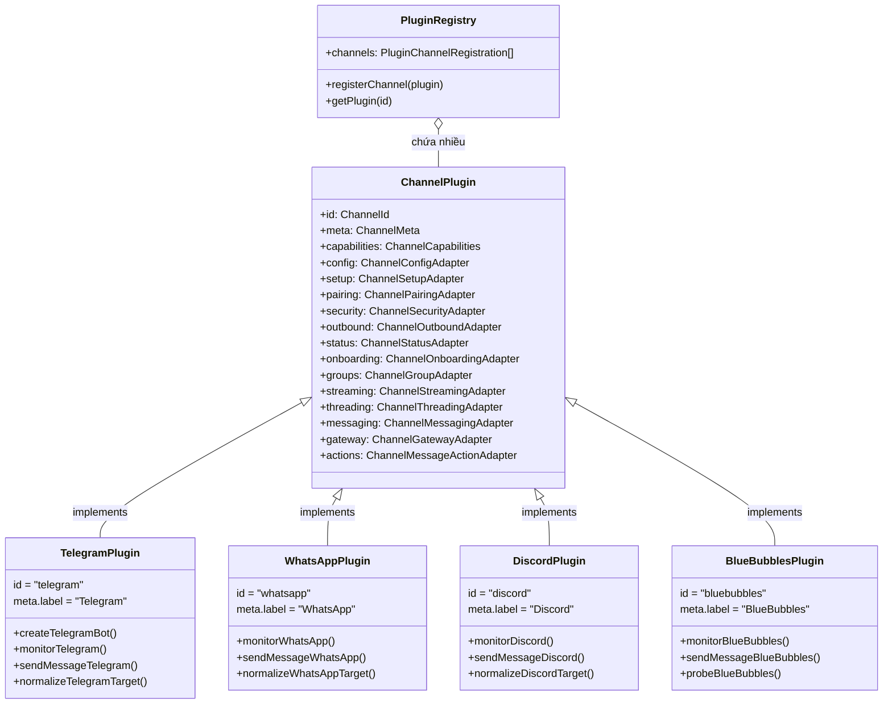
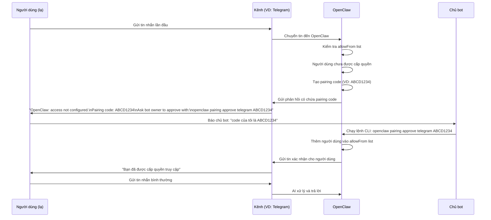
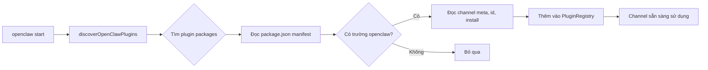
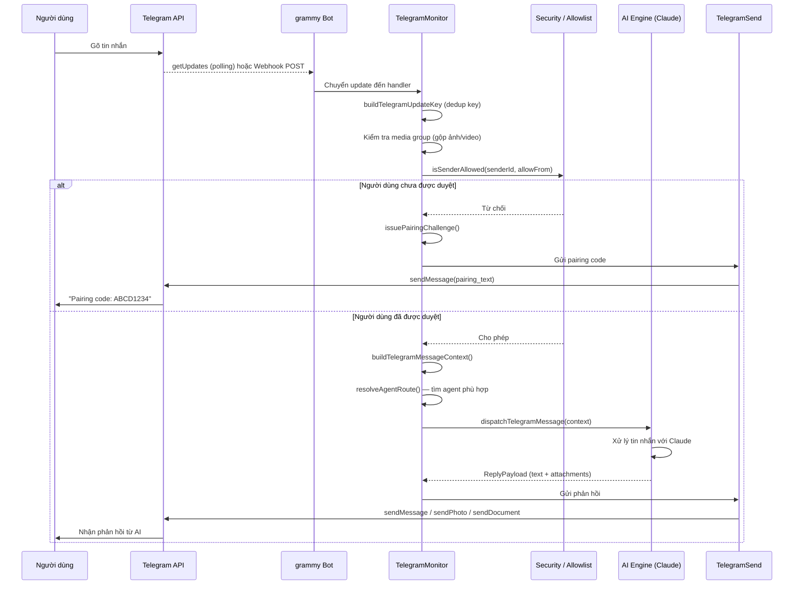
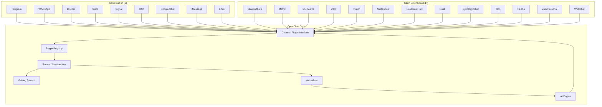

# Hệ Thống Kênh Nhắn Tin — 20+ Integrations

## 1. Kênh nhắn tin là gì?

Hãy tưởng tượng OpenClaw là một **tổng đài AI** đặt trong nhà bạn. Tổng đài này có thể nói chuyện với bạn qua nhiều "đường dây" khác nhau: WhatsApp, Telegram, Discord, Zalo, iMessage... mỗi đường dây đó chính là một **kênh nhắn tin (channel)**.

Mỗi kênh hoạt động như một **cầu nối** hai chiều:
- Tin nhắn từ người dùng gửi vào kênh → OpenClaw nhận → AI xử lý → phản hồi qua cùng kênh đó.
- Chủ bot ngồi ở đâu cũng được, chỉ cần cấu hình một lần là AI tự động trả lời trên tất cả các nền tảng.

Ưu điểm cốt lõi: **một AI, nhiều cửa vào**. Người dùng không cần cài thêm app nào — họ dùng đúng app nhắn tin họ đang dùng hằng ngày.

---

## 2. Danh sách đầy đủ kênh được hỗ trợ

| Kênh | Built-in / Extension | Platform chính | Ghi chú |
|------|----------------------|----------------|---------|
| **Telegram** | Built-in (core) | Bot API (grammy) | Dễ setup nhất — tạo bot qua @BotFather |
| **WhatsApp** | Built-in (core) | Baileys / QR link | Dùng số điện thoại cá nhân; khuyên dùng SIM riêng |
| **Discord** | Built-in (core) | Bot API | Hỗ trợ tốt; voice, thread, guild |
| **IRC** | Built-in (core) | IRC server + nick | Mạng IRC cổ điển; DM + channel routing |
| **Google Chat** | Built-in (core) | Chat API / HTTP webhook | Google Workspace |
| **Slack** | Built-in (core) | Socket Mode | App Token + Bot Token |
| **Signal** | Built-in (core) | signal-cli | Cần linked device; setup phức tạp hơn |
| **iMessage** | Built-in (core) | imsg | Đang phát triển (work in progress) |
| **LINE** | Built-in (core) | Messaging API | Webhook bot |
| **BlueBubbles** | Extension | macOS app + REST API | iMessage qua app BlueBubbles trên Mac |
| **Matrix** | Extension | Matrix protocol | Homeserver + access token |
| **Microsoft Teams** | Extension | Bot Framework / webhook | Tích hợp Microsoft 365 |
| **Feishu (Lark)** | Extension | Feishu Bot API | Nền tảng công việc của ByteDance |
| **Mattermost** | Extension | Webhook / Bot | Self-hosted Slack alternative |
| **Nextcloud Talk** | Extension | Webhook | Self-hosted |
| **Nostr** | Extension | Nostr protocol | Mạng phi tập trung, mã nguồn mở |
| **Synology Chat** | Extension | Webhook | Synology NAS |
| **Tlon (Urbit)** | Extension | Urbit / Groups | Nền tảng phi tập trung |
| **Twitch** | Extension | Twitch Chat API | Chat stream trực tiếp |
| **Zalo** | Extension | Zalo API | Phổ biến tại Việt Nam |
| **Zalo Personal** | Extension | Zalo cá nhân | Tài khoản cá nhân (không phải OA) |
| **WebChat** | Extension | Web widget | Nhúng trực tiếp vào website |

**Tổng cộng: 22 kênh** — 9 built-in (core), 13 extension.

---

## 3. Kiến trúc Channel Abstraction

OpenClaw sử dụng mô hình **Plugin Architecture** — mỗi kênh là một plugin độc lập, tất cả đều phải thực thi cùng một "hợp đồng" (interface) chung.



**Nguyên tắc thiết kế:**
- **`ChannelPlugin`** (định nghĩa tại `src/channels/plugins/types.plugin.ts`) là interface trung tâm — mọi kênh phải implement.
- Mỗi adapter (config, outbound, security...) là **optional** — kênh không cần tất cả, chỉ implement những gì cần thiết.
- Plugin được load động qua `PluginRegistry` — OpenClaw không cần biết trước danh sách kênh cứng trong code.
- Kênh core (telegram, whatsapp, discord...) đăng ký trong `src/channels/registry.ts`; kênh extension đăng ký trong file `index.ts` của chính nó.

---

## 4. Cơ chế Pairing — Kết nối thiết bị mới

### Pairing là gì?

**Pairing** là cơ chế kiểm soát truy cập — xác định ai được phép nhắn tin với bot AI của bạn. Khi một người lạ gửi tin cho bot lần đầu, bot không tự động trả lời, mà phát sinh một **mã kết nối (pairing code)**.

Chủ bot phải chạy lệnh phê duyệt thủ công, như cấp "thẻ thành viên" cho người dùng mới.

### Flow pairing từng bước



### Chi tiết kỹ thuật

- **Mã pairing**: 8 ký tự từ bảng chữ cái an toàn `ABCDEFGHJKLMNPQRSTUVWXYZ23456789` (loại bỏ I, O, 0, 1 để tránh nhầm lẫn)
- **Thời hạn**: Mã hết hạn sau 60 phút (`PAIRING_PENDING_TTL_MS = 60 * 60 * 1000`)
- **Giới hạn**: Tối đa 3 yêu cầu pairing chờ duyệt cùng lúc
- **File store**: Lưu trữ trong thư mục state của OpenClaw với file lock an toàn (tránh race condition)
- **Mã nguồn**: `src/pairing/pairing-store.ts`, `src/pairing/pairing-challenge.ts`, `src/pairing/pairing-messages.ts`

---

## 5. Phân tích chi tiết 3 kênh phổ biến

### 5.1 Telegram

**Cách hoạt động**: OpenClaw dùng thư viện `grammy` để kết nối với Telegram Bot API. Bot nhận cập nhật qua **polling** (hỏi Telegram liên tục) hoặc **webhook** (Telegram chủ động gửi về).

**Thư mục**: `src/telegram/` với ~80 file — đây là kênh được phát triển kỹ lưỡng nhất.

**Các thành phần chính:**
- `bot.ts` — Khởi tạo và cấu hình `grammy` Bot instance
- `bot-handlers.ts` — Đăng ký handlers xử lý tin nhắn đến
- `bot-message.ts` — Tạo message processor (context, dispatch)
- `monitor.ts` — Vòng lặp giám sát polling/webhook với retry logic
- `send.ts` — Các hàm gửi tin (text, media, file, sticker)
- `format.ts` — Chuyển đổi Markdown → định dạng Telegram
- `targets.ts` — Normalize địa chỉ người nhận

**Tính năng nổi bật:**
- Hỗ trợ cả DM lẫn group chat với policy riêng biệt
- Streaming response (gõ dần từng chữ) với `draft-stream.ts`
- Hỗ trợ forum topics (Supergroup với topic phân loại)
- Proxy support (`proxy.ts`) để bypass giới hạn địa lý
- Rate limiting thông qua `apiThrottler` và `sequentialize`
- Exec approval (phê duyệt lệnh nguy hiểm) qua `exec-approvals.ts`

**Cấu hình cơ bản:**
```
token: <bot-token-từ-BotFather>
allowFrom: [user_id_1, username_1]
```

---

### 5.2 Discord

**Cách hoạt động**: OpenClaw tạo Discord Bot kết nối qua **Discord Gateway** (WebSocket long-lived connection). Khác Telegram, Discord dùng event-driven model — bot nhận sự kiện theo thời gian thực.

**Thư mục**: `src/discord/` với ~40 file.

**Các thành phần chính:**
- `monitor/` — Theo dõi sự kiện Discord (messages, threads, reactions)
- `send.ts` — Export tập hợp tất cả hàm gửi
- `send.outbound.ts` — Gửi tin nhắn, poll, sticker, webhook
- `send.messages.ts` — CRUD tin nhắn (đọc, sửa, xóa, pin)
- `send.guild.ts` — Quản lý server (kick, ban, role, channel)
- `send.reactions.ts` — Xử lý reaction emoji
- `voice/` — Hỗ trợ voice channel (voice message, voice command)
- `thread-bindings.ts` — Liên kết AI session với Discord thread

**Tính năng nổi bật:**
- Hỗ trợ đầy đủ **Guild (server) management** — tạo/xóa kênh, cấp quyền
- **Thread binding** — mỗi conversation AI được gắn với một thread riêng
- **Webhook message** — gửi tin qua webhook để customize avatar/name
- **Voice message** — nhận và gửi tin nhắn thoại
- **Phân quyền tinh tế** — kiểm tra Discord permissions trước khi hành động

---

### 5.3 WhatsApp

**Cách hoạt động**: OpenClaw sử dụng thư viện **Baileys** — một client WhatsApp Web phi chính thức hoạt động bằng cách quét mã QR để link thiết bị mới (giống WhatsApp Web trên trình duyệt). Không cần WhatsApp Business API.

**Thư mục**: `src/whatsapp/` và `src/channels/plugins/outbound/whatsapp.ts`.

**Các thành phần chính:**
- `normalize.ts` — Chuẩn hóa định dạng JID (WhatsApp address)
- `resolve-outbound-target.ts` — Chuyển đổi địa chỉ gửi

**Định dạng địa chỉ WhatsApp:**
- Người dùng: `41796666864:0@s.whatsapp.net` (JID chuẩn)
- Nhóm: `123456789-1234567890@g.us`
- LID format mới: `123456@lid`

**Lưu ý quan trọng**: WhatsApp không cấp phép chính thức cho automation. OpenClaw dùng thư viện unofficial (Baileys) — có rủi ro bị khóa tài khoản nếu dùng quá mức. Khuyến nghị dùng SIM điện thoại riêng, không phải số điện thoại chính.

---

## 6. Extension Channels — Cách tải và đăng ký

### Cơ chế Plugin

Kênh extension không nằm trong code chính của OpenClaw — chúng được đóng gói như **npm package** độc lập và tải động vào runtime.



### Ví dụ: Đăng ký BlueBubbles Extension

File `extensions/bluebubbles/index.ts`:
```typescript
const plugin = {
  id: "bluebubbles",
  name: "BlueBubbles",
  register(api: OpenClawPluginApi) {
    setBlueBubblesRuntime(api.runtime);
    api.registerChannel({ plugin: bluebubblesPlugin });
  },
};
export default plugin;
```

### Các Extension tiêu biểu

| Extension | npm Package | Ngôn ngữ kết nối |
|-----------|-------------|-----------------|
| **Matrix** | `openclaw-channel-matrix` | Matrix homeserver + access token |
| **Zalo** | `openclaw-channel-zalo` | Zalo API (Official Account) |
| **Zalo Personal** | `openclaw-channel-zalouser` | Tài khoản Zalo cá nhân |
| **MS Teams** | `openclaw-channel-msteams` | Bot Framework token |
| **Mattermost** | `openclaw-channel-mattermost` | Webhook URL |
| **Twitch** | `openclaw-channel-twitch` | OAuth token |
| **Tlon** | `openclaw-channel-tlon` | Urbit ship URL + password |
| **Feishu** | `openclaw-channel-feishu` | App ID + App Secret |
| **Synology Chat** | `openclaw-channel-synology-chat` | Webhook |
| **Nextcloud Talk** | `openclaw-channel-nextcloud-talk` | Webhook |
| **Nostr** | `openclaw-channel-nostr` | Private key |

### Cách cài đặt

```bash
# Cài qua npm
openclaw plugins install openclaw-channel-matrix

# Hoặc cài local (đường dẫn tương đối)
openclaw plugins install ./my-custom-channel
```

Plugin catalog được đọc từ `~/.openclaw/mpm/plugins.json` hoặc `~/.openclaw/plugins/catalog.json`.

---

## 7. Message Format chuẩn — Normalize

Mỗi nền tảng có định dạng tin nhắn khác nhau. OpenClaw chuẩn hóa tất cả về một format thống nhất trước khi xử lý.

### Vấn đề

- Telegram dùng MarkdownV2 với escape rules phức tạp
- Discord dùng Markdown nhưng không hỗ trợ tất cả cú pháp
- WhatsApp dùng bold bằng `*text*`, italic bằng `_text_`
- Slack dùng `mrkdwn` — định dạng riêng của Slack

### Giải pháp: Normalize Pipeline

```
Tin nhắn đến từ kênh
        ↓
[Channel-specific parser]
  (vd: parseTelegramTarget)
        ↓
[Normalize thành format trung gian]
  (vd: normalizeTelegramMessagingTarget → "telegram:123456789")
        ↓
[AI xử lý]
        ↓
[Outbound formatter]
  (chuyển đổi sang format của kênh đích)
        ↓
Gửi đi qua kênh
```

### Định dạng địa chỉ chuẩn

Mỗi kênh có format địa chỉ riêng với prefix:

| Kênh | Format địa chỉ | Ví dụ |
|------|----------------|-------|
| Telegram | `telegram:<chat_id>` | `telegram:123456789` |
| Telegram group topic | `telegram:group:<id>:topic:<thread_id>` | `telegram:group:-100123:topic:5` |
| WhatsApp user | `whatsapp:<jid>` | `whatsapp:41796666864@s.whatsapp.net` |
| WhatsApp group | `whatsapp:<group_jid>` | `whatsapp:123-456@g.us` |
| Discord | `discord:<channel_id>` | `discord:987654321` |
| Slack | `slack:<channel_id>` | `slack:C01234567` |

### File normalize tương ứng

- `src/channels/plugins/normalize/telegram.ts`
- `src/channels/plugins/normalize/whatsapp.ts`
- `src/channels/plugins/normalize/discord.ts`
- `src/channels/plugins/normalize/slack.ts`
- `src/channels/plugins/normalize/signal.ts`
- `src/channels/plugins/normalize/imessage.ts`

---

## 8. Sequence Diagram: Nhận tin nhắn từ Telegram

Đây là hành trình đầy đủ của một tin nhắn từ lúc người dùng gõ đến lúc AI phản hồi:



**Các điểm đáng chú ý:**

1. **Dedup (loại trùng lặp)**: Mỗi update có unique key để tránh xử lý trùng khi Telegram gửi lại.
2. **Media group**: Nhiều ảnh gửi cùng lúc được gộp lại (debounce timeout) trước khi xử lý.
3. **Sequential key**: Tin nhắn từ cùng một chat được xử lý tuần tự, không song song — tránh lộn thứ tự.
4. **Streaming**: Trong quá trình AI đang "nghĩ", bot gửi trạng thái "đang gõ..." (sendChatAction).
5. **Retry**: Nếu Telegram API lỗi tạm thời, có retry với exponential backoff.

---

## 9. Usecase thực tế

### Usecase 1: Trả lời WhatsApp từ xa khi đang đi công tác

**Tình huống**: Bạn đang họp, khách hàng nhắn WhatsApp hỏi báo giá. Thay vì dừng họp để trả lời, AI của bạn tự trả lời.

**Cách hoạt động:**
1. Cấu hình OpenClaw với kênh WhatsApp (quét QR như WhatsApp Web)
2. Cấu hình AI với thông tin sản phẩm, bảng giá
3. Thêm số khách hàng vào `allowFrom` list
4. Khi khách nhắn → AI đọc → phân tích câu hỏi → trả lời tự động
5. Bạn có thể xem lại lịch sử chat trong CLI

---

### Usecase 2: Bot hỗ trợ cộng đồng Discord

**Tình huống**: Bạn quản lý server Discord cho cộng đồng lập trình viên. Nhiều câu hỏi lặp đi lặp lại.

**Cách hoạt động:**
1. Tạo Discord Bot, lấy token từ Discord Developer Portal
2. Cấu hình OpenClaw — kênh Discord + bot token
3. Thiết lập group policy: bot chỉ trả lời khi được mention `@botname`
4. Thêm knowledge base (tài liệu, FAQ) vào agent context
5. Thành viên mention bot → AI trả lời trong cùng thread → giữ nguyên context

**Tính năng bonus Discord**: Bot có thể tạo thread riêng cho mỗi cuộc trò chuyện, không làm rối main channel.

---

### Usecase 3: Kết hợp nhiều kênh — một AI, nhiều cửa vào

**Tình huống**: Startup muốn hỗ trợ khách hàng qua Telegram (khách Việt Nam), WhatsApp (khách quốc tế), và Zalo (khách doanh nghiệp nội địa).

**Cách hoạt động:**
1. Cài đặt OpenClaw với 3 kênh: `telegram`, `whatsapp`, `zalo`
2. Cấu hình cùng một agent AI cho cả 3 kênh
3. Agent có đầy đủ thông tin sản phẩm, chính sách, FAQ
4. Khách hàng nhắn qua kênh họ quen → AI trả lời → log lại đầy đủ
5. Khi cần escalate (vấn đề phức tạp), bot tự động ping nhân viên hỗ trợ

**Lợi ích**: Thay vì 3 nhân viên trực 24/7 trên 3 kênh, chỉ cần 1 OpenClaw instance + 1 AI agent.

---

### Usecase 4: Pairing — Kiểm soát ai được dùng bot cá nhân

**Tình huống**: Bạn cài bot Telegram cá nhân (chỉ cho gia đình dùng). Muốn mẹ và vợ dùng được, người lạ không được.

**Flow:**
1. Mẹ nhắn bot lần đầu → nhận pairing code `XKRD2948`
2. Mẹ nhắn cho bạn: "con cho mẹ code này vào"
3. Bạn chạy: `openclaw pairing approve telegram XKRD2948`
4. Từ đó mẹ nhắn bot thoải mái, người lạ vẫn bị chặn

---

## Tóm tắt kiến trúc tổng thể



OpenClaw thiết kế theo nguyên tắc **"mở rộng không giới hạn"**: bất kỳ ai cũng có thể viết extension kênh mới bằng cách implement interface `ChannelPlugin`, đóng gói thành npm package, và cài vào OpenClaw — không cần sửa code gốc.
