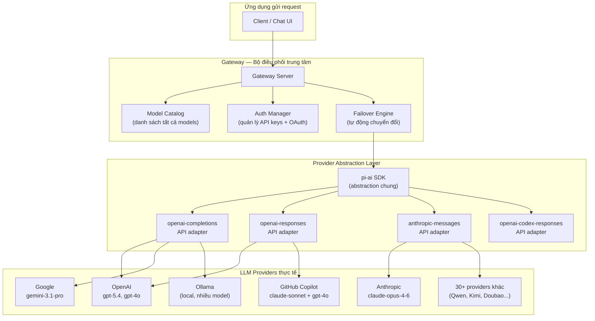

# Hệ Thống LLM Providers — Bộ Não Của OpenClaw

> Tài liệu này giải thích cách OpenClaw kết nối với các mô hình AI, quản lý xác thực,
> và tự động chuyển đổi khi một nhà cung cấp gặp sự cố.
> Viết cho người chưa quen với AI — không cần kiến thức kỹ thuật nền trước.

---

## 1. LLM là gì? (Giải thích đơn giản)

**LLM** = *Large Language Model* = Mô hình ngôn ngữ lớn.

Hãy tưởng tượng OpenClaw là một robot trợ lý thông minh. Robot này cần một "bộ não" để suy nghĩ và trả lời câu hỏi. Bộ não đó chính là **LLM**.

Tương tự như khi bạn gọi điện cho ai đó — bạn cần chọn mạng di động nào để kết nối (Viettel, Mobifone, Vinaphone...). OpenClaw cũng cần chọn "nhà mạng AI" để kết nối. Các nhà mạng AI đó gọi là **LLM Providers** (nhà cung cấp mô hình AI).

Ví dụ thực tế:
- **OpenAI** → tạo ra GPT (ChatGPT)
- **Anthropic** → tạo ra Claude
- **Google** → tạo ra Gemini
- **Ollama** → chạy AI ngay trên máy tính của bạn, không cần internet

---

## 2. Danh Sách Providers Được Hỗ Trợ

OpenClaw hỗ trợ hơn 30 providers, chia thành 3 nhóm:

### Nhóm 1 — Providers tích hợp sẵn (không cần cấu hình thêm)

| Provider | Provider ID | Mô hình ví dụ | Xác thực | Ghi chú |
|---|---|---|---|---|
| **OpenAI** | `openai` | `openai/gpt-5.4` | API Key (`OPENAI_API_KEY`) | Mặc định dùng WebSocket |
| **OpenAI Codex** | `openai-codex` | `openai-codex/gpt-5.4` | OAuth (ChatGPT) | Hỗ trợ chính thức từ OpenAI |
| **Anthropic** | `anthropic` | `anthropic/claude-opus-4-6` | API Key (`ANTHROPIC_API_KEY`) | Provider mặc định của OpenClaw |
| **Google Gemini** | `google` | `google/gemini-3.1-pro-preview` | API Key (`GEMINI_API_KEY`) | Hỗ trợ rotation nhiều key |
| **Google Vertex AI** | `google-vertex` | — | gcloud ADC (Application Default Credentials) | Dành cho doanh nghiệp |
| **Google Antigravity** | `google-antigravity` | — | OAuth (plugin riêng) | Không chính thức, cần bật plugin |
| **OpenCode (Zen)** | `opencode` | `opencode/claude-opus-4-6` | API Key (`OPENCODE_API_KEY`) | Runtime thay thế |
| **OpenCode (Go)** | `opencode-go` | `opencode-go/kimi-k2.5` | API Key (`OPENCODE_API_KEY`) | Runtime Go |
| **Z.AI (GLM)** | `zai` | `zai/glm-5` | API Key (`ZAI_API_KEY`) | Alias: `z.ai`, `z-ai` |
| **xAI (Grok)** | `xai` | `xai/grok-...` | API Key (`XAI_API_KEY`) | Của Elon Musk |
| **Mistral** | `mistral` | `mistral/mistral-large-latest` | API Key (`MISTRAL_API_KEY`) | Mô hình của Pháp |
| **Groq** | `groq` | — | API Key (`GROQ_API_KEY`) | Tốc độ suy luận nhanh |
| **Cerebras** | `cerebras` | — | API Key (`CEREBRAS_API_KEY`) | Chip AI chuyên dụng |
| **GitHub Copilot** | `github-copilot` | `claude-sonnet-4.6`, `gpt-4o`, `o3-mini` | GitHub Token / OAuth Device Flow | Hỗ trợ cả Claude lẫn GPT |
| **Hugging Face** | `huggingface` | `huggingface/deepseek-ai/DeepSeek-R1` | Token (`HUGGINGFACE_HUB_TOKEN`) | Router mô hình mã nguồn mở |
| **OpenRouter** | `openrouter` | `openrouter/anthropic/claude-sonnet-4-5` | API Key (`OPENROUTER_API_KEY`) | Tổng hợp nhiều provider |
| **Vercel AI Gateway** | `vercel-ai-gateway` | `vercel-ai-gateway/anthropic/claude-opus-4.6` | API Key (`AI_GATEWAY_API_KEY`) | Gateway của Vercel |
| **Kilo Gateway** | `kilocode` | `kilocode/kilo/auto` | API Key (`KILOCODE_API_KEY`) | Gateway tổng hợp |

### Nhóm 2 — Providers qua cấu hình `models.providers`

| Provider | Provider ID | Mô hình ví dụ | Xác thực | Ghi chú |
|---|---|---|---|---|
| **Moonshot AI (Kimi)** | `moonshot` | `moonshot/kimi-k2.5` | API Key (`MOONSHOT_API_KEY`) | endpoint OpenAI-compatible |
| **Kimi Coding** | `kimi-coding` | `kimi-coding/k2p5` | API Key (`KIMI_API_KEY`) | endpoint Anthropic-compatible |
| **Qwen Portal** | `qwen-portal` | `qwen-portal/coder-model` | OAuth (device code) | Miễn phí qua plugin |
| **Volcano Engine (Doubao)** | `volcengine` | `volcengine/doubao-seed-1-8-251228` | API Key (`VOLCANO_ENGINE_API_KEY`) | Thị trường Trung Quốc |
| **BytePlus** | `byteplus` | `byteplus/seed-1-8-251228` | API Key (`BYTEPLUS_API_KEY`) | ByteDance, thị trường quốc tế |
| **MiniMax** | `minimax` | `minimax/MiniMax-M2.5` | API Key (`MINIMAX_API_KEY`) | Anthropic-compatible |
| **MiniMax Portal** | `minimax-portal` | `minimax-portal/MiniMax-M2.5` | OAuth (`MINIMAX_OAUTH_TOKEN`) | Qua portal web |
| **Xiaomi MiMo** | `xiaomi` | `xiaomi/mimo-v2-flash` | API Key (`XIAOMI_API_KEY`) | Mô hình Xiaomi |
| **Qianfan (Baidu)** | `qianfan` | `qianfan/deepseek-v3.2` | API Key (`QIANFAN_API_KEY`) | Baidu AI Cloud |
| **ModelStudio (Alibaba)** | `modelstudio` | `modelstudio/qwen3.5-plus` | API Key (`MODELSTUDIO_API_KEY`) | Alibaba DashScope |
| **NVIDIA** | `nvidia` | `nvidia/llama-3.1-nemotron-70b-instruct` | API Key (`NVIDIA_API_KEY`) | NVIDIA AI Foundation |
| **Synthetic** | `synthetic` | `synthetic/hf:MiniMaxAI/MiniMax-M2.5` | API Key (`SYNTHETIC_API_KEY`) | Proxy Anthropic-compatible |
| **Together AI** | `together` | — | API Key (`TOGETHER_API_KEY`) | OpenAI-compatible |
| **LiteLLM** | `litellm` | — | API Key (`LITELLM_API_KEY`) | Proxy tổng hợp |
| **Venice AI** | `venice` | — | API Key (`VENICE_API_KEY`) | Tập trung vào privacy |
| **Amazon Bedrock** | `amazon-bedrock` | — | AWS Credentials | Alias: `bedrock`, `aws-bedrock` |

### Nhóm 3 — Providers chạy cục bộ (Local)

| Provider | Provider ID | Xác thực | Ghi chú |
|---|---|---|---|
| **Ollama** | `ollama` | Không cần (local) | Chạy AI trên máy, http://127.0.0.1:11434 |
| **vLLM** | `vllm` | Tùy chọn | Server tự host, http://127.0.0.1:8000 |
| **LM Studio** | Cấu hình thủ công | API Key tuỳ ý | OpenAI-compatible, port 1234 |

---

## 3. Kiến Trúc Provider Abstraction (Mermaid)

OpenClaw dùng pattern "giao diện thống nhất — nhiều triển khai cụ thể". Mọi request AI đều đi qua cùng một pipeline, bất kể bạn dùng OpenAI hay Anthropic.



**Điểm cốt lõi của kiến trúc này:**
- **Model ref** có dạng `provider/model` — ví dụ: `anthropic/claude-opus-4-6`
- **4 loại API adapter**: `openai-completions`, `openai-responses`, `anthropic-messages`, `openai-codex-responses` — bất kể provider nào cũng dùng một trong 4 loại này
- **pi-ai SDK** (`@mariozechner/pi-ai`) là thư viện trung gian, chuẩn hóa giao tiếp với các provider khác nhau
- Code nguồn: `src/agents/pi-model-discovery.ts` và `src/agents/model-catalog.ts`

---

## 4. Model Catalog — Thư Viện Mô Hình

### Model Catalog là gì?

Hãy nghĩ đến một **thư viện sách**. Catalog chính là tủ mục lục — liệt kê tất cả sách có sẵn (tên, tác giả, vị trí kệ...). Model Catalog làm điều tương tự cho các mô hình AI.

Mỗi entry trong catalog chứa:

```typescript
// src/agents/model-catalog.ts
type ModelCatalogEntry = {
  id: string;           // ID model, ví dụ: "claude-opus-4-6"
  name: string;         // Tên hiển thị: "Claude Opus 4.6"
  provider: string;     // Nhà cung cấp: "anthropic"
  contextWindow?: number; // Số token tối đa đầu vào (ví dụ: 200000)
  reasoning?: boolean;  // Có hỗ trợ suy luận phức tạp không?
  input?: ModelInputType[]; // Loại đầu vào: "text", "image", "document"
};
```

### Cách Catalog được xây dựng

Catalog được tải theo 2 nguồn, tự động gộp lại:

1. **Pi-ai SDK** (`@mariozechner/pi-coding-agent`): khám phá models từ các provider đã đăng nhập, đọc từ file `~/.openclaw/agents/<agentId>/models.json`
2. **Cấu hình thủ công** (`models.providers` trong config): các provider tự định nghĩa danh sách model

Ngoài ra có cơ chế **Synthetic Fallback** — khi một model mới ra mắt (ví dụ `gpt-5.4`) nhưng chưa có trong catalog, hệ thống tự sao chép metadata từ model cũ tương tự (`gpt-5.2`) để tạo entry tạm thời.

### Ví dụ catalog thực tế (GitHub Copilot)

```typescript
// src/providers/github-copilot-models.ts
const DEFAULT_MODEL_IDS = [
  "claude-sonnet-4.6",
  "gpt-4o",
  "gpt-4.1", "gpt-4.1-mini", "gpt-4.1-nano",
  "o1", "o1-mini", "o3-mini",
];
// Context window: 128,000 token; Max output: 8,192 token
// Cost: $0 (miễn phí qua subscription Copilot)
```

---

## 5. Credential Management — Quản Lý Thông Tin Xác Thực

### API Key là gì?

**API Key** (khóa API) giống như **mật khẩu ứng dụng**. Khi bạn đăng ký dùng OpenAI, họ cấp cho bạn một chuỗi ký tự dài như `sk-abc123...`. Chuỗi đó là API Key — bạn gửi kèm mọi request để nhà cung cấp biết "đây là request của tôi".

### OAuth là gì?

**OAuth** là phương thức đăng nhập qua bên thứ ba — tương tự "Đăng nhập bằng Google" trên các website. Thay vì copy API Key, bạn nhấn nút đăng nhập, trình duyệt mở ra, bạn chấp thuận quyền truy cập, hệ thống tự lưu token.

OpenClaw hỗ trợ OAuth Device Flow cho:
- **GitHub Copilot** — đăng nhập qua GitHub
- **Qwen Portal** — đăng nhập qua chat.qwen.ai
- **MiniMax Portal** — đăng nhập qua portal MiniMax
- **OpenAI Codex** — đăng nhập qua ChatGPT
- **Google Antigravity** — đăng nhập qua tài khoản Google (plugin riêng)

### Cách OpenClaw lưu trữ credentials

Có 3 cách lưu:

| Phương thức | Vị trí | Ví dụ |
|---|---|---|
| **Biến môi trường** | `process.env` (RAM, không lưu đĩa) | `OPENAI_API_KEY=sk-abc...` |
| **File config** | `openclaw.json` | `{ "env": { "OPENAI_API_KEY": "sk-abc..." } }` |
| **Auth Profile Store** | `~/.openclaw/agents/<id>/agent/auth-profiles.json` | JSON chứa token + thông tin hết hạn |

Ưu tiên khi có nhiều nguồn:
1. `OPENCLAW_LIVE_<PROVIDER>_KEY` (override cao nhất, dùng cho test)
2. Biến môi trường chuẩn (`OPENAI_API_KEY`, `ANTHROPIC_API_KEY`...)
3. File config `openclaw.json`
4. Auth Profile Store (OAuth tokens)

### Rotation nhiều API Key

Một provider có thể có nhiều API key cùng lúc — hữu ích khi có nhiều tài khoản:

```bash
# Cách 1: danh sách phân cách bởi dấu phẩy
export ANTHROPIC_API_KEYS="sk-key1,sk-key2,sk-key3"

# Cách 2: đánh số
export ANTHROPIC_API_KEY_1="sk-key1"
export ANTHROPIC_API_KEY_2="sk-key2"

# Cách 3: key chính + numbered
export ANTHROPIC_API_KEY="sk-primary"
export ANTHROPIC_API_KEY_1="sk-backup1"
```

---

## 6. Model Failover — Tự Động Chuyển Đổi Khi Gặp Sự Cố

### Failover là gì?

**Failover** = "chuyển sang phương án dự phòng khi phương án chính hỏng".

Ví dụ thực tế: bạn đặt pizza qua app, app A báo lỗi → tự động thử app B. Trong OpenClaw, nếu API Key A hết quota → tự động thử API Key B → nếu hết luôn → chuyển sang provider khác.

### Hai tầng Failover

```
Tầng 1: Rotation trong cùng provider
  OpenAI key #1 hết quota
    → thử OpenAI key #2
    → thử OpenAI key #3
    → tất cả hết? → xuống Tầng 2

Tầng 2: Chuyển sang model/provider khác
  OpenAI hỏng hoàn toàn
    → chuyển sang Anthropic (fallback #1)
    → Anthropic cũng lỗi? → chuyển tiếp (fallback #2)
```

### Khi nào kích hoạt Failover?

Chỉ những lỗi sau mới kích hoạt rotation key / failover model:

| Lỗi | Hành động |
|---|---|
| HTTP 429 (Too Many Requests) | Rotation key, sau đó failover model |
| "rate_limit" / "rate limit" | Rotation key |
| "quota exceeded" / "quota_exceeded" | Rotation key |
| "resource exhausted" | Rotation key |
| "insufficient credits" / "credit balance" | Đánh dấu profile disabled, failover |
| Timeout / stop reason lỗi | Failover model |

Lỗi format/validation (ví dụ request sai cú pháp) **không** kích hoạt failover — lỗi đó cần fix code.

### Hệ thống Cooldown (Thời gian chờ)

Khi một profile bị lỗi nhiều lần, OpenClaw áp dụng cooldown (thời gian cấm sử dụng tạm thời):

```
Lần 1 lỗi → cấm 1 phút
Lần 2 lỗi → cấm 5 phút
Lần 3 lỗi → cấm 25 phút
Lần 4 lỗi → cấm 1 giờ (tối đa)
```

Riêng lỗi thanh toán (billing): cấm 5 giờ, tăng gấp đôi mỗi lần lỗi, tối đa 24 giờ.

Trạng thái cooldown lưu trong `auth-profiles.json`:

```json
{
  "usageStats": {
    "anthropic:default": {
      "lastUsed": 1736160000000,
      "cooldownUntil": 1736160600000,
      "errorCount": 2
    }
  }
}
```

### Session Stickiness (Gắn kết phiên)

OpenClaw không rotation key sau mỗi request — điều đó sẽ làm mất cache. Thay vào đó, mỗi phiên chat **ghim** vào một profile cụ thể. Profile đó chỉ thay đổi khi:
- Bạn bắt đầu phiên mới (`/new` hoặc `/reset`)
- Profile bị đưa vào cooldown
- Context được nén lại (compaction)

---

## 7. So Sánh Các Providers Chính

| Tiêu chí | OpenAI | Anthropic | Google Gemini | GitHub Copilot | Ollama (Local) |
|---|---|---|---|---|---|
| **Model nổi bật** | GPT-5.4, GPT-4o | Claude Opus 4.6, Sonnet | Gemini 3.1 Pro | GPT-4o, Claude Sonnet | Llama 3.3, Mistral... |
| **Context window** | 200K token | 200K token | 1M token | 128K token | Tùy model |
| **Hỗ trợ ảnh** | Có | Có | Có | Có | Tùy model |
| **Hỗ trợ tài liệu PDF** | Không | Có | Có | Không | Tùy model |
| **Reasoning (suy luận sâu)** | Có (o1, o3) | Có (Opus) | Có | Có | Tùy model |
| **Phương thức xác thực** | API Key | API Key / OAuth Token | API Key | GitHub OAuth / Token | Không cần |
| **Rotation nhiều key** | Có | Có | Có | Không | Không áp dụng |
| **Chi phí** | Trả tiền theo token | Trả tiền theo token | Trả tiền theo token | Miễn phí (trong Copilot) | Miễn phí hoàn toàn |
| **Tốc độ** | Nhanh (WebSocket) | Nhanh | Nhanh | Nhanh | Phụ thuộc phần cứng |
| **Riêng tư dữ liệu** | Gửi lên cloud | Gửi lên cloud | Gửi lên cloud | Gửi lên cloud | Hoàn toàn cục bộ |
| **API protocol** | openai-completions / openai-responses | anthropic-messages | openai-completions | openai-responses | openai-completions |

---

## 8. Cách Thêm Provider Mới — Hướng Dẫn Cho Developer

Có 2 cách tùy theo loại provider:

### Cách A: Provider dùng cấu hình (không cần code mới)

Dành cho provider có API tương thích OpenAI hoặc Anthropic. Chỉ cần thêm vào `openclaw.json`:

```json5
{
  agents: {
    defaults: { model: { primary: "myprovider/my-model-id" } }
  },
  models: {
    mode: "merge",
    providers: {
      myprovider: {
        baseUrl: "https://api.myprovider.com/v1",
        apiKey: "${MY_PROVIDER_API_KEY}",
        api: "openai-completions",  // hoặc "anthropic-messages"
        models: [
          {
            id: "my-model-id",
            name: "My Model",
            reasoning: false,
            input: ["text", "image"],
            cost: { input: 0.5, output: 1.5, cacheRead: 0, cacheWrite: 0 },
            contextWindow: 128000,
            maxTokens: 8192
          }
        ]
      }
    }
  }
}
```

Sau đó đặt biến môi trường:
```bash
export MY_PROVIDER_API_KEY="sk-your-api-key-here"
```

### Cách B: Provider cần code đặc biệt (OAuth, auth flow riêng)

**Bước 1: Đăng ký provider ID và env var**

Thêm vào `src/agents/model-auth-env-vars.ts`:
```typescript
export const PROVIDER_ENV_API_KEY_CANDIDATES: Record<string, string[]> = {
  // ... các entries hiện có ...
  "myprovider": ["MYPROVIDER_API_KEY"],
};
```

**Bước 2: Tạo static model catalog**

Tạo file `src/agents/myprovider-models.ts`:
```typescript
export const MYPROVIDER_BASE_URL = "https://api.myprovider.com/v1";
export const MYPROVIDER_MODEL_CATALOG = [
  { id: "model-v1", name: "MyModel V1", reasoning: false, input: ["text"] }
];
export function buildMyproviderModelDefinition(model: typeof MYPROVIDER_MODEL_CATALOG[number]) {
  return {
    ...model,
    cost: { input: 0, output: 0, cacheRead: 0, cacheWrite: 0 },
    contextWindow: 128000,
    maxTokens: 8192,
  };
}
```

**Bước 3: Đăng ký provider trong static providers**

Thêm vào `src/agents/models-config.providers.static.ts`:
```typescript
export function buildMyproviderProvider(): ProviderConfig {
  return {
    baseUrl: MYPROVIDER_BASE_URL,
    api: "openai-completions",
    models: MYPROVIDER_MODEL_CATALOG.map(buildMyproviderModelDefinition),
  };
}
```

**Bước 4: Kết nối vào main providers config**

Import và gọi function mới trong `src/agents/models-config.providers.ts`.

**Bước 5: Nếu cần OAuth riêng**

Tạo file `src/providers/myprovider-oauth.ts` theo mẫu của `src/providers/qwen-portal-oauth.ts` — implement hàm `refreshMyproviderCredentials()` gọi token endpoint của provider.

---

## 9. Ví Dụ Usecase Thực Tế

### Tình huống: OpenAI hết quota → Auto failover sang Anthropic

Giả sử bạn cấu hình như sau trong `openclaw.json`:

```json5
{
  agents: {
    defaults: {
      model: {
        primary: "openai/gpt-5.4",
        fallbacks: ["anthropic/claude-opus-4-6", "ollama/llama3.3"]
      }
    }
  }
}
```

Bạn cũng có nhiều OpenAI keys:
```bash
export OPENAI_API_KEY="sk-key1"
export OPENAI_API_KEY_1="sk-key2"
export OPENAI_API_KEY_2="sk-key3"
```

Khi gửi một request AI, OpenClaw thực hiện các bước sau:

```
Bước 1: Gửi request tới OpenAI với sk-key1
  → Nhận lỗi 429 (rate limit)

Bước 2 [API Key Rotation]: Thử sk-key2
  → Nhận lỗi 429 lại

Bước 3 [API Key Rotation]: Thử sk-key3
  → Nhận lỗi 429 lại (cả 3 keys đều hết quota)

Bước 4 [Model Fallover]: Chuyển sang fallback #1
  → Gửi request tới Anthropic/claude-opus-4-6
  → Thành công! ✓
  → Anthropic:default profile được đánh dấu "last used"

Bước 5 [Ghi nhật ký]:
  → OpenAI keys #1, #2, #3 được đưa vào cooldown 1 phút
  → Phiên làm việc hiện tại tiếp tục với Anthropic
```

Toàn bộ quá trình này xảy ra **tự động** — người dùng không cần làm gì. Sau 1 phút, các OpenAI keys được giải phóng khỏi cooldown và sẵn sàng dùng lại trong phiên tiếp theo.

Nếu muốn theo dõi logs, chạy:
```bash
openclaw health
```

Để xem danh sách models và trạng thái auth:
```bash
openclaw models list
```

---

## Tóm Tắt Kiến Trúc

```
[User request]
     ↓
[Gateway] → [Model Catalog] → chọn model theo cấu hình
     ↓
[Auth Manager] → lấy API Key / OAuth token từ profiles
     ↓
[pi-ai SDK] → adapter (openai-completions / anthropic-messages / ...)
     ↓
[Provider API] → OpenAI / Anthropic / Google / Ollama / ...
     ↓ (nếu lỗi rate limit)
[Failover Engine] → rotation key → fallback model
```

**Điểm mạnh của thiết kế này:**
- Thêm provider mới mà không cần thay đổi logic gateway
- Rotation key hoàn toàn tự động, trong suốt với người dùng
- Failover đa tầng bảo đảm độ sẵn sàng cao
- Hỗ trợ cả local AI (Ollama) và cloud AI trong cùng một cấu hình
