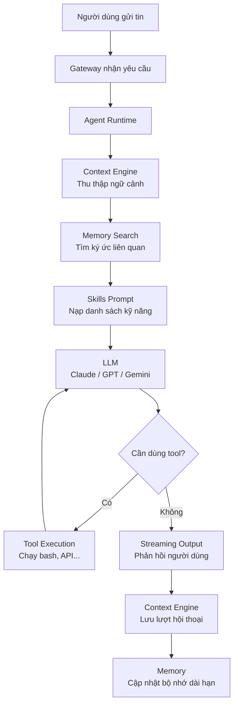
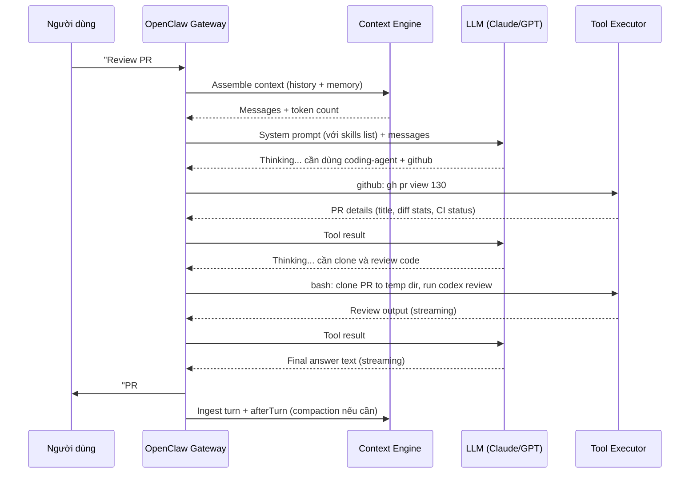

# Agent & Skills — Trái Tim Thông Minh Của OpenClaw

> Tài liệu này giải thích cách OpenClaw tổ chức trí tuệ nhân tạo thành các "tác nhân" (agent) và "kỹ năng" (skill), dành cho người chưa quen với AI.

---

## 1. Agent là gì? (ví dụ thực tế)

Hãy tưởng tượng bạn thuê một **trợ lý cá nhân thực sự**. Người này không chỉ trả lời câu hỏi — họ còn:

- Nhớ những gì bạn đã nói từ tuần trước
- Biết dùng phần mềm (GitHub, Slack, Notion) thay bạn
- Có thể nhờ thêm người khác hỗ trợ khi việc quá nhiều
- Làm việc chủ động vào lịch định sẵn

Đó chính là **Agent** trong OpenClaw. Mỗi agent là một thực thể AI có:

| Thuộc tính | Ý nghĩa |
|---|---|
| **ID riêng** | Mỗi agent có tên/ID định danh, ví dụ `default`, `work`, `personal` |
| **Workspace riêng** | Thư mục làm việc độc lập, agent chỉ thấy files trong vùng của mình |
| **Model riêng** | Có thể dùng Claude, GPT-4, Gemini... tùy cấu hình |
| **Skills riêng** | Mỗi agent chỉ được cấp những kỹ năng cần thiết |
| **Memory riêng** | Lịch sử hội thoại và bộ nhớ dài hạn lưu tách biệt |
| **Subagents** | Có thể sinh ra các agent con để làm việc song song |

Trong code, cấu trúc này được định nghĩa tại `src/agents/agent-scope.ts`:

```typescript
type ResolvedAgentConfig = {
  name?: string;
  workspace?: string;
  agentDir?: string;
  model?: AgentEntry["model"];
  skills?: AgentEntry["skills"];
  memorySearch?: AgentEntry["memorySearch"];
  identity?: AgentEntry["identity"];
  subagents?: AgentEntry["subagents"];
  sandbox?: AgentEntry["sandbox"];
};
```

---

## 2. Kiến trúc Agent

Khi bạn gửi một tin nhắn, OpenClaw xử lý qua pipeline sau:



**Giải thích từng bước:**

1. **Gateway** — cổng vào từ Telegram, Discord, Slack, iMessage...
2. **Agent Runtime** — điều phối toàn bộ vòng đời một lượt chat
3. **Context Engine** — tập hợp lịch sử hội thoại, cắt gọn nếu quá dài
4. **Memory Search** — tra cứu embedding vector để tìm thông tin cũ có liên quan
5. **Skills Prompt** — danh sách kỹ năng được inject vào system prompt
6. **LLM** — mô hình AI thực sự suy nghĩ và quyết định
7. **Tool Execution** — chạy lệnh thực tế (bash, API call, file I/O...)
8. **Streaming Output** — trả kết quả realtime về người dùng

---

## 3. Context Engine — Bộ Não Quản Lý Ký Ức Ngắn Hạn

Context Engine là hệ thống quản lý "bộ nhớ làm việc" của agent trong một phiên hội thoại. Nó giải quyết bài toán: **LLM có giới hạn token đầu vào, làm sao nhớ được cả cuộc trò chuyện dài?**

### Interface chính (từ `src/context-engine/types.ts`):

```typescript
interface ContextEngine {
  // Khởi tạo engine cho một phiên mới
  bootstrap(params: { sessionId: string; sessionFile: string }): Promise<BootstrapResult>;

  // Nạp một tin nhắn mới vào store
  ingest(params: { sessionId: string; message: AgentMessage }): Promise<IngestResult>;

  // Tập hợp context phù hợp trong giới hạn token
  assemble(params: { sessionId: string; messages: AgentMessage[]; tokenBudget?: number }): Promise<AssembleResult>;

  // Nén lịch sử khi quá dài
  compact(params: { sessionId: string; tokenBudget?: number; force?: boolean }): Promise<CompactResult>;

  // Chuẩn bị khi sinh subagent
  prepareSubagentSpawn(params: { parentSessionKey: string; childSessionKey: string }): Promise<...>;
}
```

### Compaction — Cơ Chế Nén Lịch Sử

Khi hội thoại quá dài (vượt token budget), hệ thống tự động **tóm tắt các tin nhắn cũ** thay vì xóa chúng (file `src/agents/compaction.ts`):

- Tỷ lệ nén mặc định: **40%** (BASE_CHUNK_RATIO = 0.4)
- Ngưỡng tối thiểu: **15%** (MIN_CHUNK_RATIO = 0.15)
- Buffer an toàn: **20%** (SAFETY_MARGIN = 1.2) cho sai số ước lượng token

**Ưu tiên bảo tồn khi nén:**
- Tác vụ đang chạy và trạng thái hiện tại
- Tiến độ batch (ví dụ: "đã làm 5/17 items")
- Yêu cầu cuối cùng của người dùng
- Quyết định đã đưa ra và lý do
- UUID, hash, ID, token — không được rút gọn

---

## 4. Danh Sách 52 Skills — Phân Loại Đầy Đủ

Skills là **hướng dẫn sử dụng công cụ** được inject vào system prompt của agent. Mỗi skill là một file `SKILL.md` mô tả khi nào dùng, cách dùng, và ví dụ lệnh cụ thể.

### Nhóm Năng Suất Cá Nhân (Productivity)

| Skill | Emoji | Mô tả ngắn | Yêu cầu |
|---|---|---|---|
| `apple-notes` | 📝 | Quản lý Apple Notes qua CLI `memo` | macOS + `memo` |
| `apple-reminders` | ⏰ | Quản lý Apple Reminders | macOS |
| `bear-notes` | 🐻 | Ghi chú Bear app trên macOS | macOS + Bear |
| `notion` | 📝 | Tạo/đọc/sửa pages và databases Notion | `NOTION_API_KEY` |
| `obsidian` | 🔮 | Tích hợp với Obsidian vault | Obsidian |
| `things-mac` | ✅ | Quản lý task Things 3 trên Mac | macOS + Things |
| `trello` | 📋 | Quản lý boards và cards Trello | Trello API |
| `oracle` | 🔮 | Tra cứu thông tin nội bộ | cấu hình riêng |
| `summarize` | 🧾 | Tóm tắt URL, podcast, YouTube | `summarize` CLI |
| `blogwatcher` | 👁️ | Theo dõi RSS/blog mới | cấu hình |
| `session-logs` | 📜 | Xem log các phiên hội thoại | built-in |
| `model-usage` | 📊 | Xem thống kê dùng model AI | built-in |
| `healthcheck` | 💚 | Kiểm tra trạng thái hệ thống | built-in |

### Nhóm Giao Tiếp (Communication)

| Skill | Emoji | Mô tả ngắn | Yêu cầu |
|---|---|---|---|
| `slack` | 💬 | Gửi tin, react, pin/unpin trên Slack | Slack bot token |
| `discord` | 🎮 | Tương tác Discord channels | Discord token |
| `imsg` | 💬 | Gửi iMessage (macOS) | macOS |
| `bluebubbles` | 💙 | iMessage qua BlueBubbles server | BlueBubbles |
| `wacli` | 📱 | WhatsApp CLI | `wacli` CLI |
| `himalaya` | 📧 | Email client terminal (IMAP/SMTP) | Himalaya |
| `voice-call` | 📞 | Thực hiện cuộc gọi giọng nói | cấu hình |

### Nhóm Phát Triển Phần Mềm (Development)

| Skill | Emoji | Mô tả ngắn | Yêu cầu |
|---|---|---|---|
| `coding-agent` | 🧩 | Ủy quyền task code cho Codex/Claude Code/Pi | `claude`/`codex`/`pi` |
| `github` | 🐙 | GitHub operations: PR, issues, CI | `gh` CLI |
| `gh-issues` | 🐛 | Quản lý GitHub Issues chuyên sâu | `gh` CLI |
| `tmux` | 🖥️ | Quản lý terminal sessions tmux | `tmux` |
| `skill-creator` | 🛠️ | Tạo skill mới cho OpenClaw | built-in |
| `sag` | 🤖 | Sub-agent generic | built-in |
| `mcporter` | 🔌 | Quản lý MCP servers | built-in |
| `clawhub` | 🦞 | ClawHub marketplace skills | ClawHub |
| `xurl` | 🌐 | HTTP requests nâng cao | built-in |

### Nhóm Đa Phương Tiện (Media)

| Skill | Emoji | Mô tả ngắn | Yêu cầu |
|---|---|---|---|
| `canvas` | 🎨 | Hiển thị HTML trên Mac/iOS/Android | OpenClaw node |
| `openai-image-gen` | 🖼️ | Tạo ảnh qua DALL-E | `OPENAI_API_KEY` |
| `openai-whisper` | 🎙️ | Chuyển giọng nói thành văn bản (local) | Whisper |
| `openai-whisper-api` | 🎙️ | Whisper qua API | `OPENAI_API_KEY` |
| `sherpa-onnx-tts` | 🔊 | Text-to-speech local (ONNX) | Sherpa |
| `camsnap` | 📸 | Chụp ảnh từ webcam | built-in |
| `peekaboo` | 👀 | Xem màn hình/camera Mac | macOS |
| `gifgrep` | 🎞️ | Tìm kiếm GIF | built-in |
| `video-frames` | 🎬 | Trích xuất frames từ video | ffmpeg |
| `nano-pdf` | 📄 | Đọc và xử lý PDF | built-in |
| `songsee` | 🎵 | Nhận diện bài hát | built-in |
| `nano-banana-pro` | 🍌 | Media processing tools | built-in |

### Nhóm Hệ Thống & Tích Hợp (System & Integration)

| Skill | Emoji | Mô tả ngắn | Yêu cầu |
|---|---|---|---|
| `1password` | 🔑 | Quản lý mật khẩu 1Password | `op` CLI |
| `gemini` | ✨ | Gọi Gemini API trực tiếp | `GEMINI_API_KEY` |
| `weather` | 🌤️ | Xem thời tiết | built-in |
| `goplaces` | 📍 | Tìm kiếm địa điểm | built-in |
| `openhue` | 💡 | Điều khiển đèn Philips Hue | Hue bridge |
| `spotify-player` | 🎧 | Điều khiển Spotify | Spotify CLI |
| `sonoscli` | 🔈 | Điều khiển loa Sonos | `sonos-cli` |
| `gog` | 🎮 | GOG game library | built-in |
| `eightctl` | 8️⃣ | Eight Sleep mattress control | `eightctl` CLI |
| `ordercli` | 🛒 | Đặt hàng qua CLI | `ordercli` |
| `blucli` | 🔵 | Bluetooth CLI | `blucli` |

---

## 5. Phân Tích Chi Tiết 5 Skills Phổ Biến

### 5.1 coding-agent — Ủy Quyền Lập Trình

**Khi nào dùng:** Khi cần build tính năng mới, review PR, refactor codebase lớn, fix nhiều bugs song song.

**Khi không dùng:** Sửa 1 dòng đơn giản, đọc code, làm việc trong thư mục `~/clawd` (workspace của chính OpenClaw).

**Cách hoạt động:**

```
Người dùng: "Build REST API cho todos"
    ↓
coding-agent skill được kích hoạt
    ↓
OpenClaw chạy: bash pty:true workdir:~/project background:true
               command:"codex --yolo 'Build a REST API for todos.
               When done: openclaw system event --text "Done" --mode now'"
    ↓
Codex/Claude Code chạy ngầm, có thể mất 5-30 phút
    ↓
Khi xong, gửi event wake-up ngay lập tức
    ↓
OpenClaw báo kết quả về người dùng
```

**Các agent hỗ trợ:**
- **Codex** (OpenAI): cần `pty:true`, chạy trong git repo
- **Claude Code**: dùng `--print --permission-mode bypassPermissions`, không cần PTY
- **Pi**: cần `pty:true`, hỗ trợ Anthropic prompt caching
- **OpenCode**: cần `pty:true`

**Tính năng nổi bật:** Parallel review — chạy nhiều Codex song song cho nhiều PRs cùng lúc, mỗi PR trong một git worktree riêng.

---

### 5.2 github — Tương Tác GitHub

**Khi nào dùng:** Kiểm tra PR status, CI runs, tạo/đóng issues, merge PR, query GitHub API.

**Cách hoạt động:** Wrap `gh` CLI với các pattern phổ biến:

```bash
# Kiểm tra PR có sẵn để merge chưa
gh pr list --json number,title,mergeable \
  --jq '.[] | select(.mergeable == "MERGEABLE")'

# Xem CI failed steps
gh run view <run-id> --log-failed

# Tóm tắt PR để review
gh pr view 55 --json title,body,author,additions,deletions,changedFiles
```

**Điểm mạnh:** Hỗ trợ `--json --jq` để lọc dữ liệu có cấu trúc, dễ tích hợp với các skills khác.

---

### 5.3 canvas — Hiển Thị Visual Trên Thiết Bị

**Khi nào dùng:** Khi cần hiển thị game, dashboard, visualization, demo tương tác trên màn hình Mac/iPhone/Android.

**Kiến trúc kỹ thuật:**

```
Canvas Host (HTTP :18793) → Node Bridge (TCP :18790) → Node App (Mac/iOS/Android)
```

**Luồng hoạt động:**
1. AI tạo file HTML đặt vào `~/clawd/canvas/`
2. Live Reload tự động phát hiện thay đổi (chokidar)
3. AI gọi `canvas action:present node:<id> target:<url>`
4. Node Bridge truyền URL đến thiết bị
5. Thiết bị render trong WebView

**Hỗ trợ Tailscale:** Khi thiết lập đúng, có thể hiển thị content trên iPhone từ xa qua mạng Tailscale.

---

### 5.4 notion — Quản Lý Tài Liệu Notion

**Khi nào dùng:** Tạo trang mới, tìm kiếm notes, cập nhật database, thêm blocks vào tài liệu hiện có.

**Yêu cầu:** `NOTION_API_KEY` (lấy từ https://notion.so/my-integrations)

**Điểm chú ý quan trọng (API v2025-09-03):**
- Databases đổi tên thành "data sources" trong API mới
- Mỗi database có 2 ID khác nhau: `database_id` (dùng khi tạo page) và `data_source_id` (dùng khi query)
- Endpoint query: `POST /v1/data_sources/{id}/query`

**Ví dụ tạo page trong database:**
```json
{
  "parent": {"database_id": "xxx"},
  "properties": {
    "Name": {"title": [{"text": {"content": "Tên task"}}]},
    "Status": {"select": {"name": "Todo"}}
  }
}
```

---

### 5.5 apple-notes — Ghi Chú iOS/macOS

**Khi nào dùng:** Thêm ghi chú nhanh, tìm kiếm notes, quản lý folders trong Apple Notes.

**Yêu cầu:** macOS + tool `memo` (cài qua Homebrew), cần cấp quyền Automation cho Notes.app.

**Các thao tác cơ bản:**
```bash
memo notes                    # Xem tất cả notes
memo notes -f "Work"          # Lọc theo folder
memo notes -s "meeting"       # Tìm kiếm fuzzy
memo notes -a "Tiêu đề"       # Tạo note mới
memo notes -ex                # Export sang HTML/Markdown
```

**Hạn chế:** Không edit được notes có hình ảnh hoặc attachments.

---

## 6. Cách Skills Được Load và Execute

Vòng đời của một skill trong OpenClaw:

```mermaid
flowchart LR
    A[SKILL.md files\ntrên disk] --> B[loadWorkspaceSkillEntries\nĐọc và parse frontmatter]
    B --> C[filterSkillEntries\nLọc theo OS, bins, env]
    C --> D[buildWorkspaceSkillsPrompt\nTạo system prompt text]
    D --> E[resolveSkillsPromptForRun\nInject vào agent run]
    E --> F[LLM nhận danh sách skills\ntrong system prompt]
    F --> G[LLM quyết định\ndùng skill nào]
    G --> H[Tool execution\nChạy lệnh thực tế]
```



### Bước 1: Discover

Skills được tìm trong nhiều nguồn (file `src/agents/skills/workspace.ts`):
- `~/.openclaw/skills/` — skills cá nhân
- `~/.bun/install/.../openclaw/skills/` — skills bundled theo package
- Plugin directories — skills từ plugin
- Giới hạn: tối đa 150 skills trong prompt, 30,000 ký tự, 256KB mỗi file

### Bước 2: Filter

Mỗi skill được kiểm tra điều kiện kích hoạt:
- `requires.bins` — binary phải có trong PATH
- `requires.env` — biến môi trường phải được set
- `requires.config` — cấu hình phải tồn tại
- `os` — chỉ macOS (`darwin`) hoặc Linux...
- Agent-level filter: agent chỉ được cấp subset skills nhất định

### Bước 3: Serialize thành Prompt

Mỗi skill được format ngắn gọn để tiết kiệm token:
- Tên skill + description
- Đường dẫn file (dùng `~/` thay full path → tiết kiệm 5-6 token/skill × 52 = ~300 token)
- LLM đọc SKILL.md đầy đủ bằng `read` tool khi cần chi tiết

### Bước 4: Execute

Khi LLM quyết định dùng skill, nó gọi tool tương ứng (bash, API, canvas...) với tham số cụ thể. Kết quả trả về tiếp tục vào context cho lượt suy nghĩ tiếp theo.

---

## 7. Tool Calling Flow

Đây là luồng chi tiết từ lúc người dùng hỏi đến khi nhận kết quả:



**Điểm quan trọng:**
- Mỗi tool call là một vòng lặp riêng — LLM có thể gọi nhiều tools liên tiếp
- Tool results được đưa trở lại LLM để suy nghĩ tiếp
- Streaming output: người dùng thấy text xuất hiện dần theo thời gian thực
- Sau khi hoàn thành, Context Engine lưu toàn bộ lượt vào store

---

## 8. Memory System — Bộ Nhớ Hai Tầng

OpenClaw có hai loại bộ nhớ hoạt động song song:

### Tầng 1: Short-Term Memory (Context Engine)

- **Phạm vi:** Một phiên hội thoại (`sessionId`)
- **Lưu ở:** File JSON trên disk (`~/.openclaw/sessions/`)
- **Giới hạn:** Token budget của model (thường 100K-200K tokens)
- **Xử lý khi đầy:** Compaction — tóm tắt tin nhắn cũ, giữ lại tin gần đây

### Tầng 2: Long-Term Memory (Memory Search)

Đây là hệ thống phức tạp hơn, dùng **vector embeddings** để tìm kiếm ngữ nghĩa (file `src/memory/`):

```
Tin nhắn/file mới
    ↓
Chunking (chia thành đoạn nhỏ, default: overlap giữa các đoạn)
    ↓
Embedding model (OpenAI / Gemini / local ONNX / Voyage...)
    ↓
Vector store (SQLite + sqlite-vec extension)
    ↓
Khi search: query → embedding → cosine similarity → top-K results
```

**Các nguồn memory được index:**
- `memory` — files trong thư mục memory (notes, docs)
- `sessions` — lịch sử các phiên hội thoại cũ

**Cấu hình providers embedding (`src/agents/memory-search.ts`):**

| Provider | Ưu điểm | Nhược điểm |
|---|---|---|
| `openai` | Chất lượng cao | Cần API key, tốn tiền |
| `gemini` | Miễn phí quota cao | Cần Google API |
| `voyage` | Tối ưu cho code | Cần Voyage API |
| `local` | Hoàn toàn offline | Cần download model |
| `ollama` | Local, nhiều model | Cần Ollama server |
| `auto` | Tự chọn tốt nhất | Mặc định |

**Sync strategy:**
- `onSessionStart` — index lại khi bắt đầu phiên mới
- `onSearch` — index trước khi tìm kiếm
- `watch` — theo dõi thay đổi file real-time (debounce)
- `intervalMinutes` — sync định kỳ

### MMR — Maximal Marginal Relevance

File `src/memory/mmr.ts` cho thấy OpenClaw dùng thuật toán **MMR** khi trả kết quả tìm kiếm — tức là không chỉ lấy những kết quả có score cao nhất, mà còn đảm bảo **đa dạng** để tránh trả về 5 kết quả na ná nhau.

---

## 9. Ví Dụ Usecase Thực Tế

### Tình huống: "Review code của tôi và tạo PR"

**Input người dùng** (qua Telegram/Slack/Discord):
> "Tôi vừa push branch `feat/auth-jwt` — review giúp tôi và tạo PR nhé"

**Bước 1: Memory Search**
OpenClaw tìm kiếm bộ nhớ dài hạn: "auth, jwt, PR convention" — tìm thấy ghi chú về coding standards từ tháng trước.

**Bước 2: LLM quyết định plan**
```
Cần dùng: github (lấy diff) + coding-agent (review code) + github (tạo PR)
```

**Bước 3: github skill kích hoạt**
```bash
gh pr diff origin/main...feat/auth-jwt  # Lấy diff
gh run list --branch feat/auth-jwt       # Kiểm tra CI
```
Kết quả: 340 lines thay đổi, CI đang pass.

**Bước 4: coding-agent skill kích hoạt**
```bash
# Clone branch vào temp dir
git worktree add /tmp/review-auth feat/auth-jwt
# Chạy Codex review
bash pty:true workdir:/tmp/review-auth command:"codex exec 'Review JWT auth implementation...'"
```
Codex chạy ngầm ~3 phút, báo cáo:
- LGTM về logic JWT
- Gợi ý thêm rate limiting
- 2 potential security issues nhỏ

**Bước 5: github skill tạo PR**
```bash
gh pr create \
  --title "feat: JWT authentication" \
  --body "## Summary\n- Implement JWT auth\n...\n## Review notes:\n- Consider rate limiting" \
  --base main \
  --head feat/auth-jwt
```

**Output về người dùng:**
> PR #47 đã được tạo: https://github.com/you/repo/pull/47
>
> Codex review: Code nhìn chung tốt. Có 2 gợi ý:
> 1. Thêm rate limiting cho login endpoint
> 2. JWT secret nên rotate định kỳ
>
> CI: Đang pass (3/3 checks)

**Tổng thời gian:** ~4 phút (phần lớn là coding-agent review)

---

## Tóm Tắt

OpenClaw xây dựng hệ thống agent-skills với triết lý **modular và composable**:

- **Agent** = thực thể AI độc lập với workspace, model, memory riêng
- **Context Engine** = quản lý ký ức ngắn hạn với compaction thông minh
- **Memory System** = vector search cho ký ức dài hạn qua nhiều phiên
- **Skills** = 52 "hướng dẫn sử dụng công cụ" được inject vào prompt — mỗi skill một file Markdown đơn giản
- **Tool Calling** = vòng lặp LLM → tool → LLM cho đến khi có câu trả lời

Điểm mạnh của thiết kế: **bất kỳ ai cũng có thể viết skill mới** chỉ bằng cách tạo file `SKILL.md` — không cần code. Đây là lý do tại sao OpenClaw có thể tích hợp với 52+ dịch vụ mà không phải viết plugin phức tạp.
