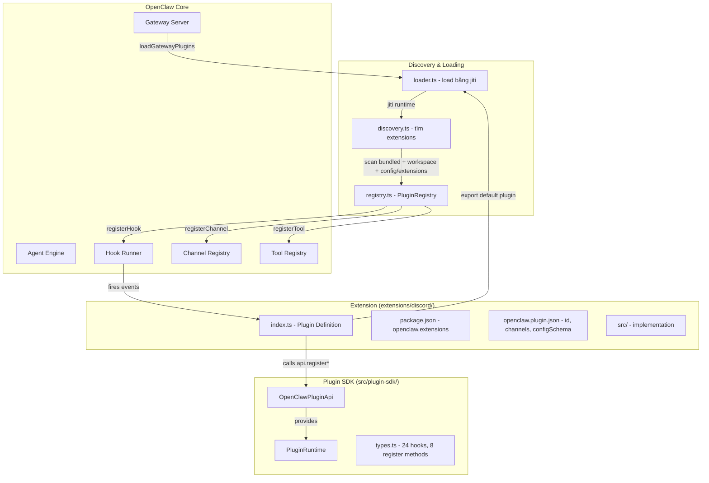
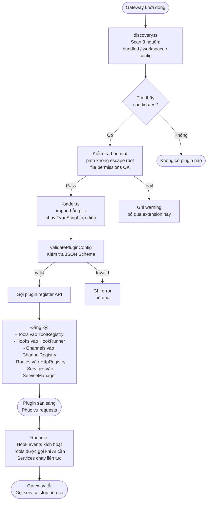

# Plugin SDK — Cách Mở Rộng OpenClaw

> Tài liệu này giải thích cách hệ thống plugin của OpenClaw hoạt động, danh sách 38+ extensions có sẵn, và hướng dẫn tạo extension của riêng bạn từ đầu.

---

## 1. Plugin là gì?

Hãy tưởng tượng OpenClaw như một **chiếc điện thoại thông minh**. Bản thân điện thoại đã làm được nghe gọi, nhắn tin cơ bản — nhưng sức mạnh thực sự đến từ **App Store**: bạn cài thêm ứng dụng để có thêm tính năng.

Plugin (hay extension) trong OpenClaw hoạt động đúng theo cơ chế đó:

- **Core** = điện thoại (gateway, agent engine, session management)
- **Extension** = ứng dụng (Telegram bot, Discord bot, bộ nhớ dài hạn, voice synthesis,...)
- **Plugin SDK** = bộ công cụ để lập trình viên xây dựng ứng dụng đó

Một extension có thể làm được:

| Khả năng | Ví dụ thực tế |
|---|---|
| Thêm kênh giao tiếp | Kết nối Telegram, Discord, WhatsApp |
| Thêm tool cho AI | AI có thêm công cụ `memory_recall`, `diff_view` |
| Thêm lệnh slash | `/tts`, `/voice`, `/memory list` |
| Thêm HTTP route | Webhook receiver tại `/plugins/my-plugin/webhook` |
| Thêm service nền | Background job chạy liên tục |
| Theo dõi lifecycle | Hook vào `before_tool_call`, `session_end`, v.v. |
| Thêm provider AI | Đăng ký OpenAI, Qwen, Gemini, Minimax |
| Xử lý context engine | Tùy chỉnh cách xây dựng system prompt |

---

## 2. Danh sách 38 Extensions Có Sẵn

### Channel Extensions — Kênh giao tiếp

| Extension | Mô tả |
|---|---|
| `bluebubbles` | iMessage qua BlueBubbles server (macOS) |
| `discord` | Discord bot (slash commands, threads, subagents) |
| `feishu` | Feishu/Lark messenger (thị trường Trung Quốc) |
| `googlechat` | Google Chat spaces và direct messages |
| `imessage` | iMessage trực tiếp (macOS native) |
| `irc` | IRC chat protocol |
| `line` | LINE messenger (phổ biến ở Nhật, Thái Lan, Đài Loan) |
| `matrix` | Matrix protocol (Element, Beeper) |
| `mattermost` | Mattermost self-hosted team chat |
| `msteams` | Microsoft Teams |
| `nextcloud-talk` | Nextcloud Talk |
| `nostr` | Nostr decentralized social protocol |
| `signal` | Signal messenger |
| `slack` | Slack workspace bot |
| `synology-chat` | Synology Chat (NAS tích hợp) |
| `telegram` | Telegram bot API |
| `tlon` | Tlon/Urbit messaging |
| `twitch` | Twitch live chat |
| `whatsapp` | WhatsApp Business API |
| `zalo` | Zalo (Việt Nam) |
| `zalouser` | Zalo User (đăng nhập cá nhân, không phải OA) |
| `lobster` | Lobster (custom/private channel) |

### AI Extensions — Tích hợp AI

| Extension | Mô tả |
|---|---|
| `acpx` | ACP runtime backend (Agent Communication Protocol) |
| `llm-task` | Generic JSON-only LLM tool cho structured tasks |
| `copilot-proxy` | GitHub Copilot proxy adapter |
| `google-gemini-cli-auth` | Authentication cho Google Gemini CLI |
| `minimax-portal-auth` | Minimax AI portal authentication |
| `qwen-portal-auth` | Qwen (Alibaba AI) portal authentication |

### Memory Extensions — Bộ nhớ

| Extension | Mô tả |
|---|---|
| `memory-core` | Bộ nhớ dựa trên file, tools `memory_search` + `memory_get` |
| `memory-lancedb` | Bộ nhớ vector (LanceDB) + OpenAI embeddings, auto-recall/capture |

### Productivity Extensions — Năng suất

| Extension | Mô tả |
|---|---|
| `diffs` | Diff viewer và PNG/PDF renderer cho agents |
| `open-prose` | Hỗ trợ viết văn bản (skills-based, không có tool JS) |
| `talk-voice` | Voice synthesis qua ElevenLabs API |
| `voice-call` | Voice call provider |
| `device-pair` | Kết nối thiết bị (phone pairing) |
| `phone-control` | Điều khiển điện thoại từ xa |

### System/Infra Extensions

| Extension | Mô tả |
|---|---|
| `diagnostics-otel` | Export diagnostics events đến OpenTelemetry |
| `thread-ownership` | Quản lý quyền sở hữu thread Slack (multi-agent) |

---

## 3. Kiến trúc Plugin SDK



**Ba loại nguồn plugin** mà discovery.ts scan:
- `bundled` — nằm trong cài đặt OpenClaw, tự động load
- `workspace` — nằm trong `~/.openclaw/extensions/` hoặc workspace dir
- `config` — khai báo trong file config của người dùng

---

## 4. Cấu trúc Một Extension

Mỗi extension là một **Node.js package** có cấu trúc như sau:

```
extensions/my-plugin/
├── index.ts                  # Entry point — bắt buộc
├── package.json              # npm metadata + openclaw.extensions field
├── openclaw.plugin.json      # Plugin manifest (id, kind, configSchema)
└── src/
    ├── channel.ts            # (nếu là channel extension)
    ├── tool.ts               # (nếu đăng ký tool)
    └── service.ts            # (nếu có background service)
```

### package.json — trường quan trọng nhất

```json
{
  "name": "@openclaw/my-plugin",
  "version": "2026.3.11",
  "description": "Mô tả plugin",
  "type": "module",
  "openclaw": {
    "extensions": [
      "./index.ts"
    ]
  }
}
```

Trường `openclaw.extensions` chỉ ra file entry point. Loader sẽ dùng `jiti` để import TypeScript trực tiếp không cần compile.

### openclaw.plugin.json — manifest khai báo

```json
{
  "id": "my-plugin",
  "kind": "memory",
  "configSchema": {
    "type": "object",
    "additionalProperties": false,
    "properties": {
      "apiKey": { "type": "string" },
      "maxResults": { "type": "number" }
    }
  }
}
```

Trường `kind` có 2 giá trị: `"memory"` hoặc `"context-engine"` (chỉ khai báo khi cần).

### index.ts — định nghĩa plugin

Có hai cách viết entry point:

**Cách 1: Object plugin (khuyến nghị)**

```typescript
import type { OpenClawPluginApi } from "openclaw/plugin-sdk/my-plugin";
import { emptyPluginConfigSchema } from "openclaw/plugin-sdk/my-plugin";

const plugin = {
  id: "my-plugin",
  name: "My Plugin",
  description: "Mô tả plugin",
  configSchema: emptyPluginConfigSchema(),
  register(api: OpenClawPluginApi) {
    // Đăng ký các thành phần ở đây
  },
};

export default plugin;
```

**Cách 2: Function export (đơn giản hơn)**

```typescript
import type { OpenClawPluginApi } from "openclaw/plugin-sdk/my-plugin";

export default function register(api: OpenClawPluginApi) {
  // Đăng ký các thành phần ở đây
}
```

---

## 5. Extension API — Các Hook và Register Method

### 8 Phương thức đăng ký (api.register*)

| Phương thức | Mục đích | Ví dụ dùng |
|---|---|---|
| `api.registerTool(tool, opts?)` | Thêm tool cho AI agent | memory_recall, diff_view |
| `api.registerChannel(plugin)` | Đăng ký kênh giao tiếp | Telegram, Discord |
| `api.registerHook(events, handler, opts?)` | Hook vào internal events | Log mọi lệnh gọi |
| `api.registerHttpRoute(params)` | Thêm HTTP endpoint | Webhook receiver |
| `api.registerService(service)` | Background service | OpenTelemetry exporter |
| `api.registerCommand(command)` | Lệnh slash tùy chỉnh | `/voice status`, `/tts` |
| `api.registerCli(registrar, opts?)` | Thêm CLI subcommand | `openclaw memory list` |
| `api.registerProvider(provider)` | Đăng ký AI provider | Gemini, Qwen, Minimax |
| `api.registerContextEngine(id, factory)` | Tùy chỉnh context engine | RAG pipeline riêng |

### 24 Plugin Lifecycle Hooks (api.on)

Hook cho phép plugin **phản ứng** với sự kiện trong vòng đời agent. Một số hook có thể **trả về kết quả** để thay đổi hành vi.

#### Agent Lifecycle Hooks

| Hook | Trigger khi | Có thể thay đổi |
|---|---|---|
| `before_model_resolve` | Trước khi chọn LLM model | `modelOverride`, `providerOverride` |
| `before_prompt_build` | Trước khi build system prompt | `systemPrompt`, `prependContext`, `appendSystemContext` |
| `before_agent_start` | Trước khi agent bắt đầu | model + prompt cùng lúc (legacy) |
| `llm_input` | Gửi request đến LLM | chỉ observe |
| `llm_output` | Nhận response từ LLM | chỉ observe |
| `agent_end` | Agent kết thúc một lượt | chỉ observe |

#### Session Hooks

| Hook | Trigger khi | Có thể thay đổi |
|---|---|---|
| `session_start` | Session bắt đầu | không |
| `session_end` | Session kết thúc | không |
| `before_compaction` | Trước khi compact session | không |
| `after_compaction` | Sau khi compact session | không |
| `before_reset` | Khi /new hoặc /reset | không |

#### Message Hooks

| Hook | Trigger khi | Có thể thay đổi |
|---|---|---|
| `message_received` | Nhận tin nhắn từ user | không |
| `message_sending` | Trước khi gửi reply | `content`, `cancel: true` |
| `message_sent` | Sau khi gửi reply | không |

#### Tool Hooks

| Hook | Trigger khi | Có thể thay đổi |
|---|---|---|
| `before_tool_call` | Trước khi AI gọi tool | `params`, `block: true` |
| `after_tool_call` | Sau khi tool chạy xong | không |
| `tool_result_persist` | Trước khi lưu kết quả tool | `message` |
| `before_message_write` | Trước khi ghi vào JSONL | `block: true`, `message` |

#### Subagent Hooks

| Hook | Trigger khi | Có thể thay đổi |
|---|---|---|
| `subagent_spawning` | Trước khi tạo subagent | `status: "error"` để chặn |
| `subagent_delivery_target` | Chọn nơi gửi kết quả | `origin` |
| `subagent_spawned` | Sau khi tạo subagent thành công | không |
| `subagent_ended` | Subagent kết thúc | không |

#### Gateway Hooks

| Hook | Trigger khi | Có thể thay đổi |
|---|---|---|
| `gateway_start` | Gateway server khởi động | không |
| `gateway_stop` | Gateway server tắt | không |

---

## 6. Hướng Dẫn Tạo Extension Từ Đầu

Ví dụ: tạo extension `auto-reply-vn` — tự động phát hiện câu hỏi tiếng Việt và thêm context vào prompt.

### Bước 1: Tạo thư mục

```
extensions/auto-reply-vn/
├── index.ts
├── package.json
└── openclaw.plugin.json
```

### Bước 2: Viết package.json

```json
{
  "name": "@openclaw/auto-reply-vn",
  "version": "1.0.0",
  "description": "Tự động thêm context tiếng Việt vào system prompt",
  "type": "module",
  "openclaw": {
    "extensions": [
      "./index.ts"
    ]
  }
}
```

### Bước 3: Viết openclaw.plugin.json

```json
{
  "id": "auto-reply-vn",
  "configSchema": {
    "type": "object",
    "additionalProperties": false,
    "properties": {
      "enabled": { "type": "boolean" },
      "contextNote": {
        "type": "string",
        "description": "Ghi chú context thêm vào prompt"
      }
    }
  }
}
```

### Bước 4: Viết index.ts

```typescript
import type { OpenClawPluginApi } from "openclaw/plugin-sdk";

// Hàm kiểm tra tin nhắn có tiếng Việt không
function hasVietnamese(text: string): boolean {
  const vnPattern = /[àáạảãâầấậẩẫăằắặẳẵèéẹẻẽêềếệểễ]/i;
  return vnPattern.test(text);
}

const plugin = {
  id: "auto-reply-vn",
  name: "Auto Reply Vietnamese",
  description: "Tự động nhận diện và hỗ trợ tiếng Việt",

  register(api: OpenClawPluginApi) {
    const cfg = (api.pluginConfig ?? {}) as {
      enabled?: boolean;
      contextNote?: string;
    };

    // Không làm gì nếu plugin bị tắt
    if (cfg.enabled === false) {
      return;
    }

    const extraNote = cfg.contextNote ?? "Người dùng nói tiếng Việt. Trả lời bằng tiếng Việt.";

    // Hook: trước khi build prompt, thêm context nếu cần
    api.on("before_prompt_build", (event) => {
      const isVietnamese = hasVietnamese(event.prompt);

      if (isVietnamese) {
        api.logger.info?.("auto-reply-vn: Phát hiện tiếng Việt, thêm context");
        return {
          prependSystemContext: extraNote,
        };
      }
    });

    // Hook: log khi nhận tin nhắn
    api.on("message_received", (event, ctx) => {
      if (hasVietnamese(event.content)) {
        api.logger.info?.(
          `auto-reply-vn: Nhận tin tiếng Việt từ ${event.from} qua ${ctx.channelId}`
        );
      }
    });

    api.logger.info("auto-reply-vn: Plugin đã đăng ký thành công");
  },
};

export default plugin;
```

### Bước 5: Khai báo trong config OpenClaw

Thêm vào file config của OpenClaw (thường là `~/.openclaw/config.yaml` hoặc tương đương):

```yaml
plugins:
  - path: ./extensions/auto-reply-vn
    config:
      enabled: true
      contextNote: "Trả lời bằng tiếng Việt thân thiện."
```

### Bước 6: Khởi động lại gateway

```bash
openclaw gateway restart
```

---

## 7. Extension Loading Lifecycle



**Lưu ý quan trọng về bảo mật:**
- Discovery kiểm tra file permissions (không cho phép world-writable)
- Plugin không được phép escape ra ngoài root directory
- Trên Linux/macOS: kiểm tra UID ownership

---

## 8. Phân Tích Chi Tiết 3 Extensions

### 8.1. memory-core — Bộ nhớ dựa trên File

**File:** `extensions/memory-core/index.ts`

Extension đơn giản nhất trong nhóm memory. Toàn bộ logic nằm trong `api.runtime.tools` (được cung cấp bởi core).

```typescript
register(api: OpenClawPluginApi) {
  // Đăng ký 2 tool: tìm kiếm và đọc memory
  api.registerTool(
    (ctx) => {
      const memorySearchTool = api.runtime.tools.createMemorySearchTool({
        config: ctx.config,
        agentSessionKey: ctx.sessionKey,  // <-- mỗi agent có bộ nhớ riêng
      });
      return [memorySearchTool, memoryGetTool];
    },
    { names: ["memory_search", "memory_get"] },
  );

  // Đăng ký CLI subcommand: `openclaw memory list`
  api.registerCli(
    ({ program }) => {
      api.runtime.tools.registerMemoryCli(program);
    },
    { commands: ["memory"] },
  );
}
```

**Điểm đáng chú ý:**
- Tool factory nhận `ctx` (context theo session) — mỗi agent session có bộ nhớ riêng biệt
- Trả về `null` nếu tool không khả dụng (graceful degradation)
- CLI tích hợp sẵn, chạy `openclaw memory` để quản lý

---

### 8.2. memory-lancedb — Bộ Nhớ Vector với Auto-Recall

**File:** `extensions/memory-lancedb/index.ts`

Extension phức tạp nhất trong dự án, sử dụng LanceDB + OpenAI embeddings để lưu và tìm kiếm memories bằng vector similarity.

**Các tools đăng ký:**

| Tool | Chức năng |
|---|---|
| `memory_recall` | Tìm kiếm memories theo semantic similarity |
| `memory_store` | Lưu thông tin mới vào bộ nhớ dài hạn |
| `memory_forget` | Xóa memory theo ID hoặc query |

**Tính năng auto-recall qua hook `before_prompt_build`:**

```typescript
api.on("before_prompt_build", async (event) => {
  // Tự động tìm memories liên quan đến tin nhắn hiện tại
  const vector = await embeddings.embed(event.prompt);
  const results = await db.search(vector, 5, 0.1);

  if (results.length > 0) {
    // Inject memories vào system context
    return {
      prependSystemContext: formatRelevantMemoriesContext(results),
    };
  }
});
```

**Tính năng auto-capture qua hook `llm_output`:**

```typescript
api.on("llm_output", async (event) => {
  // Tự động phát hiện và lưu memories từ conversation
  for (const text of event.assistantTexts) {
    if (shouldCapture(text)) {
      const vector = await embeddings.embed(text);
      await db.insert({ text, vector, category: detectCategory(text) });
    }
  }
});
```

**Bảo mật prompt injection:**
Extension có hàm `looksLikePromptInjection()` kiểm tra memories trước khi inject vào context để ngăn tấn công qua nội dung lưu trữ.

---

### 8.3. discord — Channel Integration

**File:** `extensions/discord/index.ts`

Minh họa pattern tiêu chuẩn cho channel extension.

```typescript
register(api: OpenClawPluginApi) {
  // 1. Lưu runtime reference để các module khác dùng
  setDiscordRuntime(api.runtime);

  // 2. Đăng ký channel plugin (xử lý send/receive/monitor)
  api.registerChannel({ plugin: discordPlugin });

  // 3. Đăng ký hooks dành riêng cho subagent (Discord threads)
  registerDiscordSubagentHooks(api);
}
```

`registerDiscordSubagentHooks` dùng hook `subagent_spawning` để binding Discord thread vào subagent session — khi AI tạo subagent trong Discord thread, mọi reply từ subagent sẽ tự động đi vào đúng thread đó.

**So sánh 3 extensions:**

| | memory-core | memory-lancedb | discord |
|---|---|---|---|
| Số dòng code | ~40 | ~600 | ~20 |
| Hooks sử dụng | 0 | before_prompt_build, llm_output | subagent_spawning |
| Tools | memory_search, memory_get | memory_recall, memory_store, memory_forget | không |
| Services | không | không | không |
| CLI | memory | ltm | không |
| Dependencies | none | lancedb, openai | none |

---

## 9. Best Practices Khi Viết Extension

### 1. Dùng `api.logger` thay vì `console.log`

```typescript
// Không nên
console.log("Plugin loaded");

// Nên
api.logger.info("my-plugin: Plugin loaded");
api.logger.debug?.("my-plugin: debug message");  // debug có thể undefined
```

### 2. Graceful degradation trong tool factory

```typescript
api.registerTool((ctx) => {
  const apiKey = ctx.config?.myPlugin?.apiKey;
  if (!apiKey) {
    api.logger.warn("my-plugin: apiKey not configured, tool disabled");
    return null;  // Không crash, chỉ không đăng ký tool
  }
  return createMyTool(apiKey);
});
```

### 3. Hook fail-open cho network calls

```typescript
api.on("message_sending", async (event, ctx) => {
  try {
    const result = await checkSomething(event);
    if (result.shouldBlock) {
      return { cancel: true };
    }
  } catch (err) {
    // Network error — cho phép gửi vẫn, không chặn
    api.logger.warn?.(`my-plugin: check failed (${String(err)}), allowing send`);
  }
  // Không return gì = không can thiệp
});
```

### 4. Sử dụng `api.resolvePath` cho file paths

```typescript
// Không nên — path cứng
const dbPath = "/home/user/.myapp/data.db";

// Nên — resolve relative to agent workspace
const dbPath = api.resolvePath(cfg.dbPath ?? "data.db");
```

### 5. Validate config với schema

```typescript
import { z } from "zod";

const ConfigSchema = z.object({
  apiKey: z.string().min(1),
  maxResults: z.number().int().min(1).max(100).default(10),
});

register(api: OpenClawPluginApi) {
  const cfg = ConfigSchema.parse(api.pluginConfig ?? {});
  // cfg bây giờ đã được validate và có defaults
}
```

### 6. Cleanup khi service stop

```typescript
api.registerService({
  id: "my-service",
  async start(ctx) {
    this.interval = setInterval(() => doWork(), 60_000);
    ctx.logger.info("my-service: started");
  },
  async stop(ctx) {
    clearInterval(this.interval);
    ctx.logger.info("my-service: stopped");
  },
});
```

### 7. Đặt `pluginId` prefix trong log messages

Tất cả các extensions trong codebase đều dùng pattern `"plugin-id: message"` để log dễ filter hơn.

---

## 10. Ví Dụ Use Case: Xây Dựng Extension "Auto-Reply Tiếng Việt"

Mục tiêu: Extension tự động phát hiện tin nhắn tiếng Việt và trả lời đúng ngữ cảnh văn hóa.

### Yêu cầu

1. Nhận diện tin nhắn tiếng Việt dựa trên ký tự đặc trưng
2. Thêm system context "bạn là trợ lý AI thân thiện người Việt"
3. Log thống kê: bao nhiêu % tin nhắn là tiếng Việt
4. Slash command `/vi-status` để xem thống kê

### Cấu trúc thư mục

```
extensions/auto-reply-vn/
├── index.ts
├── package.json
└── openclaw.plugin.json
```

### package.json

```json
{
  "name": "@openclaw/auto-reply-vn",
  "version": "1.0.0",
  "description": "Tự động nhận diện và xử lý tin nhắn tiếng Việt",
  "type": "module",
  "openclaw": {
    "extensions": ["./index.ts"]
  }
}
```

### openclaw.plugin.json

```json
{
  "id": "auto-reply-vn",
  "configSchema": {
    "type": "object",
    "additionalProperties": false,
    "properties": {
      "systemContext": {
        "type": "string",
        "description": "System context thêm vào khi nhận tin tiếng Việt"
      },
      "logStats": {
        "type": "boolean",
        "description": "Có log thống kê không, mặc định false"
      }
    }
  }
}
```

### index.ts — Implementation đầy đủ

```typescript
import type { OpenClawPluginApi } from "openclaw/plugin-sdk";

// Phát hiện tiếng Việt bằng Unicode ranges
function isVietnamese(text: string): boolean {
  const vnChars = /[àáạảãâầấậẩẫăằắặẳẵèéẹẻẽêềếệểễìíịỉĩòóọỏõôồốộổỗơờớợởỡùúụủũưừứựửữỳýỵỷỹđ]/i;
  return vnChars.test(text);
}

// Đếm thống kê
const stats = { total: 0, vietnamese: 0 };

const plugin = {
  id: "auto-reply-vn",
  name: "Auto Reply Vietnamese",
  description: "Nhận diện và hỗ trợ tin nhắn tiếng Việt",

  register(api: OpenClawPluginApi) {
    const cfg = (api.pluginConfig ?? {}) as {
      systemContext?: string;
      logStats?: boolean;
    };

    const systemContext =
      cfg.systemContext ??
      "Người dùng đang nói chuyện bằng tiếng Việt. Hãy trả lời bằng tiếng Việt, " +
      "thân thiện và tự nhiên như người Việt Nam.";

    // ── Hook 1: Thêm context vào prompt ──────────────────────────
    api.on("before_prompt_build", (event) => {
      if (isVietnamese(event.prompt)) {
        return {
          prependSystemContext: systemContext,
        };
      }
    });

    // ── Hook 2: Log thống kê ──────────────────────────────────────
    api.on("message_received", (event) => {
      stats.total++;
      if (isVietnamese(event.content)) {
        stats.vietnamese++;
        if (cfg.logStats) {
          const pct = ((stats.vietnamese / stats.total) * 100).toFixed(1);
          api.logger.info?.(`auto-reply-vn: ${pct}% tin nhắn là tiếng Việt`);
        }
      }
    });

    // ── Slash command: /vi-status ─────────────────────────────────
    api.registerCommand({
      name: "vi-status",
      description: "Xem thống kê tin nhắn tiếng Việt",
      acceptsArgs: false,
      requireAuth: true,
      handler: (_ctx) => {
        const pct =
          stats.total === 0
            ? "0"
            : ((stats.vietnamese / stats.total) * 100).toFixed(1);

        return {
          text:
            `Thống kê Auto-Reply Vietnamese:\n` +
            `- Tổng tin nhắn: ${stats.total}\n` +
            `- Tiếng Việt: ${stats.vietnamese} (${pct}%)`,
        };
      },
    });

    api.logger.info("auto-reply-vn: Plugin đã đăng ký thành công");
  },
};

export default plugin;
```

### Kết quả sau khi cài

- Khi user nhắn "Bạn có thể giúp mình không?" → AI nhận thêm system context tiếng Việt
- Gõ `/vi-status` trong chat → nhận thống kê ngay lập tức
- Log file có dòng `[auto-reply-vn] 78.3% tin nhắn là tiếng Việt`

### Khai báo trong config

```yaml
plugins:
  - path: ./extensions/auto-reply-vn
    config:
      logStats: true
      systemContext: "Trả lời bằng tiếng Việt chuẩn, tránh từ Hán Việt nặng."
```

---

## Tóm Tắt

| Thành phần | Vai trò |
|---|---|
| `src/plugins/types.ts` | Định nghĩa toàn bộ types: 24 hooks, 8 register methods, OpenClawPluginApi |
| `src/plugins/loader.ts` | Load extension bằng jiti (chạy TS trực tiếp) |
| `src/plugins/discovery.ts` | Scan bundled + workspace + config dirs |
| `src/plugin-sdk/index.ts` | Re-export SDK cho extensions import |
| `extensions/*/index.ts` | Entry point của từng extension |
| `extensions/*/package.json` | Khai báo `openclaw.extensions` field |
| `extensions/*/openclaw.plugin.json` | Manifest: id, kind, configSchema |

**Quy trình tạo extension mới (5 phút):**

1. Tạo thư mục `extensions/my-plugin/`
2. Viết `package.json` với `openclaw.extensions: ["./index.ts"]`
3. Viết `openclaw.plugin.json` với id và configSchema
4. Viết `index.ts` với `export default { id, register(api) {...} }`
5. Khai báo path trong config OpenClaw → restart gateway
