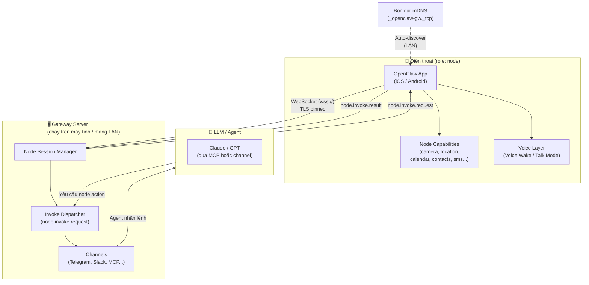

# Ứng Dụng Mobile — OpenClaw Trên Điện Thoại Và Máy Tính

> **Tóm tắt nhanh**: OpenClaw không chỉ là một công cụ dòng lệnh trên máy tính. Nó đi kèm với các ứng dụng companion chạy trên iPhone, Android, và macOS, biến điện thoại thành một "execution node" — một cánh tay nối dài cho AI agent có thể đọc lịch, chụp ảnh, nhắn tin, và phản ứng với giọng nói của bạn.

---

## 1. Tại sao cần companion apps?

Khi chạy OpenClaw trên máy tính, agent có thể thao tác với file, terminal, trình duyệt — nhưng bị giới hạn trong không gian máy tính. Companion apps mở rộng khả năng đó ra thế giới thực:

- **Điện thoại ở trong túi bạn** — nó biết vị trí, tiếp xúc danh bạ, lịch, camera.
- **Bạn không lúc nào cũng ngồi trước máy tính** — app cho phép chat hoặc nói chuyện với agent từ bất cứ đâu.
- **Điện thoại có cảm biến** — GPS, gia tốc kế, micro, camera — agent có thể khai thác tất cả.
- **Automation theo ngữ cảnh** — khi bạn đến một địa điểm, điện thoại kích hoạt workflow tự động trên gateway.

Kiến trúc tổng thể: phone/máy tính kết nối về **gateway server** trên máy tính cá nhân hoặc mạng nội bộ như một **node**. Gateway là trung tâm điều phối, còn node là "cánh tay thực thi" với bộ capabilities riêng của mình.

---

## 2. Tổng quan các apps

| Platform | Trạng thái | Ngôn ngữ / Stack | Tính năng nổi bật | Yêu cầu tối thiểu |
|----------|-----------|-------------------|-------------------|--------------------|
| **iOS** | Super Alpha (nội bộ) | Swift + SwiftUI, Xcode 16+ | Camera, màn hình, location, danh bạ, lịch, nhắc nhở, Talk/Voice Wake, APNs push, Apple Watch relay | iOS 18+, kết nối gateway (LAN hoặc VPN) |
| **macOS** | Đang hoạt động (dev) | Swift + SwiftUI | Gateway management, canvas/browser, cron jobs, CLI installer, channel config | macOS 15+, Node.js (gateway chạy local) |
| **Android** | Extremely Alpha (rebuild) | Kotlin + Jetpack Compose | Camera, SMS, vị trí, danh bạ, lịch, ảnh, Talk mode (ElevenLabs TTS), Voice Wake, push notification | Android 12+ (minSdk=31), kết nối gateway |
| **Apple Watch** | Companion (relay qua iOS) | Swift + WatchConnectivity | Quick reply, nhận kết quả từ gateway qua iPhone | Paired iPhone với OpenClaw iOS |

**Lưu ý thực tế**: Cả iOS và Android hiện ở trạng thái alpha — chỉ dùng nội bộ, chưa phân phối công khai. macOS app hoạt động ổn định hơn vì nó là primary platform của OpenClaw.

---

## 3. Kiến trúc Mobile-Gateway Connection



**Luồng kết nối chi tiết**:
1. App khởi động, quét mạng LAN qua Bonjour (`_openclaw-gw._tcp`) để tìm gateway
2. Nếu tìm thấy, app đề xuất kết nối — người dùng xác nhận TLS fingerprint
3. App kết nối WebSocket tới gateway với `role: node`, gửi danh sách capabilities
4. Gateway biết phone có thể làm gì (camera, location, v.v.) và có thể invoke bất cứ lúc nào
5. Khi AI agent cần dữ liệu từ phone, gateway gửi `node.invoke.request` qua WebSocket
6. App thực thi lệnh, trả kết quả về qua `node.invoke.result`

---

## 4. OpenClawKit — Shared SDK

`apps/shared/OpenClawKit/` là thư viện Swift Package dùng chung giữa iOS và macOS. Đây là điểm quan trọng nhất của kiến trúc mobile.

**Ba sub-libraries:**

| Module | Vai trò |
|--------|---------|
| `OpenClawProtocol` | Các model dữ liệu dùng chung (GatewayModels, AnyCodable, WizardHelpers) — không phụ thuộc platform |
| `OpenClawKit` | Logic core: gateway connection, tất cả commands, voice/talk, capabilities, Bonjour discovery |
| `OpenClawChatUI` | Giao diện chat tái sử dụng (ChatView, ChatViewModel, ChatMarkdownRenderer) |

**Nền tảng hỗ trợ**: iOS 18+ và macOS 15+ (khai báo trong `Package.swift`)

**Dependencies bên ngoài:**
- `ElevenLabsKit` (0.1.0) — TTS chất lượng cao cho Talk mode
- `textual` (0.3.1) — Render Markdown trong chat UI

**Toàn bộ command types** được định nghĩa trong OpenClawKit:
- `CameraCommands`, `LocationCommands`, `ContactsCommands`
- `CalendarCommands`, `RemindersCommands`, `PhotosCommands`
- `CanvasCommands`, `CanvasA2UICommands`, `ScreenCommands`
- `TalkCommands`, `WatchCommands`, `SystemCommands`

Nhờ thiết kế này, iOS và macOS không cần viết lại logic — chỉ cần implement handler platform-specific.

---

## 5. iOS App

### Tính năng đã hoạt động (theo README)

- **Kết nối gateway**: Tự động qua Bonjour hoặc nhập thủ công host/port + TLS fingerprint
- **Pairing**: Quét QR code hoặc nhập setup code; phê duyệt bằng `/pair approve` trên Telegram
- **Chat**: Chat với agent qua gateway session
- **Talk mode**: Nói chuyện tay đôi với agent (voice in, voice out)
- **Voice Wake**: Luôn lắng nghe wake word để kích hoạt agent không cần chạm màn hình
- **Node commands** (foreground):
  - `camera.snap`, `camera.clip` — chụp ảnh, quay video
  - `canvas.present/navigate/eval/snapshot` — canvas WebView
  - `screen.record` — quay màn hình
  - `location.get` — vị trí GPS
  - `contacts.search/add` — danh bạ
  - `calendar.events/add` — lịch
  - `reminders.list/add` — nhắc nhở
  - `photos.latest` — thư viện ảnh
  - `motion.*` — cảm biến chuyển động
  - `system.notify` — local notification
- **Apple Watch relay**: Nhận quick reply từ đồng hồ, bridge qua `WatchConnectivity`
- **Share Extension**: Chia sẻ nội dung từ app khác vào agent session
- **Live Activity / Dynamic Island**: Hiển thị trạng thái agent trực tiếp trên màn hình khóa
- **APNs push**: Nhận push notification từ gateway kể cả khi app ở background

### Cách kết nối gateway

App sử dụng `GatewayDiscoveryModel` với `NWBrowser` để quét Bonjour. Khi tìm thấy gateway, nó resolve địa chỉ LAN và Tailnet DNS (nếu dùng VPN mesh). Sau khi kết nối WebSocket, `GatewayNodeSession` quản lý toàn bộ vòng đời: connect → wait snapshot → notify connected → nhận invoke requests.

### Giới hạn hiện tại

- **Foreground-only** cho các lệnh nặng: iOS suspend socket khi background — `canvas.*`, `camera.*`, `screen.*`, `talk.*` đều bị block khi app ra background
- Background location yêu cầu quyền `Always` (không phải `While Using`)
- Voice Wake và Talk cùng tranh micro — Talk sẽ tắt Wake khi đang hoạt động
- APNs phụ thuộc vào signing/provisioning đúng — dễ lỗi khi dev

---

## 6. macOS App

macOS là platform "chủ lực" của OpenClaw — nó không chỉ là companion mà còn **tích hợp và quản lý chính gateway**.

### Tính năng đặc biệt so với iOS

| Tính năng | macOS | iOS |
|-----------|-------|-----|
| Chạy gateway trực tiếp | Có (GatewayProcessManager) | Không |
| CLI Installer | Có (cài `openclaw` CLI) | Không |
| Cron jobs / automation | Có (CronJobEditor) | Không |
| Channel config (Telegram, Slack...) | Có (ChannelsSettings) | Không — chỉ xem |
| Canvas WebView | Có (CanvasWindowController) | Có (nhưng foreground-only) |
| Exec approvals | Có (whitelist quản lý lệnh shell) | Không |
| Menu bar icon | Có (DockIconManager) | Không áp dụng |
| Camera | Có (CameraCaptureService) | Có |
| Cost/context usage | Có (CostUsageMenuView) | Không |

### Native integration

- **Sparkle**: Tự động cập nhật app
- **LaunchAgent**: Gateway có thể khởi động cùng macOS (`GatewayLaunchAgentManager`)
- **FSEvents**: Theo dõi thay đổi file config real-time (`CanvasFileWatcher`, `CoalescingFSEventsWatcher`)
- **TCC (Privacy)**: Yêu cầu quyền camera, microphone, contacts theo tiêu chuẩn macOS

macOS app về bản chất là "Control Panel" đầy đủ — vừa chạy gateway, vừa là node, vừa có giao diện cấu hình toàn bộ hệ thống.

---

## 7. Android App

Android đang trong quá trình **rebuild từ đầu** — nhiều tính năng đã xong nhưng chưa qua QA hoàn chỉnh.

### Những gì đã hoàn thành

- Onboarding 4 bước với QR code scanning
- Connect tab: Setup Code mode và Manual mode
- Chat UI với streaming support và Markdown rendering
- Voice tab: Talk mode đầy đủ với ElevenLabs TTS
- Screen tab: Canvas WebView
- Push notifications
- Biometric lock, encrypted storage (SecurePrefs)
- Performance benchmark suite (Macrobenchmark)

### Node capabilities trên Android

Android hỗ trợ tập capabilities rộng hơn iOS nhờ hệ sinh thái mở hơn:

- Tất cả camera/location/contacts/calendar commands
- **SMS** (`sms.send`, `sms.list`) — tính năng không có trên iOS
- **Notification listener** — đọc tất cả notification trên máy
- Motion (activity recognition, pedometer)
- Canvas + A2UI (WebView-based)

### Cách discovery và kết nối

`GatewayDiscovery.kt` dùng Android NSD (Network Service Discovery) kết hợp DNS-SD library (`dnsjava`) để tìm gateway trên LAN. Hỗ trợ cả kết nối USB qua `adb reverse` — tiện cho dev khi không muốn phụ thuộc LAN.

**Build stack**: Kotlin + Jetpack Compose, minSdk=31 (Android 12), target SDK mới nhất.

### Còn thiếu

- Full end-to-end QA chưa hoàn tất
- Apple Watch tương đương (Wear OS) chưa có
- Chưa lên Play Store

---

## 8. Mobile Node — Điện thoại như một "Execution Node"

Đây là concept cốt lõi: điện thoại không chỉ là màn hình để chat — nó là một **worker node** trong hệ thống phân tán của OpenClaw.

### Node là gì?

Khi app kết nối gateway với `role: node`, nó:
1. Gửi **capability manifest** — danh sách những gì nó có thể làm
2. Chờ gateway dispatch `node.invoke.request` bất cứ lúc nào
3. Thực thi lệnh, trả kết quả về

**Ví dụ capability manifest của Android node:**

```
canvas, device, notifications, system
camera (nếu được cấp quyền)
sms (nếu device hỗ trợ)
voiceWake (nếu bật)
location (nếu được cấp quyền)
photos, contacts, calendar, motion
```

### Foreground vs Background

Một số lệnh chỉ chạy được khi app ở foreground (cần giao diện active):

| Nhóm lệnh | Foreground required? |
|-----------|---------------------|
| `canvas.*`, `screen.*`, `camera.*` | Bắt buộc foreground |
| `talk.*` | Bắt buộc foreground |
| `location.get`, `calendar.*`, `contacts.*` | Background OK (iOS cần Always permission cho location) |
| `system.notify` | Background OK |
| `sms.*` (Android) | Background OK |

### Foreground Service (Android)

Android app chạy `NodeForegroundService` — một foreground service với notification thường trực — để duy trì kết nối WebSocket khi người dùng rời khỏi app. Đây là cách Android chuẩn để giữ kết nối lâu dài.

---

## 9. Voice và TTS

Voice là tính năng được đầu tư mạnh trong cả iOS và Android.

### Hai chế độ Voice

**Voice Wake (Always-On)**:
- App liên tục lắng nghe wake word trong background
- iOS: dùng `Speech` framework + `AVAudioEngine` với audio tap
- Android: `SpeechRecognizer` + `VoiceWakeManager`
- Khi phát hiện wake word → tự động kích hoạt Talk mode

**Talk Mode (Push-to-Talk / Continuous)**:
- Ghi âm giọng nói, gửi transcript lên gateway
- Gateway chuyển cho AI xử lý, trả về text response
- App đọc response bằng TTS

### TTS — Hai cấp độ

**System TTS (fallback, miễn phí)**:
- iOS: `AVSpeechSynthesizer` — giọng hệ thống iOS
- Android: Android TTS API
- Chất lượng vừa phải, không cần API key

**ElevenLabs TTS (chất lượng cao)**:
- iOS: dùng `ElevenLabsKit` qua OpenClawKit
- Android: `ElevenLabsStreamingTts.kt` — stream trực tiếp qua WebSocket
- Model mặc định: `eleven_flash_v2_5` (latency ~100ms đầu tiên)
- PCM audio 24kHz, play realtime qua `AudioTrack`
- Yêu cầu ElevenLabs API key

### Talk Commands Protocol

```
talk.ptt.start  → bắt đầu ghi âm (gửi captureId)
talk.ptt.stop   → dừng ghi âm (gửi transcript + status)
talk.ptt.cancel → hủy bỏ
talk.ptt.once   → ghi âm một lần rồi tự dừng
```

---

## 10. Setup Guide Ngắn Gọn

### Kết nối iOS/Android app với gateway

**Bước 1 — Chạy gateway trên máy tính:**
```bash
pnpm openclaw gateway --port 18789 --verbose
```
Hoặc nếu dùng macOS app: mở app → Settings → Gateway → Start.

**Bước 2 — Điện thoại phải cùng mạng LAN** (hoặc dùng Tailscale/VPN nếu khác mạng).

**Bước 3 — Mở app, vào tab Connect:**
- Chọn **Setup Code**: gateway in ra setup code, nhập vào app
- Hoặc **Manual**: nhập host IP + port + bật/tắt TLS

**Bước 4 — Phê duyệt thiết bị trên gateway:**
```bash
openclaw devices list
openclaw devices approve <requestId>
```

**Bước 5 — Xác nhận kết nối:**
```bash
openclaw nodes status
# → phone hiện ra với trạng thái "paired + connected"
```

### USB tunnel (Android, không cần LAN)
```bash
# Terminal A: chạy gateway
pnpm openclaw gateway --port 18789

# Terminal B: tạo tunnel
adb reverse tcp:18789 tcp:18789

# Trong app: Connect → Manual → Host: 127.0.0.1, Port: 18789, TLS: off
```

### Kiểm tra nhanh
```bash
# Invoke một lệnh từ máy tính sang phone:
openclaw nodes invoke <nodeId> device.info
openclaw nodes invoke <nodeId> location.get
```

---

## 11. Ví dụ Usecase Thực Tế

### Tình huống: Đang đi bộ, muốn gửi email cho team

**Bối cảnh**: Bạn đang đi bộ, tay cầm điện thoại, không thể gõ. OpenClaw iOS đang chạy và kết nối gateway.

**Luồng xử lý:**

```
[Bạn nói] "Hey OpenClaw, gửi email cho team về meeting chiều nay"
    ↓
[Voice Wake] phát hiện wake word → kích hoạt Talk mode
    ↓
[iOS SpeechRecognizer] ghi âm và transcribe:
  "gửi email cho team về meeting chiều nay"
    ↓
[talk.ptt.stop] gửi transcript lên Gateway
    ↓
[Gateway] chuyển tới AI agent (Claude/GPT)
    ↓
[AI] cần thêm info → invoke node.contacts.search("team")
    ↓
[iOS ContactsService] tìm kiếm, trả về danh sách email
    ↓
[AI] invoke node.calendar.events(today) → lấy lịch hôm nay để biết meeting lúc mấy giờ
    ↓
[AI] soạn email với thông tin đầy đủ, gọi send_email tool
    ↓
[AI] trả về: "Đã gửi email cho 5 thành viên team về meeting lúc 14h chiều nay"
    ↓
[Gateway] push response về iOS app
    ↓
[ElevenLabs TTS] đọc to câu trả lời → bạn nghe qua tai nghe
```

**Toàn bộ quá trình**: ~3-5 giây, không cần chạm màn hình.

### Tình huống: Location-based automation

Bạn cài automation: "Khi tôi đến văn phòng, tóm tắt email chưa đọc và gửi lên Slack."

```
[Điện thoại] iOS significant location update → geofence trigger
    ↓
[App] gửi location.event("arrived", coordinates) lên Gateway
    ↓
[Gateway] kích hoạt automation rule đã cấu hình
    ↓
[Agent] fetch emails → summarize → post to Slack
    ↓
[APNs push] "Đã tóm tắt 7 email chưa đọc và gửi lên #general"
```

Automation này chạy hoàn toàn tự động — bạn chỉ cần bước vào văn phòng.

---

## Tổng kết

| Điểm mạnh | Điểm cần cải thiện |
|-----------|-------------------|
| Kiến trúc node/gateway linh hoạt và mở rộng được | iOS và Android đều còn alpha — chưa production-ready |
| OpenClawKit shared code tiết kiệm effort iOS/macOS | Background limitations trên iOS là hard constraint của Apple |
| ElevenLabs TTS chất lượng thực sự cao | Chưa có trên app store công khai |
| Discovery tự động qua Bonjour rất tiện | Setup phức tạp — cần máy tính chạy gateway |
| Android có thêm SMS access mà iOS không có | Android app đang rebuild, chưa ổn định |
| Apple Watch relay qua iOS là điểm cộng | Wear OS chưa có tương đương |

OpenClaw mobile apps thể hiện một vision rõ ràng: **điện thoại là "remote sensor + actuator" cho AI agent của bạn**. Khi hệ sinh thái này hoàn chỉnh, agent không còn bị giới hạn trong màn hình máy tính — nó có thể nhìn qua camera của bạn, nghe qua micro, biết bạn đang ở đâu, và hành động thay bạn trong thế giới thực.
