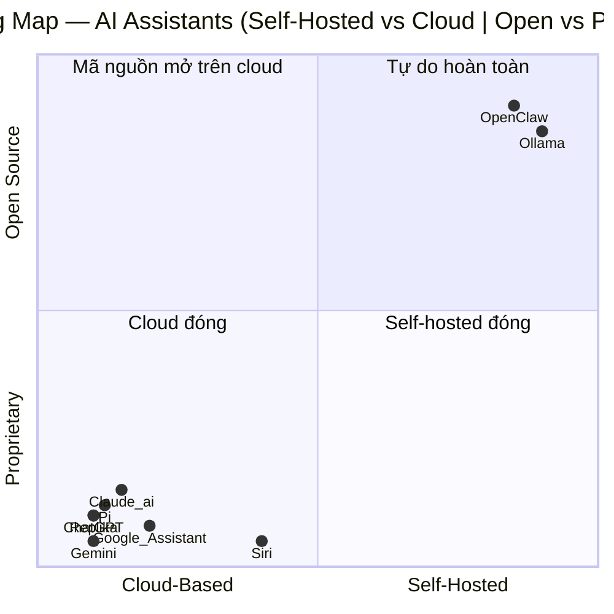
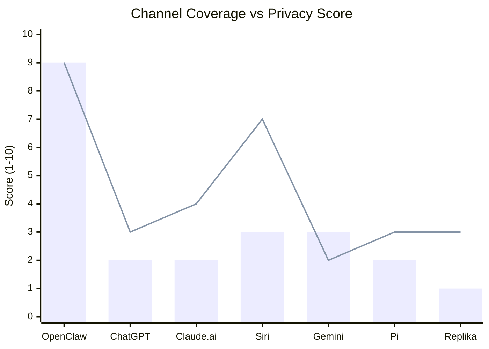

# So Sánh Benchmark — OpenClaw vs Các AI Assistant Khác

> **Phiên bản**: 2026-03-12 | **Nguồn**: README.md, VISION.md, CHANGELOG.md, package.json v2026.3.11

---

## 1. Tại Sao So Sánh? Định Vị OpenClaw

OpenClaw không phải là một chatbot web thông thường. Nó là một **gateway cá nhân chạy trên thiết bị của bạn** — hoạt động như một lớp điều phối trung tâm kết nối AI với các kênh nhắn tin bạn đang dùng hàng ngày.

Điều này tạo ra một vị thế khác biệt hoàn toàn so với ChatGPT hay Claude.ai:

- **ChatGPT/Claude.ai**: Bạn mở tab web, nhắn tin, nhận câu trả lời. AI nằm trên cloud.
- **OpenClaw**: AI phục vụ bạn ngay trong WhatsApp, Telegram, Slack — nơi bạn đang sống. Gateway chạy trên máy tính/server của bạn, dữ liệu không rời khỏi cơ sở hạ tầng của bạn.

Câu hỏi đặt ra: **Khi nào thì nên dùng OpenClaw thay vì các lựa chọn phổ biến hơn?** Báo cáo này trả lời bằng dữ liệu thực tế.

---

## 2. Bảng So Sánh Tổng Quan

| Tiêu chí | OpenClaw | ChatGPT | Claude.ai | Siri | Google Assistant | Gemini | Pi (Inflection) | Replika |
|---|---|---|---|---|---|---|---|---|
| **Giấy phép** | MIT (mã nguồn mở) | Độc quyền | Độc quyền | Độc quyền | Độc quyền | Độc quyền | Độc quyền | Độc quyền |
| **Tự host (self-hosted)** | Bắt buộc | Không | Không | Không | Không | Không | Không | Không |
| **Chạy trên thiết bị cá nhân** | Có (máy tính/server) | Không | Không | Có (on-device NLP cơ bản) | Không | Một phần | Không | Không |
| **Quyền riêng tư dữ liệu** | Cao — dữ liệu ở lại thiết bị | Thấp — OpenAI lưu trữ | Trung bình — Anthropic lưu trữ | Trung bình — Apple lưu | Thấp — Google lưu | Thấp — Google lưu | Thấp | Thấp |
| **Số kênh hỗ trợ** | 22+ (WhatsApp, Telegram, Slack, Discord, Signal, iMessage, Teams, Matrix, LINE, Zalo...) | 1 (web/app) | 1 (web/app) | 2 (iOS, macOS) | 2 (Android, web) | 3 (web, Android, iOS) | 1 (web/app) | 1 (web/app) |
| **Hỗ trợ nhà cung cấp LLM** | Nhiều (OpenAI, Anthropic, Gemini, Ollama, Kimi, DeepSeek, OpenRouter...) | 1 (GPT series) | 1 (Claude series) | 1 (tích hợp hệ thống) | 1 (Gemini) | 1 (Gemini series) | 1 (Inflection) | 1 (nội bộ) |
| **Tự chọn model AI** | Có — đổi model theo kênh/phiên | Hạn chế (Plus=GPT-4) | Hạn chế (Pro=Claude 3) | Không | Không | Hạn chế | Không | Không |
| **Model failover** | Có (tự động khi model lỗi) | Không | Không | N/A | N/A | Không | Không | Không |
| **Voice (giọng nói)** | Có (macOS/iOS/Android — ElevenLabs + TTS) | Có (web/app) | Không (chưa có) | Có (native, rất tốt) | Có (native) | Có | Có | Có |
| **Hỗ trợ di động** | iOS node + Android node (companion app) | iOS + Android app | iOS + Android app | iOS only | Android + iOS | iOS + Android | iOS + Android | iOS + Android |
| **Extensions/Plugins** | 40 extensions, 52 skills, plugin SDK | GPTs (Plus) | Projects (Pro) | Shortcuts | Actions (paid API) | Extensions | Không | Không |
| **Tự động hóa (cron/webhook)** | Có (cron tích hợp, webhook, Gmail Pub/Sub) | Không | Không | Shortcuts (hạn chế) | Routines (hạn chế) | Không | Không | Không |
| **Điều khiển trình duyệt** | Có (CDP-controlled Chrome) | Không | Không (Claude Computer Use — riêng biệt) | Không | Không | Không | Không | Không |
| **Agent-to-Agent (đa agent)** | Có (sessions_send, routing theo workspace) | Không | Không | Không | Không | Không | Không | Không |
| **Khả năng thực thi lệnh** | Có (system.run, bash, với allowlist kiểm soát) | Không | Không | Hạn chế (Shortcuts) | Không | Không | Không | Không |
| **Chi phí** | Miễn phí (tự host) + phí LLM theo dùng | Free / $20/tháng (Plus) / $200 (Pro) | Free / $20/tháng (Pro) | Miễn phí (thiết bị Apple) | Miễn phí | Free / $19.99 (Advanced) | Miễn phí | Free / $7.99/tháng |
| **Độ khó cài đặt** | Cao (cần terminal, Node.js, cấu hình) | Thấp (tạo tài khoản, dùng ngay) | Thấp | Rất thấp (sẵn trên thiết bị) | Thấp | Thấp | Rất thấp | Rất thấp |
| **Kết nối WhatsApp cá nhân** | Có (Baileys) | Không | Không | Không | Không | Không | Không | Không |
| **Kết nối Zalo** | Có (Zalo + Zalo Personal) | Không | Không | Không | Không | Không | Không | Không |
| **Hỗ trợ MCP (Model Context Protocol)** | Có (qua mcporter) | Không | Có (native) | Không | Không | Không | Không | Không |
| **Canvas / Visual workspace** | Có (A2UI agent-driven canvas) | Không | Không | Không | Không | Không | Không | Không |
| **Cộng đồng** | Discord, GitHub (đang phát triển) | Rất lớn | Lớn | Rất lớn | Rất lớn | Lớn | Nhỏ | Trung bình |
| **Trọng tâm ứng dụng** | Tự động hóa công việc, privacy-first | Chat + tạo nội dung | Chat + phân tích | Điều khiển thiết bị | Tìm kiếm + tác vụ nhanh | Chat + tìm kiếm | Trò chuyện cá nhân | Đồng hành cảm xúc |

**Chú thích**: Đánh giá dựa trên tính năng công khai tính đến tháng 3/2026.

---

## 3. Radar Chart — So Sánh Đa Chiều (ASCII)

```
                    QUYỀN RIÊNG TƯ
                          10
                          |
                    8     |
                   /      |
      KHẢ NĂNG   6--------+--------8   KÊNH NHẮN TIN
      TÍCH HỢP   |        |        |
                4|    OC  |        |4
                  \  /    |   /    /
                   \/     |  /   /
    TIỆN DÙNG  2---+------+--+--/---6   LLM LINH HOẠT
                   |      |  |
                   |      0  |
                            |
                    CHI PHÍ THẤP

Điểm tổng hợp (thang 1-10):

                 OpenClaw  ChatGPT  Claude   Siri    Gemini   Pi
Quyền riêng tư:    9         3        4       7        2       3
Kênh nhắn tin:     9         2        2       3        3       2
LLM linh hoạt:     9         3        2       1        2       2
Tự động hóa:       8         2        2       4        3       1
Khả năng mở rộng:  8         5        4       2        4       1
Chi phí thấp:      7         5        5       9        7       9
Tiện dùng:         3         9        8       9        8       8
Trợ lý cảm xúc:    2         5        6       4        5       9
Hệ sinh thái:      4         9        7       9        9       3
```

---

## 4. So Sánh Chi Tiết Từng Đối Thủ

### 4.1 OpenClaw vs ChatGPT

**ChatGPT** là tiêu chuẩn vàng cho chatbot AI — giao diện web trực quan, GPTs marketplace, DALL-E tích hợp. Ai cũng biết, ai cũng dùng được ngay.

**OpenClaw mạnh hơn ở đâu:**
- Trả lời ngay trên WhatsApp/Telegram — không cần mở tab web
- Tự chọn LLM: dùng Claude, Gemini, hoặc Ollama local thay vì chỉ GPT
- Dữ liệu cuộc hội thoại không gửi cho OpenAI (nếu dùng Ollama hoặc Gemini)
- Cron jobs, webhook automation — ChatGPT không có
- Chi phí: chỉ trả tiền cho API usage, không có phí nền tảng

**ChatGPT mạnh hơn ở đâu:**
- Không cần cài đặt, không cần server
- Giao diện web cực kỳ thân thiện
- DALL-E 3 image generation tích hợp
- GPTs marketplace với hàng ngàn ứng dụng chuyên biệt
- Cộng đồng người dùng khổng lồ, tài liệu phong phú

**Kết luận**: OpenClaw thắng về quyền riêng tư và tích hợp kênh; ChatGPT thắng về accessibility và hệ sinh thái.

---

### 4.2 OpenClaw vs Claude.ai

**Claude.ai** (Anthropic) nổi bật với khả năng phân tích văn bản dài, lập trình, và lý luận — thường được đánh giá là mô hình AI mạnh nhất hiện tại về chất lượng đầu ra.

**OpenClaw mạnh hơn ở đâu:**
- OpenClaw **có thể dùng Claude làm LLM backend** — tức là bạn nhận được chất lượng Claude + đa kênh
- Multi-channel: Claude.ai chỉ có web/app, không có Telegram hay WhatsApp
- Self-hosted: Claude.ai lưu mọi cuộc hội thoại trên server Anthropic
- Plugin/skill system phong phú hơn

**Claude.ai mạnh hơn ở đâu:**
- Zero setup — dùng ngay trên trình duyệt
- Projects và Memory tích hợp sẵn, dễ dùng
- Artifacts (code, diagram, document) — rất tiện cho lập trình viên
- MCP native (Claude.ai có tích hợp MCP trực tiếp)
- Chất lượng output model thường tốt hơn (phụ thuộc model version)

**Điểm thú vị**: OpenClaw dùng "Pi agent runtime" — không rõ có phải từ Inflection hay không, nhưng tên gợi ý liên hệ đến lịch sử Pi AI.

**Kết luận**: Nếu bạn cần chất lượng AI thuần túy → Claude.ai. Nếu bạn muốn Claude trả lời trong Telegram lúc 2 giờ sáng → OpenClaw + Claude API.

---

### 4.3 OpenClaw vs Siri / Google Assistant

**Siri** và **Google Assistant** là trợ lý hệ thống — được thiết kế để điều khiển thiết bị, set alarm, gọi điện, tìm kiếm nhanh. Họ sống trong hệ sinh thái đóng của Apple/Google.

**OpenClaw mạnh hơn ở đâu:**
- Không bị khóa vào hệ sinh thái — chạy trên macOS, Linux, Windows (WSL)
- Không giới hạn loại LLM — dùng bất kỳ model nào
- Tự động hóa phức tạp: cron, webhook, multi-step agents
- Kết nối 22+ kênh nhắn tin thay vì chỉ hoạt động trên thiết bị

**Siri/Google Assistant mạnh hơn ở đâu:**
- Zero friction: wake word, on-device processing, không cần cài đặt
- Tích hợp sâu với hệ thống: gọi điện, nhắn tin native, calendar, reminders
- Google Assistant + Gemini: tìm kiếm thời gian thực (OpenClaw cần plugin riêng)
- Siri: on-device processing bảo vệ privacy tốt hơn OpenClaw cloud-dependent scenarios

**Kết luận**: Siri/Google Assistant cho tác vụ thiết bị nhanh. OpenClaw cho tự động hóa phức tạp và multi-channel.

---

### 4.4 OpenClaw vs Pi by Inflection

**Pi** (Inflection AI) định vị là "personal AI" — trọng tâm là trò chuyện tự nhiên, hỗ trợ cảm xúc, luôn sẵn sàng.

**OpenClaw mạnh hơn ở đâu:**
- Thực sự chạy trên thiết bị của bạn — Pi là cloud service
- Có thể thực thi lệnh thực tế (system.run, browser control) — Pi chỉ chat
- Multi-channel: Pi chỉ có app riêng
- Mở rộng được qua plugin/skill

**Pi mạnh hơn ở đâu:**
- UX trò chuyện tự nhiên được thiết kế kỹ lưỡng
- Không cần cài đặt kỹ thuật
- Giao tiếp cảm xúc tốt hơn nhiều
- Miễn phí

**Ghi chú**: OpenClaw README đề cập "Pi agent runtime" — có thể dự án liên quan đến hoặc terinspired bởi Inflection's Pi, hoặc trùng tên. Cần làm rõ thêm.

**Kết luận**: Pi cho companion cá nhân. OpenClaw cho tự động hóa cá nhân.

---

### 4.5 OpenClaw vs Replika

**Replika** là AI companion — thiết kế cho kết nối cảm xúc, trò chuyện thân mật, không phải công cụ năng suất.

**So sánh ngắn**: Hai sản phẩm này không cùng phân khúc. Replika = tình cảm. OpenClaw = công việc. Không có ý nghĩa cạnh tranh trực tiếp.

---

## 5. Điểm Mạnh Độc Đáo của OpenClaw (USP)

### USP #1 — Gateway Đa Kênh Thực Sự
OpenClaw là sản phẩm **duy nhất** trong danh sách cho phép trả lời trên đồng thời 22+ kênh nhắn tin từ một chỗ. Không cần mở ChatGPT riêng, Telegram riêng, Slack riêng — AI của bạn **ở sẵn ở đó**.

Đặc biệt quan trọng với người Việt Nam: **hỗ trợ Zalo và Zalo Personal** — không có sản phẩm nào khác trong danh sách này làm được.

### USP #2 — LLM Agnostic (Không Bị Khóa Nhà Cung Cấp)
Bạn có thể dùng GPT-4o hôm nay, chuyển sang Claude 4 ngày mai, thử Gemini 2.0 tuần sau — **mà không thay đổi workflow**. Model failover tự động khi model lỗi.

Với Ollama support: chạy AI hoàn toàn local, không có chi phí API, không có dữ liệu ra ngoài.

### USP #3 — Privacy by Architecture
OpenClaw không phải "privacy-friendly" vì chính sách — mà vì **kiến trúc**. Gateway chạy trên máy bạn. Dữ liệu đi đến LLM provider bạn chọn, không qua server trung gian nào của OpenClaw.

Nếu bạn dùng Ollama local: **zero data leaves your machine**.

### USP #4 — Tự Động Hóa Thực Sự
Cron jobs, webhook triggers, Gmail Pub/Sub — OpenClaw có thể **chủ động làm việc** mà không cần bạn nhắn tin. Đặt lịch hàng ngày lúc 8 giờ sáng nhận briefing, tự động phản hồi khi có email quan trọng.

Không có chatbot nào trong danh sách có khả năng này ngoài Siri Shortcuts (rất hạn chế).

### USP #5 — Khả Năng Thực Thi Lệnh
`system.run`, browser CDP control, camera, screen recording — OpenClaw là assistant có thể **làm việc trên máy tính** thay bạn. Đây là hướng tiến của "Computer Use" AI.

### USP #6 — Mã Nguồn Mở MIT
Không có vendor lock-in. Không có nguy cơ bị tắt dịch vụ. Bạn có thể fork, modify, deploy theo ý muốn. OpenAI, Anthropic, Google có thể thay đổi điều khoản bất kỳ lúc nào — OpenClaw MIT thì không.

---

## 6. Điểm Yếu và Hạn Chế

Đánh giá trung thực — không phải quảng cáo:

### Hạn chế #1 — Ngưỡng Kỹ Thuật Cao
Cần terminal, Node.js >= 22, hiểu config files, WSL2 trên Windows. Người không có nền tảng kỹ thuật sẽ **không tự cài được**. So với ChatGPT (tạo tài khoản → dùng ngay) thì độ khó chênh lệch rất lớn.

### Hạn chế #2 — Cần Tự Vận Hành Server
Gateway phải chạy liên tục. Nếu máy tính tắt, AI ngừng hoạt động. Cần hiểu về daemon/service management, có thể cần thuê VPS để chạy 24/7.

### Hạn chế #3 — Chưa Có Image Generation Tích Hợp
Không có DALL-E, không có Midjourney bridge sẵn. Cần tự tích hợp qua plugin.

### Hạn chế #4 — Chất Lượng AI Phụ Thuộc API Key Bạn Có
OpenClaw chỉ là orchestration layer. Chất lượng câu trả lời phụ thuộc model bạn dùng. Nếu dùng model yếu vì tiết kiệm chi phí → kết quả kém hơn ChatGPT Plus dùng GPT-4o.

### Hạn chế #5 — Hệ Sinh Thái Còn Non
Mặc dù có 40 extensions và 52 skills, ClawHub marketplace còn rất nhỏ so với GPTs store của OpenAI. Cộng đồng đang phát triển nhưng chưa đạt critical mass.

### Hạn chế #6 — Tài Liệu Kỹ Thuật Phức Tạp
CHANGELOG cho thấy nhiều security patches liên tục (7+ CVE trong bản Unreleased). Điều này cho thấy sản phẩm **mature và có security focus tốt**, nhưng cũng cho thấy complexity của attack surface khi kết nối với nhiều kênh nhắn tin thực tế.

### Hạn chế #7 — Companion App macOS/iOS Beta
iOS app vẫn trong TestFlight (beta). Android node đang phát triển. Không thể kỳ vọng stability tương đương ChatGPT app hay Siri.

---

## 7. "Ai Nên Dùng Gì?" — Decision Matrix

| Nếu bạn... | Dùng cái này |
|---|---|
| Cần AI trả lời câu hỏi nhanh, không muốn cài đặt gì | **ChatGPT** hoặc **Claude.ai** |
| Cần chất lượng phân tích văn bản / code tốt nhất | **Claude.ai** (Pro) |
| Muốn AI sẵn sàng trong WhatsApp/Telegram lúc 2 giờ sáng | **OpenClaw** |
| Muốn AI nhắn tin vào Zalo cá nhân của bạn | **OpenClaw** (duy nhất) |
| Quan tâm quyền riêng tư, không muốn dữ liệu lên cloud | **OpenClaw** + Ollama |
| Muốn dùng nhiều LLM khác nhau, không bị vendor lock | **OpenClaw** |
| Cần tự động hóa: cron, webhook, email triggers | **OpenClaw** |
| Muốn AI điều khiển máy tính thay bạn | **OpenClaw** |
| Dùng thiết bị Apple, muốn tích hợp Calendar/Reminders | **Siri** + Shortcuts |
| Cần AI tìm kiếm thông tin thời gian thực tốt nhất | **Gemini** hoặc **Perplexity** |
| Muốn bạn đồng hành trò chuyện cảm xúc | **Replika** hoặc **Pi** |
| Là developer, muốn tự build/extend AI assistant | **OpenClaw** (MIT) |
| Budget $0, muốn AI tốt nhất có thể | **OpenClaw** + Gemini Free API |
| Cần deploy cho nhóm nhiều người | **OpenClaw** (multi-agent routing) |
| Mới dùng AI, không biết kỹ thuật | **ChatGPT** |

---

## 8. Kết Luận: OpenClaw Phù Hợp Với Ai?

### Người dùng lý tưởng của OpenClaw:

**Developer và kỹ sư phần mềm** — có kiến thức terminal, hiểu config, muốn kiểm soát hoàn toàn hệ thống AI của mình. Đây là nhóm sẽ cài được OpenClaw trong 30 phút và tận dụng 100% tính năng.

**Người làm việc remote hoặc chuyên gia tự do** — cần AI hỗ trợ trên nhiều kênh giao tiếp cùng lúc (Slack công việc, Telegram cá nhân, WhatsApp khách hàng). OpenClaw giải quyết fragmentation này.

**Người dùng Việt Nam** — với hỗ trợ Zalo và Zalo Personal, OpenClaw là lựa chọn duy nhất cho phép kết nối AI với nền tảng nhắn tin phổ biến nhất Việt Nam.

**Người quan tâm bảo mật và privacy** — ai không muốn lịch sử cuộc hội thoại nằm trên server của OpenAI hay Anthropic.

**Nhà nghiên cứu và thử nghiệm AI** — flexibility để thử nhiều model, plugin, tự xây skill theo nhu cầu.

### OpenClaw KHÔNG phù hợp với:

- Người dùng phổ thông, không quen terminal
- Người cần AI trả lời ngay lập tức mà không muốn setup
- Người cần AI companion / trò chuyện cảm xúc
- Người cần image generation hoặc video generation tích hợp

### Đánh giá tổng thể:

OpenClaw chiếm một ngách riêng biệt và **không có đối thủ trực tiếp** — không ai làm đúng việc OpenClaw làm (self-hosted, multi-channel, LLM-agnostic gateway). Đây vừa là điểm mạnh (không có cạnh tranh trong ngách này) vừa là điểm yếu (ngách nhỏ, cộng đồng chưa đủ lớn).

Nếu bạn thuộc nhóm người dùng lý tưởng, OpenClaw là công cụ sẽ thay đổi workflow hàng ngày của bạn. Nếu không, hãy dùng ChatGPT — nó đơn giản hơn nhiều.

---

## 9. Mermaid — Positioning Map

### 9.1 Self-Hosted vs Cloud | Open-Source vs Proprietary



### 9.2 Dễ Dùng vs Khả Năng | Privacy vs Tính Năng

```mermaid
quadrantChart
    title Capability vs Ease of Use
    x-axis Hard to Use --> Easy to Use
    y-axis Low Capability --> High Capability
    quadrant-1 Power Tool (dễ + mạnh)
    quadrant-2 Expert Tool (khó + mạnh)
    quadrant-3 Beginner (dễ + yếu)
    quadrant-4 Niche (khó + yếu)
    OpenClaw: [0.25, 0.85]
    ChatGPT_Plus: [0.90, 0.80]
    Claude_Pro: [0.85, 0.88]
    Gemini_Advanced: [0.88, 0.75]
    Siri: [0.95, 0.40]
    Google_Assistant: [0.92, 0.45]
    Pi: [0.88, 0.45]
    Replika: [0.90, 0.25]
```

### 9.3 Channel Coverage vs Privacy Score



> Chú thích: bar = Channel Coverage, line = Privacy Score

---

## Phụ Lục: Nguồn Dữ Liệu

| Nguồn | Nội dung |
|---|---|
| `openclaw/README.md` v2026.3.11 | Features, channels, architecture |
| `openclaw/VISION.md` | Định hướng và roadmap |
| `openclaw/CHANGELOG.md` Unreleased + 2026.3.11 | Security fixes, tính năng mới nhất |
| `openclaw/package.json` | Tech stack, version |
| Tài liệu công khai ChatGPT, Claude, Gemini, Siri | Tham khảo tính năng đối thủ |

*Báo cáo này phản ánh trạng thái tính đến 2026-03-12. Tính năng các sản phẩm có thể thay đổi.*
