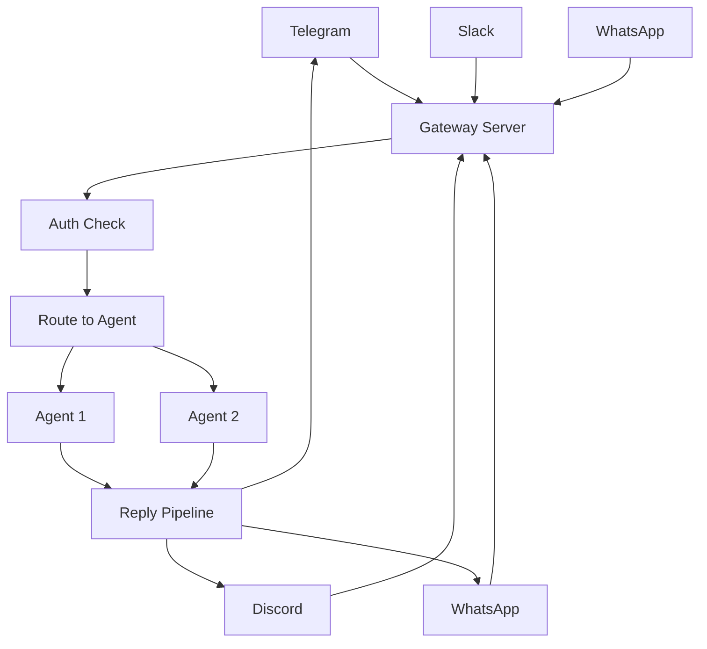
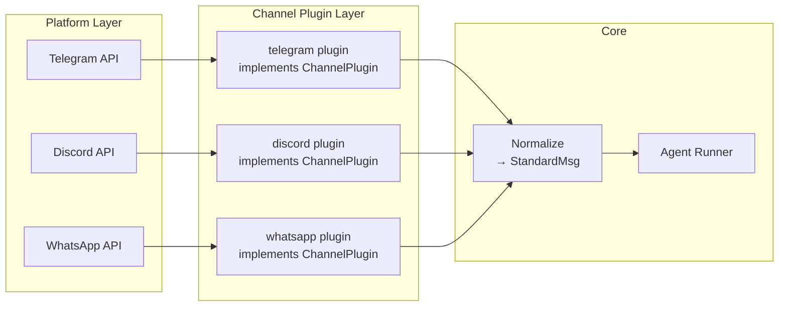
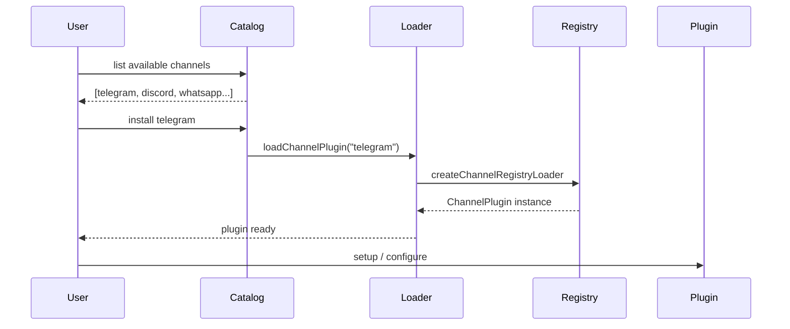
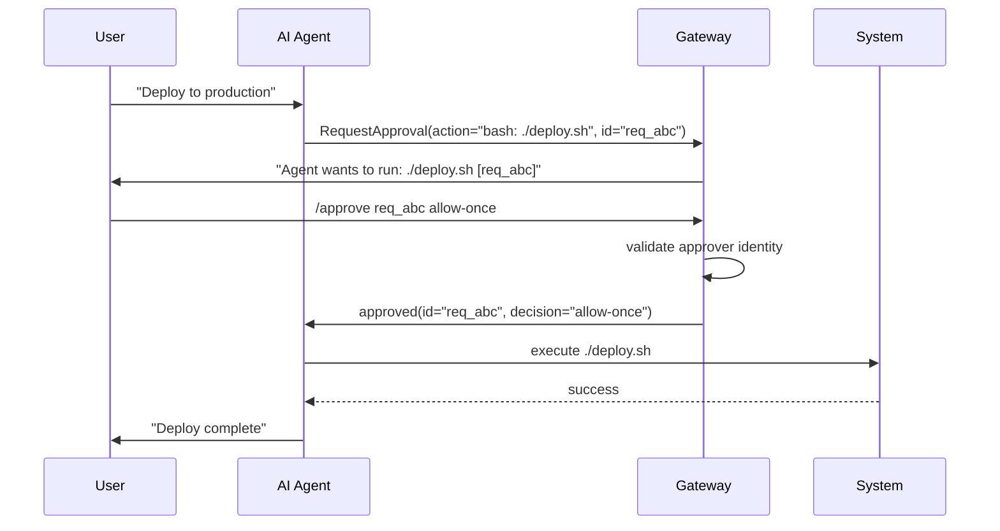
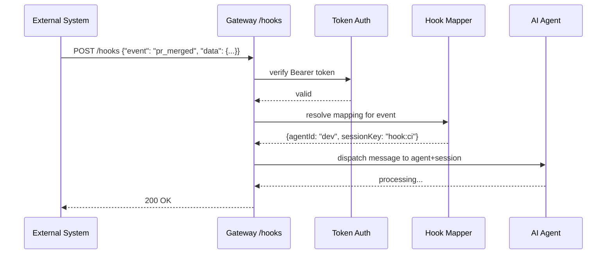

# Bài Học & Design Patterns — Rút Ra Từ OpenClaw

## 1. Tại sao học patterns từ OpenClaw?

OpenClaw không phải là một project tutorial nhỏ — đây là một hệ thống AI assistant thực chiến chạy trên 20+ nền tảng nhắn tin (Telegram, Discord, WhatsApp, Slack, Signal, iMessage…), có plugin SDK mở rộng, hệ thống approval bảo mật, và quản lý bộ nhớ AI. Codebase TypeScript gồm hàng trăm file, 40+ extensions, 52 skills.

Lý do học từ OpenClaw:

- **Vấn đề thực tế**: Mỗi pattern ở đây giải quyết một bài toán sản xuất cụ thể, không phải bài toán giả tưởng
- **Quy mô vừa phải**: Đủ lớn để thấy trade-off, nhưng không quá phức tạp như Linux kernel
- **TypeScript hiện đại**: Dùng type system đúng cách để enforce contracts
- **Kiến trúc rõ ràng**: Có sự tách biệt rõ ràng giữa gateway, channels, plugins, và auto-reply

Mỗi pattern trong tài liệu này đều được rút ra từ code thực tế — không phải lý thuyết sách giáo khoa.

---

## 2. Pattern 1: Gateway Hub Pattern

### Vấn đề cần giải quyết

Bạn có 20 nguồn tin nhắn đầu vào (Telegram, Discord, WhatsApp…) và 1 AI agent cần xử lý tất cả. Nếu mỗi nguồn kết nối thẳng vào agent, bạn sẽ có 20 luồng xử lý khác nhau, 20 cách quản lý lỗi, 20 cách log. Code sẽ trở thành mớ hỗn độn.

### Ví dụ đời thực

Sân bay trung chuyển quốc tế. Không có đường bay thẳng từ mọi thành phố nhỏ đến mọi thành phố nhỏ khác — thay vào đó, tất cả đi qua hub (London Heathrow, Dubai, Singapore). Hub tập trung kiểm soát, customs, security.

### Cách OpenClaw thực hiện

Gateway server là điểm trung tâm duy nhất. Tất cả kênh (channel adapters) đẩy tin nhắn vào gateway, gateway xử lý routing, authentication, session management, rồi dispatch đến agent runner.

Từ `src/gateway/server-plugins.ts`, OpenClaw tạo `GatewayRequestContext` — một context object đại diện cho một request đi qua gateway:

```typescript
// Fallback gateway context cho non-WS paths (Telegram, WhatsApp, etc.)
// Channel adapters invoke the agent directly without going through
// handleGatewayRequest — store the gateway context at startup as fallback.
const fallbackGatewayContextState = (() => {
  const globalState = globalThis as typeof globalThis & {
    [FALLBACK_GATEWAY_CONTEXT_STATE_KEY]?: FallbackGatewayContextState;
  };
  // ...
})();
```

Gateway còn có khái niệm "client roles" — mỗi kết nối phải tự xác nhận là operator, user, hoặc internal backend:

```typescript
function createSyntheticOperatorClient(): GatewayRequestOptions["client"] {
  return {
    connect: {
      role: "operator",
      scopes: ["operator.admin", "operator.approvals", "operator.pairing"],
    },
  };
}
```

### Sơ đồ kiến trúc



### Khi nào dùng

- Khi có nhiều nguồn input khác nhau cùng trỏ vào một xử lý chung
- Khi cần cross-cutting concerns (auth, logging, rate-limiting) áp dụng cho tất cả
- Khi muốn thêm/bớt source mà không thay đổi logic xử lý

### Khi nào KHÔNG dùng

- Khi chỉ có 1-2 nguồn input — gateway lúc này là over-engineering
- Khi latency cực kỳ quan trọng — thêm một tầng trung gian sẽ thêm latency
- Khi các nguồn input có logic xử lý hoàn toàn khác nhau và không chia sẻ gì

### Trade-off

**Ưu**: Centralized control, dễ audit, dễ thêm kênh mới.
**Nhược**: Single point of failure — nếu gateway down, toàn bộ hệ thống down. OpenClaw giải quyết bằng cách cho phép channel adapters giữ fallback context.

---

## 3. Pattern 2: Channel Abstraction Pattern

### Vấn đề cần giải quyết

Telegram gửi tin nhắn theo cách khác Discord. Discord có concept "guild" mà Telegram không có. WhatsApp có "group" khác Slack "channel". Nếu code agent phải biết về từng nền tảng, nó sẽ ngập trong `if (channel === "telegram") {...} else if (channel === "discord") {...}`.

### Ví dụ đời thực

Phích cắm điện đa năng quốc tế. Dù ổ điện ở Mỹ, Anh, hay Châu Âu khác nhau hoàn toàn — phích đa năng cho phép cùng một thiết bị cắm vào tất cả. Thiết bị không cần biết mình đang ở đâu.

### Cách OpenClaw thực hiện

Mỗi channel phải implement `ChannelPlugin<ResolvedAccount>` — một interface thống nhất với đầy đủ lifecycle hooks. Từ `src/channels/plugins/types.plugin.ts`:

```typescript
export type ChannelPlugin<ResolvedAccount = any, Probe = unknown, Audit = unknown> = {
  id: ChannelId;
  meta: ChannelMeta;
  capabilities: ChannelCapabilities;
  // Adapters — mỗi channel implement những gì nó hỗ trợ
  config: ChannelConfigAdapter<ResolvedAccount>;   // BẮT BUỘC
  setup?: ChannelSetupAdapter;                      // Optional
  pairing?: ChannelPairingAdapter;                  // Optional
  security?: ChannelSecurityAdapter<ResolvedAccount>; // Optional
  groups?: ChannelGroupAdapter;                     // Optional
  outbound?: ChannelOutboundAdapter;                // Optional
  streaming?: ChannelStreamingAdapter;              // Optional
  threading?: ChannelThreadingAdapter;              // Optional
  messaging?: ChannelMessagingAdapter;              // Optional
  // ...
};
```

Adapter pattern rõ ràng: `ChannelConfigAdapter`, `ChannelOutboundAdapter`, `ChannelSetupAdapter` — mỗi adapter là một facet của channel. Channel nào không hỗ trợ streaming thì không implement `streaming`, và gateway biết cách fallback.

Channel matching dùng strategy linh hoạt — từ `src/channels/channel-config.ts`:

```typescript
export type ChannelMatchSource = "direct" | "parent" | "wildcard";

export function resolveChannelEntryMatch<T>(params: {
  entries?: Record<string, T>;
  keys: string[];         // Thử lần lượt: exact → parent → wildcard
  wildcardKey?: string;
}): ChannelEntryMatch<T>
```

Normalize layer riêng (`src/channels/plugins/normalize/`) cho từng platform — Telegram, Discord, Signal, WhatsApp mỗi cái có file normalize riêng nhưng đầu ra là format chuẩn chung.

### Sơ đồ



### Bài học thiết kế

Dùng optional fields thay vì inheritance. Không phải tất cả channel đều hỗ trợ streaming hay threading — thay vì tạo abstract class với method trống, OpenClaw dùng optional fields trong type. Nếu `streaming` là `undefined`, gateway biết channel đó không streaming. Đơn giản và type-safe hơn.

---

## 4. Pattern 3: Plugin Registry & Catalog Pattern

### Vấn đề cần giải quyết

Bạn muốn người dùng có thể thêm tính năng mới mà không cần sửa core. Làm sao load plugin từ npm, từ local path, từ bundled package — mà core không cần biết nguồn gốc?

### Ví dụ đời thực

App Store / Google Play. Apple không biết trước bạn sẽ install app gì, nhưng mọi app đều phải qua review (xác thực) và implement iOS API (contract). Catalog là danh sách những gì có sẵn; loader là cơ chế install và khởi tạo.

### Cách OpenClaw thực hiện

Hai tầng rõ ràng: **Catalog** (danh mục plugin có sẵn) và **Loader** (cơ chế load và khởi tạo).

Từ `src/channels/plugins/catalog.ts`:

```typescript
export type ChannelPluginCatalogEntry = {
  id: string;
  meta: ChannelMeta;
  install: {
    npmSpec: string;           // "openclaw-telegram@^2.0"
    localPath?: string;        // "../my-plugin" cho development
    defaultChoice?: "npm" | "local";
  };
};

// Priority khi resolve plugin từ nhiều nguồn
const ORIGIN_PRIORITY: Record<PluginOrigin, number> = {
  config: 0,     // Cao nhất — config file override tất cả
  workspace: 1,
  global: 2,
  bundled: 3,    // Thấp nhất — bundled là fallback
};
```

Từ `src/channels/plugins/load.ts` — loader cực đơn giản nhờ registry pattern:

```typescript
const loadPluginFromRegistry = createChannelRegistryLoader<ChannelPlugin>(
  (entry) => entry.plugin
);

export async function loadChannelPlugin(id: ChannelId): Promise<ChannelPlugin | undefined> {
  return loadPluginFromRegistry(id);
}
```

Catalog paths được resolve từ nhiều nguồn (env vars, config dirs), và catalog entry có thể là JSON file hoặc được embed vào package manifest:

```typescript
const DEFAULT_CATALOG_PATHS = [
  path.join(CONFIG_DIR, "mpm", "plugins.json"),
  path.join(CONFIG_DIR, "mpm", "catalog.json"),
  path.join(CONFIG_DIR, "plugins", "catalog.json"),
];
const ENV_CATALOG_PATHS = ["OPENCLAW_PLUGIN_CATALOG_PATHS", "OPENCLAW_MPM_CATALOG_PATHS"];
```

### Lifecycle Plugin



### Bài học

Tách biệt catalog (biết cái gì tồn tại) khỏi loader (biết cách khởi tạo) khỏi registry (lưu instance đã load). Ba trách nhiệm khác nhau — nếu gộp lại sẽ rất khó test và thay thế từng phần.

---

## 5. Pattern 4: Approval Gate Pattern

### Vấn đề cần giải quyết

AI agent có thể thực thi lệnh bash, xóa file, gửi email — những hành động không thể undo. Làm sao cho AI đủ mạnh để làm việc thực tế, nhưng vẫn an toàn để không làm hỏng hệ thống?

### Ví dụ đời thực

Tủ khóa thuốc trong bệnh viện ICU — có chứa thuốc cấp cứu. Y tá cần lấy thuốc nhanh, nhưng vẫn phải quẹt thẻ và nhập mã. "Safe by default, but unlockable for trusted workflows" — đúng từ ngữ OpenClaw dùng trong VISION.md.

### Cách OpenClaw thực hiện

Từ `src/auto-reply/reply/commands-approve.ts` — hệ thống approval có 3 mức quyết định:

```typescript
const DECISION_ALIASES: Record<string, "allow-once" | "allow-always" | "deny"> = {
  allow: "allow-once",    // Cho phép lần này
  once: "allow-once",
  always: "allow-always", // Cho phép mãi mãi (thêm vào allowlist)
  deny: "deny",           // Từ chối
  reject: "deny",
  block: "deny",
};

// Cú pháp: /approve <id> allow-once|allow-always|deny
type ParsedApproveCommand =
  | { ok: true; id: string; decision: "allow-once" | "allow-always" | "deny" }
  | { ok: false; error: string };
```

Approval request được gửi đến người dùng trước khi thực thi hành động nguy hiểm. User trả lời `/approve abc123 allow-once` hoặc `/approve abc123 deny`. Gateway xác thực approver identity (`resolvedBy = channel:senderId`).

Hệ thống còn kiểm tra Telegram bot targeting — chỉ approve command gửi đến đúng bot:

```typescript
const FOREIGN_COMMAND_MENTION_REGEX = /^\/approve@([^\s]+)(?:\s|$)/i;
// Nếu command target bot khác → reject với error rõ ràng
if (FOREIGN_COMMAND_MENTION_REGEX.test(trimmed)) {
  return { ok: false, error: "This /approve command targets a different Telegram bot." };
}
```

### Flow Approval



### Điểm thú vị: allow-once vs allow-always

`allow-once` là default vì nó giảm "approval fatigue" mà vẫn an toàn. `allow-always` được dùng khi người dùng thực sự tin tưởng một action cụ thể và muốn nó tự động trong tương lai. Thiết kế này tránh được hai extreme: "hỏi mãi" (annoying) và "không hỏi gì" (dangerous).

---

## 6. Pattern 5: Concurrent Lane Pattern

### Vấn đề cần giải quyết

Cron job chạy lúc nửa đêm không nên block user message xử lý. Subagent spawn từ main agent cần queue riêng. Nếu dùng một queue duy nhất, mọi thứ serialize và performance tệ.

### Ví dụ đời thực

Làn đường cao tốc. Xe tải nặng (cron jobs) đi làn riêng, xe con (user messages) đi làn khác. Cùng chạy song song trên cùng đường, nhưng không block nhau.

### Cách OpenClaw thực hiện

Từ `src/process/lanes.ts`:

```typescript
export const enum CommandLane {
  Main = "main",       // User messages — priority cao
  Cron = "cron",       // Scheduled tasks — background
  Subagent = "subagent", // Spawned subagents
  Nested = "nested",   // Nested agent calls
}
```

Từ `src/process/command-queue.ts`:

```typescript
type LaneState = {
  lane: string;
  queue: QueueEntry[];
  activeTaskIds: Set<number>;
  maxConcurrent: number;   // Mỗi lane có giới hạn concurrency riêng
  draining: boolean;       // Cho phép graceful shutdown
  generation: number;      // Để detect stale tasks sau clear
};

const lanes = new Map<string, LaneState>();
```

Và từ `src/gateway/server-lanes.ts` — cấu hình concurrency theo config:

```typescript
export function applyGatewayLaneConcurrency(cfg: ReturnType<typeof loadConfig>) {
  setCommandLaneConcurrency(CommandLane.Cron, cfg.cron?.maxConcurrentRuns ?? 1);
  setCommandLaneConcurrency(CommandLane.Main, resolveAgentMaxConcurrent(cfg));
  setCommandLaneConcurrency(CommandLane.Subagent, resolveSubagentMaxConcurrent(cfg));
}
```

Gateway còn hỗ trợ graceful drain — khi restart, nó từ chối task mới (`GatewayDrainingError`) nhưng để task đang chạy hoàn thành:

```typescript
export class GatewayDrainingError extends Error {
  constructor() {
    super("Gateway is draining for restart; new tasks are not accepted");
  }
}
```

### Bài học

`generation` number trong lane state là một trick hay: khi lane bị clear (vì lỗi hoặc restart), mọi task đang pending kiểm tra `taskGeneration !== state.generation` và tự hủy. Không cần track từng task ID riêng.

---

## 7. Pattern 6: Hooks System — Event-Driven Extensibility

### Vấn đề cần giải quyết

Bạn muốn trigger AI agent từ bên ngoài: webhook từ GitHub, cron từ server khác, Zapier, custom scripts. Nhưng không muốn mở API quá rộng và expose security risk.

### Ví dụ đời thực

Webhook của GitHub. Khi có pull request mới, GitHub POST đến URL của bạn. Bạn không cần polling liên tục — chỉ cần expose endpoint và chờ event. OpenClaw hooks là exactly điều này, nhưng trigger vào AI agent thay vì application code.

### Cách OpenClaw thực hiện

Từ `src/gateway/hooks.ts` — hooks config với đầy đủ security controls:

```typescript
export type HooksConfigResolved = {
  basePath: string;     // "/hooks" — endpoint path
  token: string;        // Bearer token để authenticate caller
  maxBodyBytes: number; // Giới hạn body size (mặc định 256KB)
  mappings: HookMappingResolved[]; // Map event type → agent + session
  agentPolicy: HookAgentPolicyResolved;    // Agent nào được phép
  sessionPolicy: HookSessionPolicyResolved; // Session key policy
};

export type HookSessionPolicyResolved = {
  defaultSessionKey?: string;
  allowRequestSessionKey: boolean;       // Có cho phép caller chỉ định session không?
  allowedSessionKeyPrefixes?: string[]; // Whitelist prefix cho session keys
};
```

Validation chặt chẽ khi resolve hooks config:

```typescript
export function resolveHooksConfig(cfg: OpenClawConfig): HooksConfigResolved | null {
  if (cfg.hooks?.enabled !== true) {
    return null;  // Hooks phải opt-in, không phải mặc định
  }
  const token = cfg.hooks?.token?.trim();
  if (!token) {
    throw new Error("hooks.enabled requires hooks.token"); // Token bắt buộc
  }
  // Validate session key policy consistency...
  if (defaultSessionKey && allowedSessionKeyPrefixes &&
      !isSessionKeyAllowedByPrefix(defaultSessionKey, allowedSessionKeyPrefixes)) {
    throw new Error("hooks.defaultSessionKey must match hooks.allowedSessionKeyPrefixes");
  }
}
```

### Security-first hooks

Điều đáng học: hooks **không enabled mặc định** (`enabled !== true`). Không có token thì throw error, không fallback. Session keys bị restrict bởi prefix whitelist. Đây là "secure by default, explicit unlock" — philosophy xuyên suốt OpenClaw.

### Sơ đồ hooks flow



---

## 8. Pattern 7: Hot Reload Config Pattern

### Vấn đề cần giải quyết

Server đang chạy, bạn thay đổi config file. Bắt buộc restart server? Không lý tưởng — downtime, lost connections, interrupted sessions. Nhưng hot reload naively thì nguy hiểm — config inconsistency trong lúc reload.

### Ví dụ đời thực

Xe lửa đổi đường ray đang chạy — switchover phải nhanh và atomic, không được làm tàu trật bánh.

### Cách OpenClaw thực hiện

Từ `src/gateway/config-reload.ts` — 4 mode reload:

```typescript
const mode =
  rawMode === "off" || rawMode === "restart" || rawMode === "hot" || rawMode === "hybrid"
    ? rawMode
    : DEFAULT_RELOAD_SETTINGS.mode;
// Default mode là "hybrid" — thông minh nhất
```

`diffConfigPaths()` so sánh config cũ và mới một cách structural:

```typescript
export function diffConfigPaths(prev: unknown, next: unknown, prefix = ""): string[] {
  if (prev === next) return [];
  if (isPlainObject(prev) && isPlainObject(next)) {
    // Recursive diff — chỉ report paths thực sự thay đổi
    const keys = new Set([...Object.keys(prev), ...Object.keys(next)]);
    // ...
  }
  if (Array.isArray(prev) && Array.isArray(next)) {
    if (isDeepStrictEqual(prev, next)) return []; // Deep equal arrays = no change
  }
  return [prefix || "<root>"];
}
```

Dùng `chokidar` để watch file system với debounce:

```typescript
export type GatewayReloadSettings = {
  mode: GatewayReloadMode;
  debounceMs: number;  // Default 300ms — tránh reload liên tục khi editor save
};
```

Callback `onHotReload` vs `onRestart` — caller quyết định cách xử lý từng loại thay đổi:

```typescript
export function startGatewayConfigReloader(opts: {
  initialConfig: OpenClawConfig;
  readSnapshot: () => Promise<ConfigFileSnapshot>;
  onHotReload: (plan: GatewayReloadPlan, nextConfig: OpenClawConfig) => Promise<void>;
  onRestart: (plan: GatewayReloadPlan, nextConfig: OpenClawConfig) => void | Promise<void>;
  // ...
})
```

`GatewayReloadPlan` chứa thông tin về chính xác phần nào cần reload — cho phép smart partial reload thay vì restart toàn bộ.

---

## 9. Pattern 8: Context Window Management — Memory Flush

### Vấn đề cần giải quyết

AI model có context window giới hạn (ví dụ 200K tokens). Session dài sẽ vượt giới hạn → model bị truncate → mất thông tin quan trọng → AI "quên" nội dung trước đó.

### Ví dụ đời thực

Bảng trắng phòng họp có giới hạn diện tích. Khi gần đầy, bạn phải chụp ảnh lại (lưu memory), xóa nội dung cũ không cần thiết, tiếp tục viết. Không phải xóa ngẫu nhiên — mà xóa có chủ đích những gì đã được ghi lại.

### Cách OpenClaw thực hiện

Từ `src/auto-reply/reply/memory-flush.ts` — pre-compaction memory flush:

```typescript
// Soft threshold — bắt đầu chuẩn bị flush khi gần đến giới hạn
export const DEFAULT_MEMORY_FLUSH_SOFT_TOKENS = 4000;

// Prompt hướng dẫn AI lưu memory trước khi context bị compact
export const DEFAULT_MEMORY_FLUSH_PROMPT = [
  "Pre-compaction memory flush.",
  "Store durable memories only in memory/YYYY-MM-DD.md (create memory/ if needed).",
  "Read-only: MEMORY.md, SOUL.md, TOOLS.md, AGENTS.md — never overwrite them.",
  "APPEND only — never overwrite existing entries.",
  "Do NOT create timestamped variant files; always use canonical YYYY-MM-DD.md filename.",
  `If nothing to store, reply with ${SILENT_REPLY_TOKEN}.`,  // Tránh noisy empty flushes
].join(" ");
```

Token estimation trước khi flush:

```typescript
export function resolveEffectivePromptTokens(
  basePromptTokens?: number,
  lastOutputTokens?: number,
  promptTokenEstimate?: number,
): number {
  // Project next input context = base + previous output + current prompt estimate
  return base + output + estimate;
}
```

Timezone-aware date stamping cho memory files:

```typescript
export function resolveMemoryFlushRelativePathForRun(...): string {
  const dateStamp = formatDateStampInTimezone(nowMs, userTimezone);
  return `memory/${dateStamp}.md`;  // Luôn dùng local timezone của user
}
```

### Chiến lược quản lý context

| Chiến lược | Khi nào dùng | OpenClaw làm gì |
|-----------|-------------|----------------|
| **Pre-flush** | Gần threshold | Chạy memory flush agent để lưu quan trọng |
| **Append-only** | Khi lưu memory | Không overwrite, chỉ append |
| **Read-only bootstrap** | Files hệ thống | MEMORY.md, SOUL.md là read-only |
| **Silent token** | Không có gì để lưu | Reply với token đặc biệt, không tạo file rỗng |
| **Transcript read** | Ngưỡng output lớn | Buffer 8192 tokens để đảm bảo đọc kịp |

---

## 10. Anti-patterns Quan Sát Được

### Anti-pattern 1: Không có "safe by default"

Nhiều hệ thống tắt security features để dễ demo, rồi quên bật lại trong production. OpenClaw làm ngược lại: hooks mặc định `disabled`, approval `required by default`. Muốn tắt phải explicit opt-out.

Từ VISION.md: "Security in OpenClaw is a deliberate tradeoff: strong defaults without killing capability."

### Anti-pattern 2: Monolithic channel handling

Code thường thấy: `if (platform === "telegram") { ... } else if (platform === "discord") { ... }`. OpenClaw tránh hoàn toàn pattern này bằng ChannelPlugin interface. Toàn bộ core code không cần biết gì về platform cụ thể.

### Anti-pattern 3: Reload toàn bộ khi config thay đổi

Nhiều server restart ngay khi config file thay đổi. OpenClaw dùng diff-based reload — chỉ reload những phần thực sự thay đổi (`GatewayReloadPlan`), không restart service không cần thiết.

### Anti-pattern 4: Memory là "last resort"

Nhiều AI system chỉ lưu memory sau khi đã bị truncate — quá trễ. OpenClaw dùng soft threshold: bắt đầu flush khi còn `4000 tokens` dự phòng — đủ thời gian để AI agent lưu xong trước khi bị force compact.

### Anti-pattern 5: Blocking mọi thứ vào 1 queue

Nếu tất cả tasks vào một queue FIFO, cron job chạy 5 phút sẽ block user messages chờ 5 phút. Sử dụng named lanes với concurrency control riêng là best practice.

### Anti-pattern 6: Plugin without catalog

Load plugin mà không có catalog = không thể list ra "những plugin nào đang available". OpenClaw tách Catalog (what exists) khỏi Registry (what's loaded) khỏi Loader (how to load). Ba concern khác nhau.

---

## 11. 10 Bài Học Cho Developer

**Bài học 1: "Secure by default, explicit unlock"**
Mặc định phải là lựa chọn an toàn nhất. Tính năng nguy hiểm yêu cầu explicit opt-in, không phải opt-out. Áp dụng cho: API endpoints, agent permissions, automation hooks.

**Bài học 2: Interface trước, implementation sau**
Định nghĩa `ChannelPlugin` interface đầy đủ trước khi viết một channel nào. Interface là contract — mọi channel phải tuân thủ. Test viết dựa trên interface, không phải implementation cụ thể.

**Bài học 3: Optional fields > abstract class với method trống**
Không phải channel nào cũng support streaming. Thay vì `abstract class Channel { abstract stream() {} }` với nhiều subclass `throw NotImplemented`, dùng `streaming?: ChannelStreamingAdapter`. Caller kiểm tra `if (plugin.streaming)` rồi mới gọi.

**Bài học 4: Enum cho named lanes**
`CommandLane.Main`, `CommandLane.Cron`, `CommandLane.Subagent` — đặt tên cho mỗi loại công việc và xử lý chúng độc lập. Mỗi lane có SLA khác nhau (latency requirement).

**Bài học 5: Debounce là bắt buộc cho file watch**
Không bao giờ reload ngay khi file system event xảy ra — editor thường save file nhiều lần trong mili-giây. 300ms debounce là best practice.

**Bài học 6: Structural diff trước khi reload**
`diffConfigPaths(prev, next)` để biết chính xác cái gì thay đổi. Từ đó quyết định hot-reload (thay đổi nhỏ) hay restart (thay đổi breaking). Đừng restart khi không cần thiết.

**Bài học 7: Memory flush trước khi bị forced**
Với AI context management: flush không phải "khi đầy" mà "khi gần đầy". Cần buffer để flush agent có đủ context window để làm việc, không bị interrupted.

**Bài học 8: Approvals có granularity**
`allow-once` vs `allow-always` vs `deny` — không phải binary. Granularity giúp user không bị forced chọn giữa "tin tưởng mãi mãi" và "từ chối mãi mãi". Phần lớn trường hợp `allow-once` là đủ.

**Bài học 9: Normalize tại biên giới hệ thống**
Telegram message format, Discord message format, WhatsApp format — tất cả được normalize thành internal format ngay tại channel plugin layer. Core không bao giờ thấy format raw của platform.

**Bài học 10: `generation` number để handle stale state**
Khi reset/clear một queue hay state container, tăng `generation` counter. Mọi pending operation check generation trước khi chạy — nếu lỗi thời, tự hủy mà không cần explicit cancel từng operation một.

---

## 12. Áp Dụng Vào Dự Án Của Bạn

### Kịch bản 1: Game server đa platform (như CCN2)

CCN2 có WebSocket clients, HTTP admin tool, và potentially mobile clients. Áp dụng:

- **Gateway Hub**: Một điểm xử lý tất cả connections, thay vì handle riêng cho từng client type
- **Named Lanes**: Lane riêng cho AI bots, lane riêng cho human players, lane riêng cho cron (matchmaking, ranking update)
- **Approval Gate**: Trước khi admin tool thực hiện thao tác nguy hiểm (reset player data, force match end)

### Kịch bản 2: Multi-platform notification system

Cần gửi notification qua Email, SMS, Push notification, Slack:

```typescript
// Áp dụng Channel Abstraction Pattern
interface NotificationChannel {
  id: string;
  send(to: string, message: NotificationPayload): Promise<void>;
  supportsRichContent?: boolean;  // Optional capability
  supportsScheduling?: boolean;   // Optional capability
}
```

### Kịch bản 3: Plugin-based CMS

Content plugin (Blog, Wiki, Forum), auth plugin, storage plugin:

- Catalog: list available plugins + versions
- Registry: track installed + active plugins
- Loader: handle npm, local path, bundled
- Origin priority: site config > workspace > global > bundled (giống ORIGIN_PRIORITY của OpenClaw)

### Kịch bản 4: AI assistant trong sản phẩm

Dùng memory flush pattern:

```
Trước khi context đầy (soft threshold) → tự động flush summary ra file
Filename: memory/YYYY-MM-DD.md (timezone-aware)
Rule: append-only, không overwrite
Rule: nếu không có gì để lưu, không tạo file rỗng
```

### Bắt đầu từ đâu?

Nếu phải chọn MỘT pattern để implement ngay hôm nay: **Channel Abstraction Pattern**. Nó là nền tảng cho tất cả pattern khác trong OpenClaw. Khi bạn có một unified interface cho mọi "nguồn input" hay "destination output", bạn sẽ thấy các pattern còn lại tự nhiên xuất hiện theo.

Thứ tự triển khai khuyến nghị:
1. Định nghĩa interface (Channel/Plugin contract)
2. Implement 1-2 concrete adapter để validate interface
3. Thêm Gateway Hub để centralize routing
4. Thêm Named Lanes khi cần parallelism
5. Thêm Approval Gate cho dangerous operations
6. Thêm Hot Reload khi config management trở nên phức tạp

---

*Báo cáo này phân tích source code OpenClaw tại các file: `src/gateway/`, `src/channels/plugins/`, `src/auto-reply/reply/`, `src/process/`, và `VISION.md`. Tất cả code snippets được trích dẫn trực tiếp từ codebase, phản ánh thiết kế thực tế của hệ thống.*
