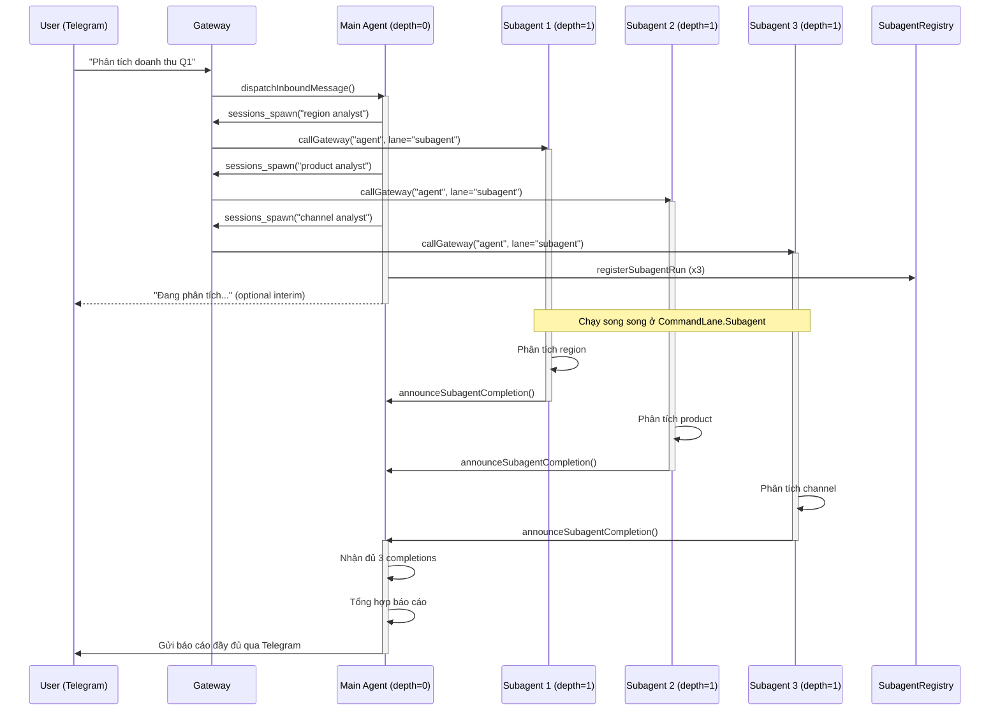
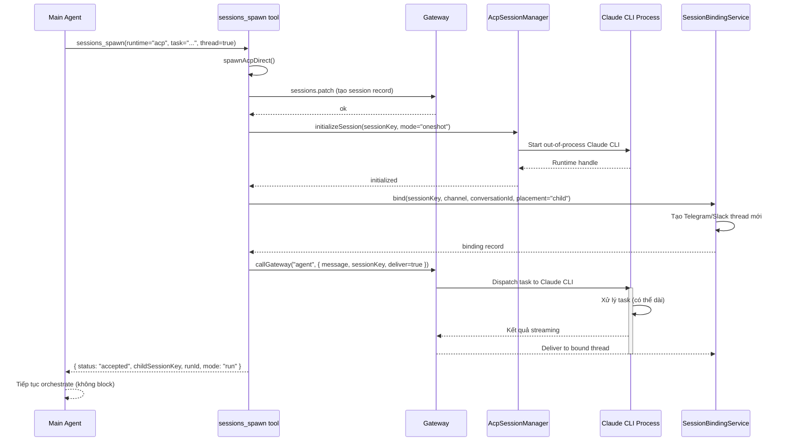
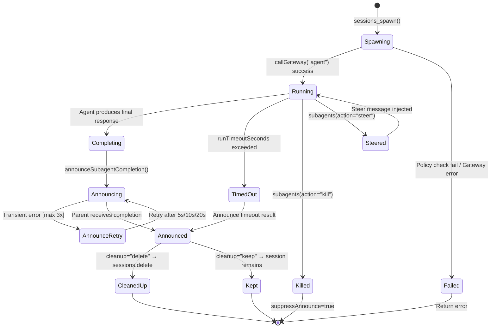

# Điều phối Agent & Sub-Agent trong OpenClaw

> **Query**: Flow điều phối agent, sub-agent, báo cáo chi tiết, ví dụ thực tế, luồng hoạt động, sơ đồ từ source code
>
> **Output**: `D:\PROJECT\CCN2\research_doc\open_claw\Q&A\agent-subagent-flow.md`
>
> **Source analyzed**: `src/agents/`, `src/acp/`, `src/process/lanes.ts`

---

## 1. Tổng quan kiến trúc

OpenClaw hỗ trợ **2 loại spawn** để điều phối tác vụ phức tạp:

| Loại | Session key pattern | Runtime | Mục đích |
|------|-------------------|---------|---------|
| **Subagent** | `agent:<id>:subagent:<uuid>` | In-process (Pi embedded) | Tác vụ song song nhanh, dùng cùng node process |
| **ACP Session** | `agent:<id>:acp:<uuid>` | Out-of-process (Codex, Claude Code...) | Tác vụ nặng cần CLI riêng biệt |

Ngoài ra có **3 loại role** trong cây subagent:

```
depth=0  →  main (agent chính, xử lý người dùng)
depth=1  →  orchestrator (có thể tiếp tục spawn children)
depth=N  →  leaf (leaf worker, KHÔNG được spawn thêm)
```

```
DEFAULT_SUBAGENT_MAX_SPAWN_DEPTH = 1   ← default chỉ 1 cấp
maxChildrenPerAgent              = 5   ← tối đa 5 con cùng lúc
```

**Source**: `src/config/agent-limits.ts`

---

## 2. 4 CommandLane — Concurrency Isolation

OpenClaw dùng **lane system** để cô lập concurrent execution:

```typescript
// src/process/lanes.ts
export const enum CommandLane {
  Main     = "main",      // agent chính xử lý user message
  Cron     = "cron",      // cron job trigger
  Subagent = "subagent",  // subagent execution lane
  Nested   = "nested",    // nested agent (không kế thừa cron lane)
}
```

```typescript
// src/agents/lanes.ts
export function resolveNestedAgentLane(lane?: string): string {
  // Nested agent KHÔNG được dùng "cron" lane — cron đang giữ lane đó
  if (!trimmed || trimmed === "cron") {
    return AGENT_LANE_NESTED;
  }
  return trimmed;
}

// src/agents/pi-embedded-runner/lanes.ts
export function resolveSessionLane(key: string) {
  // ACP session có lane riêng: "session:<sessionKey>"
  return cleaned.startsWith("session:") ? cleaned : `session:${cleaned}`;
}
```

**Ý nghĩa thực tế**: Mỗi subagent chạy ở lane `subagent` → không block main lane → user vẫn nhận được phản hồi từ agent chính trong khi subagent đang chạy ngầm.

---

## 3. Tool `sessions_spawn` — Entry Point

Agent LLM gọi tool `sessions_spawn` để tạo subagent hoặc ACP session:

```typescript
// src/agents/tools/sessions-spawn-tool.ts

// Schema đầy đủ
const SessionsSpawnToolSchema = Type.Object({
  task: Type.String(),              // mô tả nhiệm vụ (required)
  label: Type.Optional(Type.String()), // tên gọi dễ nhớ
  runtime: optionalStringEnum(["subagent", "acp"]),  // loại spawn
  agentId: Type.Optional(Type.String()),   // target agent id
  model: Type.Optional(Type.String()),     // model override
  thinking: Type.Optional(Type.String()), // thinking level
  runTimeoutSeconds: Type.Optional(Type.Number()),
  thread: Type.Optional(Type.Boolean()),  // gắn vào Slack/Telegram thread?
  mode: optionalStringEnum(["run", "session"]),
  cleanup: optionalStringEnum(["delete", "keep"]),
  sandbox: optionalStringEnum(["inherit", "require"]),
  streamTo: optionalStringEnum(["parent"]),  // ACP only
  attachments: Type.Optional(Type.Array(...)),  // inline files
});
```

**Routing logic trong `execute()`**:

```typescript
// Nếu runtime="acp" → spawnAcpDirect()
if (runtime === "acp") {
  const result = await spawnAcpDirect({ task, agentId, ... }, ctx);
  return jsonResult(result);
}

// Ngược lại → spawnSubagentDirect()
const result = await spawnSubagentDirect({ task, ... }, ctx);
return jsonResult(result);
```

---

## 4. Flow Subagent (runtime="subagent")

### 4.1 Hàm `spawnSubagentDirect()` — `src/agents/subagent-spawn.ts`

Đây là hàm trung tâm, thực hiện 9 bước:

```
[Step 1] Validate agentId (regex [a-z0-9][a-z0-9_-]{0,63})
[Step 2] Kiểm tra depth limit (callerDepth >= maxSpawnDepth → forbidden)
[Step 3] Kiểm tra maxChildrenPerAgent (activeChildren >= 5 → forbidden)
[Step 4] Kiểm tra allowAgents whitelist
[Step 5] Tạo childSessionKey = "agent:<targetId>:subagent:<uuid>"
[Step 6] Resolve sandbox policy + model override + thinking level
[Step 7] Thread binding (nếu thread=true, gọi subagent_spawning hook)
[Step 8] callGateway("agent", {message, sessionKey, lane: "subagent"})
[Step 9] registerSubagentRun() + emit subagent_spawned hook
```

**Kiểm tra depth** (từ source):

```typescript
// src/agents/subagent-spawn.ts:334-342
const callerDepth = getSubagentDepthFromSessionStore(requesterInternalKey, { cfg });
const maxSpawnDepth = cfg.agents?.defaults?.subagents?.maxSpawnDepth ?? DEFAULT_SUBAGENT_MAX_SPAWN_DEPTH;

if (callerDepth >= maxSpawnDepth) {
  return {
    status: "forbidden",
    error: `sessions_spawn is not allowed at this depth (current depth: ${callerDepth}, max: ${maxSpawnDepth})`,
  };
}
```

**Tạo childSessionKey** (từ source):

```typescript
// src/agents/subagent-spawn.ts:374
const childSessionKey = `agent:${targetAgentId}:subagent:${crypto.randomUUID()}`;
```

**Dispatch sang gateway** (từ source):

```typescript
// src/agents/subagent-spawn.ts:609-628
const response = await callGateway<{ runId: string }>({
  method: "agent",
  params: {
    message: childTaskMessage,
    sessionKey: childSessionKey,
    channel: requesterOrigin?.channel,
    idempotencyKey: childIdem,
    deliver: false,          // ← KHÔNG gửi kết quả trực tiếp cho user
    lane: AGENT_LANE_SUBAGENT, // ← chạy ở lane "subagent"
    extraSystemPrompt: childSystemPrompt,
    thinking: thinkingOverride,
    timeout: runTimeoutSeconds,
  },
  timeoutMs: 10_000,
});
```

### 4.2 System Prompt của Subagent

OpenClaw inject system prompt đặc biệt vào mỗi subagent (`buildSubagentSystemPrompt()`):

```
# Subagent Context

You are a **subagent** spawned by the main agent for a specific task.

## Your Role
- You were created to handle: <task>
- Complete this task. That's your entire purpose.
- You are NOT the main agent. Don't try to be.

## Rules
1. **Stay focused** - Do your assigned task, nothing else
2. **Complete the task** - Your final message will be automatically reported to the main agent
3. **Don't initiate** - No heartbeats, no proactive actions, no side quests
4. **Be ephemeral** - You may be terminated after task completion.
5. **Trust push-based completion** - do not busy-poll for status.
6. **Recover from compacted/truncated tool output** - handle [compacted: ...] tokens.

## Sub-Agent Spawning (nếu role=orchestrator)
You CAN spawn your own sub-agents using `sessions_spawn`.
Auto-announce is push-based. After spawning children, do NOT call sessions_list,
sessions_history, exec sleep, or any polling tool.
Track expected child session keys and only send your final answer after ALL
expected completions arrive.
If a child completion event arrives AFTER your final answer, reply ONLY with NO_REPLY.
```

**Source**: `src/agents/subagent-announce.ts:896-987`

---

## 5. Flow ACP Session (runtime="acp")

### 5.1 Sự khác biệt so với Subagent

| Tiêu chí | Subagent | ACP Session |
|---------|---------|------------|
| Process | In-process | Out-of-process (Codex/Claude CLI) |
| Session key | `agent:*:subagent:<uuid>` | `agent:*:acp:<uuid>` |
| Persistence | Ephemeral (oneshot) | Persistent (có thể resume) |
| Thread bind | Via `subagent_spawning` hook | Via `SessionBindingService` |
| Stream output | Không có | `streamTo="parent"` relay |
| Attachments | ✅ Hỗ trợ | ❌ Chưa hỗ trợ |

### 5.2 Hàm `spawnAcpDirect()` — `src/agents/acp-spawn.ts`

```typescript
// src/agents/acp-spawn.ts:403-762
export async function spawnAcpDirect(params, ctx): Promise<SpawnAcpResult> {
  // 1. Check acp.enabled policy
  if (!isAcpEnabledByPolicy(cfg)) return { status: "forbidden", ... };

  // 2. Resolve spawnMode: "run" (oneshot) | "session" (persistent)
  const spawnMode = resolveSpawnMode({ requestedMode, threadRequested });

  // 3. Tạo sessionKey: "agent:<targetId>:acp:<uuid>"
  const sessionKey = `agent:${targetAgentId}:acp:${crypto.randomUUID()}`;

  // 4. sessions.patch → tạo session record trong gateway
  await callGateway({ method: "sessions.patch", params: { key: sessionKey } });

  // 5. acpManager.initializeSession → khởi động out-of-process backend
  const initialized = await acpManager.initializeSession({
    cfg, sessionKey, agent: targetAgentId,
    mode: runtimeMode,  // "oneshot" | "persistent"
    resumeSessionId,    // nếu resume session cũ
  });

  // 6. Thread binding (nếu thread=true)
  if (preparedBinding) {
    binding = await bindingService.bind({
      targetSessionKey: sessionKey,
      targetKind: "session",
      conversation: { channel, accountId, conversationId },
      placement: "child",
    });
  }

  // 7. Dispatch task
  await callGateway({
    method: "agent",
    params: { message: task, sessionKey, deliver: useInlineDelivery },
  });

  return { status: "accepted", childSessionKey: sessionKey, runId, mode };
}
```

---

## 6. Auto-Announce — Cơ chế Push-Based Completion

Đây là cơ chế quan trọng nhất của orchestration: **subagent TỰ ĐỘNG báo kết quả về parent** khi hoàn thành.

### 6.1 Nguyên lý

```
Subagent hoàn thành
    ↓
subagent-announce.ts: announceSubagentCompletion()
    ↓
Tìm requesterSessionKey (parent)
    ↓
queueEmbeddedPiMessage(parentSessionKey, completionText)
    ↓
Parent agent nhận completion như "user message"
    ↓
Parent xử lý: tổng hợp hoặc reply NO_REPLY
```

### 6.2 Retry với transient errors

```typescript
// src/agents/subagent-announce.ts:65-67
const DIRECT_ANNOUNCE_TRANSIENT_RETRY_DELAYS_MS = [5_000, 10_000, 20_000];
// Retry sau 5s, 10s, 20s nếu lỗi transient

// Các lỗi transient được retry:
const TRANSIENT_ANNOUNCE_DELIVERY_ERROR_PATTERNS = [
  /\berrorcode=unavailable\b/i,
  /no active .* listener/i,
  /gateway not connected/i,
  /gateway timeout/i,
  /\b(econnreset|econnrefused|etimedout)\b/i,
];

// Các lỗi permanent (KHÔNG retry):
const PERMANENT_ANNOUNCE_DELIVERY_ERROR_PATTERNS = [
  /unsupported channel/i,
  /bot was blocked by the user/i,
  /forbidden: bot was kicked/i,
];
```

### 6.3 Frozen Result — Bảo toàn kết quả

Khi subagent kết thúc, kết quả được "đóng băng" vào `SubagentRunRecord`:

```typescript
// src/agents/subagent-registry.types.ts
type SubagentRunRecord = {
  frozenResultText?: string | null;       // kết quả cuối
  fallbackFrozenResultText?: string | null; // backup nếu NO_REPLY race
  expectsCompletionMessage?: boolean;
  wakeOnDescendantSettle?: boolean;       // chờ con cháu settle rồi mới announce
};
```

---

## 7. Subagent Control — `subagents` Tool

Parent agent dùng tool `subagents` để quản lý con:

```typescript
// src/agents/tools/subagents-tool.ts
// 3 actions:
subagents({ action: "list" })   // xem danh sách + status
subagents({ action: "kill", target: "runId" })   // kill 1 hoặc "all"
subagents({ action: "steer", target: "runId", message: "..." }) // inject message vào subagent đang chạy
```

**Rate limit cho steer**: `STEER_RATE_LIMIT_MS = 2_000` (2 giây giữa các lần steer)

**Cascade kill**: Khi kill một orchestrator → tự động kill tất cả children của nó.

---

## 8. Lifecycle Events

Subagent có 5 kết quả lifecycle:

```typescript
// src/agents/subagent-lifecycle-events.ts
type SubagentLifecycleEndedOutcome =
  | "ok"       // hoàn thành bình thường
  | "error"    // lỗi runtime
  | "timeout"  // hết runTimeoutSeconds
  | "killed"   // bị parent kill
  | "reset"    // session bị reset
  | "deleted"; // session bị xóa
```

Hooks tương ứng:
- `subagent_spawning` — trước khi spawn (dùng để tạo thread)
- `subagent_spawned` — sau khi spawn thành công
- `subagent_ended` — khi subagent kết thúc (any outcome)

---

## 9. Ví dụ Thực Tế: Phân tích Báo Cáo Doanh Thu

**Scenario**: User nhắn trên Telegram: _"Phân tích doanh thu Q1 2025: chia theo region, theo product, theo channel, tổng hợp thành báo cáo"_

Agent chính quyết định spawn **3 subagent song song** + **1 orchestrator tổng hợp**.

### Step-by-step

```
User (Telegram) → "Phân tích doanh thu Q1 2025"
    ↓
Gateway (chat.send handler)
    ↓
dispatchInboundMessage() → runEmbeddedPiAgent()
    ↓
Agent chính [depth=0, role=main]
    ├─ Think: "Cần 3 phân tích song song"
    ├─ sessions_spawn(task="Phân tích theo region", label="region-analyst")
    │    → childSessionKey = "agent:assistant:subagent:uuid-1"
    │    → Gateway "agent" method, lane="subagent"
    ├─ sessions_spawn(task="Phân tích theo product", label="product-analyst")
    │    → childSessionKey = "agent:assistant:subagent:uuid-2"
    ├─ sessions_spawn(task="Phân tích theo channel", label="channel-analyst")
    │    → childSessionKey = "agent:assistant:subagent:uuid-3"
    └─ Trả về (KHÔNG poll) → "đang xử lý, đợi kết quả..."
```

**3 subagents chạy song song ở `CommandLane.Subagent`:**

```
[uuid-1] region-analyst [depth=1, role=leaf]
   → Đọc data, tính toán, trả về text summary
   → announceSubagentCompletion() → push vào parent queue

[uuid-2] product-analyst [depth=1, role=leaf]
   → Đọc data, tính toán, trả về text summary
   → announceSubagentCompletion() → push vào parent queue

[uuid-3] channel-analyst [depth=1, role=leaf]
   → Đọc data, tính toán, trả về text summary
   → announceSubagentCompletion() → push vào parent queue
```

**Parent nhận announcements (như "user messages"):**

```
[Parent nhận message từ uuid-1]: "Kết quả region: HCM +23%, HN +15%..."
[Parent nhận message từ uuid-2]: "Kết quả product: SP-A dẫn đầu..."
[Parent nhận message từ uuid-3]: "Kết quả channel: online +40%..."
[Parent thấy đủ 3] → Tổng hợp → trả về Telegram
```

---

## 10. Sơ đồ Sequence: Subagent Orchestration



---

## 11. Sơ đồ Sequence: ACP Session Spawn



---

## 12. Sơ đồ State Machine: Subagent Lifecycle



---

## 13. Guardrails & Safety

### 13.1 Depth Guard

```typescript
DEFAULT_SUBAGENT_MAX_SPAWN_DEPTH = 1  // default: chỉ 1 cấp

// Khi depth=1 và maxSpawnDepth=1: role="leaf", canSpawn=false
export function resolveSubagentCapabilities(params: { depth; maxSpawnDepth }) {
  const role = depth <= 0 ? "main" : depth < maxSpawnDepth ? "orchestrator" : "leaf";
  return {
    canSpawn: role === "main" || role === "orchestrator",
    canControlChildren: role !== "leaf",
  };
}
```

### 13.2 Children Limit

```typescript
const maxChildren = cfg.agents?.defaults?.subagents?.maxChildrenPerAgent ?? 5;
const activeChildren = countActiveRunsForSession(requesterInternalKey);
if (activeChildren >= maxChildren) {
  return { status: "forbidden", error: "..." };
}
```

### 13.3 AgentId Whitelist

```typescript
// Một agent chỉ được spawn agent khác nếu được whitelist:
const allowAgents = resolveAgentConfig(cfg, requesterAgentId)?.subagents?.allowAgents ?? [];
// [] = chỉ cho phép spawn chính mình
// ["*"] = cho phép spawn bất kỳ agent nào
```

### 13.4 Sandbox Isolation

```typescript
// Sandboxed session không thể spawn unsandboxed subagent:
if (!childRuntime.sandboxed && requesterRuntime.sandboxed) {
  return { status: "forbidden",
    error: "Sandboxed sessions cannot spawn unsandboxed subagents." };
}
```

---

## 14. Config Reference

```yaml
# openclaw.config.yaml
agents:
  defaults:
    subagents:
      maxSpawnDepth: 2          # cho phép orchestrator (depth=1) spawn leaf (depth=2)
      maxChildrenPerAgent: 5    # tối đa 5 con đồng thời
      maxConcurrent: 8          # tổng số subagent chạy song song trên toàn system
      runTimeoutSeconds: 300    # 5 phút timeout mặc định
      announceTimeoutMs: 60000  # 60s chờ announce
      cleanup: "keep"           # giữ session sau khi hoàn thành
      allowAgents:
        - "*"                   # cho phép spawn bất kỳ agent nào

acp:
  enabled: true
  defaultAgent: "codex"
  backend: "codex"
```

---

## 15. Comparison: Subagent vs ACP vs Cron

| Tiêu chí | Subagent | ACP Session | Cron Job |
|---------|---------|------------|---------|
| **Trigger** | `sessions_spawn` (agent tool call) | `sessions_spawn` (agent tool call) | Schedule / Webhook |
| **Initiator** | Agent LLM | Agent LLM | System Timer / HTTP |
| **Process** | In-process | Out-of-process CLI | In-process |
| **Session key** | `:subagent:` | `:acp:` | `:cron:` |
| **Lane** | `subagent` | `session:<key>` | `cron` |
| **Max depth** | maxSpawnDepth | N/A | 0 (cron không spawn cron) |
| **Completion** | Auto-announce push | Thread delivery / streamTo | Delivery system |
| **Timeout** | runTimeoutSeconds | Không giới hạn | Backoff policy |
| **Cleanup** | delete / keep | Session management | deleteAfterRun |
| **Use case** | Parallel sub-tasks | Heavy CLI workloads | Recurring automation |

---

## 16. Key Files Summary

| File | Vai trò |
|------|---------|
| `src/agents/subagent-spawn.ts` | `spawnSubagentDirect()` — core spawn logic |
| `src/agents/acp-spawn.ts` | `spawnAcpDirect()` — ACP session spawn |
| `src/agents/tools/sessions-spawn-tool.ts` | `sessions_spawn` tool definition |
| `src/agents/tools/subagents-tool.ts` | `subagents` tool (list/kill/steer) |
| `src/agents/subagent-announce.ts` | Auto-announce completion, retry logic |
| `src/agents/subagent-capabilities.ts` | Role resolution (main/orchestrator/leaf) |
| `src/agents/subagent-registry.types.ts` | `SubagentRunRecord` type definition |
| `src/agents/subagent-lifecycle-events.ts` | Lifecycle outcome types |
| `src/agents/lanes.ts` | Lane constants |
| `src/process/lanes.ts` | `CommandLane` enum |
| `src/config/agent-limits.ts` | `DEFAULT_SUBAGENT_MAX_SPAWN_DEPTH = 1` |

---

*Generated: 2026-03-17 | Query: agent/sub-agent orchestration flow | Source: OpenClaw src/agents/*
