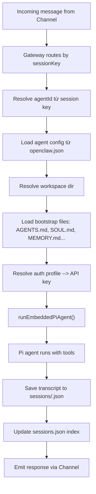

# Q: Trong OpenClaw, Agent được quản lý như thế nào và lưu thông tin ở đâu?

**Date**: 2026-03-17
**Depth**: module + file analysis
**Sources**: `src/agents/`, `src/config/sessions/`, `src/routing/`, `src/gateway/`

---

## 1. Agent là gì trong OpenClaw?

Trong OpenClaw, **Agent** là một cấu hình logic đại diện cho một "nhân vật AI" độc lập, với:
- Model riêng (có thể khác nhau giữa các agent)
- Workspace directory riêng
- Skills/tools được phép sử dụng
- Identity, memory, và bootstrap files riêng

Mỗi agent có một `agentId` dạng `[a-z0-9_-]{1,64}` (lowercase). Agent mặc định có ID là `"main"`.

---

## 2. Cấu hình Agent — Nơi khai báo

### File config: `openclaw.json` (hoặc `~/.openclaw/openclaw.json`)

```json
{
  "agents": {
    "defaults": {
      "model": "claude-opus-4",
      "workspace": "~/my-workspace"
    },
    "list": [
      {
        "id": "main",
        "default": true,
        "name": "Cốm Đào",
        "model": { "primary": "claude-sonnet-4-6", "fallbacks": ["claude-haiku-4-5"] },
        "workspace": "~/openclaw/workspace",
        "agentDir": "~/openclaw/agents/main/agent",
        "skills": ["brainstorming", "tdd"],
        "memorySearch": true,
        "identity": { ... },
        "subagents": { "maxDepth": 3 },
        "tools": { ... }
      },
      {
        "id": "coder",
        "model": "claude-sonnet-4-6",
        "workspace": "~/projects"
      }
    ]
  }
}
```

**Source**: `src/agents/agent-scope.ts` — `listAgentEntries()`, `resolveAgentConfig()`

---

## 3. Session Key — Cách định danh một cuộc hội thoại

Mỗi tin nhắn/cuộc hội thoại được đánh địa chỉ bằng **session key** theo format:

```
agent:<agentId>:<context>
```

Ví dụ:
```
agent:main:telegram:direct:user123
agent:coder:discord:guild-abc:channel-dev
agent:main:cron:backup-job:run:abc123
agent:main:subagent:main:abc123          ← subagent session
```

**Rules:**
- `isCronSessionKey()` → key chứa `:cron:`
- `isSubagentSessionKey()` → key chứa `subagent:`
- `getSubagentDepth()` → đếm số lần `:subagent:` để chống lồng vô hạn
- Session ID (UUID) sinh ra per-run riêng biệt với session key

**Source**: `src/sessions/session-key-utils.ts`, `src/routing/session-key.ts`

---

## 4. Filesystem Layout — Lưu ở đâu

### State Directory (root)
```
~/.openclaw/                     ← DEFAULT_STATE_DIR
                                   (hoặc OPENCLAW_STATE_DIR env)
```

### Cấu trúc đầy đủ:
```
~/.openclaw/
├── openclaw.json                ← Main config file
│
├── agents/
│   ├── main/                    ← Agent ID = "main"
│   │   ├── agent/               ← agentDir (auth, API keys)
│   │   │   ├── auth.json        ← API keys & OAuth tokens (AUTH_PROFILE_FILENAME)
│   │   │   └── auth-v1.json     ← Legacy auth format
│   │   └── sessions/            ← All sessions for this agent
│   │       ├── sessions.json    ← Session index/store
│   │       ├── <uuid>.json      ← Individual session transcript
│   │       └── archive/         ← Archived/completed sessions
│   │           └── <timestamp>-<uuid>-<reason>.json
│   │
│   └── coder/                   ← Agent ID = "coder"
│       ├── agent/
│       │   └── auth.json
│       └── sessions/
│           └── ...
│
└── workspace/                   ← Default workspace (per agent hoặc shared)
    ├── AGENTS.md                ← Agent instructions (wakeup guideline)
    ├── SOUL.md                  ← Agent identity/personality
    ├── TOOLS.md                 ← Available tools description
    ├── IDENTITY.md              ← Agent identity file
    ├── USER.md                  ← User profile/preferences
    ├── HEARTBEAT.md             ← Heartbeat/scheduled task config
    ├── BOOTSTRAP.md             ← Onboarding guide (deleted after onboarding)
    ├── MEMORY.md                ← Agent memory (persistent)
    ├── .openclaw/
    │   └── workspace-state.json ← Onboarding state tracking
    └── .git/                    ← Git repo (auto-init nếu git available)
```

### Path Resolution Logic:
```typescript
// State dir
resolveStateDir()  // → ~/.openclaw (hoặc OPENCLAW_STATE_DIR)

// Agent dir (auth keys)
resolveAgentDir(cfg, agentId)  // → ~/.openclaw/agents/<id>/agent

// Sessions dir
resolveAgentSessionsDir(agentId)  // → ~/.openclaw/agents/<id>/sessions

// Session transcript file
resolveSessionFilePath(sessionId, storePath)  // → <sessionsDir>/<uuid>.json

// Workspace dir
resolveAgentWorkspaceDir(cfg, agentId)  // → config.workspace || ~/.openclaw/workspace
```

**Sources**: `src/config/paths.ts`, `src/config/sessions/paths.ts`, `src/agents/agent-paths.ts`, `src/agents/agent-scope.ts:resolveAgentDir()`

---

## 5. Workspace Bootstrap Files — Bộ nhớ dài hạn

Khi agent khởi động, nó đọc các file từ workspace directory:

| File | Mục đích | Ghi chú |
|------|----------|---------|
| `AGENTS.md` | Wakeup guideline, task instructions | Template → user tùy chỉnh |
| `SOUL.md` | Core identity/personality | Template → user tùy chỉnh |
| `TOOLS.md` | Tool descriptions | Template |
| `IDENTITY.md` | Agent identity | Template → user tùy chỉnh |
| `USER.md` | User profile | Template → user tùy chỉnh |
| `HEARTBEAT.md` | Heartbeat/schedule config | Template |
| `MEMORY.md` | Persistent memory (ghi nhớ giữa sessions) | User/agent tự ghi |
| `BOOTSTRAP.md` | Onboarding instructions | Xóa sau khi onboarding xong |

**Source**: `src/agents/workspace.ts` — `loadWorkspaceBootstrapFiles()`

**Quan trọng**: Subagent và cron sessions chỉ nhận **minimal bootstrap** (AGENTS, TOOLS, SOUL, IDENTITY, USER) — không có MEMORY/HEARTBEAT để tránh bloat.

---

## 6. Auth Profiles — Lưu API Keys ở đâu

```
~/.openclaw/agents/<agentId>/agent/auth.json
```

**Format** (`AuthProfileStore`):
```json
{
  "version": 1,
  "profiles": {
    "anthropic": {
      "type": "api-key",
      "apiKey": "sk-ant-...",
      "lastUsed": "2026-03-17T...",
      "lastGood": "2026-03-17T..."
    },
    "openai": { ... }
  }
}
```

**Features**:
- Cooldown tracking khi API key lỗi
- Round-robin ordering cho multiple keys
- Rotation tự động khi key fail

**Source**: `src/agents/auth-profiles/paths.ts`, `src/agents/auth-profiles/store.ts`

---

## 7. Session Transcript — Lưu lịch sử hội thoại

```
~/.openclaw/agents/<agentId>/sessions/
├── sessions.json         ← Index: { sessions: { [key]: SessionEntry } }
└── <uuid>.json           ← Transcript: array of AgentMessage
```

**SessionEntry** (trong `sessions.json`):
```typescript
{
  sessionId: string;     // UUID
  sessionKey: string;    // "agent:main:telegram:..."
  agentId: string;
  createdAt: string;     // ISO timestamp
  updatedAt: string;
  firstUserMessage?: string;
  lastMessagePreview?: string;
}
```

**Transcript file** (`<uuid>.json`): array of messages, format từ `@mariozechner/pi-coding-agent`

**Archive**: Sessions cũ được archive sang `sessions/archive/<timestamp>-<uuid>-<reason>.json`

**Source**: `src/config/sessions/paths.ts`, `src/gateway/session-utils.fs.ts`

---

## 8. Agent Lifecycle — Vòng đời một agent run



**Lane Concurrency** (từ `src/gateway/server-lanes.ts`):
- `CommandLane.Main` — cho agent requests thường (default: 1 concurrent)
- `CommandLane.Subagent` — cho subagent spawns
- `CommandLane.Cron` — cho scheduled tasks (default: 1 concurrent)

---

## 9. Subagent Management

Subagent có session key dạng:
```
agent:main:subagent:main:<original-key>
```

Giới hạn depth: `getSubagentDepth()` đếm `:subagent:` occurrences → có thể cấu hình `subagents.maxDepth` trong config.

Subagent chỉ nhận minimal bootstrap files (không có MEMORY.md, HEARTBEAT.md) để tránh context bloat.

**Source**: `src/sessions/session-key-utils.ts:isSubagentSessionKey()`, `src/agents/agent-scope.ts`

---

## Tóm Tắt Ngắn

| Loại data | Nơi lưu |
|-----------|---------|
| Agent config (model, skills, workspace) | `~/.openclaw/openclaw.json` → `agents.list[]` |
| API keys / auth tokens | `~/.openclaw/agents/<id>/agent/auth.json` |
| Session transcripts | `~/.openclaw/agents/<id>/sessions/<uuid>.json` |
| Session index | `~/.openclaw/agents/<id>/sessions/sessions.json` |
| Long-term memory | `~/.openclaw/workspace/MEMORY.md` |
| Identity/personality | `~/.openclaw/workspace/SOUL.md`, `IDENTITY.md` |
| Workspace onboarding state | `~/.openclaw/workspace/.openclaw/workspace-state.json` |

---

*Generated: 2026-03-17 | Source: OpenClaw codebase analysis*
