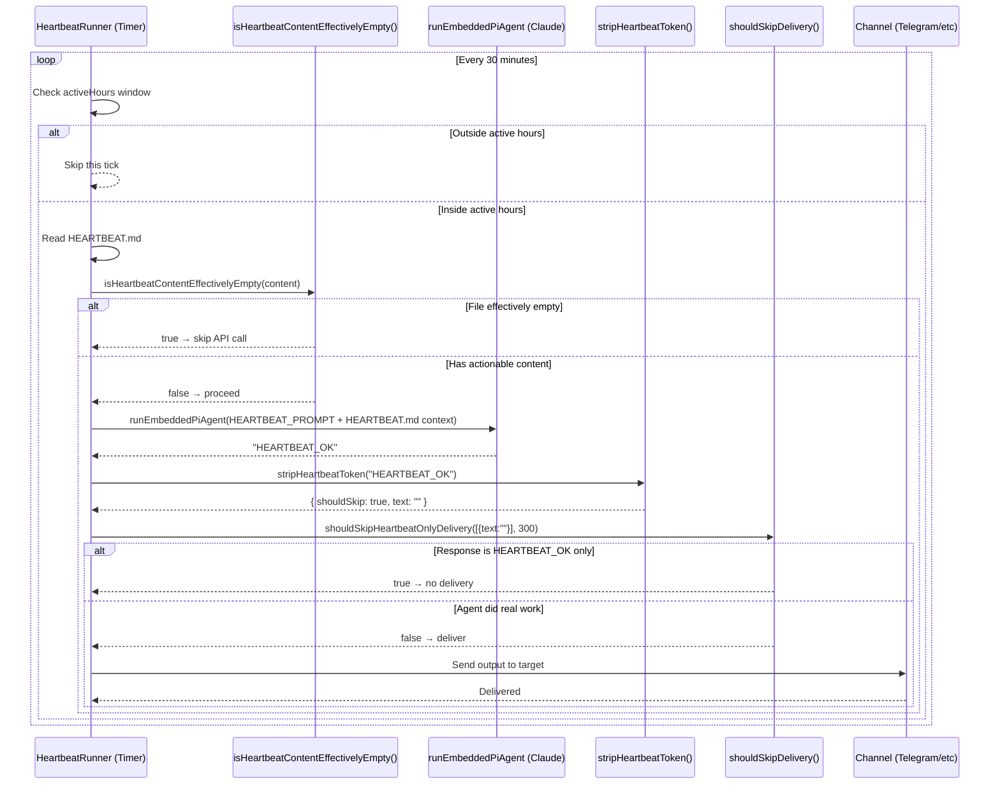
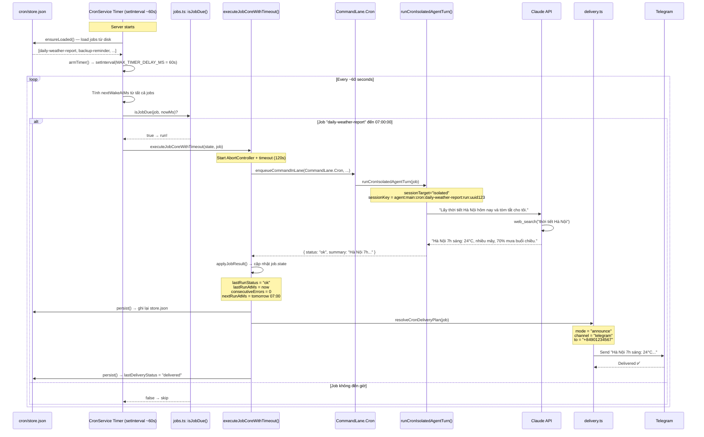
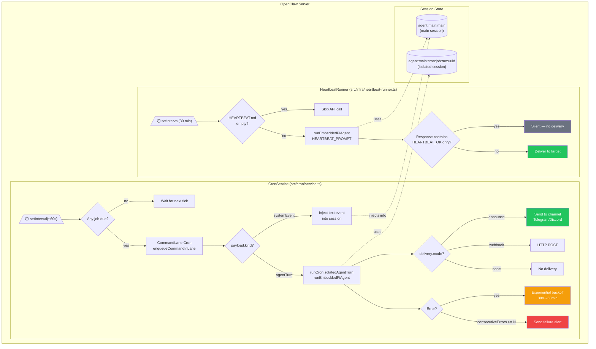
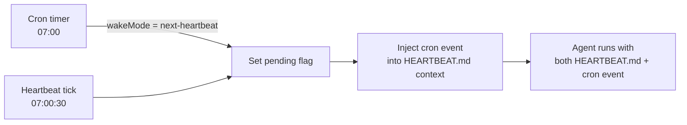

# Q: Cron Job và Heartbeat trong OpenClaw — Giải thích chi tiết và so sánh

**Date**: 2026-03-17
**Depth**: file analysis
**Sources**: `src/cron/`, `src/infra/heartbeat-runner.ts`, `src/auto-reply/heartbeat.ts`, `src/config/types.agent-defaults.ts`

---

## Tổng quan

OpenClaw có **2 cơ chế chạy task tự động** theo thời gian:

| | Heartbeat | Cron Job |
|---|-----------|----------|
| Mục đích | Background "health check" định kỳ | Lịch task tùy chỉnh, gửi output |
| Cấu hình | Vài dòng trong `openclaw.json` | Mỗi job là 1 object đầy đủ |
| Payload | Đọc `HEARTBEAT.md`, chạy AI | `systemEvent` hoặc `agentTurn` |
| Output | Suppress nếu `HEARTBEAT_OK` | Announce / Webhook / None |
| Retry logic | Không | Có (exponential backoff) |
| Failure alert | Không | Có (channel + cooldown) |
| Session key | `agent:main:main` hoặc configured | `agent:main:cron:<name>:run:<uuid>` |

---

## PHẦN 1 — HEARTBEAT

### 1.1 Heartbeat là gì?

Heartbeat là một **background timer định kỳ** kích hoạt agent để kiểm tra xem có task cần làm không. Nó đọc file `HEARTBEAT.md` trong workspace và hỏi agent: "Có gì cần làm không?"

**Nếu không có gì → agent trả về `HEARTBEAT_OK` → OpenClaw suppresses output, không gửi gì.**

### 1.2 Source: Token và Prompt mặc định

```typescript
// src/auto-reply/tokens.ts:3
export const HEARTBEAT_TOKEN = "HEARTBEAT_OK";

// src/auto-reply/heartbeat.ts:6-8
export const HEARTBEAT_PROMPT =
  "Read HEARTBEAT.md if it exists (workspace context). Follow it strictly. " +
  "Do not infer or repeat old tasks from prior chats. " +
  "If nothing needs attention, reply HEARTBEAT_OK.";
export const DEFAULT_HEARTBEAT_EVERY = "30m";
export const DEFAULT_HEARTBEAT_ACK_MAX_CHARS = 300;
```

### 1.3 Cấu hình Heartbeat

```json
// openclaw.json
{
  "agents": {
    "defaults": {
      "heartbeat": {
        "every": "30m",
        "target": "telegram",
        "to": "+84901234567",
        "prompt": "Read HEARTBEAT.md. Do scheduled tasks if any. Reply HEARTBEAT_OK if nothing.",
        "ackMaxChars": 300,
        "activeHours": {
          "start": "08:00",
          "end": "22:00",
          "timezone": "Asia/Ho_Chi_Minh"
        },
        "model": "claude-haiku-4-5",
        "session": "main",
        "lightContext": true
      }
    }
  }
}
```

**Config fields** (`src/config/types.agent-defaults.ts:221`):

| Field | Default | Mô tả |
|-------|---------|-------|
| `every` | `"30m"` | Interval (duration string: `"30m"`, `"1h"`, `"15m"`) |
| `target` | `"none"` | Gửi output đến đâu: `"last"`, `"none"`, `"telegram"`, ... |
| `to` | - | Phone/chat ID nếu dùng Telegram/WhatsApp |
| `prompt` | HEARTBEAT_PROMPT | Custom prompt thay thế default |
| `ackMaxChars` | `300` | Nếu response ≤ N chars sau khi strip token → suppress |
| `activeHours` | - | Chỉ chạy trong khung giờ này |
| `model` | inherited | Override model cho heartbeat |
| `session` | `"main"` | Session key cho heartbeat runs |
| `lightContext` | `false` | Nếu true: chỉ load `HEARTBEAT.md`, bỏ qua MEMORY.md, SOUL.md... |
| `suppressToolErrorWarnings` | `false` | Suppress tool error payloads |

### 1.4 Suppress Logic — Khi nào KHÔNG gửi output?

```typescript
// src/cron/heartbeat-policy.ts:9
export function shouldSkipHeartbeatOnlyDelivery(
  payloads: HeartbeatDeliveryPayload[],
  ackMaxChars: number,
): boolean {
  if (payloads.length === 0) return true;

  // Nếu có media (ảnh/file) → luôn gửi
  const hasAnyMedia = payloads.some(p => (p.mediaUrls?.length ?? 0) > 0);
  if (hasAnyMedia) return false;

  // Nếu text chỉ chứa HEARTBEAT_OK (và ≤ ackMaxChars) → suppress
  return payloads.some((payload) => {
    const result = stripHeartbeatToken(payload.text, {
      mode: "heartbeat",
      maxAckChars: ackMaxChars,  // default: 300
    });
    return result.shouldSkip;
  });
}
```

**Quy tắc suppress**:
- Response = `"HEARTBEAT_OK"` → suppress ✅
- Response = `"HEARTBEAT_OK. Không có gì."` (≤ 300 chars) → suppress ✅
- Response = `"HEARTBEAT_OK. Đã gửi báo cáo doanh thu tháng 3..."` (> 300 chars) → **gửi** ✅
- Response = `"Đã backup database thành công."` (không có token) → **gửi** ✅

### 1.5 HEARTBEAT.md — File task cho agent

```markdown
# HEARTBEAT.md (example)

## Daily Tasks
- [ ] Kiểm tra server health — gửi báo cáo nếu có lỗi
- [ ] Gửi digest email cho team nếu đã 24h kể từ lần cuối

## Weekly (thứ 2)
- [ ] Generate tuần report từ database

## If urgent
- Nếu có ticket P0 chưa assign → notify @oncall
```

**Nếu file chỉ có comments/headers/empty list** → OpenClaw skip luôn, không gọi API:

```typescript
// src/auto-reply/heartbeat.ts:23
export function isHeartbeatContentEffectivelyEmpty(content: string): boolean {
  const lines = content.split("\n");
  for (const line of lines) {
    const trimmed = line.trim();
    if (!trimmed) continue;                        // empty line → ok
    if (/^#+(\s|$)/.test(trimmed)) continue;       // # header → ok
    if (/^[-*+]\s*(\[[\sXx]?\]\s*)?$/.test(trimmed)) continue; // empty list item → ok
    return false;  // Có nội dung thực → không skip
  }
  return true;     // Tất cả đều trống/comment → skip
}
```

### 1.6 Heartbeat Flow Diagram



---

## PHẦN 2 — CRON JOB

### 2.1 Cron Job là gì?

Cron Job là một **scheduled task có đầy đủ config** — tên, lịch chạy, payload (message cho agent), target delivery, failure alerts, retry logic. Được quản lý bởi `CronService`.

**Source**: `src/cron/service.ts:7`

```typescript
export class CronService {
  async start()                             // Khởi động, load jobs từ store
  async list()                              // Liệt kê jobs
  async add(input: CronJobCreate)           // Tạo job mới
  async update(id, patch: CronJobPatch)     // Sửa job
  async remove(id)                          // Xóa job
  async run(id, mode?: "due" | "force")     // Chạy ngay (force/due)
  wake(opts: { mode, text })               // Wake up cron system
}
```

### 2.2 Cấu trúc CronJob — đầy đủ từ source

```typescript
// src/cron/types-shared.ts:1
type CronJobBase = {
  id: string;               // UUID
  agentId?: string;         // Chạy bằng agent nào (default: main)
  sessionKey?: string;      // Override session key
  name: string;             // Tên job hiển thị
  description?: string;
  enabled: boolean;
  deleteAfterRun?: boolean; // One-shot: tự xóa sau khi chạy
  createdAtMs: number;
  updatedAtMs: number;
  schedule: CronSchedule;
  sessionTarget: "main" | "isolated";
  wakeMode: "next-heartbeat" | "now";
  payload: CronPayload;
  delivery?: CronDelivery;
  failureAlert?: CronFailureAlert | false;
  state: CronJobState;      // Runtime state
};

// src/cron/types.ts:5
type CronSchedule =
  | { kind: "at"; at: string }           // One-time: "2026-03-17T09:00:00+07:00"
  | { kind: "every"; everyMs: number; anchorMs?: number }  // Interval: 3600000
  | { kind: "cron"; expr: string; tz?: string; staggerMs?: number };  // Cron: "0 9 * * *"

// Payload types
type CronPayload =
  | { kind: "systemEvent"; text: string }    // Chỉ text event, không gọi AI
  | { kind: "agentTurn"; message: string; model?: string; ... }; // Full AI turn
```

### 2.3 Schedule Types — 3 loại lịch

```typescript
// src/cron/schedule.ts:64
export function computeNextRunAtMs(schedule: CronSchedule, nowMs: number): number | undefined {
  // 1. at: one-time
  if (schedule.kind === "at") {
    const atMs = parseAbsoluteTimeMs(schedule.at);
    return atMs > nowMs ? atMs : undefined;  // undefined = đã qua rồi, không chạy nữa
  }

  // 2. every: fixed interval
  if (schedule.kind === "every") {
    const anchor = schedule.anchorMs ?? nowMs;
    const elapsed = nowMs - anchor;
    const steps = Math.ceil(elapsed / schedule.everyMs);
    return anchor + steps * schedule.everyMs;
  }

  // 3. cron expression: dùng thư viện "croner"
  const cron = new Cron(schedule.expr, { timezone: schedule.tz });
  return cron.nextRun(new Date(nowMs))?.getTime();
}
```

### 2.4 Ví dụ config JSON cho Cron Jobs

```json
// openclaw.json — cron section
{
  "cron": {
    "enabled": true,
    "maxConcurrentRuns": 1,
    "jobs": [
      {
        "id": "daily-weather-report",
        "name": "Daily Weather Report",
        "enabled": true,
        "schedule": { "kind": "cron", "expr": "0 7 * * *", "tz": "Asia/Ho_Chi_Minh" },
        "sessionTarget": "isolated",
        "wakeMode": "now",
        "payload": {
          "kind": "agentTurn",
          "message": "Lấy thời tiết Hà Nội hôm nay và tóm tắt cho tôi.",
          "model": "claude-haiku-4-5",
          "timeoutSeconds": 120
        },
        "delivery": {
          "mode": "announce",
          "channel": "telegram",
          "to": "+84901234567"
        },
        "failureAlert": {
          "after": 2,
          "channel": "telegram",
          "to": "+84901234567",
          "cooldownMs": 3600000
        }
      },
      {
        "id": "backup-reminder",
        "name": "Backup Reminder",
        "enabled": true,
        "schedule": { "kind": "every", "everyMs": 86400000 },
        "sessionTarget": "main",
        "wakeMode": "next-heartbeat",
        "payload": {
          "kind": "systemEvent",
          "text": "[CRON] Daily backup check due"
        },
        "delivery": { "mode": "none" }
      }
    ]
  }
}
```

### 2.5 Retry và Failure Alert

```typescript
// src/cron/service/timer.ts:114
// Exponential backoff khi job lỗi liên tiếp
const DEFAULT_BACKOFF_SCHEDULE_MS = [
  30_000,       // 1st error  →  30 giây
  60_000,       // 2nd error  →   1 phút
  5 * 60_000,   // 3rd error  →   5 phút
  15 * 60_000,  // 4th error  →  15 phút
  60 * 60_000,  // 5th+ error →  60 phút
];

// Transient error patterns — tự động retry
const TRANSIENT_PATTERNS = {
  rate_limit:   /(rate_limit|too many requests|429)/i,
  overloaded:   /\boverloaded(?:_error)?\b|capacity exceeded/i,
  network:      /(network|econnreset|fetch failed)/i,
  timeout:      /(timeout|etimedout)/i,
  server_error: /\b5\d{2}\b/,
};

// Failure alert: chỉ gửi sau N consecutive errors + cooldown
const DEFAULT_FAILURE_ALERT_AFTER = 2;           // Sau 2 lỗi liên tiếp
const DEFAULT_FAILURE_ALERT_COOLDOWN_MS = 60 * 60_000; // 1 giờ cooldown
```

### 2.6 Session Target: `main` vs `isolated`

```typescript
// src/cron/types.ts:16
type CronSessionTarget = "main" | "isolated";
```

| Session Target | Session key | Ý nghĩa |
|----------------|-------------|---------|
| `"main"` | `agent:main:main` | Cron chạy **trong session chính** — có context lịch sử chat |
| `"isolated"` | `agent:main:cron:<name>:run:<uuid>` | Cron có **session riêng biệt** — không có lịch sử, "fresh start" |

**Wake Mode**:
- `"now"` → Chạy ngay khi đến giờ
- `"next-heartbeat"` → Đợi đến heartbeat tick tiếp theo rồi chạy (giảm overhead)

### 2.7 Cron Job Flow — "Báo cáo thời tiết 7h sáng"



---

## PHẦN 3 — SO SÁNH CHI TIẾT

### 3.1 Bảng so sánh đầy đủ

| Tiêu chí | Heartbeat | Cron Job |
|----------|-----------|----------|
| **Kích hoạt bởi** | Internal timer (HeartbeatRunner) | CronService timer |
| **Cấu hình ở** | `agents.defaults.heartbeat` trong config | `cron.jobs[]` trong config hoặc API |
| **Lịch chạy** | Interval đơn giản (`every: "30m"`) | `at` / `every` / cron expression |
| **Payload** | Cố định: đọc HEARTBEAT.md + prompt | `systemEvent` (text) hoặc `agentTurn` (AI) |
| **Session** | Main session (chia sẻ với user chat) | `main` hoặc `isolated` (session riêng) |
| **Session key** | `agent:main:main` | `agent:main:cron:<name>:run:<uuid>` |
| **Output delivery** | Chỉ khi có real work (suppress HEARTBEAT_OK) | `none` / `announce` / `webhook` |
| **Failure alert** | Không | Có (channel, cooldown, `after` N errors) |
| **Retry** | Không | Có (exponential backoff: 30s → 60min) |
| **Context** | Full hoặc `lightContext` (chỉ HEARTBEAT.md) | Full hoặc `lightContext` per job |
| **One-shot** | Không | Có (`deleteAfterRun: true`) |
| **Lane** | Heartbeat lane | `CommandLane.Cron` |
| **Max concurrent** | Không có hàng đợi riêng | `maxConcurrentRuns` (default: 1) |
| **Startup catchup** | Không | Có (chạy bù jobs bị miss khi server off) |
| **Timezone** | `activeHours.timezone` | `schedule.tz` cho cron expression |

### 3.2 Luồng tổng thể — 2 cơ chế song song



### 3.3 Khi nào dùng Heartbeat? Khi nào dùng Cron?

**Dùng Heartbeat khi:**
- Muốn agent "tự động check việc cần làm" theo kiểu open-ended
- Không biết trước lúc nào agent cần làm gì — để HEARTBEAT.md quyết định
- Không cần gửi output định kỳ (chỉ gửi khi có chuyện)
- Ví dụ: monitor GitHub issues, check email, watch for alerts

**Dùng Cron Job khi:**
- Task cụ thể, lặp đi lặp lại theo lịch rõ ràng
- Cần gửi output mỗi lần chạy (báo cáo, digest)
- Cần failure alert khi job lỗi
- Cần one-shot job (chạy 1 lần rồi tự xóa)
- Ví dụ: báo cáo thời tiết mỗi sáng, weekly summary, backup reminder

### 3.4 Có thể kết hợp không?

**Có.** Cron job với `wakeMode: "next-heartbeat"` sẽ **trigger qua heartbeat**:

```typescript
// src/cron/types.ts:17
type CronWakeMode = "next-heartbeat" | "now";
```

- `"now"`: CronService timer tự chạy ngay khi đến giờ
- `"next-heartbeat"`: CronService đặt flag, heartbeat tick tiếp theo nhặt flag và chạy → **cron event được inject vào heartbeat session**

Đây là pattern để cron job chạy **trong context của main session** (có lịch sử chat):



---

## Tóm tắt

| | Heartbeat | Cron Job |
|---|-----------|----------|
| **Metaphor** | "Checkup bác sĩ định kỳ" | "Lịch hẹn rõ ràng có mục đích" |
| **Complexity** | Thấp | Cao |
| **Use case** | Proactive monitoring | Scheduled automation |
| **Key file** | `HEARTBEAT.md` | `cron/store.json` |
| **Key function** | `isHeartbeatContentEffectivelyEmpty()` | `computeNextRunAtMs()` |
| **Skip mechanism** | `HEARTBEAT_OK` token | `enabled: false` |
| **Error handling** | Silent fail | Backoff + alert |

---

*Generated: 2026-03-17 | Source: OpenClaw codebase analysis*
*Key files: `src/infra/heartbeat-runner.ts`, `src/auto-reply/heartbeat.ts`, `src/cron/service.ts`, `src/cron/types.ts`, `src/cron/schedule.ts`, `src/cron/service/timer.ts`*
