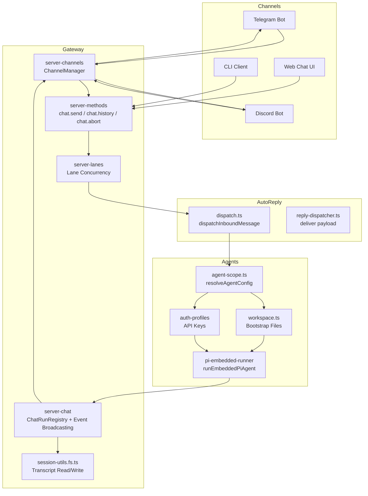
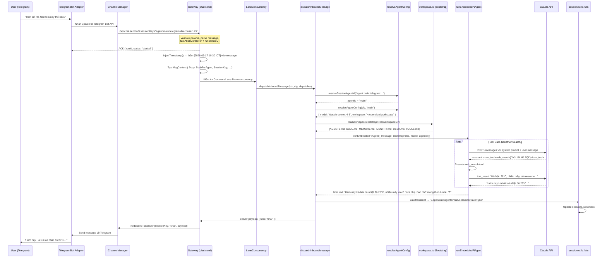

# Q: Vai trò của Gateway trong OpenClaw là gì?

**Date**: 2026-03-17
**Depth**: module + file analysis
**Sources**: `src/gateway/`, `src/auto-reply/`, `src/channels/`, `src/agents/`

---

## 1. Gateway là gì?

**Gateway** là trung tâm điều phối của OpenClaw — một HTTP/WebSocket server nằm giữa **channels** (Telegram, Discord, Web...) và **agents** (các AI model). Mọi tin nhắn vào/ra đều đi qua Gateway.

```
[Telegram/Discord/Web] ←→ [GATEWAY] ←→ [Agent / Pi Runner (Claude)]
```

**Entry point**: `src/gateway/server.ts` → re-exports `startGatewayServer()`

**Source** (`src/gateway/server.ts`):
```typescript
export { startGatewayServer } from "./server.impl.js";
```

---

## 2. Kiến trúc tổng quan



---

## 3. Các thành phần chính của Gateway

### 3.1 `server-methods/` — Routing Table

`src/gateway/server-methods.ts` khai báo toàn bộ method handlers:

```typescript
// src/gateway/server-methods.ts (simplified)
export const chatHandlers = {
  "chat.send":    async ({ params, respond, context, client }) => { ... },
  "chat.history": async ({ params, ... }) => { ... },
  "chat.abort":   async ({ params, ... }) => { ... },
  "chat.inject":  async ({ params, ... }) => { ... },
};
```

Các handler group khác: `agentHandlers`, `sessionsHandlers`, `cronHandlers`, `configHandlers`, `usageHandlers`...

### 3.2 `server-lanes.ts` — Concurrency Control

Giới hạn số lượng agent runs đồng thời:

```typescript
// src/gateway/server-lanes.ts
export enum CommandLane {
  Main    = "main",      // Tin nhắn thường — default: 1 concurrent
  Subagent = "subagent", // Subagent spawns
  Cron    = "cron",      // Scheduled tasks — default: 1 concurrent
}

export function applyGatewayLaneConcurrency(cfg, lanes) {
  // Main lane: 1 concurrent (configurable)
  // Cron lane: 1 concurrent (configurable)
  // Subagent lane: separate pool
}
```

### 3.3 `server-chat.ts` — Event Broadcasting

Quản lý active runs và broadcast events về client qua WebSocket:

```typescript
// src/gateway/server-chat.ts
type ChatRunRegistry = {
  add(sessionId: string, entry: ChatRunEntry): void;
  peek(sessionId: string): ChatRunEntry | undefined;
  shift(sessionId: string): ChatRunEntry | undefined;
  remove(sessionId: string, runId: string): void;
  clear(sessionId: string): void;
};
```

- **Delta throttling**: buffer 150ms trước khi broadcast partial text
- **Silent reply suppression**: lọc `SILENT_REPLY_TOKEN` khỏi chat UI
- **Tool event streaming**: gửi tool call events cho client có `TOOL_EVENTS` cap

### 3.4 `server-channels.ts` — Channel Lifecycle

```typescript
// src/gateway/server-channels.ts
export function createChannelManager() {
  return {
    startChannels():   Promise<void>,   // Khởi động tất cả channels
    stopChannel(id):   Promise<void>,   // Dừng channel
    getRuntimeSnapshot(): ChannelRuntimeSnapshot,  // Status channels
    markChannelLoggedOut(accountId),    // Mark logged out
  };
}
```

**Exponential backoff**: restart tự động khi channel disconnect (5s → 5min max, ×2 mỗi lần, max 10 retries)

### 3.5 `session-utils.fs.ts` — Transcript Persistence

```typescript
// src/gateway/session-utils.fs.ts
async function readSessionMessages(sessionId, storePath) {
  // Đọc JSONL transcript file
  // Parse từng dòng thành message object
}

async function archiveFileOnDisk(filePath, reason) {
  // Rename: <uuid>.json → <timestamp>-<uuid>-<reason>.json
}
```

---

## 4. Ví dụ cụ thể: User hỏi "Thời tiết Hà Nội hôm nay thế nào?"

### Scenario

- Agent: `main` (Cốm Đào), model: `claude-sonnet-4-6`
- Channel: Telegram
- User ID: `user123`
- Session key: `agent:main:telegram:direct:user123`

---

### Sequence Diagram



---

### Step-by-step từ source code

#### Bước 1: Telegram Bot nhận message

Channel adapter (Telegram) nhận update từ Telegram Bot API, tạo session key:

```typescript
// src/channels/telegram/ adapter (conceptual)
const sessionKey = `agent:main:telegram:direct:${userId}`;
// Gọi gateway method: chat.send
```

#### Bước 2: `chat.send` handler xử lý

```typescript
// src/gateway/server-methods/chat.ts:1067
"chat.send": async ({ params, respond, context, client }) => {
  // ...
  const rawSessionKey = p.sessionKey; // "agent:main:telegram:direct:user123"
  const { cfg, entry, canonicalKey: sessionKey } = loadSessionEntry(rawSessionKey);

  // Tạo AbortController để có thể cancel run
  const abortController = new AbortController();
  context.chatAbortControllers.set(clientRunId, {
    controller: abortController,
    sessionKey: rawSessionKey,
    startedAtMs: now,
    // ...
  });

  // ACK ngay lập tức — không block chờ AI response
  respond(true, { runId: clientRunId, status: "started" });
```

#### Bước 3: Inject timestamp và tạo context

```typescript
// src/gateway/server-methods/chat.ts:1251
const stampedMessage = injectTimestamp(messageForAgent, timestampOptsFromConfig(cfg));
// → "Thời tiết Hà Nội hôm nay thế nào?\n[2026-03-17 10:30 ICT]"

const ctx: MsgContext = {
  Body: messageForAgent,           // Raw message cho UI
  BodyForAgent: stampedMessage,    // Message có timestamp cho agent
  SessionKey: sessionKey,          // "agent:main:telegram:direct:user123"
  Provider: INTERNAL_MESSAGE_CHANNEL,
  ChatType: "direct",
  // ...
};

const agentId = resolveSessionAgentId({
  sessionKey,      // Parse "agent:main:..." → "main"
  config: cfg,
});
```

#### Bước 4: Dispatch đến auto-reply system

```typescript
// src/gateway/server-methods/chat.ts:1305
void dispatchInboundMessage({
  ctx,
  cfg,
  dispatcher,
  replyOptions: {
    runId: clientRunId,
    abortSignal: abortController.signal,
    onAgentRunStart: (runId) => {
      // Register tool event subscription
    },
  },
});
```

#### Bước 5: `dispatchInboundMessage` → Agent runner

```typescript
// src/auto-reply/dispatch.ts:35
export async function dispatchInboundMessage(params: {
  ctx: MsgContext | FinalizedMsgContext;
  cfg: OpenClawConfig;
  dispatcher: ReplyDispatcher;
  // ...
}): Promise<DispatchInboundResult> {
  const finalized = finalizeInboundContext(params.ctx);
  return await withReplyDispatcher({
    dispatcher: params.dispatcher,
    run: () => dispatchReplyFromConfig({
      ctx: finalized,
      cfg: params.cfg,
      dispatcher: params.dispatcher,
      // → sẽ gọi runEmbeddedPiAgent() với bootstrap files + message
    }),
  });
}
```

#### Bước 6: Agent run, gọi Claude API, dùng tools

`runEmbeddedPiAgent()` trong `src/agents/pi-embedded-runner/run.ts`:

- Load bootstrap files từ workspace (SOUL.md, AGENTS.md, MEMORY.md...)
- Chọn model: `claude-sonnet-4-6` (từ agent config)
- Load API key từ `~/.openclaw/agents/main/agent/auth.json`
- Gọi Claude API: `/messages` với hệ thống prompt + user message
- Claude quyết định dùng tool `web_search`
- Runner execute tool → trả kết quả về Claude
- Claude generate câu trả lời cuối

#### Bước 7: Lưu transcript và gửi response

```typescript
// src/gateway/session-utils.fs.ts
// Transcript được lưu tự động sau mỗi turn:
// ~/.openclaw/agents/main/sessions/<uuid>.json

// Gateway broadcast response về:
// src/gateway/server-methods/chat.ts:1292
deliver: async (payload, info) => {
  if (info.kind !== "final") return;
  const text = payload.text?.trim() ?? "";
  finalReplyParts.push(text);
},
```

---

## 5. Các cơ chế đặc biệt của Gateway

### 5.1 Idempotency / Deduplication

```typescript
// src/gateway/server-methods/chat.ts:1191
const cached = context.dedupe.get(`chat:${clientRunId}`);
if (cached) {
  respond(cached.ok, cached.payload, cached.error, { cached: true });
  return;
}
```

Nếu cùng một `clientRunId` gửi lại, Gateway trả về cached result — tránh duplicate agent runs.

### 5.2 Abort / Stop run

```typescript
// chat.abort handler — src/gateway/server-methods/chat.ts:998
const active = context.chatAbortControllers.get(runId);
if (active.sessionKey !== rawSessionKey) {
  respond(false, errorShape(ErrorCodes.INVALID_REQUEST, "runId does not match sessionKey"));
  return;
}
abortController.abort(); // Pi runner nhận signal, dừng API call
```

### 5.3 Heartbeat suppression

```typescript
// src/gateway/server-chat.ts
function normalizeHeartbeatChatFinalText(text: string): string {
  // Lọc bỏ heartbeat ACK text khỏi chat UI
  // Chỉ giữ lại khi gửi qua control channel
}
```

### 5.4 Silent Reply

```typescript
// src/auto-reply/tokens.ts
export const SILENT_REPLY_TOKEN = "<!-- SILENT_REPLY -->";

export function isSilentReplyText(text: string): boolean {
  return text.includes(SILENT_REPLY_TOKEN);
}
```

Agent có thể trả về silent reply — không hiển thị cho user nhưng broadcast về Control UI (monitoring).

### 5.5 Channel-agnostic sessions

```typescript
// src/gateway/server-methods/chat.ts:97
const CHANNEL_AGNOSTIC_SESSION_SCOPES = new Set([
  "main", "direct", "dm", "group", "channel",
  "cron", "run", "subagent", "acp", "thread", "topic",
]);
```

Session scopes này có thể nhận tin nhắn từ bất kỳ channel nào — không bị lock vào Telegram hay Discord.

---

## 6. Phân biệt Channel vs Gateway

| Khía cạnh | Channel (Telegram/Discord) | Gateway |
|-----------|---------------------------|---------|
| Vai trò | Nhận/gửi tin nhắn từ external platform | Route, orchestrate, persist |
| Protocol | Telegram Bot API, Discord WebSocket | HTTP/WebSocket (Fastify) |
| Session key | Tạo ra `agent:main:telegram:...` | Parse, validate, route |
| Agent | Không biết về agent | Load config, bootstrap, run |
| Transcript | Không lưu | Lưu `~/.openclaw/agents/<id>/sessions/` |
| Concurrency | Per-account | Lane-based (Main/Subagent/Cron) |

---

## 7. Tóm tắt vai trò Gateway

| Chức năng | Mô tả |
|-----------|-------|
| **Message Router** | Parse session key → xác định agent nào xử lý |
| **Channel Orchestrator** | Quản lý lifecycle của tất cả channel adapters |
| **Concurrency Manager** | Lane-based concurrency (Main/Subagent/Cron) |
| **Agent Launcher** | Load config → bootstrap → run Pi agent |
| **Event Broadcaster** | Streaming events về client qua WebSocket |
| **Transcript Keeper** | Lưu toàn bộ lịch sử hội thoại |
| **Idempotency Guard** | Dedup duplicate requests |
| **Abort Controller** | Cancel running agent via signal |

---

*Generated: 2026-03-17 | Source: OpenClaw codebase analysis*
*Key files: `src/gateway/server-methods/chat.ts`, `src/gateway/server-chat.ts`, `src/gateway/server-channels.ts`, `src/gateway/server-lanes.ts`, `src/auto-reply/dispatch.ts`*
