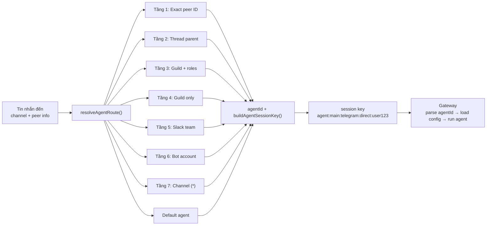

# Q: Định tuyến trong OpenClaw hoạt động như thế nào? Vì sao cần 7 tầng?

**Date**: 2026-03-17
**Depth**: file analysis
**Sources**: `src/routing/resolve-route.ts`, `src/routing/session-key.ts`, `src/sessions/session-key-utils.ts`, `src/routing/bindings.ts`, `src/config/types.agents.ts`

---

## 1. Routing trong OpenClaw là gì?

OpenClaw hỗ trợ nhiều agents song song, mỗi agent có model/workspace/persona riêng. Khi một tin nhắn đến từ Telegram, Discord, Slack... **routing system** phải trả lời câu hỏi:

> **"Tin nhắn này nên được xử lý bởi agent nào?"**

Câu trả lời đó được mã hóa thành một **session key** dạng `agent:<agentId>:<context>`, dùng để:
1. Xác định agent nào chạy
2. Lưu transcript hội thoại vào đúng file
3. Đảm bảo concurrency (lane system)

---

## 2. Session Key — Cấu trúc 5 phần

```
agent : <agentId> : <channel> : [<accountId>:] <chatType> : <peerId>
  [1]      [2]         [3]           [4]            [5]        [6]
```

| Segment | Ví dụ | Mô tả |
|---------|-------|-------|
| `agent` | `agent` | Tiền tố cố định |
| `agentId` | `main`, `coder` | ID của agent xử lý |
| `channel` | `telegram`, `discord`, `slack` | Nguồn tin nhắn |
| `accountId` (optional) | `acc1`, `bot123` | Bot account ID (khi multi-account) |
| `chatType` | `direct`, `group`, `channel` | Loại chat |
| `peerId` | `user123`, `group456` | ID người dùng / nhóm |

### Ví dụ thực tế

```
agent:main:main
   └── Main session (all DMs chung 1 session, khi dmScope="main")

agent:main:telegram:direct:user123
   └── DM trên Telegram với user123 (dmScope="per-channel-peer")

agent:main:telegram:acc1:direct:user123
   └── DM trên Telegram, bot account acc1, với user123 (dmScope="per-account-channel-peer")

agent:main:discord:group:chat456
   └── Group chat trên Discord

agent:main:discord:group:chat456:thread:t001
   └── Thread trong group Discord

agent:main:cron:backup:run:uuid-abc
   └── Scheduled task "backup"

agent:main:subagent:main:agent:main:telegram:direct:user123
   └── Subagent spawned từ session Telegram
```

### Parser source code

```typescript
// src/sessions/session-key-utils.ts:12
export function parseAgentSessionKey(
  sessionKey: string | undefined | null,
): ParsedAgentSessionKey | null {
  const raw = (sessionKey ?? "").trim().toLowerCase();
  const parts = raw.split(":").filter(Boolean);
  if (parts.length < 3) return null;
  if (parts[0] !== "agent") return null;   // Phải bắt đầu bằng "agent"
  const agentId = parts[1]?.trim();
  const rest = parts.slice(2).join(":");   // Tất cả còn lại là "context"
  if (!agentId || !rest) return null;
  return { agentId, rest };
}
```

---

## 3. `resolveAgentRoute()` — Hàm định tuyến chính

**Source**: `src/routing/resolve-route.ts:614`

```typescript
export function resolveAgentRoute(input: ResolveAgentRouteInput): ResolvedAgentRoute {
  // Input: { cfg, channel, accountId, peer, parentPeer, guildId, teamId, memberRoleIds }
  // Output: { agentId, sessionKey, mainSessionKey, matchedBy }
}
```

Hàm này chạy qua **7 tầng binding** từ cụ thể nhất → chung nhất. Tầng nào match trước thì dùng tầng đó.

---

## 4. 7 Tầng Routing — Tại sao cần?

### Nguồn gốc từ source code

```typescript
// src/routing/resolve-route.ts:723
const tiers: Array<{
  matchedBy: ...;
  enabled: boolean;
  scopePeer: RoutePeer | null;
  candidates: EvaluatedBinding[];
  predicate: (candidate: EvaluatedBinding) => boolean;
}> = [
  { matchedBy: "binding.peer",         ... }, // Tầng 1
  { matchedBy: "binding.peer.parent",  ... }, // Tầng 2
  { matchedBy: "binding.guild+roles",  ... }, // Tầng 3
  { matchedBy: "binding.guild",        ... }, // Tầng 4
  { matchedBy: "binding.team",         ... }, // Tầng 5
  { matchedBy: "binding.account",      ... }, // Tầng 6
  { matchedBy: "binding.channel",      ... }, // Tầng 7
];

// Sau đó fallback:
return choose(resolveDefaultAgentId(input.cfg), "default"); // Tầng 8 (default)
```

### Bảng 7 tầng đầy đủ

| Tầng | `matchedBy` | Match điều kiện | Use case |
|------|------------|-----------------|----------|
| 1 | `binding.peer` | Peer ID cụ thể (user/group ID) | User VIP → agent chuyên biệt |
| 2 | `binding.peer.parent` | Parent peer (thread parent ID) | Thread kế thừa routing từ parent |
| 3 | `binding.guild+roles` | Discord guild + member roles | Role-based routing (admin→agent A) |
| 4 | `binding.guild` | Discord guild ID (không cần roles) | Toàn server Discord → agent B |
| 5 | `binding.team` | Slack team ID | Workspace Slack → agent C |
| 6 | `binding.account` | Bot account ID cụ thể | Bot account @sales → agent sales |
| 7 | `binding.channel` | Chỉ cần đúng channel type (`*`) | Mọi Telegram → agent main |
| - | `default` | Không match gì | Fallback: default agent |

### Tại sao cần 7 tầng?

**Vấn đề**: Trong thực tế, bạn cần routing linh hoạt:

- Cùng một Discord server, admin dùng agent `security`, member thường dùng agent `main`
- Cùng Telegram bot, user123 là VIP → agent `premium`, còn lại → agent `free`
- Slack workspace A → agent `sales`, workspace B → agent `support`
- Thread trong channel → kế thừa agent từ parent channel

**Giải pháp**: Hierarchy từ cụ thể → tổng quát. Mỗi tầng thêm một chiều discriminator:

```
Tầng 1-2: Cụ thể nhất (exact peer ID)
Tầng 3-4: Server-level (guild)
Tầng 5:   Team-level (Slack)
Tầng 6:   Account-level (bot account)
Tầng 7:   Channel-level (wildcard per channel)
Default:  Fallback
```

---

## 5. Binding Config — Khai báo rules

### Type definition

```typescript
// src/config/types.agents.ts:28
export type AgentBindingMatch = {
  channel: string;           // "telegram", "discord", "slack"...
  accountId?: string;        // Bot account ID (wildcard "*")
  peer?: { kind: ChatType; id: string };  // Specific user/group
  guildId?: string;          // Discord guild ID
  teamId?: string;           // Slack team ID
  roles?: string[];           // Discord role IDs
};

export type AgentRouteBinding = {
  type?: "route";
  agentId: string;
  comment?: string;
  match: AgentBindingMatch;
};
```

### Ví dụ config `openclaw.json`

```json
{
  "bindings": [
    {
      "comment": "VIP user → premium agent",
      "agentId": "premium",
      "match": {
        "channel": "telegram",
        "peer": { "kind": "direct", "id": "vip-user-456" }
      }
    },
    {
      "comment": "Discord admin role → security agent",
      "agentId": "security",
      "match": {
        "channel": "discord",
        "guildId": "my-discord-server",
        "roles": ["admin-role-id", "mod-role-id"]
      }
    },
    {
      "comment": "Slack workspace A → sales agent",
      "agentId": "sales",
      "match": {
        "channel": "slack",
        "teamId": "T01234ABCD"
      }
    },
    {
      "comment": "Tất cả Telegram → main agent (wildcard)",
      "agentId": "main",
      "match": {
        "channel": "telegram",
        "accountId": "*"
      }
    }
  ]
}
```

---

## 6. DM Scope — Quyết định session isolation

`dmScope` trong config quyết định cách tạo session key cho DM:

```typescript
// src/routing/session-key.ts:136
export function buildAgentPeerSessionKey(params: {
  dmScope?: "main" | "per-peer" | "per-channel-peer" | "per-account-channel-peer";
  // ...
}): string {
  if (peerKind === "direct") {
    if (dmScope === "per-account-channel-peer") {
      return `agent:${agentId}:${channel}:${accountId}:direct:${peerId}`;
    }
    if (dmScope === "per-channel-peer") {
      return `agent:${agentId}:${channel}:direct:${peerId}`;   // ← MOST COMMON
    }
    if (dmScope === "per-peer") {
      return `agent:${agentId}:direct:${peerId}`;
    }
    // "main" scope
    return `agent:${agentId}:main`;
  }
  // Group/channel
  return `agent:${agentId}:${channel}:${peerKind}:${peerId}`;
}
```

| dmScope | Session key | Ý nghĩa |
|---------|-------------|---------|
| `"main"` | `agent:main:main` | Tất cả DM chung 1 session |
| `"per-peer"` | `agent:main:direct:user123` | Mỗi user 1 session (mọi channel) |
| `"per-channel-peer"` | `agent:main:telegram:direct:user123` | Mỗi user/channel 1 session (**default**) |
| `"per-account-channel-peer"` | `agent:main:telegram:acc1:direct:user123` | Mỗi user/account/channel 1 session |

---

## 7. Flow hoàn chỉnh: "Thời tiết Hà Nội hôm nay thế nào?"

### Setup scenario

**Config `openclaw.json`**:
```json
{
  "agents": {
    "list": [
      { "id": "main", "default": true, "model": "claude-sonnet-4-6" },
      { "id": "premium", "model": "claude-opus-4-6" }
    ]
  },
  "bindings": [
    {
      "comment": "VIP user → premium agent",
      "agentId": "premium",
      "match": { "channel": "telegram", "peer": { "kind": "direct", "id": "vip456" } }
    },
    {
      "comment": "All Telegram → main agent",
      "agentId": "main",
      "match": { "channel": "telegram", "accountId": "*" }
    }
  ],
  "session": { "dmScope": "per-channel-peer" }
}
```

**User**: `user123` (không phải VIP) nhắn "Thời tiết Hà Nội hôm nay thế nào?" qua Telegram.

---

### Routing Flow Diagram

```mermaid
flowchart TD
    A["User123 gửi tin nhắn qua Telegram Bot"] --> B

    subgraph TG["Telegram Channel Adapter"]
        B["Nhận Telegram Update<br/>from: user_id=123, chat_type=direct"]
        B --> C["resolveAgentRoute(cfg, 'telegram', 'acc1', peer={kind:'direct', id:'user123'})"]
    end

    subgraph ROUTING["src/routing/resolve-route.ts: resolveAgentRoute()"]
        C --> T1

        T1{"Tầng 1: binding.peer<br/>peer={direct:user123}<br/>Match binding với peer.id=user123?"}
        T1 -->|"❌ user123 không phải VIP<br/>Không có binding"| T2

        T2{"Tầng 2: binding.peer.parent<br/>Thread parent? No parent"}
        T2 -->|"❌ disabled (no parentPeer)"| T3

        T3{"Tầng 3: binding.guild+roles<br/>Discord guild? N/A"}
        T3 -->|"❌ disabled (not Discord)"| T4

        T4{"Tầng 4: binding.guild<br/>Discord guild? N/A"}
        T4 -->|"❌ disabled"| T5

        T5{"Tầng 5: binding.team<br/>Slack team? N/A"}
        T5 -->|"❌ disabled (not Slack)"| T6

        T6{"Tầng 6: binding.account<br/>accountId=acc1<br/>Match binding với accountId='acc1'?"}
        T6 -->|"❌ Không có binding với acc1"| T7

        T7{"Tầng 7: binding.channel<br/>channel=telegram, accountId=*<br/>Match!"}
        T7 -->|"✅ Match: agentId='main'"| RESULT
    end

    RESULT["choose('main', 'binding.channel')"]
    RESULT --> SK["buildAgentSessionKey()<br/>dmScope='per-channel-peer'<br/>→ agent:main:telegram:direct:user123"]

    SK --> GW["Gateway xử lý<br/>sessionKey = 'agent:main:telegram:direct:user123'"]
    GW --> LOAD["resolveSessionAgentId() → 'main'<br/>resolveAgentConfig(cfg, 'main')<br/>→ {model:'claude-sonnet-4-6', workspace:...}"]
    LOAD --> RUN["runEmbeddedPiAgent()<br/>model=claude-sonnet-4-6"]
    RUN --> CLAUDE["Claude API<br/>web_search('thời tiết Hà Nội')"]
    CLAUDE --> RESP["Trả về: 28°C, mưa nhẹ"]
    RESP --> SAVE["Lưu transcript<br/>~/.openclaw/agents/main/sessions/<uuid>.json"]
    SAVE --> REPLY["Gửi reply về Telegram → User123"]

    style T7 fill:#22c55e,color:#fff
    style T1 fill:#ef4444,color:#fff
    style T2 fill:#6b7280,color:#fff
    style T3 fill:#6b7280,color:#fff
    style T4 fill:#6b7280,color:#fff
    style T5 fill:#6b7280,color:#fff
    style T6 fill:#ef4444,color:#fff
```



---

### Nếu user là VIP (vip456):

```
Tầng 1: binding.peer
  → Match! peer.id = "vip456" khớp binding { agentId: "premium", match.peer.id: "vip456" }
  → agentId = "premium"
  → sessionKey = "agent:premium:telegram:direct:vip456"
  → matchedBy = "binding.peer"
```

Kết quả: VIP dùng Claude Opus, người thường dùng Claude Sonnet — **cùng 1 Telegram bot**.

---

## 8. Thread Routing (tầng 2)

Khi user reply vào một thread Discord:

```
Thread message: channel=discord, peer={kind:channel, id:ch789}, threadId=t001
Parent peer:    channel=discord, peer={kind:channel, id:ch789}

→ Session key: agent:main:discord:channel:ch789:thread:t001
→ Parent key:  agent:main:discord:channel:ch789

// src/sessions/session-key-utils.ts:112
resolveThreadParentSessionKey("agent:main:discord:channel:ch789:thread:t001")
→ "agent:main:discord:channel:ch789"
```

**Tầng 2** (`binding.peer.parent`) cho phép thread kế thừa binding từ parent channel:

```typescript
// src/routing/resolve-route.ts:738
{
  matchedBy: "binding.peer.parent",
  enabled: Boolean(parentPeer && parentPeer.id),
  scopePeer: parentPeer && parentPeer.id ? parentPeer : null,
  candidates: collectPeerIndexedBindings(bindingsIndex, parentPeer),
  predicate: (candidate) => candidate.match.peer.state === "valid",
},
```

Nếu channel `ch789` được bind vào agent `support`, thì threads trong channel đó cũng tự động dùng agent `support`.

---

## 9. Special Session Keys

```typescript
// src/sessions/session-key-utils.ts

// Cron task
isCronSessionKey("agent:main:cron:backup:run:abc123")  // → true
isCronRunSessionKey("agent:main:cron:backup:run:abc123") // → true (đang run)

// Subagent
isSubagentSessionKey("agent:main:subagent:main:agent:main:telegram:direct:user123") // → true
getSubagentDepth("agent:main:subagent:main:subagent:main:...") // → 2 (nested)

// ACP (Agent Communication Protocol)
isAcpSessionKey("agent:main:acp:codex:session123") // → true

// Chat type detection
deriveSessionChatType("agent:main:telegram:direct:user123") // → "direct"
deriveSessionChatType("agent:main:discord:group:chat456")   // → "group"
```

---

## 10. Route Cache — Performance

```typescript
// src/routing/resolve-route.ts:203
const resolvedRouteCacheByCfg = new WeakMap<
  OpenClawConfig,
  {
    bindingsRef: OpenClawConfig["bindings"];
    agentsRef: OpenClawConfig["agents"];
    sessionRef: OpenClawConfig["session"];
    byKey: Map<string, ResolvedAgentRoute>;  // Cache key → ResolvedAgentRoute
  }
>();
const MAX_RESOLVED_ROUTE_CACHE_KEYS = 4000;  // Tự clear khi > 4000 entries
```

Routing result được cache theo `(channel, accountId, peer, guildId, teamId, roles, dmScope)`. Config thay đổi → cache tự invalidate (WeakMap + reference check).

---

## 11. Tóm tắt



| Khái niệm | Source file | Chức năng |
|-----------|-------------|-----------|
| **7-tier lookup** | `resolve-route.ts:723` | Chọn agent từ bindings |
| **Session key builder** | `session-key.ts:118–174` | Tạo key từ peer info |
| **Session key parser** | `session-key-utils.ts:12` | Parse key → agentId + rest |
| **Binding config** | `types.agents.ts:28` | Khai báo routing rules |
| **dmScope** | `session-key.ts:136` | Isolation level cho DM |
| **Route cache** | `resolve-route.ts:203` | Performance (max 4000 entries) |

---

*Generated: 2026-03-17 | Source: OpenClaw codebase analysis*
*Key files: `src/routing/resolve-route.ts` (805 lines), `src/routing/session-key.ts` (253 lines), `src/sessions/session-key-utils.ts` (133 lines)*
