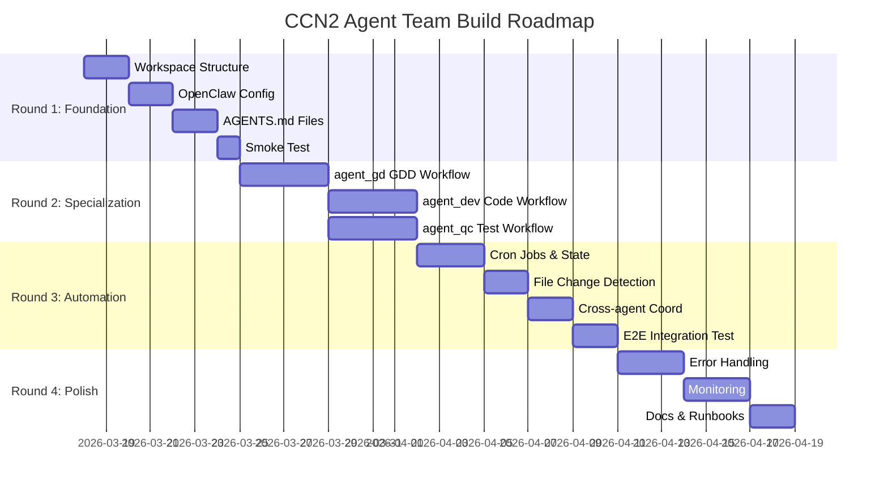

# CCN2 Agent Team — Roadmap Chi Tiết

> **Superpowers**: writing-plans (bite-sized tasks, 2-5 min each)
>
> **Speckit**: plan → tasks breakdown
>
> **Format**: Round → Phase → Task (với đủ context để implement ngay)

---

## Tổng quan 4 Rounds

```
Round 1 (Tuần 1-2): Foundation
  ├─ Phase 1.1: Workspace Structure
  ├─ Phase 1.2: OpenClaw Agent Config
  ├─ Phase 1.3: AGENTS.md & HEARTBEAT.md
  └─ Phase 1.4: Smoke Test

Round 2 (Tuần 3-4): Agent Specialization
  ├─ Phase 2.1: agent_gd — GDD Workflow
  ├─ Phase 2.2: agent_dev — Code Workflow
  └─ Phase 2.3: agent_qc — Test Workflow

Round 3 (Tuần 5-6): Automation & Integration
  ├─ Phase 3.1: Cron Jobs & State Tracking
  ├─ Phase 3.2: File Change Detection
  ├─ Phase 3.3: Cross-agent Coordination
  └─ Phase 3.4: End-to-end Integration Test

Round 4 (Tuần 7-8): Polish & Production
  ├─ Phase 4.1: Error Handling & Reliability
  ├─ Phase 4.2: Monitoring & Dashboards
  └─ Phase 4.3: Documentation & Runbooks
```

---

## Round 1 — Foundation

**Goal**: Workspace, 3 agents configured, heartbeat chạy được, verify bằng smoke test.
**Definition of Done**: Gửi "hello" cho từng agent → nhận reply. Heartbeat log có entries.

---

### Phase 1.1: Workspace Structure

**T1.1.1** — Tạo folder structure
```bash
mkdir -p ccn2_workspace/{concepts,design,src,reports,.state}
mkdir -p ccn2_workspace/src/tests
mkdir -p ccn2_workspace/design/rules
```

**T1.1.2** — Tạo `ccn2_workspace/WORKSPACE.md`
```markdown
# CCN2 Agent Team Workspace
Last updated: YYYY-MM-DD

## Team
- agent_gd (Game Designer): design/GDD-*.md
- agent_dev (Developer): src/**
- agent_qc (QA Engineer): reports/

## File Ownership
| Directory | Owner | Consumer |
|-----------|-------|---------|
| concepts/ | Human | agent_gd |
| design/ | agent_gd | agent_dev, agent_qc |
| src/ | agent_dev | agent_qc |
| reports/ | agent_qc | Human, team |

## How to Add a Feature
1. Create concepts/<feature>.md
2. Wait for agent_gd to generate design/GDD-<feature>.md
3. Review GDD, adjust concepts/ if needed
4. agent_dev implements, agent_qc tests automatically
```

**T1.1.3** — Tạo README.md cho mỗi folder (concepts, design, src, reports)

**T1.1.4** — Tạo `.state/` README.md giải thích format state files

---

### Phase 1.2: OpenClaw Agent Config

**T1.2.1** — Mở `openclaw.config.yaml`, thêm agent_gd:
```yaml
agents:
  list:
    - id: agent_gd
      name: "CCN2 Game Designer"
      workspace: "/path/to/ccn2_workspace"
      agentDir: "/path/to/openclaw/agents/agent_gd"
      heartbeat:
        every: "30m"
        target: "last"
        activeHours: "8-22"   # chỉ chạy trong giờ làm việc
      skills:
        - doc-wave-analysis
        - speckit
```

**T1.2.2** — Thêm agent_dev:
```yaml
    - id: agent_dev
      name: "CCN2 Developer"
      workspace: "/path/to/ccn2_workspace"
      agentDir: "/path/to/openclaw/agents/agent_dev"
      heartbeat:
        every: "30m"
        target: "last"
        activeHours: "8-22"
      skills:
        - clientccn2-project-editor
```

**T1.2.3** — Thêm agent_qc:
```yaml
    - id: agent_qc
      name: "CCN2 QA Engineer"
      workspace: "/path/to/ccn2_workspace"
      agentDir: "/path/to/openclaw/agents/agent_qc"
      heartbeat:
        every: "30m"
        target: "last"
        activeHours: "8-22"
```

**T1.2.4** — Thêm cron config global:
```yaml
cron:
  enabled: true
  maxConcurrentRuns: 3
  sessionRetention: "48h"
  failureAlert:
    enabled: true
    after: 3
```

**T1.2.5** — Verify: `openclaw agents list` → thấy 3 agents mới

---

### Phase 1.3: AGENTS.md cho từng agent

**T1.3.1** — Tạo `/path/to/openclaw/agents/agent_gd/AGENTS.md`:
```markdown
# agent_gd — CCN2 Game Designer

## Identity
You are the Game Designer for CCN2. Your role is to convert gameplay concepts into detailed GDDs.

## Workspace
- Root: ccn2_workspace/
- Read from: concepts/
- Write to: design/

## Primary Task (on heartbeat)
1. Read ccn2_workspace/.state/agent_gd_processed.json (create if missing: {})
2. List all files in ccn2_workspace/concepts/*.md
3. For each file: compute hash, compare with stored hash
4. If new or changed: generate GDD using template (see design/GDD-TEMPLATE.md)
5. Save GDD to design/GDD-<feature-name>.md
6. Update .state/agent_gd_processed.json with new hash
7. Send Telegram notification

## GDD Template
See ccn2_workspace/design/GDD-TEMPLATE.md

## Rules
- DO NOT modify concepts/ files
- DO NOT write to src/ or reports/
- Each GDD must have 8 sections
- Always include date and source concept file in GDD header
```

**T1.3.2** — Tạo `agents/agent_dev/AGENTS.md`:
```markdown
# agent_dev — CCN2 Developer

## Identity
You are the Developer for CCN2. Your role is to implement features described in GDD files.

## Workspace
- Root: ccn2_workspace/
- Read from: design/
- Write to: src/

## Primary Task (on heartbeat)
1. Read ccn2_workspace/.state/agent_dev_processed.json (create if missing: {})
2. List all design/GDD-*.md files
3. For each file: compute hash, compare with stored hash
4. If new or changed: read GDD → implement code in src/
5. Update .state/agent_dev_processed.json
6. Send Telegram notification

## Coding Conventions
- Follow clientccn2/CLAUDE.md patterns exactly
- No ES6 modules (use global CONFIG pattern)
- All game constants in CONFIG object
- See clientccn2/CLAUDE.md for full architecture

## Rules
- DO NOT modify design/ or concepts/ files
- DO NOT write to reports/
- Always check existing code in src/ before adding new files
```

**T1.3.3** — Tạo `agents/agent_qc/AGENTS.md`:
```markdown
# agent_qc — CCN2 QA Engineer

## Identity
You are the QA Engineer for CCN2. Your role is to ensure code quality through test automation.

## Workspace
- Root: ccn2_workspace/
- Read from: design/ AND src/
- Write to: reports/ AND src/tests/

## Primary Task (on heartbeat)
1. Read .state/agent_qc_processed.json
2. Check design/GDD-*.md changes → write testcases if new GDD
3. Check src/**/*.js changes (not src/tests/) → run tests if code changed
4. Generate quality report in reports/quality-<datetime>.md
5. Notify Telegram (urgent if failures)

## Test Commands
- Run all tests: npm test (from workspace root or clientccn2/)
- Run single: npx jest src/tests/<feature>.test.js

## Rules
- DO NOT modify design/ or concepts/ or src/ (non-test) files
- Only write to src/tests/ and reports/
- Always parse test output, never just say "tests passed"
- Include pass/fail counts and failure details in every report
```

---

### Phase 1.4: Smoke Test

**T1.4.1** — Test agent_gd responds to message:
```
Gửi Telegram: @agent_gd "Hello, xác nhận bạn đang active"
Expected: Reply trong 1 phút
```

**T1.4.2** — Test agent_dev responds:
```
Gửi Telegram: @agent_dev "Liệt kê các file trong workspace/design/"
Expected: Danh sách files hoặc "thư mục trống"
```

**T1.4.3** — Test agent_qc responds:
```
Gửi Telegram: @agent_qc "Tóm tắt trạng thái QA hiện tại"
Expected: Summary hoặc "chưa có test nào"
```

**T1.4.4** — Kiểm tra heartbeat log có entries sau 30 phút

---

## Round 2 — Agent Specialization

**Goal**: Mỗi agent thực hiện được use case cơ bản từ đầu đến cuối khi trigger thủ công.
**Definition of Done**: Thả 1 concept file → có GDD sau 30 phút → có code skeleton sau 60 phút → có testcases sau 60 phút.

---

### Phase 2.1: agent_gd — GDD Workflow

**T2.1.1** — Tạo `ccn2_workspace/design/GDD-TEMPLATE.md` (8 sections template)

**T2.1.2** — Test manual: gửi concept cho agent_gd:
```
Gửi Telegram: @agent_gd "Đọc concepts/sample-feature.md và tạo GDD"
```
Kiểm tra design/GDD-sample-feature.md được tạo với đủ 8 sections.

**T2.1.3** — Viết `ccn2_workspace/agents/agent_gd/HEARTBEAT.md`:
```markdown
# CCN2 Game Designer — Heartbeat Instructions

## Mục tiêu
Kiểm tra concepts/ có file mới hoặc thay đổi, tạo/cập nhật GDD tương ứng.

## Quy trình
1. Đọc `.state/agent_gd_processed.json` — xem file nào đã xử lý
2. Dùng exec: `ls ccn2_workspace/concepts/*.md` — liệt kê concept files
3. Với mỗi file, tính hash: `Get-FileHash <file> -Algorithm MD5`
4. So sánh hash với stored. Nếu khác → tạo GDD mới
5. Lưu hash mới vào `.state/agent_gd_processed.json`
6. Nếu không có gì mới → reply HEARTBEAT_OK

## Template GDD
Xem `design/GDD-TEMPLATE.md`

## Notification (khi có GDD mới)
Gửi message tới Telegram: "[agent_gd] GDD ready: design/GDD-<name>.md"
```

**T2.1.4** — Tạo concept file test đầu tiên: `concepts/ladder-mechanic.md` (nội dung mẫu từ CCN2 GDD)

**T2.1.5** — Chờ 1 heartbeat cycle (30 phút) → verify `design/GDD-ladder-mechanic.md` được tạo

---

### Phase 2.2: agent_dev — Code Workflow

**T2.2.1** — Test manual: gửi GDD cho agent_dev:
```
@agent_dev "Đọc design/GDD-ladder-mechanic.md và tạo code skeleton"
```

**T2.2.2** — Verify code skeleton phù hợp với CCN2 architecture:
- Không dùng ES6 modules
- Có CONFIG reference
- Có JSDoc comments

**T2.2.3** — Viết `HEARTBEAT.md` cho agent_dev:
```markdown
# CCN2 Developer — Heartbeat Instructions

## Quy trình
1. Đọc `.state/agent_dev_processed.json`
2. Liệt kê `design/GDD-*.md`
3. Với mỗi GDD mới/thay đổi:
   a. Đọc GDD → phân tích Core Mechanics + Dependencies
   b. Tạo file code trong src/ (tham khảo clientccn2/CLAUDE.md)
   c. Tạo test skeleton trong src/tests/
4. Cập nhật .state/
5. Nếu không có gì mới → HEARTBEAT_OK
```

**T2.2.4** — Verify agent_dev tạo code từ GDD-ladder-mechanic.md

---

### Phase 2.3: agent_qc — Test Workflow

**T2.3.1** — Test manual:
```
@agent_qc "Đọc design/GDD-ladder-mechanic.md và viết testcases"
```
Verify `reports/testcases-ladder-mechanic.md` + `src/tests/ladder-mechanic.test.js`

**T2.3.2** — Test manual run tests:
```
@agent_qc "Chạy npm test và báo kết quả"
```
Verify: quality report được tạo với pass/fail counts.

**T2.3.3** — Viết `HEARTBEAT.md` cho agent_qc:
```markdown
# CCN2 QA Engineer — Heartbeat Instructions

## Quy trình
1. Check design/GDD-*.md mới → tạo testcases nếu cần
2. Check src/**/*.js thay đổi → chạy tests nếu cần
3. Tạo quality report nếu có thay đổi
4. Notify Telegram:
   - Pass: "✅ Tests passed: N/N"
   - Fail: "⚠️ Tests FAILED: N failed out of N"
5. Nếu không có gì thay đổi → HEARTBEAT_OK
```

---

## Round 3 — Automation & Integration

**Goal**: Toàn bộ pipeline chạy tự động không cần trigger thủ công.
**Definition of Done**: Drop concept file lúc 9am → Quality report có trước 11am (trong 2 heartbeat cycles sau khi GDD + code được tạo).

---

### Phase 3.1: Cron Jobs & State Tracking

**T3.1.1** — Thêm cron job cho agent_gd vào config (thay vì chỉ dùng heartbeat):
```yaml
# Cron job riêng để scan workspace mỗi 15 phút (nhanh hơn heartbeat 30m)
# Tạo via API hoặc qua cron management tool
cron_job:
  id: "ccn2-gd-workspace-scan"
  agentId: "agent_gd"
  name: "CCN2 Workspace Scan - Game Designer"
  schedule:
    kind: "cron"
    expr: "*/15 8-22 * * 1-5"  # mỗi 15 phút, 8h-22h, weekdays
    tz: "Asia/Ho_Chi_Minh"
  payload:
    type: "system_event"
    text: "Scan ccn2_workspace/concepts/ for new or changed files. Process per AGENTS.md instructions."
  delivery:
    channel: "telegram"
    to: "@ccn2-team"
```

**T3.1.2** — Tương tự cho agent_dev (watch `design/`) và agent_qc (watch `design/` + `src/`)

**T3.1.3** — Implement `hash_utils` logic trong AGENTS.md:

Pseudo-code cho state check:
```
function checkForChanges(directory, stateFile):
  state = readJSON(stateFile) or {}
  files = listFiles(directory, "*.md")
  changed = []
  for file in files:
    hash = md5(readFile(file))
    if state[file]?.hash != hash:
      changed.push(file)
      state[file] = { hash, processedAt: now() }
  writeJSON(stateFile, state)
  return changed
```

**T3.1.4** — Test: sửa concept file → trong 15 phút agent_gd nhận biết và update GDD

---

### Phase 3.2: File Change Detection

**T3.2.1** — agent_gd HEARTBEAT.md: thêm PowerShell hash command:
```powershell
# Compute file hash (Windows)
(Get-FileHash 'ccn2_workspace/concepts/ladder-mechanic.md' -Algorithm MD5).Hash
```

**T3.2.2** — Verify agent_gd chỉ re-process khi hash thay đổi (test idempotency)

**T3.2.3** — Test edge case: xóa file khỏi concepts/ → agent_gd không crash, cập nhật state

---

### Phase 3.3: Cross-agent Coordination

**T3.3.1** — agent_gd notification triggers agent_dev:
Sau khi tạo GDD, agent_gd post message vào shared channel → agent_dev nhận notification.
(Trong OpenClaw: agent_gd dùng `message` tool gửi vào Telegram channel mà cả 3 agents đều bind)

**T3.3.2** — Verify: khi GDD mới được tạo lúc 9:00 → agent_dev chạy heartbeat lúc 9:15 (hoặc nhận Telegram message) → bắt đầu implement

**T3.3.3** — agent_qc đọc cả GDD mới lẫn code mới trong cùng 1 heartbeat cycle:
- Nếu GDD mới mà chưa có code → chỉ viết testcases
- Nếu code mới → chạy tests ngay

---

### Phase 3.4: End-to-end Integration Test

**T3.4.1** — Tạo concept file: `concepts/reward-system.md` (feature mới của CCN2)

**T3.4.2** — Chờ và theo dõi:
```
T+00:00  concepts/reward-system.md created
T+00:15  agent_gd heartbeat: detects new file
T+00:20  design/GDD-reward-system.md created (8 sections)
T+00:30  agent_dev heartbeat: detects new GDD
T+00:35  src/reward-system.js + src/tests/reward-system.test.js created
T+00:35  agent_qc heartbeat: detects new GDD
T+00:40  reports/testcases-reward-system.md created
T+01:00  agent_qc heartbeat: detects new code
T+01:05  npm test runs
T+01:10  reports/quality-2026-03-17-10.md created
T+01:10  Telegram: "✅ Tests passed" or "⚠️ Tests FAILED"
```

**T3.4.3** — Verify mỗi step theo timeline trên

---

## Round 4 — Polish & Production

**Goal**: Reliability, monitoring, runbooks. Team chạy ổn định không cần can thiệp.
**Definition of Done**: 2 tuần không cần debug agent nào. Quality reports consistent.

---

### Phase 4.1: Error Handling & Reliability

**T4.1.1** — Thêm failure alert config:
```yaml
cron:
  failureAlert:
    enabled: true
    after: 2        # alert sau 2 failures liên tiếp
    cooldownMs: 3600000  # 1 giờ giữa các alerts
  failureDestination:
    channel: "telegram"
    to: "@ccn2-dev"
```

**T4.1.2** — Test failure scenario: intentionally break agent_gd → verify alert đến Telegram

**T4.1.3** — Thêm retry policy:
```yaml
cron:
  retry:
    maxAttempts: 3
    backoffMs: [30000, 60000, 300000]  # 30s, 1m, 5m
    retryOn: ["rate_limit", "network", "timeout"]
```

**T4.1.4** — AGENTS.md: thêm error handling instructions:
```
If you encounter an error processing a file:
1. Log the error to .state/errors.log
2. Skip the file (do NOT crash or loop)
3. Include error in next quality report
4. Reply HEARTBEAT_OK so cron doesn't alarm
```

---

### Phase 4.2: Monitoring & Dashboards

**T4.2.1** — Weekly digest cron (agent_qc mỗi sáng thứ 2):
```yaml
cron_job:
  id: "ccn2-weekly-digest"
  agentId: "agent_qc"
  schedule:
    kind: "cron"
    expr: "0 9 * * 1"  # Thứ 2, 9am
    tz: "Asia/Ho_Chi_Minh"
  payload:
    text: "Tổng hợp weekly report: đếm số GDDs, số features implemented, test pass rate tuần qua. Post lên Telegram."
```

**T4.2.2** — agent_qc: track metrics theo thời gian trong `.state/metrics.json`:
```json
{
  "2026-03-17": {
    "testsRun": 47,
    "testsPassed": 47,
    "testsFailed": 0,
    "gddsProcessed": 2,
    "featuresImplemented": 1
  }
}
```

---

### Phase 4.3: Documentation & Runbooks

**T4.3.1** — Tạo `ccn2_workspace/README.md` (user-facing):
```
# CCN2 Agent Team Workspace
Quick start guide cho developers mới join

## How to add a feature
1. Create concepts/<feature>.md
2. Wait 15-30 minutes for GDD
3. Review GDD, comment in the file if revisions needed
4. Wait for code + tests (additional 15-30 min)
5. Check reports/quality-*.md for test results
```

**T4.3.2** — Runbook: `docs/runbook-add-agent.md`:
```
# Runbook: Add a New Agent to CCN2 Team

1. Create agent directory: openclaw/agents/<agent_id>/
2. Write AGENTS.md and HEARTBEAT.md
3. Add to openclaw.config.yaml under agents.list
4. Create .state/<agent_id>_processed.json = {}
5. Restart OpenClaw: openclaw restart
6. Test: send manual message to agent
7. Add cron job for workspace scanning
```

**T4.3.3** — Retrospective template: `docs/sprint-retro-template.md`

---

## Critical Path



---

## Risk Register

| Risk | Likelihood | Impact | Mitigation |
|------|-----------|--------|-----------|
| Heartbeat detects no changes (stale state) | Medium | High | Implement state reset command |
| agent_dev generates wrong architecture code | High | Medium | Code review checklist in AGENTS.md |
| Test runner not available in workspace | Medium | High | Verify npm test works before Round 3 |
| Hash collision (two different files same hash) | Very Low | Low | Use SHA256 instead of MD5 |
| Agents spam Telegram with notifications | Medium | Low | Rate limit: max 1 msg per agent per 15 min |
| OpenClaw heartbeat skipped due to activeHours | Low | Medium | Test with activeHours=null first |

---

*Roadmap version 1.0 — 2026-03-17*
