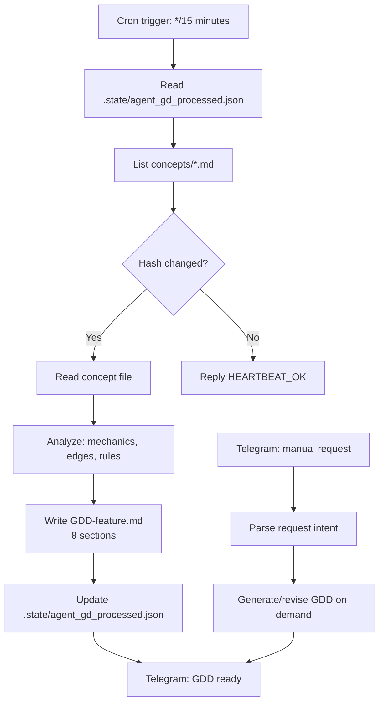
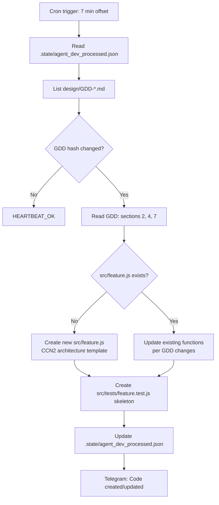
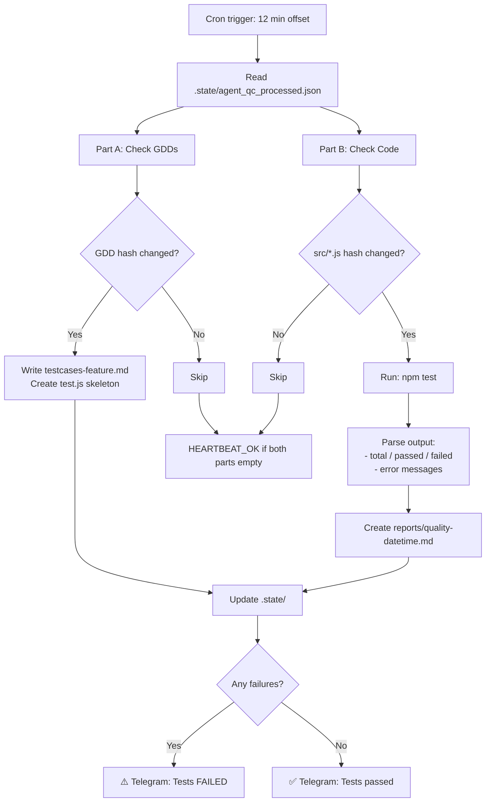
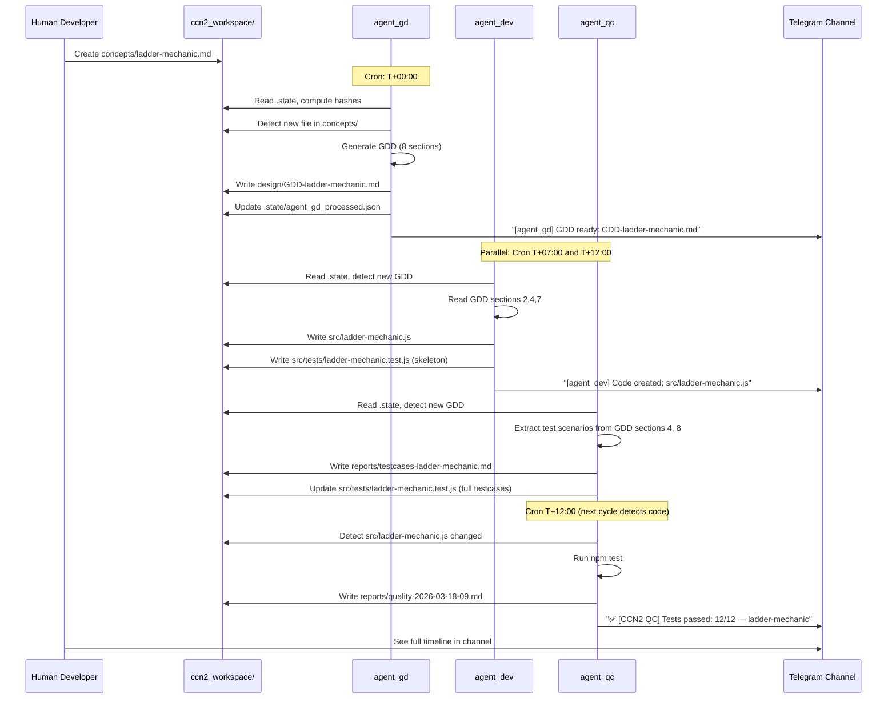

# CCN2 Agent Team — Agent Profiles

> **Scope**: Profile chi tiết từng agent — role, capabilities, triggers, tools, interaction diagrams

---

## Profile 1: agent_gd — Game Designer

### Identity Card

| Field | Value |
|-------|-------|
| **Agent ID** | `agent_gd` |
| **Name** | CCN2 Game Designer |
| **Role** | Chuyển concept → GDD |
| **Model** | claude-opus-4-6 (reasoning cao) |
| **Lane** | main (heartbeat/cron) |
| **Session key** | `agent:agent_gd:dm:default:default` |

### Capabilities

| Capability | Source |
|-----------|--------|
| Đọc gameplay concept, hiểu ý định thiết kế | LLM reasoning |
| Viết GDD 8 sections theo standard format | AGENTS.md template |
| Kết nối với CCN2 game rules | MEMORY.md + workspace context |
| Phát hiện concept file mới/thay đổi | Hash comparison qua exec |
| Gửi Telegram notification | message tool |
| Spawn sub-agent để xử lý GDD song song | sessions_spawn (self) |

### Skills Installed

```yaml
skills:
  - doc-wave-analysis      # Phân tích tài liệu nhiều tầng song song
  - speckit                # SDD pipeline: specify → plan → tasks
  - web-data-analysis      # Research từ web khi cần reference
```

### Trigger Map

```
Trigger 1: Cron (*/15 8-22 weekdays)
  → WORKSPACE_SCAN prompt
  → Check concepts/ hashes
  → Generate GDD if new/changed
  → Telegram notify

Trigger 2: Direct Telegram message
  → Respond to design questions
  → Manual GDD generation on request
  → Review/revise existing GDD
```

### Flow Diagram



### Output Files

| File | When | Format |
|------|------|--------|
| `design/GDD-<feature>.md` | New/changed concept | 8-section markdown |
| `.state/agent_gd_processed.json` | Every run | `{filepath: {hash, processedAt}}` |

### Sample GDD Output (ladder-mechanic)

```markdown
# GDD: Ladder Mechanic
**Source**: concepts/ladder-mechanic.md
**Created**: 2026-03-18
**Status**: Draft

## 1. Overview
The Ladder Mechanic is the win-condition pathway in CCN2. When a player accumulates
600 DIAMOND and lands on a safe zone, a gate opens allowing them to move their token
to the Ladder destination tile for their color, triggering game win.

## 2. Core Mechanics
1. Track player.diamond for each player
2. When player.diamond >= 600 AND player lands on safe zone → gate.open = true
3. When gate.open = true → player can choose to move toward LADDER tile
4. Token reaches LADDER tile → triggerWin(playerId)
...
```

---

## Profile 2: agent_dev — Developer

### Identity Card

| Field | Value |
|-------|-------|
| **Agent ID** | `agent_dev` |
| **Name** | CCN2 Developer |
| **Role** | GDD → code implementation |
| **Model** | claude-sonnet-4-6 |
| **Lane** | main (heartbeat/cron) |

### Capabilities

| Capability | Source |
|-----------|--------|
| Đọc GDD và hiểu requirements | LLM reasoning |
| Viết JS code theo CCN2 architecture | AGENTS.md + clientccn2/CLAUDE.md |
| Detect code patterns từ existing codebase | read tool + grep |
| Phát hiện GDD mới/thay đổi | Hash comparison |
| Tạo test skeletons | Jest format knowledge |
| Gửi Telegram notification | message tool |

### Skills Installed

```yaml
skills:
  - clientccn2-project-editor   # Đọc/sửa client code, apply patterns
  - serverccn2-project-editor   # Nếu feature cần server changes
```

### CCN2 Architecture Constraints (agent_dev must follow)

```
✅ Global CONFIG object in src/rules.js
✅ No import/export statements
✅ Cocos2d-x component patterns for UI
✅ Script load order: rules → utils → entities → board → input → game → ui → main
✅ Event bus: gv.bus for new code (NOT signalMgr/fr.event)
✅ All game constants in CONFIG, not magic numbers

❌ ES6 modules
❌ Arrow functions in Cocos2d handlers
❌ Importing external npm packages
❌ Modifying server code without approval
```

### Trigger Map

```
Trigger 1: Cron (7,22,37,52 8-22 weekdays)
  → WORKSPACE_SCAN prompt
  → Check design/GDD-*.md hashes
  → Implement feature if GDD new/changed
  → Create test skeleton
  → Telegram notify

Trigger 2: Direct Telegram
  → Code review
  → Explain existing code
  → Manual feature implementation
```

### Flow Diagram



### Output Files

| File | When | Format |
|------|------|--------|
| `src/<feature>.js` | New GDD | CCN2 JS architecture |
| `src/tests/<feature>.test.js` | New GDD | Jest format skeleton |
| `.state/agent_dev_processed.json` | Every run | hash map |

### Sample Code Output (ladder-mechanic)

```javascript
// src/ladder-mechanic.js
// CCN2 Game Engine — Ladder Mechanic
// Implements: GDD Ladder Mechanic (see design/GDD-ladder-mechanic.md)
// Created by: agent_dev 2026-03-18

var LadderMechanic = {

  // Check if player is eligible to enter ladder path
  isEligible: function(player) {
    return player.diamond >= CONFIG.WIN_DIAMOND_THRESHOLD;
  },

  // Called when player lands on safe zone with enough diamonds
  openGate: function(player, tileId) {
    if (!this.isEligible(player)) return false;
    if (!CONFIG.SAFE_ZONE_TILES.includes(tileId)) return false;
    player.gateOpen = true;
    gv.bus.emit('LADDER_GATE_OPENED', { playerId: player.id });
    return true;
  },

  // Called when player reaches LADDER destination tile
  triggerWin: function(player, tileId) {
    if (tileId !== CONFIG.LADDER_TILES[player.colorIndex]) return false;
    gv.bus.emit('GAME_WIN', { playerId: player.id, finalDiamond: player.diamond });
    return true;
  },

  reset: function() {
    // Called on new game
  }
};
```

---

## Profile 3: agent_qc — QA Engineer

### Identity Card

| Field | Value |
|-------|-------|
| **Agent ID** | `agent_qc` |
| **Name** | CCN2 QA Engineer |
| **Role** | Test automation + quality reports |
| **Model** | claude-sonnet-4-6 |
| **Lane** | main (heartbeat/cron) |

### Capabilities

| Capability | Source |
|-----------|--------|
| Đọc GDD, extract test scenarios | LLM reasoning |
| Viết Jest unit tests | Testing patterns |
| Chạy npm test qua exec | Bash tool |
| Parse test output (pass/fail counts) | Text parsing |
| Tạo quality reports | Template |
| Phát hiện code changes | Hash comparison |
| Alert failures ngay lập tức | message tool |

### Trigger Map

```
Trigger 1: Cron (12,27,42,57 8-22 weekdays) — Part A
  → Check design/GDD-*.md mới → viết testcases

Trigger 1: Cron — Part B
  → Check src/**/*.js thay đổi → chạy tests → quality report

Trigger 2: Direct Telegram
  → Manual test run on request
  → Explain test failures
  → Review test coverage
```

### Flow Diagram



### Output Files

| File | When | Format |
|------|------|--------|
| `reports/testcases-<feature>.md` | New GDD | Markdown checklist |
| `src/tests/<feature>.test.js` | New GDD | Jest format |
| `reports/quality-<datetime>.md` | Code change detected | Structured report |
| `.state/agent_qc_processed.json` | Every run | hash map |

### Sample Test Output (ladder-mechanic)

```javascript
// src/tests/ladder-mechanic.test.js
// Generated by: agent_qc from GDD-ladder-mechanic.md

describe('LadderMechanic', () => {

  describe('isEligible()', () => {
    test('player with 600 diamonds is eligible', () => {
      const player = { diamond: 600, colorIndex: 0 };
      expect(LadderMechanic.isEligible(player)).toBe(true);
    });

    test('player with 599 diamonds is NOT eligible', () => {
      const player = { diamond: 599 };
      expect(LadderMechanic.isEligible(player)).toBe(false);
    });

    test('player with 0 diamonds is NOT eligible', () => {
      const player = { diamond: 0 };
      expect(LadderMechanic.isEligible(player)).toBe(false);
    });
  });

  describe('openGate() — Edge Cases from GDD section 4', () => {
    test('eligible player on safe zone opens gate', () => {
      const player = { diamond: 600, gateOpen: false, id: 1 };
      const result = LadderMechanic.openGate(player, 1); // tile 1 = safe zone
      expect(result).toBe(true);
      expect(player.gateOpen).toBe(true);
    });

    test('ineligible player on safe zone does NOT open gate', () => {
      const player = { diamond: 500, gateOpen: false };
      expect(LadderMechanic.openGate(player, 1)).toBe(false);
      expect(player.gateOpen).toBe(false);
    });

    test('eligible player NOT on safe zone cannot open gate', () => {
      const player = { diamond: 600, gateOpen: false };
      expect(LadderMechanic.openGate(player, 7)).toBe(false); // tile 7 not safe
    });
  });

  describe('triggerWin()', () => {
    test('player reaching correct LADDER tile wins', () => {
      const player = { diamond: 600, colorIndex: 0, id: 1 }; // Green = tile 41
      expect(LadderMechanic.triggerWin(player, 41)).toBe(true);
    });

    test('player on wrong LADDER tile does not win', () => {
      const player = { colorIndex: 0, id: 1 }; // Green player
      expect(LadderMechanic.triggerWin(player, 42)).toBe(false); // Red tile
    });
  });
});
```

---

## Interaction Diagram: Full Team Flow



---

## Agent Coordination Summary

| Scenario | agent_gd | agent_dev | agent_qc |
|---------|---------|---------|---------|
| New concept file | 🔄 Creates GDD | ⏳ Waits for GDD | ⏳ Waits for GDD |
| New GDD available | ✅ Done | 🔄 Implements code | 🔄 Writes testcases |
| Code change detected | N/A | ✅ Done | 🔄 Runs tests |
| Tests fail | N/A | 🔄 Fix code | 🔄 Reports + alerts |
| Nothing changed | 💤 HEARTBEAT_OK | 💤 HEARTBEAT_OK | 💤 HEARTBEAT_OK |

---

*Agent Profiles version 1.0 — 2026-03-17*
