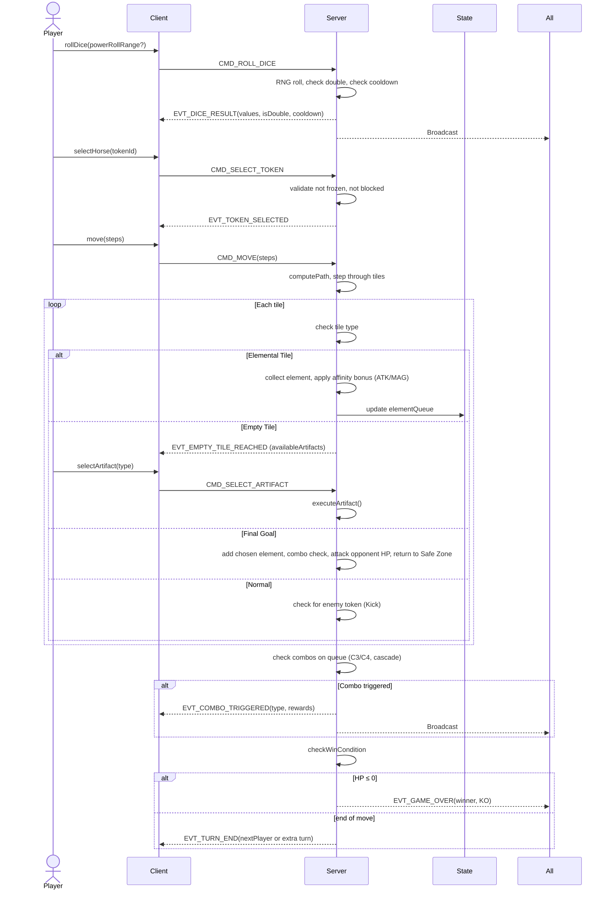
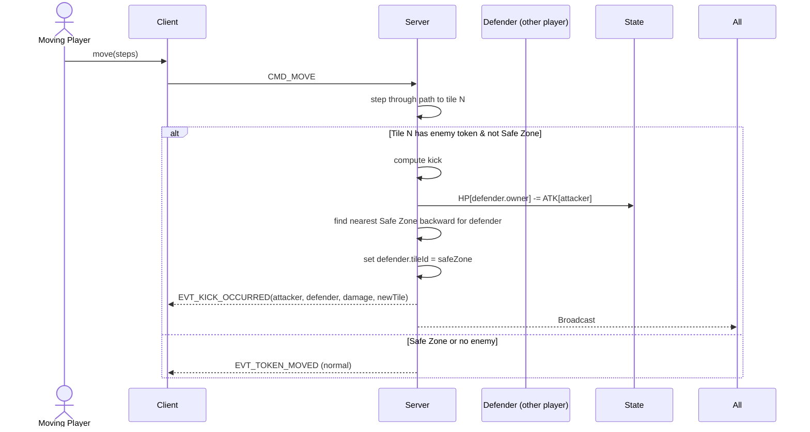
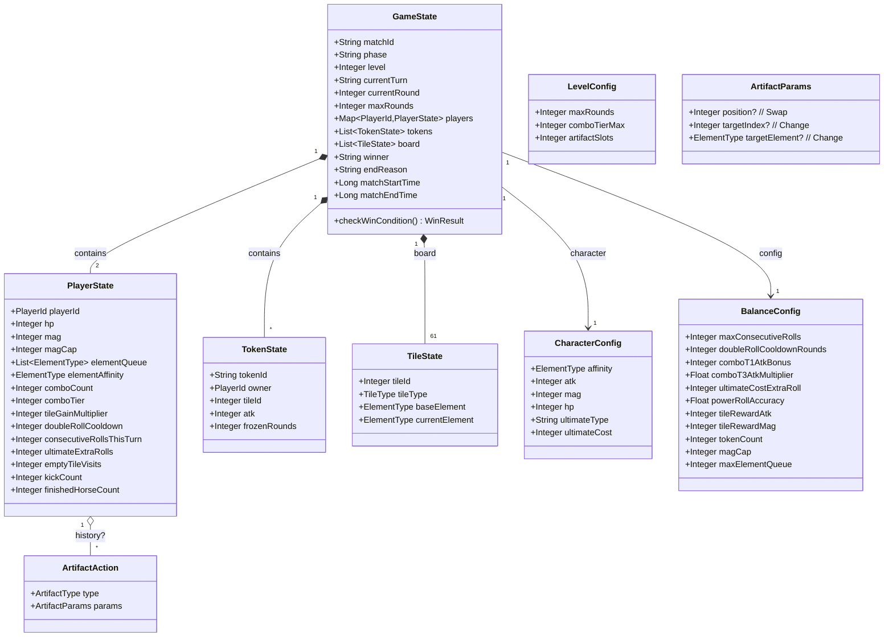
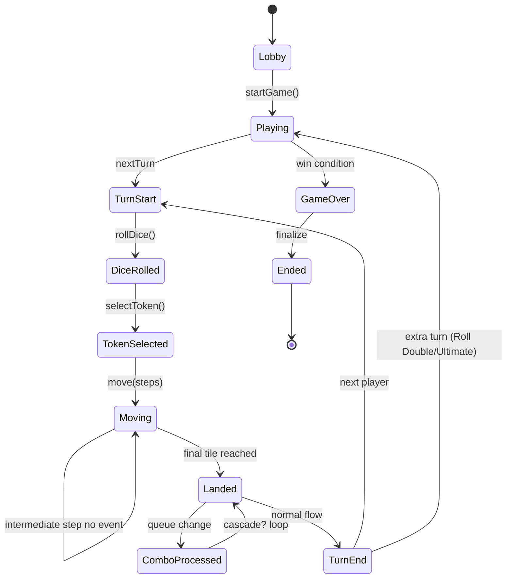

# DESIGN-elemental-hunter — Technical Architecture Design
**Source**: REQ-elemental-hunter.md + GDD-FEATURE-elemental-hunter.md (v1)  
**Created**: 2026-03-19 10:54 GMT+7  
**Created by**: agent_dev (Codera) — pipeline auto-design  
**Status**: Draft (require diagram validation)

---

## 1. Architecture Overview

Elemental Hunter được implement theo kiến trúc 3-layer của CCN2:

```
┌─────────────────────────────────────────────────────┐
│  CLIENT (TypeScript / Cocos2d-x)                    │
│  - Board rendering (61-tile cross map)              │
│  - Token animation + movement                       │
│  - UI: Element Queue, HP bar, MAG bar, dice         │
│  - Power Roll UI, Artifact selection UI             │
│  - Event bus: elementalHunter:* events              │
└────────────────────┬────────────────────────────────┘
                     │ WebSocket (game packets)
┌────────────────────▼────────────────────────────────┐
│  SERVER (Kotlin / Ktor / Actor model)               │
│  - Authoritative game state                         │
│  - Turn logic, movement validation                  │
│  - Combo detection (C3/C4/Cascading)                │
│  - Combat (Kick, FinalGoal attack)                  │
│  - MAG, Ultimate, Power Roll RNG                    │
│  - Win condition check                              │
└────────────────────┬────────────────────────────────┘
                     │ REST API
┌────────────────────▼────────────────────────────────┐
│  ADMIN (Java + React / REST)                        │
│  - Balance config management (magCap, maxQueue)    │
│  - Metrics dashboard (Behavior + Balance)          │
└─────────────────────────────────────────────────────┘
```

---

## 2. Diagrams

### 2.1 Use Case Diagram

```mermaid
graph TD
  subgraph Player
    UC1[Roll Dice]
    UC2[Select Horse]
    UC3[Move Horse]
    UC4[Activate Artifact]
    UC5[Use Ultimate]
  end

  subgraph Server (Authoritative)
    UC6[Trigger Combo]
    UC7[Kick Opponent]
    UC8[Process Landing]
    UC9[Check Win Condition]
  end

  subgraph Admin
    UC10[Configure Balance]
    UC11[Monitor Metrics]
  end

  Player --> UC1
  Player --> UC2
  Player --> UC3
  Player --> UC4
  Player --> UC5

  UC1 -.->|triggers| UC6
  UC3 -.->|triggers| UC6
  UC3 -.->|triggers| UC7
  UC3 -.->|triggers| UC8
  UC8 -.->|triggers| UC6
  UC9 -.->|after turn| Server

  Admin --> UC10
  Admin --> UC11
```

---

### 2.2 Sequence Diagram — Happy Path Turn



---

### 2.3 Sequence Diagram — Kick (Error Path)



---

### 2.4 Class Diagram — Domain Objects



---

### 2.5 State Diagram — Turn Flow (Simplified)



---

## 3. Module Breakdown

### 3.1 BoardModule
**Responsibility**: Board layout, pathfinding, Branch Point logic

```typescript
const ARM_PATHS: Record<PlayerId, number[]> = {
  P1: [51, ...9 more],  // 10 tiles including Start (51)
  P2: [0, ...9 more],
  // P3, P4 nếu cần
};
const MAIN_LOOP: number[] = [...];  // circular connecting arms
const BRANCH_RULES: Record<number, { ownerId: PlayerId; goalPath: number[] }> = {
  // Branch tile X: owner Y → goalPath Y (4 tiles to FinalGoal)
};
const FINAL_GOALS: Record<PlayerId, number> = { P1: 31, P2: 25 };
const SAFE_ZONES: number[] = [...];  // includes Start, maybe others
const ELEMENTAL_TILES: Record<number, ElementType> = {
  // tileId -> element type (Fire/Ice/Grass/Rock)
};
const EMPTY_TILE_IDS: number[] = [...];

function getPath(from: number, steps: number, owner: PlayerId): number[] { ... }
function getNearestSafeZone(tileId: number, direction: 'backward'): number { ... }
function isSafeZone(tileId: number): boolean { ... }
function isBranchPoint(tileId: number): boolean { ... }
```

---

### 3.2 TurnModule
**Responsibility**: Turn flow, dice rolling, token selection, move execution

```typescript
class TurnHandler {
  startTurn(state: GameState): TurnContext
  rollDice(ctx: TurnContext, powerRoll?: TargetRange): DiceResult
  selectToken(ctx: TurnContext, tokenId: string): boolean
  moveToken(ctx: TurnContext, tokenId: string, steps: number): MoveResult
  endTurn(ctx: TurnContext): GameState
  checkConsecutiveRollCap(ctx: TurnContext): boolean
  activateUltimate(ctx: TurnContext): void
}
```

---

### 3.3 ElementModule
**Responsibility**: Element collection, queue management, combo detection + rewards

```typescript
class ElementEngine {
  collectElement(state: GameState, playerId: PlayerId, tile: TileState): void
  addToQueue(playerState: PlayerState, element: ElementType): void
  processCombos(queue: ElementType[]): ComboResult[]
  applyComboRewards(state: GameState, playerId: PlayerId, combo: ComboResult): void
  checkMilestoneTier(comboCount: number): 1 | 2 | 3
}
```

---

### 3.4 CombatModule
**Responsibility**: Kick damage, push-back, Final Goal attack

```typescript
class CombatEngine {
  checkKick(state: GameState, movingToken: TokenState, landedTile: number): KickResult | null
  executeKick(state: GameState, attacker: TokenState, defender: TokenState): void
  processFinalGoal(state: GameState, tokenId: string, chosenElement: ElementType): void
}
```

---

### 3.5 ArtifactModule
**Responsibility**: Artifact pool, unlock thresholds, execution

```typescript
class ArtifactHandler {
  getAvailableArtifacts(player: PlayerState, level: LevelConfig): ArtifactType[]
  executeArtifact(state: GameState, playerId: PlayerId, action: ArtifactAction): void
  unlockArtifacts(player: PlayerState, visitedCount: number): ArtifactType[]
}
```

---

### 3.6 CharacterModule
**Responsibility**: Character, Level, Balance configurations

```kotlin
// Kotlin config classes
data class CharacterConfig(
  val affinity: ElementType,
  val atk: Int,
  val mag: Int,
  val hp: Int,
  val ultimateType: String,
  val ultimateCost: Int
)

data class LevelConfig(
  val maxRounds: Int,
  val comboTierMax: Int,
  val artifactSlots: Int
)

object BalanceConfig {
  const val MAX_CONSECUTIVE_ROLLS = 3
  const val DOUBLE_ROLL_COOLDOWN_ROUNDS = 2
  const val COMBO_T1_ATK_BONUS = 150
  const val COMBO_T3_ATK_MULTIPLIER = 1.5
  const val ULTIMATE_COST_EXTRA_ROLL = 50
  const val POWER_ROLL_ACCURACY = 0.20
  const val TILE_REWARD_ATK = 30   // = character.atk
  const val TILE_REWARD_MAG = 10   // = character.mag
  const val TOKEN_COUNT = 3
  var magCap: Int = TODO()        // OQ-01
  var maxElementQueue: Int = TODO() // OQ-02
}
```

---

## 4. Data Models

### 4.1 PlayerState
```typescript
interface PlayerState {
  playerId: 'P1' | 'P2';
  hp: number;
  mag: number;
  magCap: number;
  elementQueue: ElementType[];
  elementAffinity: ElementType;
  comboCount: number;
  comboTier: 1 | 2 | 3;
  tileGainMultiplier: 1 | 2;
  doubleRollCooldown: number;
  consecutiveRollsThisTurn: number;
  ultimateExtraRolls: number;
  emptyTileVisits: number;
  kickCount: number;
  finishedHorseCount: number;
}
```

### 4.2 TokenState
```typescript
interface TokenState {
  tokenId: string;
  owner: 'P1' | 'P2';
  tileId: number;
  atk: number;
  frozenRounds: number;
}
```

### 4.3 TileState
```typescript
interface TileState {
  tileId: number;
  tileType: 'elemental' | 'empty' | 'safe_zone' | 'start';
  baseElement: ElementType | null;
  currentElement: ElementType | null;
}
```

### 4.4 GameState
```typescript
interface GameState {
  matchId: string;
  phase: 'lobby' | 'playing' | 'ended';
  level: 1 | 2 | 3;
  currentTurn: 'P1' | 'P2';
  currentRound: number;
  maxRounds: number;
  players: Record<'P1' | 'P2', PlayerState>;
  tokens: TokenState[];
  board: TileState[];
  winner: 'P1' | 'P2' | null;
  endReason: 'ko' | 'round_limit' | null;
  matchStartTime: number;
  matchEndTime: number | null;
}
```

---

## 5. Implementation Layer Mapping

### 5.1 Client (agent_dev_client → src/client/elemental-hunter/)

| Component | File | Notes |
|-----------|------|-------|
| BoardRenderer | board-renderer.ts | Render 61-tile cross, isometric |
| TokenRenderer | token-renderer.ts | Sprite + ATK label + animation |
| DiceUI | dice-ui.ts | Two dice, Power Roll slider |
| ElementQueueUI | element-queue-ui.ts | Queue icons, combo highlight |
| HUDRenderer | hud-renderer.ts | HP/MAG bars, round/turn display |
| ArtifactUI | artifact-ui.ts | Modal selection, unlock state |
| ComboAnimation | combo-animation.ts | C3/C4 cascade effects |
| EventBus | event-bus.ts | `elementalHunter:*` |
| GameScene | game-scene.ts | Main loop, WS handler |

### 5.2 Server (agent_dev_server → src/server/elemental-hunter/)

| Component | File | Notes |
|-----------|------|-------|
| GameRoom | GameRoom.kt | Actor per room, holds GameState |
| TurnHandler | TurnHandler.kt | Commands + validation |
| MovementValidator | MovementValidator.kt | Path calc, Branch logic |
| ElementEngine | ElementEngine.kt | Queue + combo detection |
| CombatEngine | CombatEngine.kt | Kick + FinalGoal |
| ArtifactHandler | ArtifactHandler.kt | Artifact execution |
| RNGService | RNGService.kt | Dice + Power Roll 20% |
| GameConfig | GameConfig.kt | Character/Level/Balance configs |
| MetricsCollector | MetricsCollector.kt | Behavior + balance |

### 5.3 Admin (agent_dev_admin → src/admin/elemental-hunter/)

| Component | File | Notes |
|-----------|------|-------|
| BalanceConfigEditor | BalanceConfigEditor.tsx | Edit magCap, maxQueue, etc |
| CharacterEditor | CharacterEditor.tsx | ATK/MAG/HP/Affinity |
| LevelEditor | LevelEditor.tsx | Round limit, combo tier, artifact slots |
| SessionMonitor | SessionMonitor.tsx | Live match viewer |
| MetricsDashboard | MetricsDashboard.tsx | Behavior + balance charts |
| GameLogViewer | GameLogViewer.tsx | Turn replay |

---

## 6. Event System (Client ↔ Server Protocol)

### 6.1 Server → Client
```typescript
EVT_GAME_START         { level, character, tokenPositions, initialElements }
EVT_DICE_RESULT        { values: [d1,d2], isPowerRoll, hitTarget, isDouble, cooldown }
EVT_TOKEN_MOVED        { tokenId, path: number[], landedTile }
EVT_ELEMENT_COLLECTED  { playerId, element, tileId, queueState }
EVT_COMBO_TRIGGERED    { playerId, type: 'C3'|'C4', elements, rewards, cascade? }
EVT_KICK_OCCURRED      { attacker, defender, damage, defenderNewTile }
EVT_GOAL_REACHED       { tokenId, chosenElement, comboResult, attackDamage }
EVT_TURN_END           { nextPlayer, currentRound }
EVT_GAME_OVER          { winner, reason, finalHp }
EVT_ARTIFACT_USED      { playerId, artifactType, params, queueState }
EVT_EMPTY_TILE_REACHED { artifactsAvailable: ArtifactType[] }
```

### 6.2 Client → Server
```typescript
CMD_ROLL_DICE          { powerRollTarget?: [min,max] }
CMD_SELECT_TOKEN       { tokenId }
CMD_SELECT_ARTIFACT    { artifactType, params? }
CMD_SELECT_GOAL_ELEMENT{ element: ElementType }
CMD_ACTIVATE_ULTIMATE  {}
```

---

## 7. Key Algorithms

### 7.1 Combo Detection (processCombos)
```kotlin
fun processCombos(queue: ArrayDeque<ElementType>): List<ComboResult> {
  val results = mutableListOf<ComboResult>()
  var cascade = true
  while (cascade) {
    cascade = false
    // Priority: C3 first
    for (i in 0 until queue.size - 2) {
      if (queue[i] == queue[i+1] && queue[i] == queue[i+2]) {
        val removed = listOf(queue.removeAt(i), queue.removeAt(i), queue.removeAt(i))
        results.add(ComboResult("C3", removed))
        cascade = true
        break  // restart scanning
      }
    }
    if (cascade) continue
    // Then C4: all 4 different
    for (i in 0 until queue.size - 3) {
      val sub = queue.subList(i, i+4)
      if (sub.distinct().size == 4) {
        val removed = sub.toList()
        repeat(4) { queue.removeAt(i) }
        results.add(ComboResult("C4", removed))
        cascade = true
        break
      }
    }
  }
  return results
}
```

### 7.2 Branch Point Movement
```kotlin
fun getNextTilePath(current: Int, steps: Int, owner: PlayerId): List<Int> {
  val path = mutableListOf<Int>()
  var tile = current
  repeat(steps) {
    val next = if (BRANCH_RULES.containsKey(tile) && tile == BRANCH_RULES[tile]?.goalPath?.first()) {
      // At branch: decide based on owner
      if (owner == BRANCH_RULES[tile]?.ownerId) BRANCH_RULES[tile]?.goalPath?.get(1)
      else MAIN_LOOP[(MAIN_LOOP.indexOf(tile) + 1) % MAIN_LOOP.size]
    } else {
      // default next along MAIN_LOOP or goal path continuation
      defaultNext(tile, owner)
    }
    path.add(next)
    tile = next
  }
  return path
}
```

### 7.3 Nearest Safe Zone (Kick Push-Back)
```kotlin
fun getNearestSafeZoneBackward(tileId: Int): Int {
  val path = MAIN_LOOP.reversed()  // depends on player direction
  val idx = path.indexOf(tileId)
  for (i in (idx+1) until path.size) {
    if (SAFE_ZONES.contains(path[i])) return path[i]
  }
  return SAFE_ZONES.first()  // fallback
}
```

---

## 8. Open Technical Decisions

| ID | Decision | Options | Current Choice | Owner |
|----|----------|---------|----------------|-------|
| TD-01 | `magCap` value | 50, 100, infinite? | Undecided (balance) | Balance |
| TD-02 | `maxElementQueue` size | 4, 6, 8? | Undecided (balance) | Balance |
| TD-03 | Pillow Affinity | Fire/Ice/Grass/Rock | TBD | Character Design |
| TD-04 | Board tile map layout (exact IDs) | Need detailed map | TBD | Map Designer |
| TD-05 | Ultimate Extra Roll: auto or manual? | Auto after move / manual button | Manual per GDD "Cost 50 MAG. Kích hoạt..." suggests manual trigger | Designia |
| TD-06 | Does Ultimate count toward `MAX_CONSECUTIVE_ROLLS`? | Yes / No | Likely Yes (cap applies to all extra rolls) | Designia |
| TD-07 | Safe Zone stacking when kicked | Allow multiple tokens? | Assume allow (simplify) | Game Designer |

---

**Next Steps:**
- Self-evaluate this DESIGN against Design Rubric
- Generate DESIGN-EVAL with scores
- If `combined_score ≥ 70` → Dispatch to client/server/admin agents
