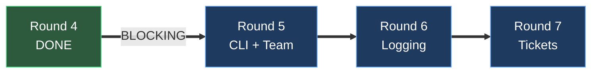
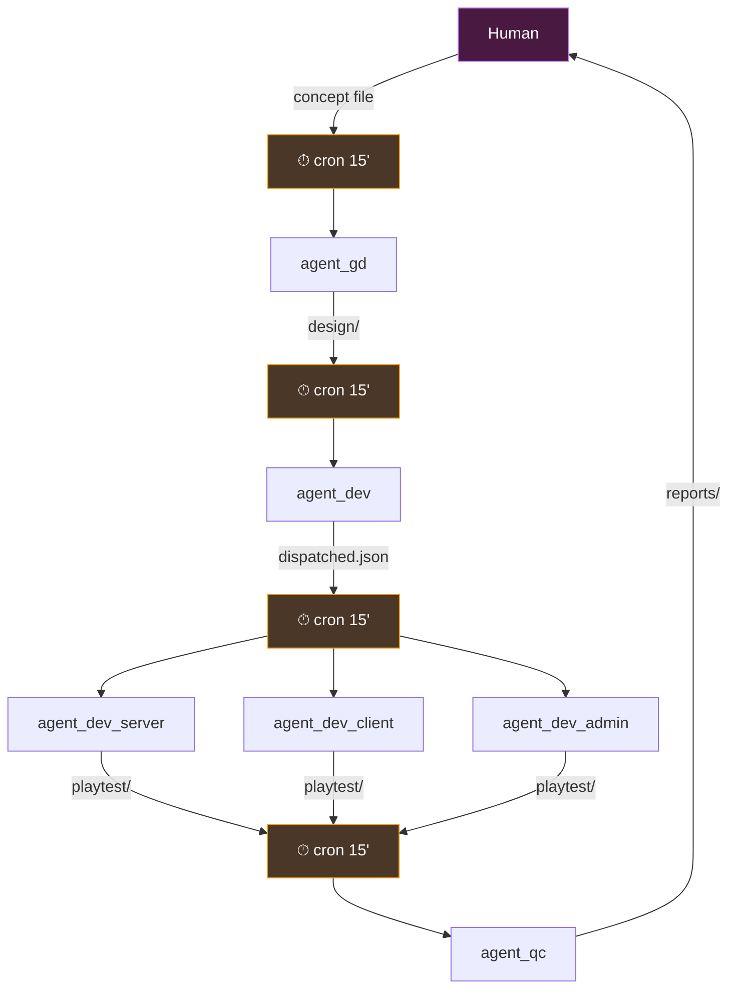
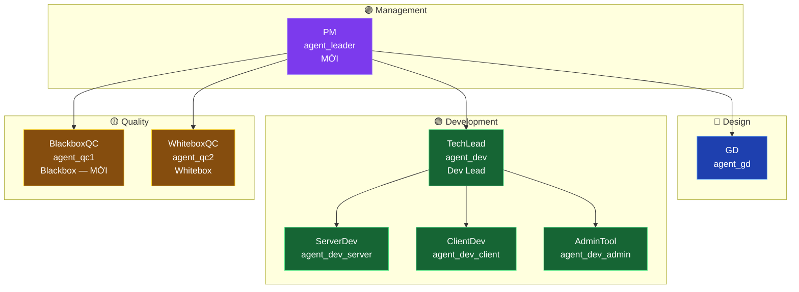
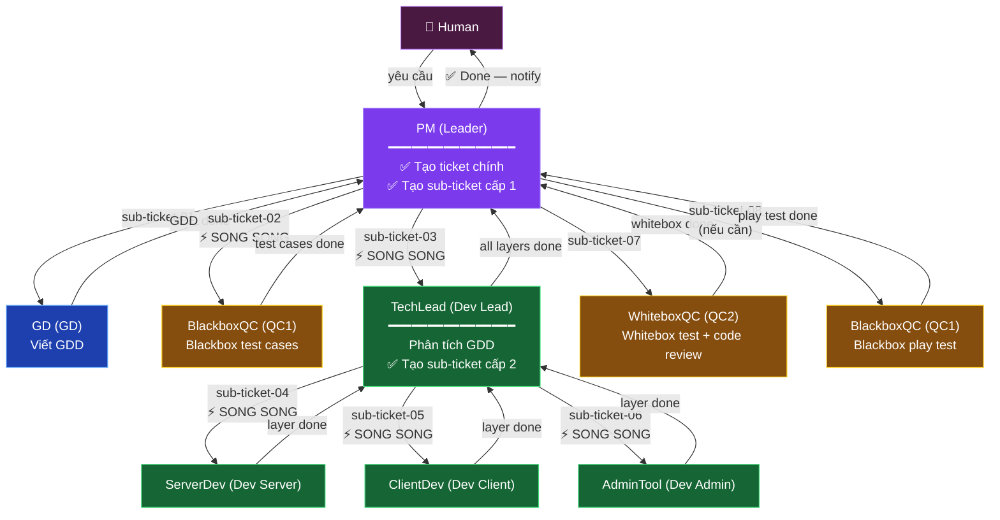
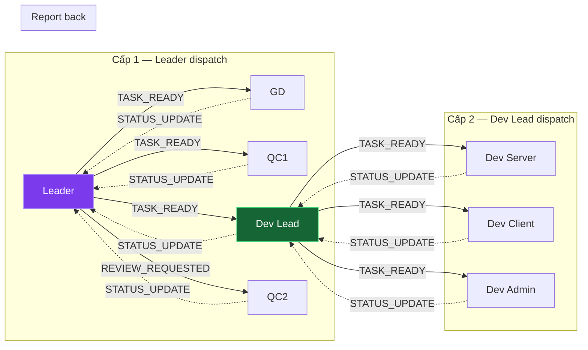
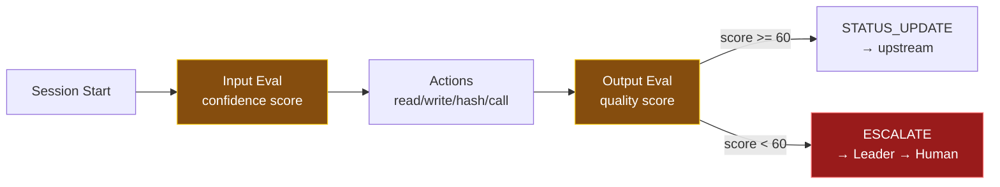
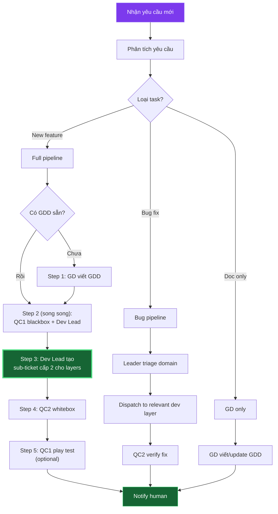
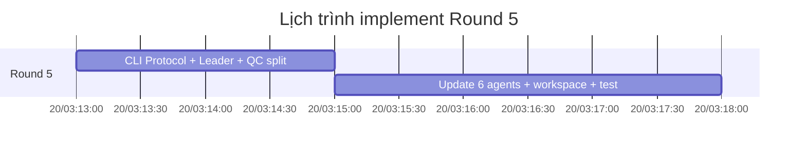
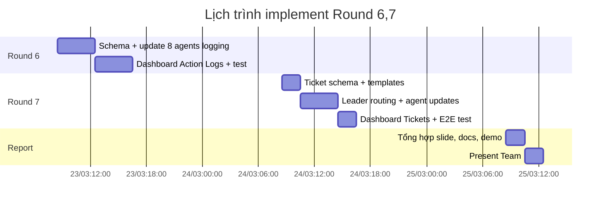
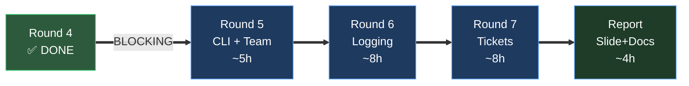

# Kế Hoạch Nâng Cấp Agent Team — Round 5, 6, 7

**Phiên bản**: v2.1
**Ngày lập**: 2026-03-20
**Trạng thái**: DRAFT — cần review trước khi implement

---

## Tóm Tắt Executive

Hệ thống agent team hiện tại (sau Round 4) hoạt động theo mô hình **polling + cron + file-based state**. Ba round tiếp theo nâng cấp lên mô hình **event-driven** với 4 trụ cột:

| Round | Trụ cột | Mục tiêu |
|-------|---------|----------|
| Round 5 | CLI Protocol + Tái cấu trúc đội hình | Giao tiếp trực tiếp qua CLI, thêm Leader agent, tách QC thành 2 |
| Round 6 | Action Logging & Self-Evaluation | Log toàn bộ quá trình + agent tự đánh giá input/output |
| Round 7 | Ticket System với Sub-tickets | Human gửi yêu cầu → Leader tạo ticket + sub-tickets → pipeline tự chạy |



---

## Bối Cảnh — Trạng Thái Sau Round 4

### Kiến trúc hiện tại



### Điểm mạnh đã có
- 6 agents với AGENTS.md, SOUL.md, HEARTBEAT.md, IDENTITY.md đầy đủ
- `.state/` JSON tracking (processed, dispatched, bug-tracker, pipeline-health)
- Bug flow hoàn chỉnh (BUG-TEMPLATE → triage → domain routing → verify)
- Playtest pipeline (smoke-test.ps1 + C7_playtest)
- Single Source of Truth: agents ghi thẳng vào `playtest/`

### Điểm yếu cần giải quyết
1. **Độ trễ 15 phút** giữa các agent do cron polling
2. **Không có tracing** — không biết agent nghĩ gì, dùng tool gì
3. **Input từ human** phải tạo file thủ công — không có channel trực tiếp
4. **Pipeline cứng** — flow luôn GD→Dev→Layers→QC, không linh hoạt
5. **1 QC làm tất cả** — blackbox test phải chờ code xong mới bắt đầu
6. **GD kiêm coordinator** — vừa design vừa quản lý, dễ quá tải

---

## Đội Hình Agent Mới (8 Agents)

### So sánh trước / sau

| Trước (Round 1–4) | Sau (Round 5–7) |
|---|---|
| 6 agents, GD kiêm coordinator | 8 agents, **Leader chuyên trách** |
| 1 QC làm tất cả | **2 QC**: blackbox + whitebox |
| Flow cứng, tuần tự | Leader đánh giá routing linh hoạt |
| Agents chia sẻ workspace | Mỗi agent có workspace riêng + shared |

### Danh sách 8 agents

| # | Tên            | ID | Vai trò | Mới? |
|---|----------------|-----|---------|------|
| 1 | **PM**         | `agent_leader` | Project Lead — nhận yêu cầu, tạo ticket, routing, theo dõi | **MỚI** |
| 2 | GD             | `agent_gd` | Game Designer — viết GDD từ concept/spec | Giữ |
| 3 | TechLead       | `agent_dev` | Dev Lead — phân tích GDD, thiết kế code, dispatch | Giữ |
| 4 | ServerDev      | `agent_dev_server` | Server Developer — implement server code | Giữ |
| 5 | ClientDev      | `agent_dev_client` | Client Developer — implement client code | Giữ |
| 6 | AdminTool      | `agent_dev_admin` | Admin Developer — implement admin tools | Giữ |
| 7 | **BlackboxQC** | `agent_qc1` | QC Blackbox — test từ GDD, không cần code | **MỚI** (tách từ WhiteboxQC) |
| 8 | **WhiteboxQC** | `agent_qc2` | QC Whitebox — unit test, code review, cần code | Đổi tên ID |



### Lợi ích đội hình mới

**Leader tách riêng (PM)**:
- GD không bị overload vừa design vừa quản lý ticket
- Leader có khả năng đánh giá cần worker nào, song song hay tuần tự
- Leader theo dõi tiến độ, escalate khi stuck, báo cáo human

**2 QC chuyên biệt**:
- QC1 (BlackboxQC) chạy **song song với Dev** — chỉ cần GDD, viết test cases + blackbox scenarios
- QC2 (WhiteboxQC) chạy **sau Dev** — cần code để whitebox test + code review
- Pipeline nhanh hơn vì blackbox test không phải chờ code

---

## Workspace Mới

```
ccn2_workspace/
├── agents/                          # Workspace riêng từng agent
│   ├── agent_leader/                # Leader: routing decisions, ticket drafts
│   ├── agent_gd/                    # GD: concept analysis, GDD drafts
│   ├── agent_dev/                   # Dev Lead: design docs, dispatch plans
│   ├── agent_dev_server/            # Server: implementation workspace
│   ├── agent_dev_client/            # Client: implementation workspace
│   ├── agent_dev_admin/             # Admin: implementation workspace
│   ├── agent_qc1/                   # QC Blackbox: test case drafts
│   └── agent_qc2/                   # QC Whitebox: test results, reviews
│
├── shared/                          # Workspace chung — mọi agent đọc/ghi
│   ├── concepts/                    # Input specs từ human
│   ├── design/                      # GDD output
│   ├── analysis/                    # Design docs
│   ├── playtest/                    # Code output (server/client/admin)
│   └── reports/                     # QC reports, dashboard
│
├── tickets/                         # Ticket system
│   ├── README.md                    # Hướng dẫn tạo ticket
│   ├── TICKET-TEMPLATE.md           # Template
│   └── <user>/                      # Tickets theo user
│       ├── ticket-20260320-001.md   # Ticket chính
│       ├── sub-20260320-001-01.md   # Sub-ticket cho GD
│       ├── sub-20260320-001-02.md   # Sub-ticket cho QC1
│       └── ...
│
├── logs/                            # Action logs (VCS ignore)
│   ├── agent_leader/YYYY-MM-DD/
│   ├── agent_gd/YYYY-MM-DD/
│   └── ...
│
├── .state/                          # State tracking (JSON)
│   ├── SCHEMA.md
│   ├── ticket-tracker.json
│   ├── processed.json
│   ├── dispatched.json
│   └── pipeline-health.json
│
├── docs/                            # Documentation
│   ├── ARCHITECTURE.md
│   ├── HOWTO-create-ticket.md
│   └── AGENT-GUIDE.md
│
└── README.md                        # Tổng quan repo + cấu trúc
```

---

## Pipeline Mới

### Luồng hoàn chỉnh — Ai tạo sub-ticket nào?

Có **2 cấp dispatch**, mỗi cấp có agent chịu trách nhiệm tạo sub-ticket riêng:

| Cấp | Agent tạo sub-ticket | Tạo cho ai | Lý do |
|-----|---------------------|------------|-------|
| **Cấp 1** | **Leader (PM)** | GD, QC1, Dev Lead, QC2 | Leader biết routing tổng thể |
| **Cấp 2** | **Dev Lead (TechLead)** | Dev Server, Dev Client, Dev Admin | Dev Lead mới biết cần layers nào sau khi phân tích GDD |

> **Tại sao Dev Lead tạo sub-ticket cho dev layers, không phải Leader?**
> - Leader không đủ context kỹ thuật để biết feature cần server, client, hay admin
> - Dev Lead phân tích GDD → viết design doc → từ đó mới biết cần dispatch layers nào
> - Dev Lead cũng quyết định skip layer (VD: feature chỉ cần server, không cần admin)



### Ví dụ: Feature "main-gameplay" — sub-ticket flow

```
Ticket: ticket-20260320-001 (tạo bởi Leader)
│
├── sub-01  GD          ← Leader tạo       "Viết GDD main-gameplay"
├── sub-02  QC1         ← Leader tạo       "Blackbox test cases từ GDD"
├── sub-03  Dev Lead    ← Leader tạo       "Phân tích GDD + dispatch layers"
│   ├── sub-04  Dev Server  ← Dev Lead tạo "Implement server code"
│   ├── sub-05  Dev Client  ← Dev Lead tạo "Implement client code"
│   └── sub-06  Dev Admin   ← Dev Lead tạo "Implement admin" (hoặc SKIP)
├── sub-07  QC2         ← Leader tạo       "Whitebox test + code review"
└── sub-08  QC1         ← Leader tạo       "Blackbox play test" (optional)
```

### So sánh thời gian

| Pipeline | Latency |
|----------|---------|
| Cũ (cron 15' × 5 bước) | 60–90 phút |
| **Mới (CLI + song song)** | **8–20 phút** |

Nhanh hơn nhờ:
- QC1 chạy song song với Dev (tiết kiệm ~5-10')
- Leader routing thông minh (skip agent không cần)
- CLI call trực tiếp, không chờ cron

---

## Round 5 — CLI Protocol + Tái Cấu Trúc Đội Hình

### Mục tiêu
1. Giao tiếp agent-to-agent qua CLI trực tiếp
2. Thêm Leader agent (PM) làm coordinator
3. Tách QC thành QC1 (blackbox) + QC2 (whitebox)

### Spec 5.1 — CLI Command (✅ Verified trên staging)

**Format chuẩn:**
```bash
openclaw agent --agent <agent_id> -m "<prompt_message>"
```

**Ví dụ:**
```bash
# Leader → GD: yêu cầu viết GDD
openclaw agent --agent agent_gd -m "TASK_READY: ticket_id=TICKET-001, sub_ticket=sub-20260320-001-01.md, feature=main-gameplay, spec=concepts/main-gameplay.md, priority=High"

# GD xong → báo Leader
openclaw agent --agent agent_leader -m "STATUS_UPDATE: ticket_id=TICKET-001, agent=agent_gd, status=done, output=design/GDD-FEATURE-main-gameplay.md, score=88"

# Leader → dispatch song song QC1 + Dev Lead
openclaw agent --agent agent_qc1 -m "TASK_READY: ticket_id=TICKET-001, sub_ticket=sub-20260320-001-02.md, feature=main-gameplay, gdd_path=design/GDD-FEATURE-main-gameplay.md"
openclaw agent --agent agent_dev -m "TASK_READY: ticket_id=TICKET-001, sub_ticket=sub-20260320-001-03.md, feature=main-gameplay, gdd_path=design/GDD-FEATURE-main-gameplay.md"

# Dev Lead → dispatch song song 3 dev layers (Dev Lead tạo sub-ticket)
openclaw agent --agent agent_dev_server -m "TASK_READY: ticket_id=TICKET-001, sub_ticket=sub-20260320-001-04.md, feature=main-gameplay, design_path=analysis/DESIGN-main-gameplay.md"
openclaw agent --agent agent_dev_client -m "TASK_READY: ticket_id=TICKET-001, sub_ticket=sub-20260320-001-05.md, feature=main-gameplay, design_path=analysis/DESIGN-main-gameplay.md"
openclaw agent --agent agent_dev_admin -m "TASK_READY: ticket_id=TICKET-001, sub_ticket=sub-20260320-001-06.md, feature=main-gameplay, design_path=analysis/DESIGN-main-gameplay.md"
```

### Spec 5.2 — Message Protocol

Mỗi message giữa agents follow format:
```
<TRIGGER_TYPE>: <CONTEXT_BLOCK>
```

**Trigger types:**

| Type | Ý nghĩa | Hướng |
|------|---------|-------|
| `TASK_READY` | Task mới cần xử lý | Leader/Dev Lead → worker |
| `STATUS_UPDATE` | Báo cáo kết quả | Worker → Leader (hoặc → Dev Lead) |
| `BUG_ASSIGNED` | Bug cần fix | Leader → worker |
| `REVIEW_REQUESTED` | Yêu cầu review | Leader → QC |
| `ESCALATE` | Cần human quyết định | Leader → human (Telegram) |
| `PIPELINE_ALERT` | Cảnh báo blocking/failure | Any → Leader |

> **Lưu ý**: Dev layers (Server/Client/Admin) gửi `STATUS_UPDATE` cho **Dev Lead**, không phải Leader. Dev Lead tổng hợp rồi báo Leader khi all layers done.

**Context block:**
```
ticket_id=<TICKET-xxx>, sub_ticket=<sub-xxx.md>, feature=<name>,
gdd_path=<path>, design_path=<path>, output_path=<path>,
priority=<HIGH|NORMAL|LOW>, agent=<source_agent_id>
```

### Spec 5.3 — Leader Agent (PM)

**Vai trò chính:**
- Nhận yêu cầu từ human (CLI hoặc Telegram)
- Tạo ticket chính + đánh giá routing
- Tạo sub-tickets **cấp 1** (cho GD, QC1, Dev Lead, QC2)
- Dispatch sub-tickets (song song khi có thể)
- Theo dõi tiến độ, update ticket-tracker.json
- Escalate khi worker stuck > threshold
- Notify human khi ticket done

> **Leader KHÔNG tạo sub-ticket cho dev layers** (Server/Client/Admin). Đó là trách nhiệm của Dev Lead sau khi phân tích GDD.

**HEARTBEAT.md core logic:**
```
ON TRIGGER (CLI message):
  1. Check inbox: có yêu cầu mới từ human?
     → Tạo ticket + sub-tickets cấp 1
     → Đánh giá: cần agent nào? song song hay tuần tự?
     → Dispatch sub-ticket đầu tiên (hoặc batch song song)

  2. Check STATUS_UPDATE từ workers:
     → Update ticket progress
     → Update sub-ticket status
     → Nếu step hiện tại done → dispatch step tiếp theo
     → Nếu tất cả done → mark ticket done, notify human

  3. Check stuck workers (> 30 phút không update):
     → Retry hoặc escalate
```

### Spec 5.4 — Dev Lead (TechLead) — Sub-ticket Creator cấp 2

**Luồng xử lý của Dev Lead:**
```
ON TASK_READY từ Leader:
  1. Đọc GDD + sub-ticket-03 context
  2. Phân tích: feature cần layers nào?
     → Server only? Client only? Cả 3? Skip admin?
  3. Viết design doc (analysis/DESIGN-xxx.md)
  4. Tạo sub-tickets cấp 2 cho từng layer cần thiết
  5. Dispatch song song các dev layers
  6. Chờ STATUS_UPDATE từ dev layers
  7. Khi all layers done → STATUS_UPDATE cho Leader
```

**Ví dụ: Dev Lead quyết định skip admin**
```bash
# Dev Lead tạo sub-ticket-04 cho Server
# Dev Lead tạo sub-ticket-05 cho Client
# Dev Lead KHÔNG tạo sub-ticket cho Admin (feature không cần)
# Dev Lead dispatch 2 layers song song
openclaw agent --agent agent_dev_server -m "TASK_READY: ..."
openclaw agent --agent agent_dev_client -m "TASK_READY: ..."
# Chờ 2 layers → báo Leader: all done
openclaw agent --agent agent_leader -m "STATUS_UPDATE: ticket_id=TICKET-001, agent=agent_dev, status=done, layers_completed=[server,client], layers_skipped=[admin]"
```

### Spec 5.5 — Tách QC

**QC1 — BlackboxQC (Blackbox)**:
- Input: GDD (không cần code)
- Output: test cases, test scenarios, expected behaviors
- Chạy **song song với Dev** — nhận dispatch từ Leader ngay sau GDD xong
- Blackbox play test sau khi code xong

**QC2 — WhiteboxQC (Whitebox)**:
- Input: Code + GDD + QC1 test cases
- Output: unit test results, code review, coverage report
- Chạy **sau Dev xong** — cần code để test

### Spec 5.6 — Chain Call Mapping (8 Agents)



**Dạng text:**
```
agent_leader (PM):
  → agent_gd         (TASK_READY: viết GDD)
  → agent_qc1        (TASK_READY: blackbox test — song song với dev)
  → agent_dev        (TASK_READY: phân tích + dispatch)
  → agent_qc2        (REVIEW_REQUESTED: whitebox test — sau dev xong)

agent_dev (TechLead — Dev Lead):
  → agent_dev_server (TASK_READY: implement server)       ← Dev Lead tạo sub-ticket
  → agent_dev_client (TASK_READY: implement client)       ← Dev Lead tạo sub-ticket
  → agent_dev_admin  (TASK_READY: implement admin)        ← Dev Lead tạo sub-ticket
  → agent_leader     (STATUS_UPDATE: all layers done)

agent_gd:
  → agent_leader     (STATUS_UPDATE: GDD done)

agent_dev_server/client/admin:
  → agent_dev        (STATUS_UPDATE: layer done)          ← Báo Dev Lead, KHÔNG báo Leader

agent_qc1:
  → agent_leader     (STATUS_UPDATE: blackbox test done)

agent_qc2:
  → agent_leader     (STATUS_UPDATE: whitebox test done)
```

### Task Breakdown — Round 5 (14 tasks, ~21h)

| Task | Mô tả | Ước tính |
|------|-------|----------|
| T5.1 | ~~Verify CLI syntax~~ ✅ Đã verify trên staging | — |
| T5.2 | Viết CLI Protocol Spec vào `.state/SCHEMA.md` | 1h |
| T5.3 | Tạo agent_leader: SOUL.md, IDENTITY.md, AGENTS.md, HEARTBEAT.md | 3h |
| T5.4 | Tạo agent_qc1 (BlackboxQC): tách từ WhiteboxQC, SOUL/IDENTITY/HEARTBEAT | 2h |
| T5.5 | Đổi agent_qc → agent_qc2, cập nhật scope (whitebox only) | 1h |
| T5.6 | Cập nhật agent_gd HEARTBEAT: báo Leader thay vì tự chain call | 45' |
| T5.7 | Cập nhật agent_dev HEARTBEAT: nhận dispatch từ Leader + **tự tạo sub-ticket cấp 2** cho dev layers | 1.5h |
| T5.8 | Cập nhật agent_dev_server HEARTBEAT: STATUS_UPDATE → **agent_dev** (không phải Leader) | 30' |
| T5.9 | Cập nhật agent_dev_client HEARTBEAT: STATUS_UPDATE → **agent_dev** | 30' |
| T5.10 | Cập nhật agent_dev_admin HEARTBEAT: STATUS_UPDATE → **agent_dev** | 30' |
| T5.11 | Cập nhật agent_dev AGENTS.md: STATUS_UPDATE → Leader khi all layers done | 30' |
| T5.12 | Setup workspace mới: `agents/`, `shared/`, `tickets/`, `logs/` | 1h |
| T5.13 | Test end-to-end: concept → Leader → GD → Dev → QC | 2h |
| T5.14 | Cập nhật docs/ARCHITECTURE.md + HOWTO | 1h |

---

## Round 6 — Action Logging & Self-Evaluation

### Mục tiêu
1. Mỗi agent log toàn bộ quá trình xử lý (input → thinking → tool → output)
2. Agent tự đánh giá: mức hiểu input + chất lượng output
3. Human debug được tại sao agent làm sai

### Spec 6.1 — Action Log Schema

**Vị trí**: `logs/<agent-id>/<YYYY-MM-DD>/<timestamp>-<task-slug>.jsonl`

**Action entry format:**
```json
{
  "action_id": "act-001",
  "session_id": "sess-2026-03-20T10:00:00",
  "agent": "agent_gd",
  "ticket_id": "TICKET-001",
  "sub_ticket": "sub-20260320-001-01.md",
  "feature": "main-gameplay",
  "timestamp": "2026-03-20T10:01:23+07:00",
  "action_type": "read_file | write_file | hash_check | eval | chain_call | telegram | error",
  "input": {
    "description": "Đọc concept file để lấy mô tả feature",
    "data": "concepts/main-gameplay.md"
  },
  "thinking": {
    "summary": "File có priority High, 3 mechanics chính",
    "key_decisions": ["Dùng DIAMOND currency", "Section 4 cần >= 3 edge cases"],
    "confidence": 0.85
  },
  "tool_used": "Read",
  "output": {
    "description": "Đọc thành công, 450 bytes",
    "result": "success"
  },
  "duration_ms": 234,
  "status": "success | error | skipped"
}
```

### Spec 6.2 — Self-Evaluation

Mỗi agent thêm 2 bước đánh giá trong mỗi session:

**Đầu session — Input Evaluation:**
```json
{
  "action_type": "eval",
  "input": { "description": "Đánh giá mức hiểu input" },
  "thinking": {
    "summary": "Input rõ ràng, đủ context",
    "confidence": 0.9,
    "unclear_points": [],
    "assumptions": ["Assuming DIAMOND is primary currency"]
  }
}
```

**Cuối session — Output Evaluation:**
```json
{
  "action_type": "eval",
  "input": { "description": "Tự đánh giá chất lượng output" },
  "thinking": {
    "summary": "GDD đủ 10 sections, coverage tốt",
    "quality_score": 88,
    "limitations": ["Edge case Z chưa cover đủ"],
    "within_scope": true
  }
}
```

Nếu `confidence < 0.5` hoặc `quality_score < 60` → agent gửi `ESCALATE` cho Leader.



### Spec 6.3 — Session Summary

Cuối mỗi session, agent ghi 1 entry tổng kết:
```json
{
  "action_id": "SUMMARY",
  "session_id": "sess-2026-03-20T10:00:00",
  "agent": "agent_gd",
  "ticket_id": "TICKET-001",
  "total_actions": 12,
  "total_duration_ms": 45000,
  "input_confidence": 0.9,
  "output_quality": 88,
  "outcome": "success",
  "output_files": ["design/GDD-FEATURE-main-gameplay.md"],
  "chain_calls": ["agent_leader"],
  "errors": []
}
```

### Spec 6.4 — Dashboard Tab "Action Logs"

Cập nhật `shared/reports/dashboard.html`:

**Features:**
- Dropdown chọn agent + ngày
- Timeline view: mỗi action là 1 card có màu theo type
- Click action → expand chi tiết (thinking, input, output)
- Filter: feature, ticket_id, status=error
- Confidence/quality indicators (đỏ < 60, vàng 60-80, xanh > 80)
- Replay mode — xem lại từng bước

**Màu sắc:**

| Type | Màu |
|------|-----|
| read_file | 🔵 Xanh dương |
| write_file | 🟢 Xanh lá |
| hash_check | ⚪ Xám |
| eval | 🟡 Vàng |
| chain_call | 🟣 Tím |
| error | 🔴 Đỏ |
| telegram | 🟠 Cam |

### Spec 6.5 — Retention Policy

- Giữ 7 ngày gần nhất
- agent_qc2 auto-cleanup logs cũ hơn 7 ngày
- `logs/` được VCS ignore (.gitignore)

### Task Breakdown — Round 6 (11 tasks, ~14h)

| Task | Mô tả | Ước tính |
|------|-------|----------|
| T6.1 | Viết Action Log Schema vào `.state/SCHEMA.md` | 45' |
| T6.2 | Tạo `logs/` directory structure + .gitignore | 15' |
| T6.3 | agent_leader HEARTBEAT: log routing decisions + dispatch | 1.5h |
| T6.4 | agent_gd HEARTBEAT: log actions + self-eval | 1h |
| T6.5 | agent_dev HEARTBEAT: log phases + chain calls | 1h |
| T6.6 | agent_dev_server/client/admin HEARTBEAT: log implement | 1.5h |
| T6.7 | agent_qc1 HEARTBEAT: log blackbox test + self-eval | 1h |
| T6.8 | agent_qc2 HEARTBEAT: log whitebox test + cleanup old logs | 1h |
| T6.9 | Dashboard: thêm tab "Action Logs" | 3h |
| T6.10 | Cập nhật docs với action-logs spec | 30' |
| T6.11 | Test: chạy 1 feature end-to-end, kiểm tra log đủ debug info | 2h |

---

## Round 7 — Ticket System với Sub-tickets

### Mục tiêu
1. Human gửi yêu cầu → Leader tạo ticket + sub-tickets tự động
2. Mỗi agent nhận sub-ticket riêng với context cụ thể
3. Tracking end-to-end theo ticket_id
4. Notify human khi hoàn thành

### Spec 7.1 — Ticket Schema (Ticket Chính)

**Vị trí**: `tickets/<user>/ticket-<YYYYMMDD>-<NNN>.md`

```markdown
# ticket-20260320-001

**Ticket ID**: ticket-20260320-001
**Thời điểm nhận**: 2026-03-20T10:00:00+07:00
**Người yêu cầu**: Daniel
**Nội dung yêu cầu**: Xây dựng feature main gameplay cho Elemental Hunter
**Priority**: High
**Trạng thái**: open | in_progress | done | failed

## Attachment
- File: research_doc/open_claw/GDD_Overview_v2_ElementalHunter.md

## Resource được chỉ định
- (optional — human chỉ định agent cụ thể nếu cần)

## Kết quả mong đợi
- GDD hoàn chỉnh
- Code server + client
- Test cases + QC report

## Tiến độ

| # | Công việc | Status | Sub-ticket | Tạo bởi | Agent | Output |
|---|-----------|--------|------------|---------|-------|--------|
| i | Detail document (GDD) | Done | sub-01 | Leader | GD | design/GDD-xxx.md |
| ii | Blackbox test cases | Done | sub-02 | Leader | QC1 | reports/testcases-xxx.md |
| iii | Code design + dispatch | Done | sub-03 | Leader | Dev Lead | analysis/DESIGN-xxx.md |
| iv | Code server | Working | sub-04 | **Dev Lead** | Dev Server | Pending |
| v | Code client | Pending | sub-05 | **Dev Lead** | Dev Client | — |
| vi | Code admin | Skipped | — | — | — | Không cần |
| vii | Whitebox unit test | Pending | sub-07 | Leader | QC2 | — |
| viii | Blackbox play test | Pending | sub-08 | Leader | QC1 | — |

## Lịch sử xử lý

| Thời gian | Agent | Action | Kết quả |
|-----------|-------|--------|---------|
| 10:01 | Leader | Tạo ticket + routing | Sub-01~03 (cấp 1) |
| 10:02 | GD | Nhận sub-01 | Bắt đầu viết GDD |
| 10:15 | GD | GDD hoàn thành | Score 88/100 |
| 10:16 | QC1 | Nhận sub-02 (Leader dispatch) | Blackbox test |
| 10:16 | Dev Lead | Nhận sub-03 (Leader dispatch) | Phân tích GDD |
| 10:20 | Dev Lead | Tạo sub-04, sub-05 (cấp 2) | Skip admin |
| 10:21 | Dev Server | Nhận sub-04 (Dev Lead dispatch) | Implement |
| 10:21 | Dev Client | Nhận sub-05 (Dev Lead dispatch) | Implement |
| ... | ... | ... | ... |
```

### Spec 7.2 — Sub-ticket Schema

**Vị trí**: `tickets/<user>/sub-<YYYYMMDD>-<NNN>-<NN>.md`

```markdown
# sub-20260320-001-01

**Parent ticket**: ticket-20260320-001
**Tạo bởi**: agent_leader (cấp 1) | agent_dev (cấp 2)
**Agent**: agent_gd (GD)
**Nhiệm vụ**: Viết GDD cho feature main-gameplay
**Priority**: High
**Trạng thái**: done

## Input
- Concept: concepts/main-gameplay.md
- Spec gốc: research_doc/open_claw/GDD_Overview_v2_ElementalHunter.md

## Yêu cầu cụ thể
- GDD đầy đủ 10 sections theo template chuẩn
- Cover tối thiểu 3 edge cases mỗi mechanic

## Output
- design/GDD-FEATURE-main-gameplay.md

## Ghi chú xử lý
- Input confidence: 0.9/1.0
- Output quality: 88/100
- Thời gian: 13 phút
- Session log: logs/agent_gd/2026-03-20/10-02-00-main-gameplay.jsonl
```

### Spec 7.3 — Ticket Tracker

**`.state/ticket-tracker.json`:**
```json
{
  "ticket-20260320-001": {
    "ticket_file": "tickets/daniel/ticket-20260320-001.md",
    "requester": "Daniel",
    "priority": "High",
    "status": "in_progress",
    "created_at": "2026-03-20T10:00:00+07:00",
    "started_at": "2026-03-20T10:01:00+07:00",
    "completed_at": null,
    "routing": {
      "level_1_by": "agent_leader",
      "level_2_by": "agent_dev",
      "agents_needed": ["agent_gd", "agent_qc1", "agent_dev", "agent_dev_server", "agent_dev_client", "agent_qc2"],
      "agents_skipped": ["agent_dev_admin"],
      "parallel_groups": [
        ["agent_qc1", "agent_dev"],
        ["agent_dev_server", "agent_dev_client"]
      ]
    },
    "pipeline_steps": [
      { "agent": "agent_gd", "sub_ticket": "sub-01.md", "created_by": "leader", "status": "done" },
      { "agent": "agent_qc1", "sub_ticket": "sub-02.md", "created_by": "leader", "status": "in_progress" },
      { "agent": "agent_dev", "sub_ticket": "sub-03.md", "created_by": "leader", "status": "in_progress" },
      { "agent": "agent_dev_server", "sub_ticket": "sub-04.md", "created_by": "dev_lead", "status": "pending" },
      { "agent": "agent_dev_client", "sub_ticket": "sub-05.md", "created_by": "dev_lead", "status": "pending" },
      { "agent": "agent_qc2", "sub_ticket": "sub-07.md", "created_by": "leader", "status": "pending" }
    ]
  }
}
```

### Spec 7.4 — Human → Leader Flow

**Cách 1: CLI trực tiếp**
```bash
openclaw agent --agent agent_leader -m "TICKET: feature=main-gameplay, spec=concepts/main-gameplay.md, priority=High, requester=Daniel"
```

**Cách 2: Telegram**
Human gửi tin nhắn/file cho bot → Leader nhận và tạo ticket.

**Cách 3: Tạo file ticket thủ công**
Human tạo `tickets/<user>/ticket-xxx.md` với status=open → Leader scan và xử lý.

### Spec 7.5 — Leader Routing Logic



### Spec 7.6 — Agent Monitor

Ngoài dashboard HTML, có thể query ticket status qua CLI:
```bash
# Hỏi Leader về status ticket
openclaw agent --agent agent_leader -m "QUERY: ticket_id=ticket-20260320-001"

# Leader trả lời qua Telegram hoặc ghi vào file
```

### Spec 7.7 — Dashboard Tab "Tickets"

**Features:**
- Bảng tickets: ID | Priority | Status | Requester | Progress | Duration
- Click ticket → xem pipeline steps + sub-tickets + link action logs
- Progress bar visual (3/7 steps done = 43%)
- Filter: open / in_progress / done / failed
- Sort: priority, thời gian

### Task Breakdown — Round 7 (12 tasks, ~16h)

| Task | Mô tả | Ước tính |
|------|-------|----------|
| T7.1 | Tạo tickets/TICKET-TEMPLATE.md | 30' |
| T7.2 | Tạo tickets/SUB-TICKET-TEMPLATE.md | 30' |
| T7.3 | Tạo tickets/README.md hướng dẫn | 30' |
| T7.4 | Viết Ticket Schema vào `.state/SCHEMA.md` | 45' |
| T7.5 | Khởi tạo `.state/ticket-tracker.json` | 10' |
| T7.6 | agent_leader HEARTBEAT: scan tickets/ + routing logic | 2h |
| T7.7 | agent_leader HEARTBEAT: tạo sub-tickets cấp 1 tự động | 1.5h |
| T7.8 | agent_dev HEARTBEAT: tạo sub-tickets **cấp 2** cho dev layers | 1.5h |
| T7.9 | Cập nhật 6 worker agents: nhận sub-ticket + propagate ticket_id | 2h |
| T7.10 | Tất cả agents: ghi lịch sử vào ticket + sub-ticket sau mỗi step | 1.5h |
| T7.11 | Dashboard: thêm tab "Tickets" | 3h |
| T7.12 | Test end-to-end: tạo ticket → pipeline → Telegram notify | 3h |

---

## Tổng Kết

### Timeline
**Lịch trình implement Round 5–7**




```
Total: ~20h implement + test + reports (~3 ngày làm việc)
```

### Dependencies



Round 5 là foundation. Không bỏ qua.

---

## Phân Tích Rủi Ro

| Rủi ro | Xác suất | Impact | Mitigation |
|--------|----------|--------|------------|
| ~~CLI syntax chưa xác định~~ | — | — | ✅ Đã verify trên staging |
| Leader agent quá phức tạp, khó viết HEARTBEAT | Trung bình | High | Viết đơn giản trước (fixed routing), iterate sau |
| Action logs quá lớn — disk space | Trung bình | Moderate | 7-day retention + VCS ignore + QC2 auto-cleanup |
| Agent không follow protocol | Trung bình | High | Test 1 agent trước (GD), rồi roll out |
| Sub-ticket file conflict (2 agents ghi cùng lúc) | Thấp | Low | Mỗi agent chỉ ghi sub-ticket của mình |
| Dev Lead tạo sub-ticket sai layers | Thấp | Moderate | Leader verify dev layers output trong final check |
| 8 agents quá nhiều — overhead quản lý | Thấp | Moderate | Leader tự quản, human chỉ cần tương tác Leader |

---

## Câu Hỏi Đã Xác Nhận

| # | Câu hỏi | Kết luận |
|---|---------|----------|
| 1 | CLI syntax | ✅ `openclaw agent --agent <id> -m "..."` — verified trên staging |
| 2 | Ai tạo sub-ticket cho dev layers? | **Dev Lead** tạo cấp 2, **Leader** tạo cấp 1 |
| 3 | Cron hybrid hay bỏ? | CLI là primary, giữ cron fallback nếu cần |

## Câu Hỏi Còn Mở

1. **Agent name**: Cần đặt IDENTITY phù hợp với theme.
2. **Workspace migration**: Migrate workspace hiện tại sang cấu trúc mới (tạo mới nếu bắt đầu từ đầu)?
3. **Sub-ticket**: Leader dùng template cố định?
4. **Monitor agent**: Leader kiêm luôn?

---

*Kế hoạch thống nhất cho Round 5–7. Bước tiếp: review → clarify câu hỏi mở → execute T5.2 trở đi.*
