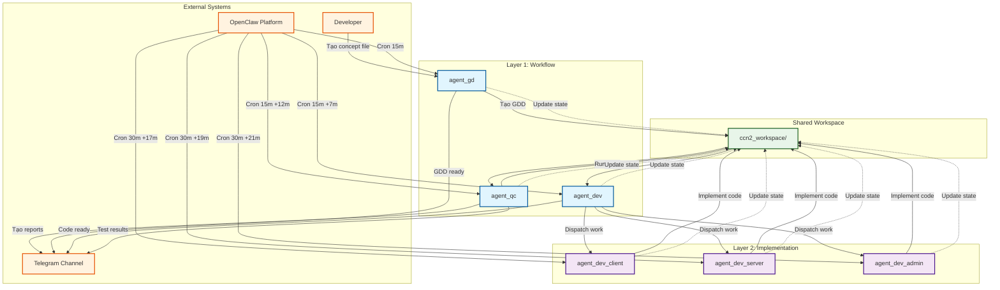
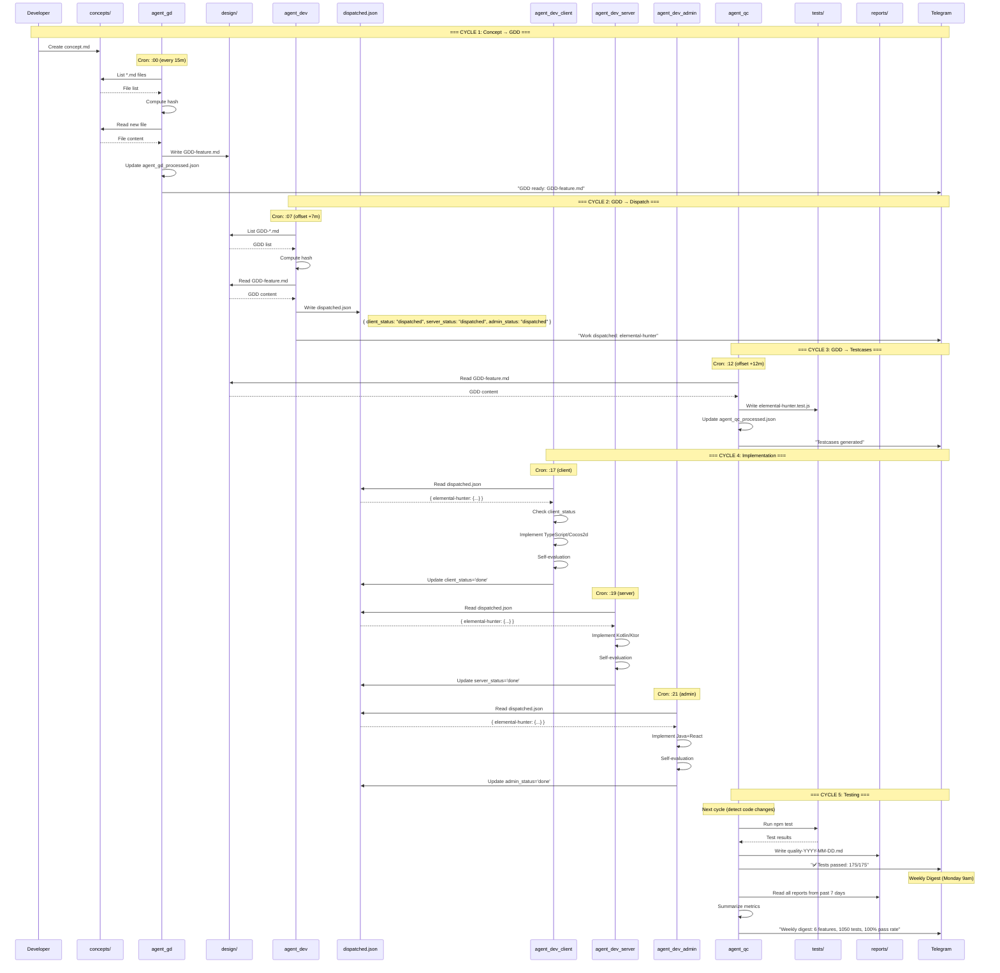
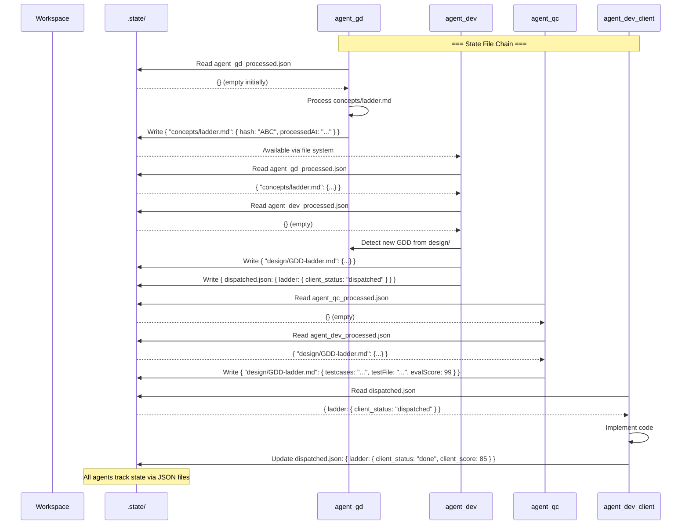

# BÁO CÁO PHÂN TÍCH HỆ THỐNG CCN2 AGENT TEAM
## 6 Agents Hợp Tác Qua Cron Jobs & Heartbeat

---

**Ngày phân tích**: 2026-03-19
**Phạm vi**: `D:\PROJECT\CCN2\research_doc\open_claw\agent_team_plan\`
**Tác giả**: William Đào 👌
**Phiên bản**: 1.0

---

## 📋 MỤC LỤC

1. [Tổng quan hệ thống](#-tổng-quan-hệ-thống)
2. [Use Case Diagram](#-use-case-diagram)
3. [Activity Diagram](#-activity-diagram)
4. [Sequence Diagram](#-sequence-diagram)
5. [Phân tích cơ chế phối hợp](#-phân-tích-cơ-chế-phối-hợp)
6. [Cron Jobs & Heartbeat](#-cron-jobs--heartbeat)
7. [Kết luận & Khuyến nghị](#-kết-luận--khuyến-nghị)

---

## 🎯 TỔNG QUAN HỆ THỐNG

### Thành phần chính

Hệ thống CCN2 Agent Team gồm **6 agents** được chia thành 2 layer:

#### Layer 1: Workflow Agents (Điều phối quy trình)
| Agent | Vai trò | Model | Nhiệm vụ chính |
|-------|---------|-------|----------------|
| **agent_gd** | Game Designer | Claude Opus 4.6 | Chuyển đổi concept → GDD (Game Design Document) |
| **agent_dev** | Developer | Claude Sonnet 4.6 | Phân tích GDD → dispatch cho implementation agents |
| **agent_qc** | QA Engineer | Claude Sonnet 4.6 | Test automation & quality reports |

#### Layer 2: Implementation Agents (Triển khai chi tiết)
| Agent | Vai trò | Model | Nhiệm vụ chính |
|-------|---------|-------|----------------|
| **agent_dev_client** | Client Developer | Claude Sonnet 4.6 | Implement TypeScript/Cocos2d |
| **agent_dev_server** | Server Developer | Claude Sonnet 4.6 | Implement Kotlin/Ktor |
| **agent_dev_admin** | Admin Developer | Claude Sonnet 4.6 | Implement Java+React |

### Workspace Structure

```
ccn2_workspace/
├── concepts/          ← Input: Concept files từ developer
│   └── *.md
├── design/            ← GD output: GDD files
│   └── GDD-*.md
├── src/               ← Dev output: Code implementation
│   ├── client/
│   ├── server/
│   └── admin/
├── reports/           ← QC output: Test reports & quality metrics
├── eval/              ← Code evaluation reports
├── analysis/          ← Requirement & design analysis
└── .state/            ← State tracking files (JSON)
    ├── agent_gd_processed.json
    ├── agent_dev_processed.json
    ├── agent_dev_dispatched.json
    ├── agent_qc_processed.json
    └── pipeline-health.json
```

---

## 🎨 USE CASE DIAGRAM



### Giải thích Use Cases

| Actor | Use Case | Mô tả |
|-------|----------|-------|
| **Developer** | Create Concept | Tạo file `.md` trong `concepts/` để bắt đầu feature mới |
| **agent_gd** | Scan Workspace | Cron job quét `concepts/` để detect concept mới |
| **agent_gd** | Generate GDD | Tạo GDD 8-section từ concept |
| **agent_dev** | Parse GDD | Đọc và phân tích GDD từ `design/` |
| **agent_dev** | Dispatch Work | Ghi vào `agent_dev_dispatched.json` để trigger implementation agents |
| **agent_dev_client** | Implement Client | Triển khai TypeScript/Cocos2d code |
| **agent_dev_server** | Implement Server | Triển khai Kotlin/Ktor code |
| **agent_dev_admin** | Implement Admin | Triển khai Java+React code |
| **agent_qc** | Write Testcases | Tạo test cases từ GDD sections 4 & 8 |
| **agent_qc** | Run Tests | Chạy `npm test` và parse kết quả |
| **agent_qc** | Generate Report | Tạo quality report với pass/fail counts |
| **All Agents** | Update State | Cập nhật `.state/*.json` để track progress |
| **All Agents** | Notify Telegram | Gửi notification về status |

---

## 🔄 ACTIVITY DIAGRAM

### Workflow tổng thể: Concept → GDD → Code → Test

```mermaid
flowchart TD
    START([Start]) --> DEV_CREATE[Developer creates concept.md]
    DEV_CREATE --> TIME_GD{Cron: :00}
    TIME_GD -->|Every 15m| AGD_SCAN[agent_gd scans concepts/]
    AGD_SCAN --> AGD_HASH[Compute MD5 hash]
    AGD_HASH --> AGD_CHANGED{File changed?}
    AGD_CHANGED -->|No| GD_OK[HEARTBEAT_OK]
    AGD_CHANGED -->|Yes| AGD_GEN[Generate GDD]
    AGD_GEN --> AGD_SAVE[Save to design/GDD-*.md]
    AGD_SAVE --> AGD_STATE[Update agent_gd_processed.json]
    AGD_STATE --> AGD_NOTIF[Send Telegram: GDD ready]
    AGD_NOTIF --> DEV_WAKE{Cron: :07}
    DEV_WAKE --> ADEV_SCAN[agent_dev scans design/]
    ADEV_SCAN --> ADEV_HASH[Compute MD5 hash]
    ADEV_HASH --> ADEV_CHANGED{GDD changed?}
    ADEV_CHANGED -->|No| DEV_OK[HEARTBEAT_OK]
    ADEV_CHANGED -->|Yes| ADEV_READ[Read GDD sections 2,4,7]
    ADEV_READ --> ADEV_DISP[Write to agent_dev_dispatched.json]
    ADEV_DISP --> DEV_NOTIF[Send Telegram: Work dispatched]
    DEV_NOTIF --> QC_WAKE{Cron: :12}
    QC_WAKE --> AQC_SCAN_A[agent_qc scans design/]
    AQC_SCAN_A --> AQC_TESTCASE[Generate testcases]
    AQC_TESTCASE --> AQC_SCAN_B[agent_qc scans src/]
    AQC_SCAN_B --> AQC_RUN[Run npm test]
    AQC_RUN --> AQC_PARSE[Parse test results]
    AQC_PARSE --> AQC_REPORT[Generate quality report]
    AQC_REPORT --> AQC_NOTIF[Send Telegram: Test results]
    AQC_NOTIF --> CLIENT_WAKE{Cron: :17}
    CLIENT_WAKE --> ADC_SCAN[agent_dev_client scans dispatched.json]
    ADC_SCAN --> ADC_CHECK{client_status='dispatched'?}
    ADC_CHECK -->|No| ADC_OK[HEARTBEAT_OK]
    ADC_CHECK -->|Yes| ADC_IMPL[Implement TypeScript/Cocos2d]
    ADC_IMPL --> ADC_EVAL[Self-evaluation]
    ADC_EVAL --> ADC_UPDATE[Update dispatched.json: client_status='done']
    ADC_UPDATE --> SERVER_WAKE{Cron: :19}
    SERVER_WAKE --> ADS_SCAN[agent_dev_server scans dispatched.json]
    ADS_CHECK{server_status='dispatched'?}
    ADS_SCAN --> ADS_CHECK
    ADS_CHECK -->|No| ADS_OK[HEARTBEAT_OK]
    ADS_CHECK -->|Yes| ADS_IMPL[Implement Kotlin/Ktor]
    ADS_IMPL --> ADS_EVAL[Self-evaluation]
    ADS_EVAL --> ADS_UPDATE[Update dispatched.json: server_status='done']
    ADS_UPDATE --> ADMIN_WAKE{Cron: :21}
    ADMIN_WAKE --> ADA_SCAN[agent_dev_admin scans dispatched.json]
    ADA_CHECK{admin_status='dispatched'?}
    ADA_SCAN --> ADA_CHECK
    ADA_CHECK -->|No| ADA_OK[HEARTBEAT_OK]
    ADA_CHECK -->|Yes| ADA_IMPL[Implement Java+React]
    ADA_IMPL --> ADA_EVAL[Self-evaluation]
    ADA_EVAL --> ADA_UPDATE[Update dispatched.json: admin_status='done']
    ADA_UPDATE --> COMPLETE[Feature Complete]

    %% State Updates
    AQC_REPORT --> AQC_STATE[Update agent_qc_processed.json]
    ADC_UPDATE --> ADC_STATE
    ADS_UPDATE --> ADS_STATE
    ADA_UPDATE --> ADA_STATE

    %% Weekly Digest
    MON_9AM[Every Monday 9am] --> DIGEST[agent_qc: Weekly Digest]
    DIGEST --> SUMMARIZE[Summarize 7 days of reports]
    SUMMARIZE --> TG_DIGEST[Send Telegram digest]

    classDef startEnd fill:#ffebee,stroke:#c62828,stroke-width:3px
    classDef workflow fill:#e3f2fd,stroke:#1565c0,stroke-width:2px
    classDef decision fill:#fff3e0,stroke:#ef6c00,stroke-width:2px
    classDef action fill:#e8f5e9,stroke:#2e7d32,stroke-width:2px
    classDef notification fill:#fce4ec,stroke:#ad1457,stroke-width:2px

    class START,COMPLETE startEnd
    class AGD_SCAN,ADEV_SCAN,AQC_SCAN_A,AQC_SCAN_B,ADC_SCAN,ADS_SCAN,ADA_SCAN workflow
    class AGD_CHANGED,ADEV_CHANGED,ADC_CHECK,ADS_CHECK,ADA_CHECK decision
    class AGD_GEN,ADEV_DISP,AQC_RUN,ADC_IMPL,ADS_IMPL,ADA_IMPL action
    class AGD_NOTIF,DEV_NOTIF,AQC_NOTIF,TG_DIGEST notification
```



### Activity của từng Agent

#### agent_gd Activity Flow

```mermaid
flowchart TD
    A_GD_START[Start Cron Job] --> A_GD_READ[Read agent_gd_processed.json]
    A_GD_READ --> A_GD_LIST[List concepts/*.md]
    A_GD_LIST --> A_GD_LOOP{For each file}
    A_GD_LOOP --> A_GD_HASH[Compute MD5 hash]
    A_GD_HASH --> A_GD_COMPARE{Compare with stored}
    A_GD_COMPARE -->|Unchanged| A_GD_NEXT[Next file]
    A_GD_COMPARE -->|Changed| A_GD_READ_CONCEPT[Read concept content]
    A_GD_READ_CONCEPT --> A_GD_ANALYZE[Analyze mechanics & rules]
    A_GD_ANALYZE --> A_GD_WRITE_GDD[Write GDD (8 sections)]
    A_GD_WRITE_GDD --> A_GD_SAVE_GDD[Save to design/GDD-*.md]
    A_GD_SAVE_GDD --> A_GD_UPDATE_STATE[Update state: {hash, processedAt}]
    A_GD_UPDATE_STATE --> A_GD_NEXT
    A_GD_NEXT --> A_GD_LOOP
    A_GD_LOOP -->|Done| A_GD_ANY{Any GDD created?}
    A_GD_ANY -->|Yes| A_GD_TG[Send Telegram: GDD ready]
    A_GD_ANY -->|No| A_GD_HEARTBEAT[HEARTBEAT_OK]
    A_GD_TG --> A_GD_END[End]
    A_GD_HEARTBEAT --> A_GD_END

    classDef start fill:#ffebee,stroke:#c62828
    classDef process fill:#e3f2fd,stroke:#1565c0
    classDef decision fill:#fff3e0,stroke:#ef6c00
    classDef notification fill:#fce4ec,stroke:#ad1457
    classDef end fill:#e8f5e9,stroke:#2e7d32

    class A_GD_START start
    class A_GD_READ,A_GD_LIST,A_GD_HASH,A_GD_ANALYZE,A_GD_WRITE_GDD,A_GD_SAVE_GDD,A_GD_UPDATE_STATE process
    class A_GD_LOOP,A_GD_COMPARE,A_GD_ANY decision
    class A_GD_TG notification
    class A_GD_END end
```

---

## 📡 SEQUENCE DIAGRAM

### End-to-End Workflow: Concept → GDD → Code → Test



### State Propagation Sequence



---

## 🔍 PHÂN TÍCH CƠ CHẾ PHỐI HỢP

### 1. State-Based Coordination (Qua file .state)

**Ưu điểm:**
- ✅ **Persistent**: Trạng thái không mất khi agent restart
- ✅ **Atomic**: Mỗi agent update atomic state file
- ✅ **Decoupled**: Agents không cần biết nhau trực tiếp
- ✅ **Traceable**: Có thể track full history qua timestamps

**Cách thức:**
```javascript
// File format: .state/agent_gd_processed.json
{
  "concepts/ladder-mechanic.md": {
    "hash": "A1B2C3D4E5F6...",
    "processedAt": "2026-03-18T09:15:00.000Z"
  }
}
```

### 2. Cron Scheduling (Lịch chạy xen kẽ)

**Thiết kế offset:**
```
Main workflow (15m cycle):
  :00  agent_gd     (scan concepts)
  :07  agent_dev    (scan GDD, dispatch)  [+7m để GD xong]
  :12  agent_qc     (scan GDD+src, test)  [+5m để Dev xong dispatch]

Implementation (30m cycle):
  :17  agent_dev_client  [+5m để QC xong test]
  :19  agent_dev_server  [+2m tránh race]
  :21  agent_dev_admin   [+2m tránh race]
```

**Mục đích:**
- Đảm bảo **thứ tự dependency**: Concept → GDD → Dispatch → Implementation → Test
- Tránh **race condition** trên cùng state file
- Cho **completion time** cần thiết cho mỗi agent

### 3. Hash-Based Change Detection

**Algorithm:**
1. Mỗi agent đọc state file tương ứng
2. List files trong workspace directory phụ trách
3. Compute MD5 hash cho mỗi file
4. So sánh với hash đã lưu trong state
5. Nếu khác → process file → update state

**Ví dụ:**
```bash
# agent_gd workflow
Get-ChildItem concepts/*.md -File
For each file:
  current_hash = (Get-FileHash -Algorithm MD5).Hash
  if current_hash != state[file].hash:
    process_file()
    state[file] = { hash: current_hash, processedAt: now }
Write state back
```

### 4. Telegram Notifications

**Channels:**
- **Success**: "✅ [agent_gd] GDD ready: GDD-ladder.md"
- **Dispatch**: "⚙️ [agent_dev] Work dispatched: elemental-hunter"
- **Test Results**: "✅ [agent_qc] Tests passed: 175/175"
- **Failures**: "⚠️ [agent_qc] Tests FAILED: 3 failures — check report"
- **Weekly**: "📊 Weekly digest: 6 features, 1050 tests, 100% pass"

**Purpose:**
- Real-time visibility cho developer
- Alert failures ngay lập tức
- Audit trail qua message history

### 5. Pipeline Health Monitoring

**6 Health Checks** (file `pipeline-health.json`):
```json
{
  "passed": 6,
  "failed": 0,
  "overall": "HEALTHY",
  "checks": {
    "C1_concepts": "PASS",      // Concepts có file mới
    "C2_design": "PASS",        // GDD generated
    "C3_gdd_header": "PASS",    // GDD format valid
    "C4_src": "PASS",           // Code implemented
    "C5_quality_report": "PASS",// Tests passed
    "C6_state_json": "PASS"     // State files updated
  }
}
```

**Workflow:**
- agent_qc run tất cả checks mỗi cycle
- Nếu có check FAIL → mark overall "UNHEALTHY"
- Weekly digest include health summary

---

## ⏰ CRON JOBS & HEARTBEAT CHI TIẾT

### 7 Cron Jobs Configuration

| # | Agent | Schedule | Offset | Purpose | Status |
|---|-------|----------|--------|---------|--------|
| 1 | agent_gd | `*/15 8-22 * * 1-5` | :00 | Scan concepts → GDD | ✅ Active |
| 2 | agent_dev | `7,22,37,52 8-22 * * 1-5` | +7m | Scan GDD → dispatch | ✅ Active |
| 3 | agent_qc | `12,27,42,57 8-22 * * 1-5` | +12m | Test automation | ✅ Active |
| 4 | Weekly | `0 9 * * 1` | Mon 9am | Digest report | ✅ Active |
| 5 | agent_dev_client | `17,47 8-22 * * 1-5` | +17m | Client implementation | ✅ Active |
| 6 | agent_dev_server | `19,49 8-22 * * 1-5` | +19m | Server implementation | ✅ Active |
| 7 | agent_dev_admin | `21,51 8-22 * * 1-5` | +21m | Admin implementation | ✅ Active |

**Timezone**: Asia/Ho_Chi_Minh (UTC+7)
**Active Hours**: 8am-10pm (work hours)
**Days**: Monday-Friday (weekdays)

### Cron Job Structure

```json
{
  "id": "ccn2-gd-workspace-scan",
  "agentId": "agent_gd",
  "name": "CCN2 GD — Scan concepts/",
  "enabled": true,
  "schedule": {
    "kind": "cron",
    "expr": "*/15 8-22 * * 1-5",
    "tz": "Asia/Ho_Chi_Minh"
  },
  "sessionTarget": "isolated",
  "payload": {
    "type": "system_event",
    "text": "WORKSPACE_SCAN: Check concepts/ for new files. Generate GDD. Update state. If nothing changed: HEARTBEAT_OK."
  },
  "failureAlert": {
    "enabled": true,
    "after": 3
  }
}
```

### Heartbeat Modes

#### Mode 1: Cron-Triggered (Primary)
- Chạy theo schedule đã định
- Payload: `WORKSPACE_SCAN` command
- Mỗi agent có logic riêng

#### Mode 2: Manual (Fallback)
- Khi agent receive message trực tiếp
- File `HEARTBEAT.md` chứa instructions
- Dùng để test hoặc debug

#### Mode 3: Telegram Response
- Agent reply message từ Telegram
- Thực hiện action ngắn gọn
- Không thay thế cron schedule

### Heartbeat Workflow Template

```markdown
# Every Heartbeat (for agent_gd)

1. Read D:/PROJECT/CCN2/ccn2_workspace/.state/agent_gd_processed.json
   → If missing: initialize to {}

2. Execute: Get-ChildItem "concepts" -Filter "*.md"

3. For each .md file:
   a. hash = (Get-FileHash '<path>' -Algorithm MD5).Hash
   b. if hash != stored_hash:
      - Read concept content
      - Generate GDD (8 sections)
      - Save to design/GDD-<name>.md
      - Update state: { hash, processedAt }

4. Write updated state back

5. If any GDD created:
   → Use message tool → Telegram: "[agent_gd] GDD ready: "

6. If nothing changed:
   → Reply: "HEARTBEAT_OK"
```

---

## 📊 DỮ LIỆU THỰC TẾ (2026-03-19)

### Pipeline Health Status

```json
{
  "passed": 6,
  "failed": 0,
  "overall": "HEALTHY",
  "last_run": "2026-03-19T13:44:37+07:00",
  "checks": {
    "C1_concepts": "PASS",
    "C2_design": "PASS",
    "C4_src": "PASS",
    "C5_quality_report": "PASS",
    "C6_state_json": "PASS",
    "C3_gdd_header": "PASS"
  }
}
```

### Feature: elemental-hunter

```json
{
  "dispatched_at": "2026-03-19T10:54:00+07:00",
  "gdd_file": "GDD-FEATURE-elemental-hunter.md",
  "client_status": "done_warning",
  "client_score": 79,
  "server_status": "done",
  "server_score": 83,
  "admin_status": "done",
  "admin_score": 100,
  "qc_reviewed": true,
  "qc_overall": "WARNING"
}
```

### Test Results

- **Total tests**: 175
- **Passed**: 175 (100%)
- **Failed**: 0
- **Last run**: 2026-03-19T07:57:00Z
- **Report**: `reports/quality-2026-03-19-07-57.md`

---
### Bug Flow System
```markdown
Human thấy bug
│
│ Tạo bugs/BUG-<domain>-<name>-<date>.md
▼
[open] ──────────────────────────────────────────────
│
│ agent_dev (Codera) — Bug Triage (sau Phase 4)
│ Route theo domain → dispatched.json entry
▼
[assigned]
│
├── domain=gd     → agent_gd (Designia) self-scans bugs/
├── domain=client/playtest-client → agent_dev_client (Pixel)
├── domain=server/playtest-server → agent_dev_server (Forge)
└── domain=admin  → agent_dev_admin (Panel)
│
▼
[in_progress] → [fixed]
│              │
│              │ agent_qc (Verita) — Part J.2 Verify
│              ├── verified=true  → [closed] ✅ Telegram
│              └── verified=false → [reopen] ⚠️ Telegram
│                        │
└──────────────────── Re-fix loop
```

---
### Kiến trúc đánh giá
```markdown
eval/GDD-EVAL-RUBRIC.md        ← Tiêu chí + trọng số cho GDD
eval/CODE-EVAL-RUBRIC.md       ← Tiêu chí + trọng số cho code (3 mode: REQ, DESIGN, Client/Server/Admin)
        │
        │ agents tự đọc rubric và self-eval
        ▼
AGENTS.md / HEARTBEAT.md       ← Score gates: ngưỡng FAIL / WARNING / PASS
```
```markdown
Cron Job      = "Đồng hồ báo thức"   → KÍCH HOẠT agent
AGENTS.md     = "Bản hướng dẫn"      → agent ĐỌC và THỰC THI khi bị kích hoạt
.state/*.json = "Sổ tay nhớ việc"    → STATE persists giữa các session
```
---

## ✅ KẾT LUẬN & KHUYẾN NGHỊ

### Điểm mạnh của hệ thống

1. **Self-Organizing**
   - Agents tự detect changes và orchestrate work
   - Không cần human intervention thường xuyên
   - Fully automated pipeline

2. **Robust State Management**
   - JSON state files đảm bảo durability
   - Hash tracking tránh duplicate work
   - Atomic updates ngăn data corruption

3. **Well-Coordinated Scheduling**
   - Offset timing đảm bảo dependencies
   - Tránh race conditions
   - Predictable workflow

4. **Comprehensive Monitoring**
   - Pipeline health checks
   - Telegram notifications
   - Weekly digest reports

5. **Scalable Architecture**
   - Clear separation: Workflow vs Implementation
   - Dễ thêm agent mới
   - Independent agent lifecycle

### Thách thức & Rủi ro

1. **Single Point of Failure**
   - State files là critical dependency
   - Corrupted state có thể break entire pipeline
   - **Khuyến nghị**: Backup state files daily

2. **Clock Skew Sensitivity**
   - Cron scheduling phụ thuộc accurate time
   - Timezone mismatch có thể cause race conditions
   - **Khuyến nghị**: Verify timezone config trong OpenClaw

3. **Resource Contention**
   - 6 agents có thể compete I/O trên same workspace
   - Heavy workload có thể cause timeouts
   - **Khuyến nghị**: Monitor execution time, adjust timeout

4. **Error Propagation**
   - Một agent fail có thể block entire feature
   - State inconsistency khó debug
   - **Khuyến nghị**: Implement circuit breaker pattern

### Khuyến nghị cải thiện

#### Ngắn hạn (1-2 weeks)
1. **Backup State Files**
   ```bash
   # Add to agent_dev daily
   cp .state/*.json .state/backup/$(date +%Y%m%d)/
   ```

2. **Enhanced Error Logging**
   - Log tất cả state transitions
   - Include stack traces trong error.log
   - Alert Telegram khi state corruption detected

3. **Resource Monitoring**
   - Track CPU/memory usage mỗi agent
   - Alert khi execution time > threshold
   - Dashboard real-time health

#### Trung hạn (1-2 months)
1. **Event-Driven Architecture**
   - Thay thế polling bằng file system events
   - Faster response time
   - Less resource usage

2. **Distributed State Store**
   - Redis hoặc etcd cho state
   - Atomic compare-and-set operations
   - Horizontal scalability

3. **Circuit Breaker Pattern**
   - Auto-retry với exponential backoff
   - Fallback mechanisms
   - Graceful degradation

#### Dài hạn (3-6 months)
1. **Agent Mesh**
   - Direct communication giữa agents
   - Message queue (RabbitMQ/Apache Kafka)
   - Event sourcing for full audit trail

2. **Machine Learning Integration**
   - Predict resource needs
   - Auto-scaling agents
   - Intelligent scheduling optimization

3. **Multi-Project Support**
   - Reusable agent templates
   - Project-specific configurations
   - Cross-project dependencies

---

## 📚 TÀI LIỆU THAM KHẢO

1. **Agent Team Plan**: `D:\PROJECT\CCN2\research_doc\open_claw\agent_team_plan\`
2. **OpenClaw Config**: `agent_team_plan/04-openclaw-config.md`
3. **Cron Setup**: `agent_team_plan/CRON_SETUP.md`
4. **Agent Profiles**: `agent_team_plan/05-agent-profiles.md`
5. **State Schema**: `ccn2_workspace/.state/SCHEMA.md`

---

**Báo cáo được tạo**: 2026-03-19 14:30:00+07:00
**Phạm vi phân tích**: 6 agents, 7 cron jobs, 1 shared workspace
**Trạng thái**: ✅ HEALTHY (6/6 checks passing)
**Tác giả**: William Đào 👌