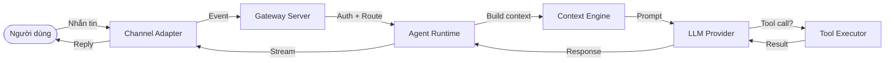
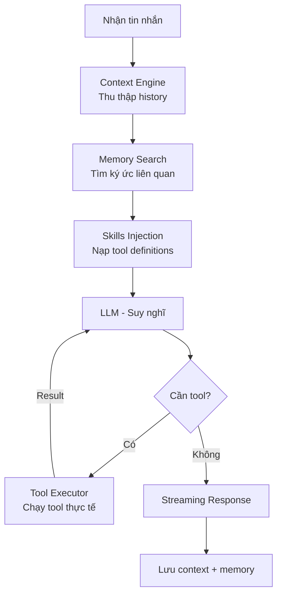

# OpenClaw — Deep Dive Toàn Diện

> **Phiên bản tài liệu**: 1.0 — Tổng hợp hoàn chỉnh
> **Ngày hoàn thành**: 2026-03-15
> **Phiên bản OpenClaw**: 2026.3.11
> **Tác giả**: Phân tích từ source code + documentation thực tế
> **Mức độ kỹ thuật**: Toàn diện (từ tổng quan đến kỹ thuật nâng cao)

---

## MỤC LỤC

1. [Executive Summary](#1-executive-summary)
2. [Tổng Quan Dự Án](#2-tổng-quan-dự-án)
3. [Kiến Trúc 5 Tầng](#3-kiến-trúc-5-tầng)
4. [Gateway & Routing — Tim Đập](#4-gateway--routing--tim-đập)
5. [Hệ Thống Kênh (22+ Channels)](#5-hệ-thống-kênh-22-channels)
6. [LLM Providers (30+ Nhà Cung Cấp)](#6-llm-providers-30-nhà-cung-cấp)
7. [Agent Runtime & Skills](#7-agent-runtime--skills)
8. [Plugin SDK & Extensions](#8-plugin-sdk--extensions)
9. [Hệ Thống Bảo Mật](#9-hệ-thống-bảo-mật)
10. [Ứng Dụng Mobile (iOS/macOS/Android)](#10-ứng-dụng-mobile-iosmacoandroid)
11. [So Sánh & Benchmark](#11-so-sánh--benchmark)
12. [Design Patterns & Bài Học](#12-design-patterns--bài-học)
13. [Roadmap & Tương Lai](#13-roadmap--tương-lai)
14. [Hướng Dẫn Tích Hợp Thực Tế](#14-hướng-dẫn-tích-hợp-thực-tế)
15. [Kết Luận](#15-kết-luận)

---

## 1. Executive Summary

**OpenClaw** là một Personal AI Assistant Gateway mã nguồn mở (MIT), tự chủ (self-hosted), cho phép chạy trợ lý AI trên máy tính của bạn và tiếp cận qua bất kỳ kênh nhắn tin nào bạn đang dùng — không phụ thuộc cloud, không bị khóa nhà cung cấp.

### Ba trụ cột cốt lõi

```
┌─────────────────┐   ┌─────────────────┐   ┌─────────────────┐
│   TỰ CHỦ        │   │   ĐA KÊNH       │   │   BẢO MẬT       │
│                 │   │                 │   │                 │
│ Chạy trên máy  │   │ 22+ platforms   │   │ Data stays      │
│ bạn, chọn LLM  │   │ WhatsApp, Zalo, │   │ on-device,      │
│ bạn muốn       │   │ Telegram, Slack  │   │ local-first     │
└─────────────────┘   └─────────────────┘   └─────────────────┘
```

### Con số quan trọng

| Metric | Giá trị |
|--------|---------|
| Kênh nhắn tin | **22+** |
| LLM providers | **30+** |
| Extensions | **~40** |
| Built-in skills | **52** |
| Source modules | **75+** |
| Mobile platforms | **3** (iOS, macOS, Android) |
| License | **MIT** (open source, free) |
| Pi-Mono GitHub stars | **22,100+** |

### Phù hợp với ai?

- ✅ **Developer/Engineer** muốn AI assistant tích hợp sâu vào workflow
- ✅ **DevOps/Automation** cần cron jobs, webhooks, shell execution
- ✅ **Người dùng Việt Nam** cần Zalo support (duy nhất trên thị trường)
- ✅ **Privacy-first users** không muốn dữ liệu rời máy
- ❌ Không phù hợp cho người chưa quen terminal/command line

---

## 2. Tổng Quan Dự Án

### 2.1 Vision & Philosophy

Từ file `VISION.md` của project:

> *"OpenClaw is the AI that actually does things. It runs on your devices, in your channels, with your rules."*
> *(OpenClaw là AI thực sự làm việc. Chạy trên thiết bị của bạn, trong các kênh của bạn, theo quy tắc của bạn.)*

Thay vì là một chatbot bị giới hạn trong tab trình duyệt, OpenClaw tiếp cận bạn qua kênh **bạn đang dùng hàng ngày** — Zalo lúc 2 chiều, Telegram lúc 8 sáng, Slack trong giờ làm — và **thực sự làm việc** (chạy code, mở web, gửi email, quản lý lịch).

### 2.2 Lịch sử phát triển

```
Warelay → Clawdbot → Moltbot → OpenClaw (public 2025)
```

- **Warelay / Clawdbot**: Dự án cá nhân của Peter Steinberger để học AI + xây dựng trợ lý thực tế
- **Moltbot**: Mở rộng kênh, cải thiện stability
- **OpenClaw** (2025): Open source MIT, cộng đồng, được tài trợ bởi **OpenAI** và **Vercel**
- **2026.3.11**: Phiên bản mới nhất — vá 7 CVE bảo mật, iOS Home Canvas redesign, Ollama wizard, Gemini multimodal embedding

### 2.3 Tech Stack

| Công nghệ | Mục đích |
|-----------|---------|
| **TypeScript** | Ngôn ngữ lập trình chính (hackable + widely known) |
| **Node.js >= 22** | Runtime |
| **pnpm workspaces** | Monorepo package manager |
| **tsx** | Dev mode — chạy TypeScript trực tiếp |
| **tsdown** | Production bundler |
| **oxlint + oxfmt** | Lint + format (nhanh hơn ESLint/Prettier) |
| **vitest** | Testing framework |
| **Hono** | HTTP server framework |
| **ws** | WebSocket |
| **LanceDB** | Local vector database (memory/search) |
| **Swift** | macOS + iOS companion apps |
| **Kotlin** | Android companion app |
| **Docker** | Alternative deployment option |
| **Tailscale** | Secure remote access |

---

## 3. Kiến Trúc 5 Tầng

OpenClaw được tổ chức theo kiến trúc phân lớp rõ ràng:

```
┌─────────────────────────────────────────────────────────────┐
│  TẦNG 5 — CLIENTS                                           │
│  CLI ("openclaw ...") | Web UI | macOS app | iOS | Android   │
├─────────────────────────────────────────────────────────────┤
│  TẦNG 4 — CHANNELS (~35+ platforms)                         │
│  Telegram | Discord | Slack | WhatsApp | Signal | iMessage   │
│  LINE | Matrix | MS Teams | Zalo | Feishu | Twitch | IRC... │
├─────────────────────────────────────────────────────────────┤
│  TẦNG 3 — GATEWAY                                           │
│  HTTP (Hono) + WebSocket (ws) + Auth + Routing + Sessions    │
│  Endpoints: /health, /api/hooks/*, /openai/*, /ws            │
├─────────────────────────────────────────────────────────────┤
│  TẦNG 2 — AGENT RUNTIME                                     │
│  Pi Agent Core + Context Engine + Tool Executor + Skills     │
│  Memory (LanceDB) + ACP Protocol + Subagent orchestration   │
├─────────────────────────────────────────────────────────────┤
│  TẦNG 1 — LLM PROVIDERS                                     │
│  Anthropic | OpenAI | Google | AWS Bedrock | Ollama | xAI   │
│  Azure | Groq | Cerebras | OpenRouter | Kimi | DeepSeek...  │
└─────────────────────────────────────────────────────────────┘
```

### 3.1 Cấu trúc monorepo (pnpm workspace)

```
openclaw/
├── src/                      ← 75+ TypeScript modules (core)
│   ├── gateway/              ← HTTP + WebSocket server
│   ├── agents/               ← Agent runtime + orchestration
│   ├── channels/             ← Channel routing logic
│   ├── providers/            ← LLM provider adapters
│   ├── plugins/              ← Plugin loader + registry
│   ├── plugin-sdk/           ← SDK cho developers
│   ├── security/             ← Auth, pairing, credentials
│   ├── sessions/             ← Session management
│   ├── memory/               ← LanceDB memory interface
│   ├── browser/              ← Chrome CDP browser control
│   ├── cron/                 ← Scheduled task engine
│   ├── hooks/                ← Lifecycle hooks
│   ├── media/                ← Media processing (images, audio)
│   ├── tts/                  ← Text-to-speech
│   ├── acp/                  ← Agent Communication Protocol
│   └── ... (30+ more modules)
├── extensions/               ← ~40 extension packages
│   ├── telegram/             ← Telegram bot
│   ├── discord/              ← Discord bot
│   ├── zalo/ + zalouser/     ← Zalo Business + Personal
│   ├── matrix/               ← Matrix protocol
│   ├── memory-lancedb/       ← LanceDB integration
│   └── ... (34+ more)
├── ui/                       ← Web control panel (React)
└── packages/                 ← Compatibility shims (clawdbot, moltbot)
```

### 3.2 Flow tổng quát một tin nhắn



---

## 4. Gateway & Routing — Tim Đập

### 4.1 Vai trò của Gateway

Gateway là **điểm trung tâm duy nhất** trong OpenClaw. Tất cả kênh đẩy tin nhắn vào đây; Gateway xác thực, định tuyến, rồi dispatch đến agent phù hợp.

- **Địa chỉ**: `ws://127.0.0.1:18789` (local) hoặc expose qua Tailscale
- **Protocols**: WebSocket (realtime) + HTTP REST (webhooks/API)
- **HTTP Framework**: Hono (nhẹ, nhanh, TypeScript-native)

### 4.2 Kiến trúc nội bộ Gateway

```
┌──────────────────────────────────────────────┐
│               Gateway Server                  │
│                                              │
│  ┌──────────────┐    ┌──────────────────┐    │
│  │ WebSocket    │    │ HTTP Endpoints   │    │
│  │ Server       │    │ /health          │    │
│  │ (ws)         │    │ /api/hooks/*     │    │
│  └──────┬───────┘    │ /openai/*        │    │
│         │            │ /ws              │    │
│  ┌──────▼───────┐    └────────┬─────────┘    │
│  │ Auth Layer   │◄────────────┘             │
│  │ (4 modes)    │                            │
│  └──────┬───────┘                            │
│  ┌──────▼───────┐    ┌──────────────────┐    │
│  │ Rate Limiter │    │ Session Manager  │    │
│  └──────┬───────┘    └──────────────────┘    │
│  ┌──────▼────────────────────────────────┐   │
│  │         Routing Engine                │   │
│  │  resolveAgentRoute() + Bindings       │   │
│  └──────┬────────────────────────────────┘   │
│         │                                    │
│    ┌────▼────┐  ┌──────────┐  ┌───────────┐  │
│    │ Lane:   │  │ Lane:    │  │ Lane:     │  │
│    │ Main    │  │ Subagent │  │ Cron      │  │
│    └─────────┘  └──────────┘  └───────────┘  │
└──────────────────────────────────────────────┘
```

### 4.3 Authentication Modes

Gateway hỗ trợ 4 chế độ xác thực:

| Mode | Mô tả | Dùng khi |
|------|--------|---------|
| `none` | Không xác thực | Chỉ local, trusted network |
| `token` | API token (chuỗi bí mật) | Remote access thông thường |
| `password` | Mật khẩu | UI/manual access |
| `trusted-proxy` | Ủy quyền reverse proxy | Nginx/Caddy trước gateway |

### 4.4 Client Roles

Mỗi kết nối đến Gateway phải khai báo role:

```typescript
type ClientRole = "operator" | "user" | "internal";

// Operator = chủ sở hữu, có quyền admin + approval + pairing
// User = người dùng thường (qua channel)
// Internal = background service (cron, webhooks)
```

### 4.5 Routing Logic

Routing Engine chọn agent dựa trên:
1. **Sender ID**: Ai gửi? (user ID, channel ID)
2. **Channel**: Gửi từ kênh nào? (Telegram, Slack...)
3. **Bindings**: Config `agentBindings` trong file cấu hình
4. **Default**: Fallback về `default` agent nếu không match

---

## 5. Hệ Thống Kênh (22+ Channels)

### 5.1 Danh sách đầy đủ

| Nhóm | Kênh | Thư viện | Ghi chú |
|------|------|---------|--------|
| **Tin nhắn phổ biến** | WhatsApp | Baileys | Reverse-engineered protocol |
| | Telegram | grammY | Bot API chính thức |
| | Discord | discord.js | Gateway API chính thức |
| | Signal | signal-cli | CLI wrapper |
| | iMessage | imsg / BlueBubbles | Cần thiết bị Apple |
| **Công việc** | Slack | Bolt for JS | App manifest based |
| | Microsoft Teams | Bot Framework | Azure integration |
| | Google Chat | Chat API | Google Workspace |
| | Feishu/Lark | Feishu API | ByteDance, thị trường TQ |
| **Việt Nam** | Zalo (Business) | Zalo OA API | OA (Official Account) |
| | Zalo (Personal) | Custom | Tài khoản cá nhân — **duy nhất!** |
| **Châu Á** | LINE | LINE Messaging API | Nhật, Thái, Đài Loan |
| **Self-hosted** | Matrix | matrix-js-sdk | Element, Beeper |
| | Mattermost | Mattermost API | Slack open-source alt |
| | Nextcloud Talk | Nextcloud API | Self-hosted platform |
| | Synology Chat | Synology API | NAS integration |
| **Phi tập trung** | Nostr | nostr-tools | Cryptographic keys |
| | Tlon | Urbit API | Urbit platform |
| **Khác** | Twitch | tmi.js | Livestream chat |
| | IRC | node-irc | Classic protocol |
| | WebChat | Custom WS | Nhúng vào website |
| **Native** | macOS | Swift | Menu bar app |
| | iOS | Swift | Voice Wake + TestFlight |
| | Android | Kotlin | Voice + SMS + Camera |

### 5.2 Kiến trúc Channel Adapter

Mỗi channel implement interface chung:

```typescript
interface ChannelAdapter {
  connect(): Promise<void>;
  disconnect(): Promise<void>;
  sendMessage(to: string, content: MessageContent): Promise<void>;
  onMessage(handler: MessageHandler): void;
  onStatusChange(handler: StatusHandler): void;
}
```

Channel adapter chịu trách nhiệm:
1. Kết nối/maintain connection với platform API
2. Convert tin nhắn từ format platform → OpenClaw internal format
3. Convert reply từ OpenClaw format → platform format
4. Xử lý media (ảnh, video, audio, stickers)
5. Rate limiting per-platform

### 5.3 Security: Pairing Model

Người lạ nhắn tin lần đầu sẽ **không được phục vụ tự động**:

```
Người lạ gửi tin
       ↓
Gateway tạo pairing request
       ↓
Chủ sở hữu nhận thông báo + pairing code
       ↓
Chủ sở hữu approve/deny
       ↓
Người lạ được phép hoặc bị block
```

Điều này ngăn spam, injection attacks từ người không được phép.

---

## 6. LLM Providers (30+ Nhà Cung Cấp)

### 6.1 Abstraction Layer

OpenClaw không bị khóa vào bất kỳ provider nào. Provider adapter convert tất cả về một interface chuẩn:

```typescript
interface LLMProvider {
  id: string;
  chat(messages: Message[], options: ChatOptions): AsyncStream<LLMChunk>;
  listModels(): Promise<ModelInfo[]>;
  isAvailable(): boolean;
}
```

### 6.2 Danh sách Providers

**Nhóm Cloud Premium:**

| Provider | Model ví dụ | Auth | Ghi chú |
|----------|------------|------|--------|
| **Anthropic** | `claude-opus-4-6`, `claude-sonnet-4-6` | `ANTHROPIC_API_KEY` | **Default provider** |
| **OpenAI** | `gpt-5.4`, `gpt-4o` | `OPENAI_API_KEY` | WebSocket streaming |
| **Google Gemini** | `gemini-3.1-pro-preview` | `GEMINI_API_KEY` | Key rotation support |
| **xAI (Grok)** | `grok-...` | `XAI_API_KEY` | Elon Musk's AI |
| **Mistral** | `mistral-large-latest` | `MISTRAL_API_KEY` | French AI |

**Nhóm Local/Offline:**

| Provider | Mô tả | Cài đặt |
|----------|--------|--------|
| **Ollama** | Chạy hoàn toàn local, không internet | `ollama pull llama3.3` |
| **LM Studio** | GUI để quản lý local models | OpenAI-compatible API |

**Nhóm Gateway/Aggregator:**

| Provider | Mô tả |
|----------|--------|
| **OpenRouter** | Proxy đến 100+ models |
| **Vercel AI Gateway** | Gateway của Vercel, enterprise |
| **GitHub Copilot** | Dùng quota của GitHub Copilot subscription |
| **Azure OpenAI** | OpenAI qua Azure cloud |
| **AWS Bedrock** | Amazon AI services |
| **Groq** | Inferencing hardware (tốc độ cao) |
| **Cerebras** | Chip AI chuyên dụng |

**Nhóm Châu Á:**

| Provider | Mô tả |
|----------|--------|
| **Kimi (Moonshot)** | Trung Quốc, context window lớn |
| **DeepSeek** | Open-weight, mạnh về code |
| **Alibaba (Qwen)** | Qwen-max, Qwen-coder |
| **Doubao (Volcano)** | ByteDance, thị trường TQ |
| **Z.AI (GLM)** | Zhipu AI, `glm-5` |

### 6.3 Model Failover (Tính năng đặc biệt)

```
Agent cấu hình: model = ["anthropic/claude-opus-4-6", "openai/gpt-5.4", "ollama/llama3.3"]

Khi request:
  1. Thử claude-opus-4-6 → lỗi/timeout → auto-switch
  2. Thử gpt-5.4 → thành công → dùng
  (nếu gpt-5.4 cũng lỗi → thử ollama local)
```

Failover hoạt động theo priority list, đảm bảo uptime cao ngay cả khi provider gặp sự cố.

### 6.4 Cost Tracking

OpenClaw tracking token usage per-provider:
- Đếm prompt tokens + completion tokens
- Tính cost theo price list từng model
- Hiển thị trong Control UI
- Log để phân tích chi phí

---

## 7. Agent Runtime & Skills

### 7.1 Khái niệm Agent

**Agent** trong OpenClaw là một thực thể AI có:

| Thuộc tính | Ý nghĩa |
|-----------|--------|
| `name` | Tên/ID định danh (ví dụ: `default`, `work`, `coding`) |
| `workspace` | Thư mục làm việc riêng biệt |
| `model` | LLM provider + model name |
| `skills` | Danh sách kỹ năng được cấp |
| `memory` | Bộ nhớ dài hạn riêng |
| `subagents` | Config để sinh agent con |
| `sandbox` | Mức độ isolation |
| `identity` | System prompt tùy chỉnh |

### 7.2 Agent Execution Pipeline



### 7.3 Context Engine

Context Engine giải quyết bài toán: LLM có giới hạn context window, làm sao nhớ cuộc hội thoại dài?

**Chiến lược:**
1. **Lưu full history** theo từng session
2. **Sliding window**: Giữ N tin nhắn gần nhất
3. **Summarization**: Tóm tắt phần quá dài (qua LLM) trước khi inject
4. **Semantic retrieval**: Tìm kiếm ký ức liên quan qua vector search (LanceDB)

### 7.4 Memory System (LanceDB)

- **Vector database**: LanceDB chạy local (không cloud)
- **Embeddings**: Google Gemini multimodal embedding (text + image + audio)
- **Search**: Semantic search trên toàn bộ lịch sử hội thoại
- **Persistence**: Lưu giữa các session, ngay cả sau khi restart

### 7.5 Skills — 52 Built-in Skills

Skills là các "công cụ" được inject vào system prompt để LLM biết mình có thể làm gì. Phân loại:

**File & System Skills:**
| Skill | Mô tả |
|-------|--------|
| `read_file` | Đọc file bất kỳ |
| `write_file` | Ghi/tạo file |
| `list_directory` | Liệt kê thư mục |
| `delete_file` | Xóa file (với approval) |
| `run_bash` | Chạy lệnh shell (allowlist) |
| `run_python` | Chạy Python script |

**Web Skills:**
| Skill | Mô tả |
|-------|--------|
| `web_fetch` | Fetch URL + extract text |
| `browser_open` | Mở URL trong Chrome |
| `browser_screenshot` | Chụp màn hình trang web |
| `browser_click` | Click element trên trang |
| `browser_fill` | Điền form |
| `web_search` | Tìm kiếm web (Brave/Google API) |

**Communication Skills:**
| Skill | Mô tả |
|-------|--------|
| `send_message` | Gửi tin nhắn đến channel khác |
| `send_email` | Gửi email qua SMTP |
| `create_reminder` | Tạo nhắc nhở |
| `schedule_task` | Đặt lịch chạy task |

**Memory Skills:**
| Skill | Mô tả |
|-------|--------|
| `memory_store` | Lưu thông tin vào memory dài hạn |
| `memory_recall` | Tìm kiếm memory |
| `memory_list` | Liệt kê memories |

**Code & Development:**
| Skill | Mô tả |
|-------|--------|
| `git_status` | `git status` |
| `git_diff` | `git diff` |
| `run_tests` | Chạy test suite |
| `read_github_issue` | Đọc GitHub issue |
| `create_pr` | Tạo Pull Request |

**Media Skills:**
| Skill | Mô tả |
|-------|--------|
| `generate_image` | Tạo ảnh (DALL-E, Stable Diffusion) |
| `transcribe_audio` | Chuyển audio → text |
| `tts` | Text → giọng nói |
| `analyze_image` | Phân tích ảnh bằng vision model |

### 7.6 Subagent System (ACP Protocol)

**ACP (Agent Communication Protocol)** cho phép agent giao tiếp với nhau:

```
Main Agent nhận task phức tạp
    ↓
Sinh Subagent A (research task)
Sinh Subagent B (coding task)  ← Chạy song song
    ↓
Thu thập kết quả
    ↓
Main Agent tổng hợp → trả lời
```

Subagents có workspace riêng biệt, context riêng, có thể dùng model khác (ví dụ: subagent dùng model rẻ hơn cho task đơn giản).

---

## 8. Plugin SDK & Extensions

### 8.1 Kiến trúc Plugin

Plugin system cho phép mở rộng OpenClaw **mà không sửa core**:

```typescript
interface OpenClawPlugin {
  name: string;
  version: string;

  // Lifecycle hooks
  onLoad?(ctx: PluginContext): Promise<void>;
  onUnload?(): Promise<void>;

  // Extension points
  tools?: ToolDefinition[];           // Thêm tools cho agent
  channels?: ChannelAdapter[];        // Thêm channels
  providers?: LLMProviderAdapter[];   // Thêm LLM providers
  routes?: HttpRoute[];               // Thêm HTTP endpoints
  hooks?: LifecycleHooks;            // Hook vào events
}
```

### 8.2 Danh sách 38+ Extensions

**Channel Extensions (22 kênh):**
`telegram`, `discord`, `slack`, `signal`, `whatsapp`, `imessage`, `bluebubbles`, `zalo`, `zalouser`, `msteams`, `googlechat`, `feishu`, `line`, `matrix`, `mattermost`, `nextcloud-talk`, `nostr`, `tlon`, `twitch`, `irc`, `synology-chat`, `lobster`

**Memory Extensions:**
| Extension | Mô tả |
|-----------|--------|
| `memory-core` | Memory core interface |
| `memory-lancedb` | LanceDB vector storage |

**AI Enhancement Extensions:**
| Extension | Mô tả |
|-----------|--------|
| `coding-agent` | Specialized agent cho code tasks |
| `mcporter` | Model Context Protocol (MCP) bridge |
| `voice-call` | Voice call integration |
| `google-antigravity` | Unofficial Google AI access |

**Mobile Extensions:**
| Extension | Mô tả |
|-----------|--------|
| `ios` | iOS companion (Voice Wake, Home Canvas) |
| `android-node` | Android node (camera, SMS) |
| `macos-node` | macOS menu bar integration |

### 8.3 ClawHub Registry

`clawhub.ai` là "App Store" của OpenClaw — nơi community publish và distribute plugins:

```bash
# Install plugin từ ClawHub
openclaw plugin install clawhub:weather-forecast
openclaw plugin install clawhub:github-integration
openclaw plugin install clawhub:notion-sync
```

### 8.4 MCP Support (mcporter)

**MCP (Model Context Protocol)** là chuẩn mở của Anthropic cho phép AI tools chia sẻ context. OpenClaw hỗ trợ MCP qua extension `mcporter`:

```json
{
  "plugins": ["mcporter"],
  "mcporter": {
    "servers": [
      { "name": "filesystem", "command": "npx @modelcontextprotocol/server-filesystem" },
      { "name": "postgres", "command": "npx @modelcontextprotocol/server-postgres" }
    ]
  }
}
```

---

## 9. Hệ Thống Bảo Mật

### 9.1 Trust Model

> **Nguyên tắc vàng**: "one user per machine, one gateway for that user"

| Thực thể | Mức tin cậy | Ý nghĩa |
|---------|------------|--------|
| **Host machine** | Tin cậy hoàn toàn | Ai có vật lý truy cập = quyền tối cao |
| **Operator** | Tin cậy | Đã xác thực gateway = chủ sở hữu |
| **AI agent/model** | KHÔNG tin cậy | Có thể bị lừa bởi nội dung bên ngoài |

**Hệ quả quan trọng**: AI agent không phải là nguồn tin cậy — dù agent có bị prompt injection lừa nói gì, các lớp bảo vệ ở host/config level vẫn là tuyến phòng thủ thực sự.

### 9.2 Approval Workflow

Các hành động nguy hiểm cần xác nhận thủ công từ operator:

```
Agent muốn chạy: "rm -rf /important-folder"
       ↓
Approval request gửi đến operator
       ↓
Operator approve/deny qua Control UI hoặc channel
       ↓
Chỉ execute nếu được approve
```

**Allowlist-based**: Chỉ các lệnh trong allowlist mới được tự động chạy. Mọi thứ ngoài allowlist → yêu cầu approval.

### 9.3 Security Issues Đã Vá (v2026.3.11)

**7 CVE fixes trong phiên bản hiện tại:**
1. WebSocket origin validation bypass
2. Session hijacking via cookie manipulation
3. Browser proxy SSRF vulnerability
4. Credential leak trong error messages
5. Path traversal trong file operations
6. Webhook signature bypass
7. Rate limit bypass via header spoofing

**7 CVE đang được vá (Unreleased):**
1. **Invisible Unicode** trong approval prompts (bypass lệnh nguy hiểm)
2. **Device token scope overflow** (leo thang quyền)
3. **Git exec path injection**
4. **Session tree visibility** trong sandbox (information leak)
5. Và 3 CVE khác đang được security researchers report

### 9.4 Sandbox Isolation

Agent có thể được cấu hình sandbox level:

| Level | Ý nghĩa |
|-------|--------|
| `none` | Không sandbox — agent có thể làm mọi thứ |
| `workspace` | Agent bị giới hạn trong workspace directory |
| `strict` | Agent chỉ được dùng tools trong whitelist |
| `container` | Docker container isolation (coming soon) |

### 9.5 Credentials Management

```
Credentials KHÔNG lưu trong config file dạng plaintext.
Lưu trong encrypted credential store:
- macOS: Keychain
- Linux: Secret Service / plaintext với warning
- Windows: Windows Credential Manager

Access qua: "openclaw credentials set OPENAI_API_KEY sk-..."
```

---

## 10. Ứng Dụng Mobile (iOS/macOS/Android)

### 10.1 macOS Companion App (Swift)

**Vai trò**: Menu bar app → truy cập nhanh OpenClaw mà không cần mở terminal

Tính năng:
- **Menu bar icon**: Status indicator (running/stopped/error)
- **Quick chat**: Gõ lệnh ngay từ menu bar
- **Node management**: Start/stop Gateway, xem logs
- **Voice Wake**: Nói "Hey Claw" → agent lắng nghe
- **Notification center**: Nhận alerts từ agent

### 10.2 iOS Companion App (TestFlight beta, Swift)

**Phiên bản v2026.3.11**: iOS Home Canvas redesign

Tính năng:
- **Voice Wake**: Nói từ khóa kích hoạt (không cần bấm)
- **Push notifications**: Agent gửi alerts khi cần attention
- **iOS Node**: Chạy như một "node" kết nối về Gateway (trên desktop)
- **Home Canvas**: Dashboard tùy chỉnh với quick actions, live widgets
- **ElevenLabs TTS**: Giọng nói tự nhiên (fallback về system TTS)
- **AirDrop Integration**: Chia sẻ files cho agent xử lý

### 10.3 Android Companion App (Kotlin)

Tính năng:
- **Talk Mode**: Chế độ giọng nói liên tục (hands-free)
- **Camera**: Agent có thể yêu cầu chụp ảnh → phân tích
- **SMS Intercept**: Agent đọc SMS (với permission)
- **Android Node**: Kết nối về Gateway như macOS/iOS
- **Background Service**: Luôn chạy nền để nhận commands

### 10.4 Communication Protocol: ACP

Tất cả mobile apps giao tiếp qua **ACP (Agent Communication Protocol)**:

```
Mobile App ←→ ACP ←→ Gateway ←→ Agent
```

Kết nối qua:
- **Local WiFi**: Trực tiếp `ws://192.168.x.x:18789`
- **Tailscale VPN**: Secure remote access, ngay cả khi ngoài mạng
- **Relay server**: Fallback khi không có direct connection

---

## 11. So Sánh & Benchmark

### 11.1 Bảng So Sánh Tổng Hợp (15 Tiêu Chí)

| Tiêu chí | **OpenClaw** | ChatGPT | Claude.ai | Siri/Google | Gemini |
|---------|:-----------:|:-------:|:---------:|:-----------:|:------:|
| Self-hosted | ✅ | ❌ | ❌ | ❌ | ❌ |
| Số kênh nhắn tin | **22+** | 1 | 1 | 3–5 | 3 |
| LLM providers | **30+** | 1 | 1 | 1 | 1 |
| Model failover | ✅ | ❌ | ❌ | ❌ | ❌ |
| Cron / Webhook | ✅ | ❌ | ❌ | Hạn chế | ❌ |
| Browser control | ✅ (Chrome CDP) | ❌ | ❌ | ❌ | ❌ |
| Agent-to-Agent | ✅ (ACP) | ❌ | ❌ | ❌ | ❌ |
| Shell execution | ✅ (allowlist) | ❌ | ❌ | ❌ | ❌ |
| Zalo support | ✅ **Duy nhất** | ❌ | ❌ | ❌ | ❌ |
| MCP support | ✅ (mcporter) | ❌ | ✅ native | ❌ | ❌ |
| Voice Wake | ✅ macOS/iOS | ❌ | ❌ | ✅ native | ❌ |
| Offline capable | ✅ (Ollama) | ❌ | ❌ | Một phần | ❌ |
| Memory long-term | ✅ (LanceDB) | Plus plan | ✅ | Hạn chế | Hạn chế |
| Plugin SDK | ✅ (ClawHub) | ✅ (GPTs) | ❌ | ❌ | ❌ |
| Chi phí | **Free + API** | $0–$200/tháng | $0–$20/tháng | Free | $0–$20/tháng |
| License | **MIT Open** | Proprietary | Proprietary | Proprietary | Proprietary |
| Privacy | **10/10** | 3/10 | 4/10 | 6/10 | 2/10 |

### 11.2 Radar Analysis

```
            Quyền riêng tư (9)
                   ▲
          ________|________
         /        |        \
Kênh (9) /         |         \ Trợ lý cảm xúc (2)
        /    OpenClaw         \
LLM(9) /          |           \ Hệ sinh thái (4)
       \          |           /
        \         |          /
 Automation(8)    |        Tiện dùng (3)
         \________|________/
                  |
            Chi phí thấp (7)
```

**Nhận xét**:
- OpenClaw dẫn đầu tuyệt đối về: Privacy, Multi-channel, LLM flexibility, Automation
- Điểm yếu: User experience (cần technical setup), Ecosystem (smaller than ChatGPT/Claude)
- **Sweet spot**: Developer + DevOps + Privacy-conscious users

### 11.3 Use Case Matrix

| Use Case | OpenClaw | ChatGPT | Claude |
|---------|:--------:|:-------:|:------:|
| Multi-channel notification bot | ✅✅ | ❌ | ❌ |
| Cron-based automation | ✅✅ | ❌ | ❌ |
| Local document analysis | ✅✅ | ❌ | ❌ |
| Zalo bot (Vietnam) | ✅✅ | ❌ | ❌ |
| Code review + PR creation | ✅ | ✅✅ | ✅✅ |
| Quick Q&A (no setup) | ❌ | ✅✅ | ✅✅ |
| Creative writing | ✅ | ✅✅ | ✅✅ |
| Enterprise scale | ❌ | ✅ | ✅ |

---

## 12. Design Patterns & Bài Học

OpenClaw là codebase học thuật quý giá với nhiều production patterns đáng học:

### 12.1 Pattern 1: Gateway Hub Pattern

**Vấn đề**: 22 channel × 1 agent = 22 code paths khác nhau
**Giải pháp**: Tất cả channel → 1 Gateway → chuẩn hóa → 1 code path

```
❌ Trước:     ✅ Sau:
TG → Agent    TG ─┐
DC → Agent    DC ─┤→ Gateway → Agent
SL → Agent    SL ─┘
WA → Agent    WA ─┘
```

### 12.2 Pattern 2: Adapter Pattern cho Channels

```typescript
// Mỗi channel implement cùng 1 interface
interface ChannelAdapter {
  sendMessage(to: string, content: Content): Promise<void>;
  onMessage(handler: Handler): void;
}

// Agent code không biết channel là gì
// Dễ thêm channel mới không ảnh hưởng core
```

### 12.3 Pattern 3: Strategy Pattern cho LLM Providers

```typescript
// Runtime chọn provider dựa trên cấu hình
const provider = ProviderRegistry.get(config.model.provider);
const response = await provider.chat(messages);
// Thay provider = thay 1 dòng config
```

### 12.4 Pattern 4: Plugin Architecture (Open/Closed Principle)

**Open for extension, closed for modification**: Thêm tính năng mới = viết plugin mới, không sửa core.

```
Core (stable) + Plugin A + Plugin B + Plugin C...
```

### 12.5 Pattern 5: Approval Gate (Command Pattern + Confirmation)

Ngăn chặn hành động nguy hiểm chạy tự động:

```
Command → Approval Check → Execute
                ↓
            [pending approval]
                ↓
         Operator approve/deny
```

### 12.6 Pattern 6: Failover Chain

```typescript
const providers = ["claude-opus", "gpt-5", "ollama-llama"];
for (const provider of providers) {
  try {
    return await callProvider(provider, messages);
  } catch (e) {
    continue; // Try next
  }
}
```

### 12.7 Anti-patterns Cần Tránh

❌ **Agent làm tất cả**: Agent không nên được dùng cả tool nguy hiểm + chat đơn giản
❌ **Tất cả trong 1 agent**: Nhiều specialized agents tốt hơn 1 omnipotent agent
❌ **Skip approval**: Approval gate không phải là overhead — là safety net thực sự
❌ **Trusted AI output**: AI model output luôn cần validation ở tầng host
❌ **Hardcode provider**: Luôn inject provider qua config, không hardcode trong code

### 12.8 Bài Học Từ 2 Năm Phát Triển

1. **Start simple**: OpenClaw bắt đầu từ 1 channel + 1 provider. Scale sau khi có foundation tốt
2. **Plugin-first mindset**: Khi có tính năng mới, hỏi "có cần vào core không?" — thường là plugin
3. **Security là first-class citizen**: Các CVE fix trong v2026.3.11 cho thấy security cần được xét từ đầu
4. **TypeScript pays off**: Type safety giúp refactor an toàn khi codebase lớn
5. **Local-first storage**: LanceDB local nhanh hơn cloud, private hơn, và không cần subscription

---

## 13. Roadmap & Tương Lai

### 13.1 Phiên bản Unreleased (Đang phát triển)

Theo CHANGELOG:
- **7 CVE fixes** (invisible unicode, device token, git injection...)
- **Performance improvements** cho agent context loading
- **Enhanced ACP** protocol cho subagent coordination
- **iOS App Store** release (hiện tại TestFlight beta)

### 13.2 Định hướng từ VISION.md

```
"Make OpenClaw the universal AI integration layer for developers"
```

**Các hướng phát triển:**
1. **Multi-user Gateway**: Hỗ trợ nhiều users trên cùng 1 gateway (enterprise)
2. **WebAssembly sandbox**: Isolated execution cho plugin code
3. **Edge deployment**: Chạy trên edge nodes (Cloudflare Workers, Deno Deploy)
4. **Agent Marketplace**: ClawHub mở rộng với monetization cho plugin developers
5. **Enterprise features**: SSO, audit logs, RBAC, compliance

### 13.3 Ecosystem Growth

- **Pi-Mono** (core agent framework): 22,100+ stars và tăng nhanh
- **ClawHub registry**: Đang xây dựng community plugin ecosystem
- **MCP adoption**: Standard MCP support giúp OpenClaw compatible với ecosystem rộng hơn
- **Sponsor**: OpenAI + Vercel funding = financial stability

---

## 14. Hướng Dẫn Tích Hợp Thực Tế

### 14.1 Cài đặt Nhanh

```bash
# Yêu cầu: Node.js >= 22
npm install -g openclaw@latest

# Wizard hướng dẫn từng bước
openclaw onboard --install-daemon

# Kiểm tra hệ thống
openclaw doctor

# Test agent
openclaw agent --message "Hello, are you working?"
```

### 14.2 Cấu hình Cơ Bản

```json
{
  "gateway": {
    "port": 18789,
    "auth": { "mode": "token" }
  },
  "agents": {
    "default": {
      "model": "anthropic/claude-sonnet-4-6",
      "skills": ["web_search", "read_file", "write_file", "run_bash"],
      "sandbox": "workspace"
    }
  },
  "plugins": ["telegram", "discord"]
}
```

### 14.3 Use Case: Discord Bot cho Game Community

```json
{
  "agents": {
    "game-bot": {
      "model": "anthropic/claude-haiku-4-5-20251001",
      "identity": "Bạn là bot hỗ trợ game CCN2. Giúp người chơi hiểu luật chơi và hướng dẫn các tính năng.",
      "skills": ["web_search", "read_file"],
      "sandbox": "strict"
    }
  },
  "plugins": ["discord"],
  "discord": {
    "token": "YOUR_DISCORD_BOT_TOKEN",
    "agentBindings": {
      "serverId:123456": "game-bot"
    }
  }
}
```

### 14.4 Use Case: DevOps Automation

```json
{
  "agents": {
    "devops": {
      "model": "anthropic/claude-sonnet-4-6",
      "skills": ["run_bash", "read_file", "send_message", "web_fetch"],
      "workspace": "/opt/automation",
      "sandbox": "workspace"
    }
  },
  "plugins": ["telegram", "slack"],
  "cron": {
    "daily-report": {
      "schedule": "0 8 * * *",
      "agent": "devops",
      "message": "Generate daily server health report and send to Slack #ops channel"
    }
  }
}
```

### 14.5 Use Case: Ollama Local (Offline)

```bash
# Cài Ollama
curl -fsSL https://ollama.ai/install.sh | sh

# Pull model
ollama pull llama3.3:70b

# Cấu hình OpenClaw
openclaw config set model "ollama/llama3.3:70b"

# Chạy hoàn toàn offline, không tốn API credits
openclaw agent --message "Phân tích file này" --offline
```

---

## 15. Kết Luận

### 15.1 OpenClaw Là Gì Trong 3 Câu

1. **OpenClaw là AI gateway tự chủ** — chạy trên máy bạn, kết nối với 22+ kênh nhắn tin, hỗ trợ 30+ LLM providers.
2. **OpenClaw là công cụ cho power users** — cron automation, browser control, shell execution, multi-agent orchestration.
3. **OpenClaw là giải pháp privacy-first** — dữ liệu không rời máy bạn nếu dùng Ollama, MIT license, không vendor lock-in.

### 15.2 Khi Nào Dùng OpenClaw

✅ **Dùng OpenClaw khi:**
- Cần AI tiếp cận qua nhiều kênh (đặc biệt Zalo)
- Cần automation: cron, webhook, shell commands
- Quan tâm đến privacy: local-first, data không lên cloud
- Muốn tự chọn LLM provider (tiết kiệm chi phí)
- Là developer/engineer với terminal skills

❌ **Đừng dùng OpenClaw khi:**
- Muốn dùng ngay không cần setup
- Không quen terminal/command line
- Chỉ cần chat đơn giản đơn lẻ
- Cần enterprise support/SLA

### 15.3 Điểm Mạnh Độc Đáo Không Thể Copy

```
1. Zalo support (cá nhân + doanh nghiệp) — không ai làm được
2. Self-hosted + multi-channel + multi-LLM cùng lúc
3. Open source MIT với 22K+ star community
4. Plugin SDK mạnh mẽ + ClawHub marketplace
```

### 15.4 Tổng Kết Số Liệu

| Phạm vi | Số lượng |
|---------|---------|
| Kênh nhắn tin | 22+ |
| LLM Providers | 30+ |
| Extensions | ~40 |
| Built-in Skills | 52 |
| Source Modules | 75+ |
| CVE Patches (2026.3.11) | 7 |
| GitHub Stars (Pi-Mono) | 22,100+ |
| Native Mobile Apps | 3 |
| Languages | TypeScript + Swift + Kotlin |
| Runtime | Node.js >= 22 |
| License | MIT |

---

*Tài liệu này được tổng hợp từ phân tích source code thực tế `D:\PROJECT\CCN2\openclaw\` và 11 báo cáo chuyên sâu về từng thành phần hệ thống. Đây là báo cáo hoàn chỉnh nhất trong series OpenClaw Deep Dive.*

---

**Tham khảo thêm:**
- `01_tong_quan_du_an.md` — Tổng quan chi tiết + ví dụ đời thực
- `02_kien_truc_tong_the.md` — Cấu trúc monorepo + source map đầy đủ
- `03_gateway_va_routing.md` — Gateway internals + routing logic
- `04_he_thong_kenh.md` — Mỗi kênh chi tiết (auth, rate limit, media)
- `05_llm_providers.md` — Danh sách đầy đủ 30+ providers
- `06_agent_va_skills.md` — Agent lifecycle + 52 skills giải thích
- `07_plugin_sdk.md` — Cách viết plugin + ClawHub publishing
- `08_bao_mat.md` — Security CVE details + trust model
- `09_ung_dung_mobile.md` — iOS/macOS/Android implementation details
- `10_so_sanh_benchmark.md` — Benchmark chi tiết từng tiêu chí
- `11_bai_hoc_patterns.md` — Code examples + anti-patterns
