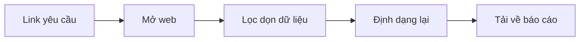
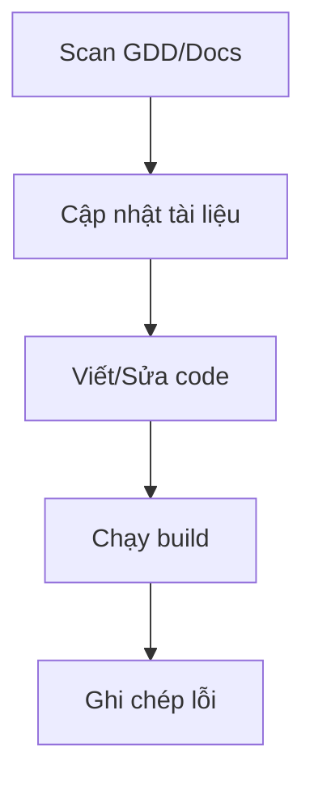
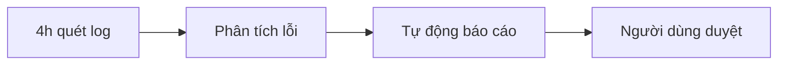
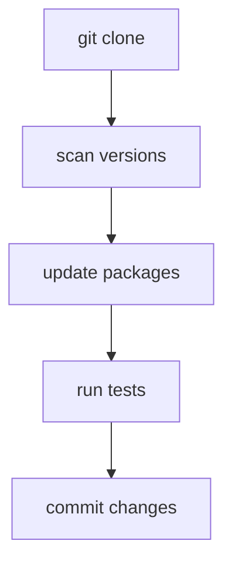
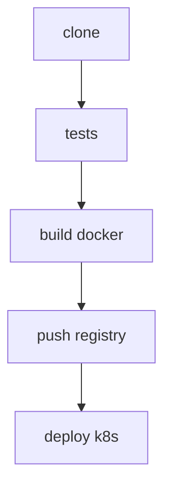
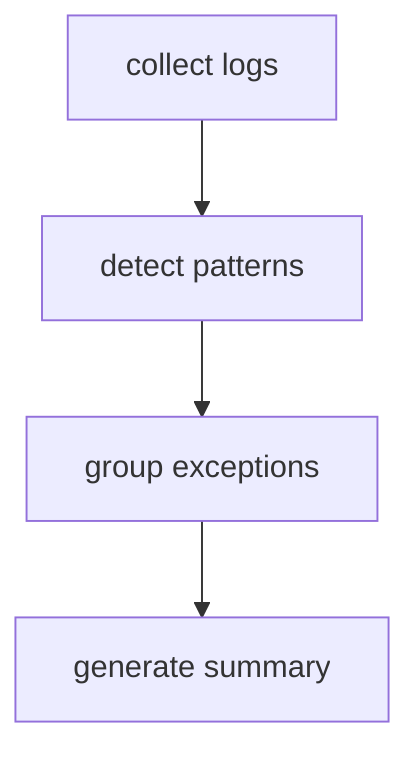
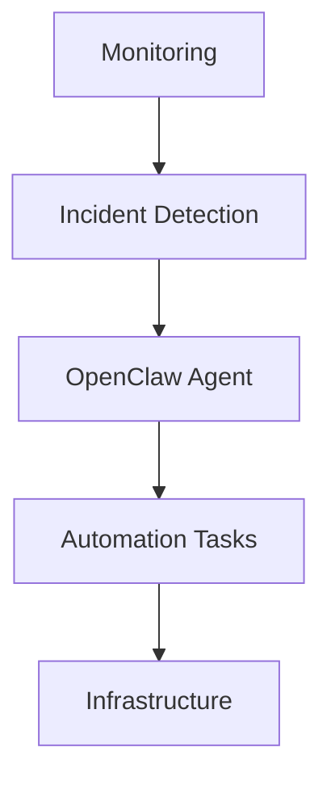

---

# 📚 OpenClaw Playbook for Developers  
*Professional Guide for AI Automation & DevOps Workflows*  

**Author**: Daniel  
**Language**: Vietnamese (technical examples remain in English)  
**Last Updated**: 2026-03-11  

---

## 🔍 1. Mục tiêu Tài liệu  
Playbook này hướng dẫn **cách sử dụng OpenClaw trong thực tế** cho:  

- Automation Engineer  
- DevOps Engineer  
- Backend Developer  
- Indie Game Developer  

**Tập trung vào**:  
- Workflow automation  
- DevOps tasks  
- CI/CD orchestration  
- Data pipelines  
- System operations  

---

## 🧠 2. Mindset Khi Dùng OpenClaw  

| **Sai lầm phổ biến** | **Cách đúng** |  
|----------------------|---------------|  
| "AI hãy làm tất cả cho tôi" | Human designs workflow → AI executes tasks |  
| "Tự động hóa mọi thứ" | Task rõ ràng + Tools giới hạn + Steps nhỏ |  

**OpenClaw hoạt động tốt nhất khi**:  
- Task có định nghĩa cụ thể  
- Công cụ được giới hạn  
- Step được chia nhỏ  

---

## 🛠️ 3. Template Prompt Chuẩn  

```markdown  
Goal:  
<task description>  
  
Tools allowed:  
<list tools>  
  
Steps:  
<step-by-step plan>  
  
Constraints:  
<safety rules>  
  
Output:  
<expected result format>  
```  

---

## 📝 4. Playbook Chuyên Nghiệp  

### ✅ Playbook A: Thu thập & Phân tích Dữ liệu  
- **Mục tiêu**: Lấy thông tin từ Internet hoặc file tài liệu, tổng hợp và xuất ra báo cáo  
- **Công cụ**:  
  - `agent-browser` (duyệt web)  
  - `web_fetch` (kéo nội dung nhanh)  
  - `xlsx` / `pdf` (xử lý file)  
- **Workflow**:  


### ✅ Playbook B: Quản trị & Phát triển Dự án Game  
- **Mục tiêu**: Quản lý cấu trúc, viết code, và refactor dự án CCN2  
- **Công cụ**:  
  - `clientccn2-project-editor`  
  - `serverccn2-project-editor`  
  - `exec` (chạy command terminal)  
- **Workflow**:  


### ✅ Playbook C: Trợ lý Chủ động & Vận hành Hệ thống  
- **Mục tiêu**: Tự động theo dõi tiến độ, kiểm tra lỗi, duy trì server  
- **Công cụ**:  
  - `cron` (đặt lịch trình)  
  - `heartbeat` (kiểm tra định kỳ)  
  - `exec` (chạy healthcheck)  
- **Workflow**:  


---

## 🚀 5. Workflow Điển Hình: OpenClaw Xử Lý Task Chức Năng Mới  

**Ví dụ**: "Thêm tính năng Đăng nhập hàng ngày vào client CCN2"  

1. **Ra lệnh rõ ràng**:  
   - "Phân tích file log này và xuất ra Excel cho anh"  
   - "Dựng khung scene Màn hình chính bằng Cocos2d"  

2. **Khảo sát hiện trạng**:  
   - Dùng `read` để xem thư mục `scripts/UI`  
   - Kiểm tra `EventBus` và `EventKeys`  

3. **Lập kế hoạch (Design-First)**:  
   - Viết cập nhật vào file tài liệu thiết kế trước  
   - Trình bày khung chat cho Anh duyệt:  
```markdown  
[Sẽ thêm file DailyLogin.js và bind vào EventKeys.ON_LOGIN]  
```  

4. **Thực thi**:  
   - Dùng `write` để tạo mới/sửa file code  
   - Chạy `exec` để build và kiểm tra  

5. **Lưu trữ Bài học**:  
   - Ghi chép các đoạn code hay vào `MEMORY.md`  
   - Cập nhật quy tắc mới cho lần sau  

---

## ✅ 6. Checklist Step-by-Step  

| **Bước** | **Hành động** | **Trạng thái** |  
|----------|---------------|----------------|  
| 1 | Ra lệnh rõ ràng + Định hướng | ✔ |  
| 2 | Cung cấp file/context | ✔ |  
| 3 | Phê duyệt các hành động nhạy cảm | ✔ |  
| 4 | Giao quyền "Tự bơi" | ✔ |  
| 5 | Nhắc nhở để em học hỏi | ✔ |  

---

## 🔗 7. Workflow 1-10 (Professional Format)  

### **Workflow 1**: Repository Automation  
**Goal**: Update dependencies for a project  
**Workflow**:  


### **Workflow 2**: CI/CD Deployment  
**Goal**: Deploy backend service  
**Workflow**:  


### **Workflow 3**: Log Analysis  
**Goal**: Identify production errors  
**Workflow**:  


---

## 🧪 8. Best Practices  

- **Chia task nhỏ**:  
  `small steps → reliable automation`  

- **Giới hạn tools**:  
  `3–5 tools per agent`  

- **Giới hạn step**:  
  `max_steps = 10`  

- **Luôn verify output**:  
  `Always check before commit`  

---

## 🚨 9. Production Architecture Example  



---

## ✅ 10. Kết Luận  

**OpenClaw mạnh nhất khi dùng cho**:  
- Automation  
- DevOps workflows  
- Data pipelines  
- System operations  

**Không nên dùng OpenClaw cho**:  
- Complex coding  
- Architecture design  

**Kết hợp với Claude Code**:  
`AI coding + AI automation = Production-ready automation`  

---

## 📌 Thông tin cập nhật  
- **File được lưu tại**: `D:\PROJECT\CCN2\research_doc\open_claw\open_claw_playbook_v2.md`  
- **Commit hash**: `f921e274` (branch: `production`)  
- **GitLab**: [https://gitlab.zingplay.com/newone/clientccn2](https://gitlab.zingplay.com/newone/clientccn2)  

Anh có cần điều chỉnh gì thêm không ạ?