# OpenClaw — Architecture Diagrams (Mermaid)
> Tất cả diagrams cho buổi thuyết trình. Render bằng Mermaid Live Editor (mermaid.live) hoặc VS Code Mermaid extension.

---

## Diagram 1: Feature Comparison Matrix (Radar/Table)

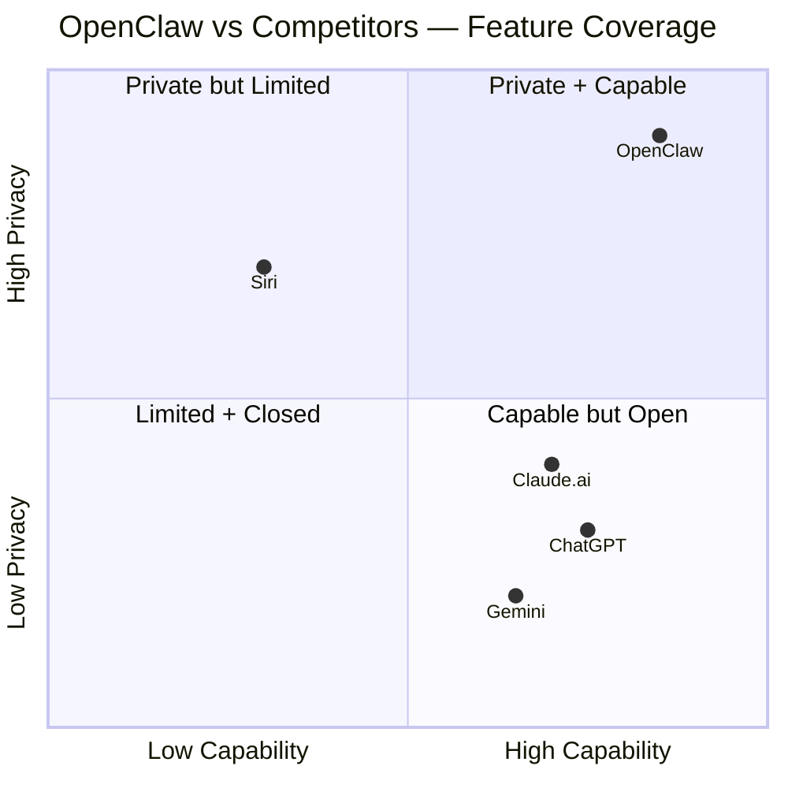

---

## Diagram 2: 22+ Channels Ecosystem

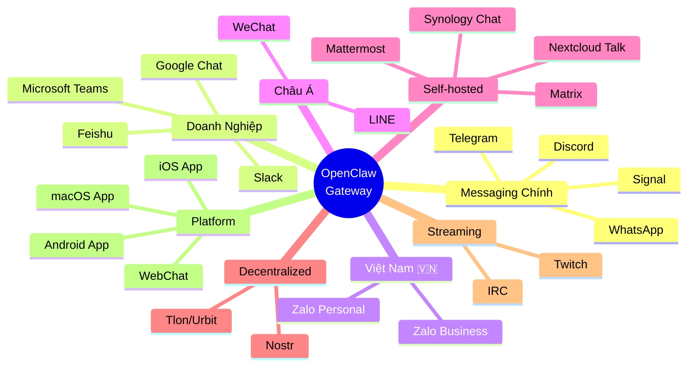

---

## Diagram 3: Kiến Trúc 5 Tầng (Top-Down)

```mermaid
graph TD
    subgraph Layer5["🖥️ TẦNG 5 — CLIENTS"]
        CLI["CLI Terminal"]
        WebUI["Web Dashboard"]
        Mac["macOS App"]
        iOS["iOS App"]
        Android["Android App"]
    end

    subgraph Layer4["📱 TẦNG 4 — CHANNELS (22+)"]
        Telegram["Telegram"]
        Discord["Discord"]
        WhatsApp["WhatsApp"]
        Slack["Slack"]
        Zalo["Zalo 🇻🇳"]
        More["+ 17 kênh khác..."]
    end

    subgraph Layer3["🔀 TẦNG 3 — GATEWAY (Pi-Mono Routing)"]
        HTTP["HTTP Server (Hono)"]
        WS["WebSocket Server"]
        Auth["Auth Layer"]
        Router["7-Tier Router"]
        Sessions["Session Manager"]
    end

    subgraph Layer2["🤖 TẦNG 2 — AGENT RUNTIME (Pi-Mono)"]
        AgentCore["Pi Agent Core"]
        ContextEng["Context Engine"]
        Skills["Skills System (52)"]
        Memory["Memory (LanceDB)"]
        Security["Security (8 layers)"]
    end

    subgraph Layer1["🧠 TẦNG 1 — LLM PROVIDERS (22+)"]
        Claude["Anthropic Claude"]
        GPT["OpenAI GPT"]
        Gemini["Google Gemini"]
        Ollama["Ollama (Local)"]
        More2["+ 18 providers..."]
    end

    Layer5 --> Layer4
    Layer4 --> Layer3
    Layer3 --> Layer2
    Layer2 --> Layer1

    style Layer5 fill:#4A90D9,color:#fff
    style Layer4 fill:#7B68EE,color:#fff
    style Layer3 fill:#E8884A,color:#fff
    style Layer2 fill:#5CB85C,color:#fff
    style Layer1 fill:#D9534F,color:#fff
```

---

## Diagram 4: Gateway Routing — 7-Tier Priority

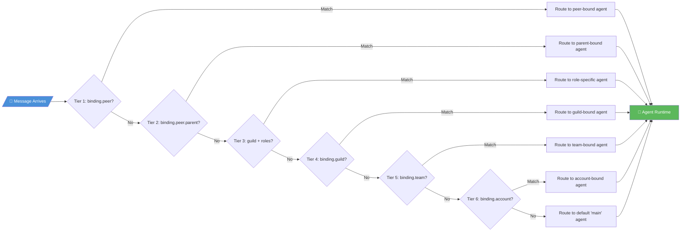

---

## Diagram 5: Dual-Loop Agent Execution (Pi-Mono Core)

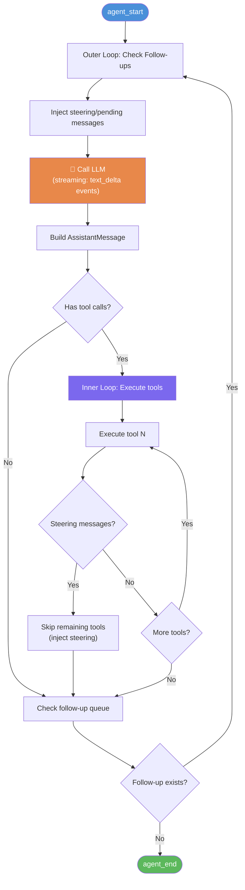

---

## Diagram 6: Extension Ecosystem Layers

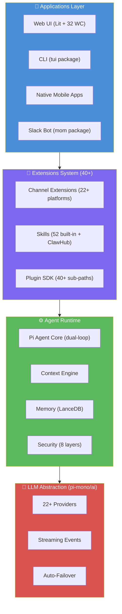

---

## Diagram 7: Security Model — 8 Layers

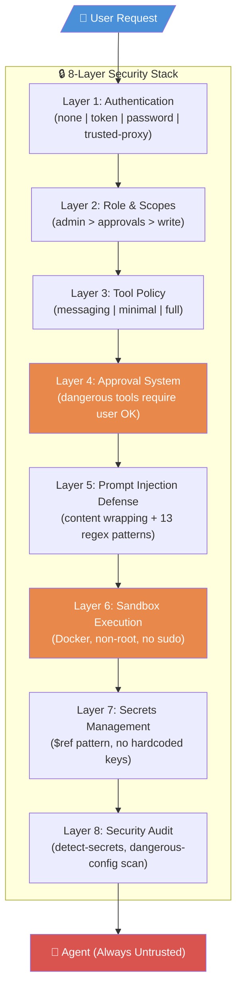

---

## Diagram 8: Pi-Mono 3-Tier Architecture (Dependency Graph)

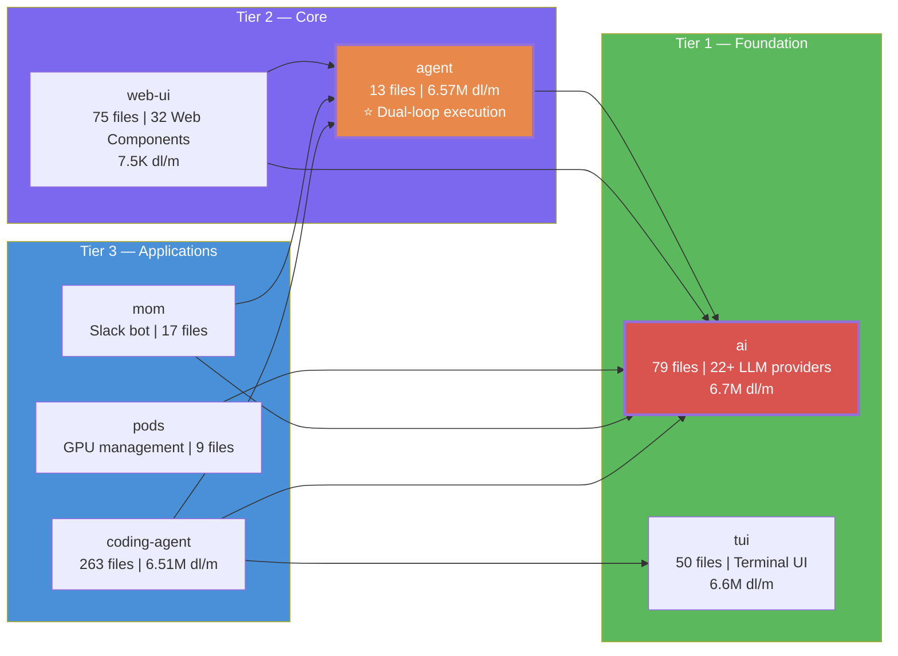

---

## Diagram 9: Pi-Mono → OpenClaw Component Mapping

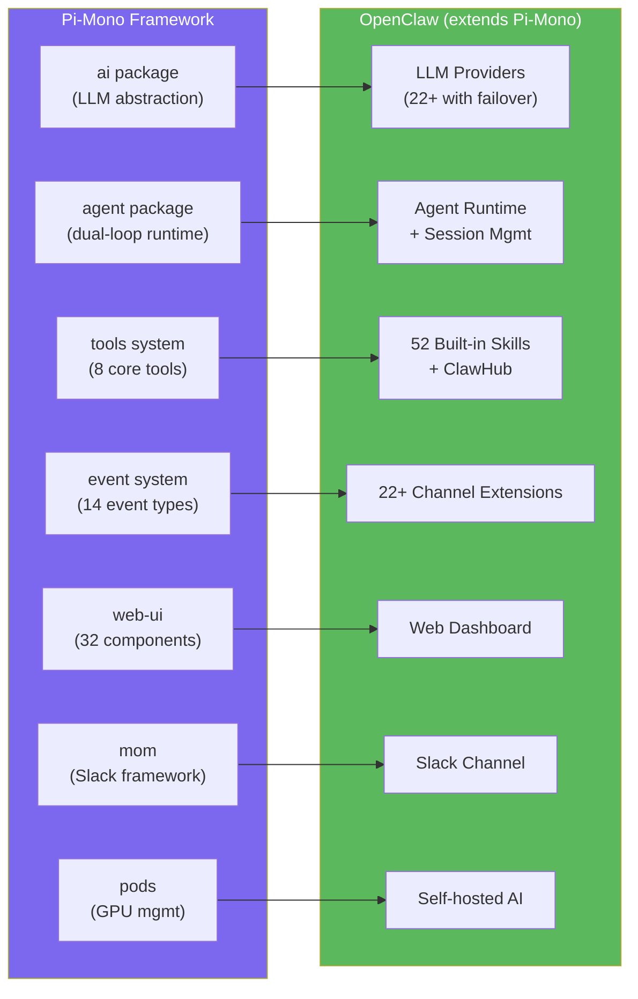

---

## Diagram 10: Complete Data Flow — User to AI and Back

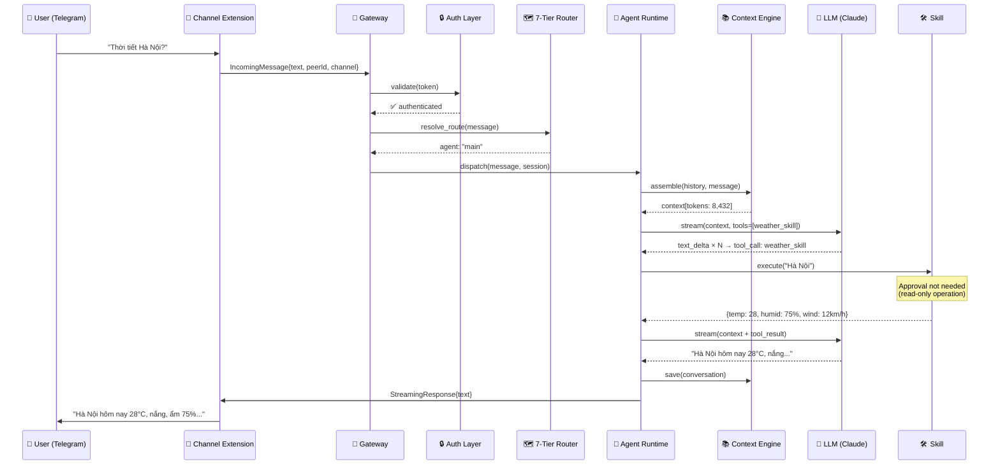

---

## Diagram 11: Skills System Pipeline

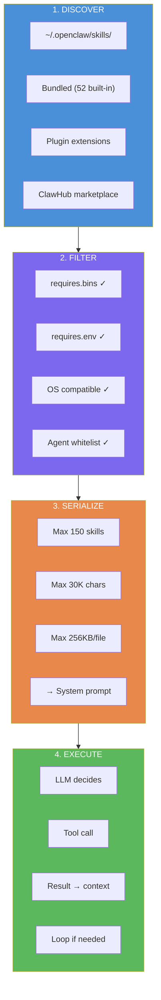

---

## Diagram 12: LLM Provider Architecture (22+ Providers)

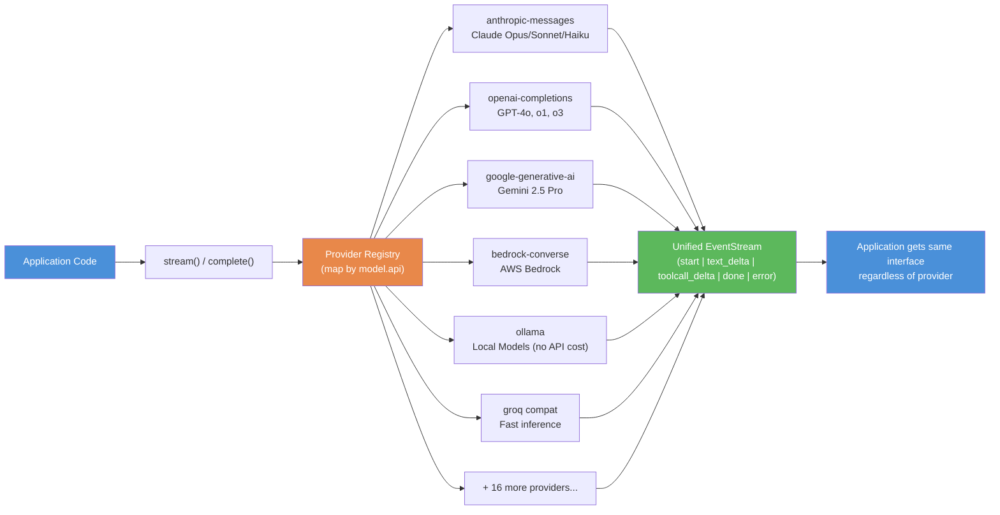

---

## Diagram 13: Benchmark Scores — Bảng So Sánh Radar

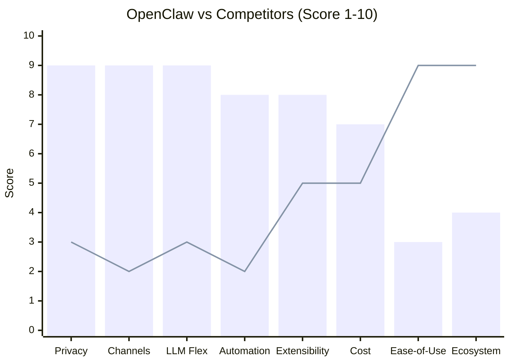

*Lưu ý: Bar = OpenClaw, Line = ChatGPT*

---

## Sử Dụng Diagrams

**Render options:**
1. **Mermaid Live**: Copy diagram code → https://mermaid.live
2. **VS Code**: Cài extension "Mermaid Preview"
3. **GitHub**: Paste vào .md file — GitHub tự render
4. **Slides**: Export PNG từ mermaid.live → paste vào PowerPoint/Google Slides

**Gợi ý dùng theo section:**
| Section | Diagrams nên dùng |
|---------|------------------|
| 1. Tại sao nổi bật | Diagrams 1, 2, 13 |
| 2. Kiến trúc | Diagrams 3, 4, 5, 6, 7 |
| 3. Pi-Mono | Diagrams 8, 9, 10 |
| 4. Technical | Diagrams 11, 12 |
